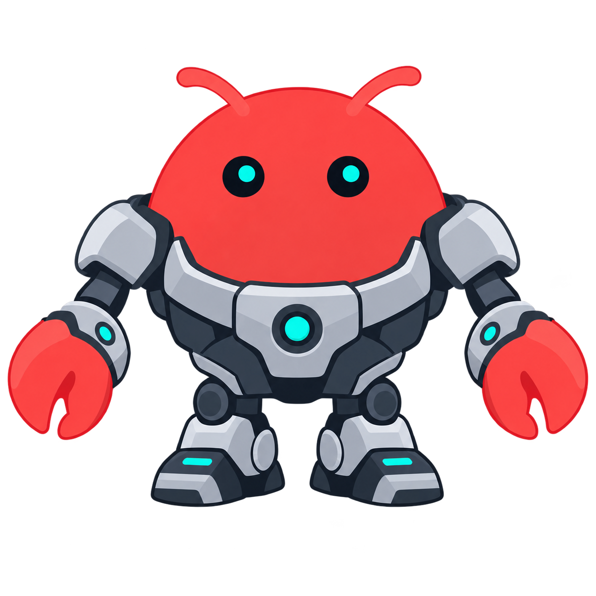

# OpenClaw Enterprise



The open control plane for deploying and managing Agents. Under active construction.

## Getting Started

Requires Docker Engine and Docker Compose. Build the runtime image and create
`.env` if it does not already exist:

```sh
docker build -f deploy/runtime/Dockerfile \
  --tag openclaw-enterprise-runtime:quickstart deploy/runtime
umask 077
test -f .env || cp .env.example .env
```

Set `OCC_DOCKER_RUNTIME_IMAGE=openclaw-enterprise-runtime:quickstart` in `.env`,
then start the stack:

```sh
docker compose up --build -d
docker compose ps -a
```

Wait for PostgreSQL and the controller to be healthy, the migration to exit with
code `0`, and the worker to be running. The API defaults to `http://127.0.0.1:3000`.
Follow the [quickstart](docs/guides/quickstart.md#sign-in-and-read-the-installation)
to sign in and make an authenticated request. A model credential is required to
run Agent model turns, but not to start the stack.

The local worker has Docker host access through the Docker socket. Use the
[deployment guide](docs/guides/deploy.md) for host requirements and production
Kubernetes setup; the [runtime image recipe](deploy/runtime/README.md) documents
image versions and build options.

## Develop

Requires Node.js 24 or newer and the pnpm version pinned in
[`package.json`](package.json).

```sh
pnpm install --frozen-lockfile
pnpm check:workspace
pnpm format:check
pnpm typecheck
pnpm openapi:check
pnpm test
```

PostgreSQL, Docker, and Kubernetes integration suites require additional setup;
see [Testing](docs/testing.md) for suite coverage, credentials, setup, and commands.

## Code layout

| Path                                          | Responsibility                                       |
| --------------------------------------------- | ---------------------------------------------------- |
| `apps/controller/`                            | HTTP API, worker, and Driver implementations.        |
| `packages/contracts/`                         | Resource models, Driver interfaces, and API schemas. |
| `packages/occ/`                               | Resource lifecycle, persistence, and work queue.     |
| `packages/iam/`                               | Identities, roles, and resource authorization.       |
| `packages/audit/`                             | Audit events and sensitive-value sanitization.       |
| [`packages/utils/`](packages/utils/README.md) | Shared validation, hashing, and object helpers.      |
| `tests/`                                      | Conformance and integration tests.                   |

## Documentation

- [Documentation map](docs/README.md): guides, references, and runtime flows.
- [Platform design](docs/design.md) and [current architecture](docs/ARCHITECTURE.md): target design and implemented components.
- [Feature reference](docs/reference/README.md): supported behavior and Driver contracts.
- [HTTP API](docs/reference/api.md): routes, request and response schemas, authentication, and permissions.
- [Spec archive](specs/README.md): proposals and implementation history, with recorded statuses.

## License

[MIT](LICENSE). Third-party components retain their own licenses.
