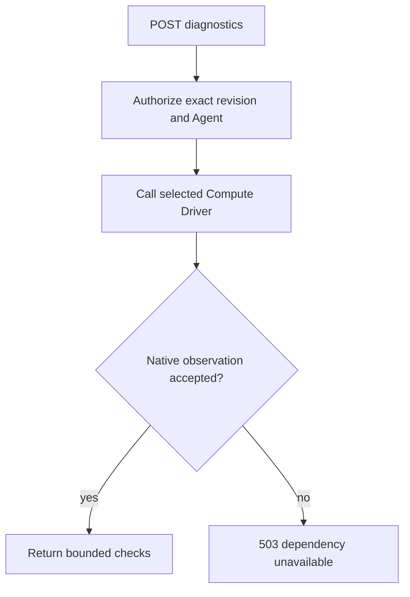

# Agent Deployment Diagnostics Flow

## Overview

OpenClaw Control Plane (OCC) returns a fresh runtime observation for one admitted
AgentRevision. The request authorizes the exact revision and Agent, calls the
selected Compute Driver, validates the bounded result, and does not mutate
deployment state or runtime resources.

## Entry Points

`apps/controller/src/index.ts:createFastifyApp` handles the bodyless POST.
`packages/occ/src/index.ts:OpenClawController.diagnoseAgentDeployment`
authorizes authenticated browser, service-key, and CLI callers before invoking
`packages/contracts/src/index.ts:ComputeDriver.diagnoseAgentDeployment`.
`deploymentId` is the admitted AgentRevision ID; the
[Agent reference](../reference/agents.md#deployment-status) owns response fields.

## Flow

## Execution Trace

### 1. Authorize the exact deployment target

Source: `packages/contracts/src/api/routes.ts:diagnoseAgentDeployment`,
`apps/controller/src/index.ts:requiredPermissions`, and
`packages/occ/src/index.ts:OpenClawController.diagnoseAgentDeployment`.
The bodyless route uses deployment status path parameters. OCC calls
`getRevision` to verify Namespace and Agent ownership and authorize exact
AgentRevision `read`, then authorizes exact Agent `operate` and `read`.

### 2. Let Compute collect native evidence

Source: `packages/contracts/src/index.ts:ComputeDriver.diagnoseAgentDeployment`
and
`apps/controller/src/drivers/compute/kubernetes/index.ts:KubernetesComputeDriver.diagnoseAgentDeployment`.
OCC passes the resolved Namespace, Agent, and revision to Compute. The Kubernetes
Driver resolves each container in its current placement: dedicated Gateways use
the managed Gateway namespace and Harnesses use the tenant namespace. It verifies
Namespace and Pod identity before reading the runtime-local
diagnostics endpoint. Slack diagnostics use a no-send status probe for
configuration, authentication, and connectivity, and must not return secrets,
raw provider output, logs, or backend-specific detail.

### 3. Validate and return the generic envelope

Source: `packages/occ/src/index.ts:OpenClawController.deploymentDiagnostics`
and `packages/occ/src/index.ts:OpenClawController.validRuntimeDiagnosticCheck`.
OCC accepts only an object for the requested revision, a valid observation time,
and bounded checks. Driver exceptions, including typed scope and conflict errors,
are sanitized before they reach the API; their messages can contain private data. Missing support, collection failure, mismatched evidence, or invalid
Driver output becomes `503 DEPENDENCY_UNAVAILABLE`. The response is current
observation only; it does not update deployment work, startup failure evidence,
Agent active revision, plugin warnings, or audit lifecycle results.

## Debugging and Verification

`403` means missing exact permissions. `404` means the Namespace, Agent, or
revision does not match the path. `503 DEPENDENCY_UNAVAILABLE` means Compute
selection, support, collection, or evidence validation failed. The CLI command
`occ agent deployment diagnostics AGENT_ID DEPLOYMENT_ID --output json` uses the
same route as the console action.

Use deployment status GET for persisted startup failures, and model or channel
workflows to prove actual responses or message delivery.

## Related docs

See [Agent deployment status](../reference/agents.md#deployment-status),
[ComputeDriver diagnostics](../reference/drivers/compute.md#optional-runtime-diagnostics),
[console Agent editing](platform-console/agent-editing.md), and the
[OCC CLI reference](../reference/cli.md).

## Manual Notes

[keep this for the user to add notes. do not change between edits]

## Changelog

- 2026-09-21 11:44: Tighten the diagnostics flow around the single owning contract and clarify no-send runtime checks. (authoring-run/3183720c-678d-44cd-8c0c-c090ff60b907 - 1bc69d75)
- 2026-09-20 21:22: Document the bodyless deployment diagnostics path from API authorization through Compute validation. (authoring-run/975423a5-058b-461b-80a9-35b1ed0f760f - aa6dd741)
