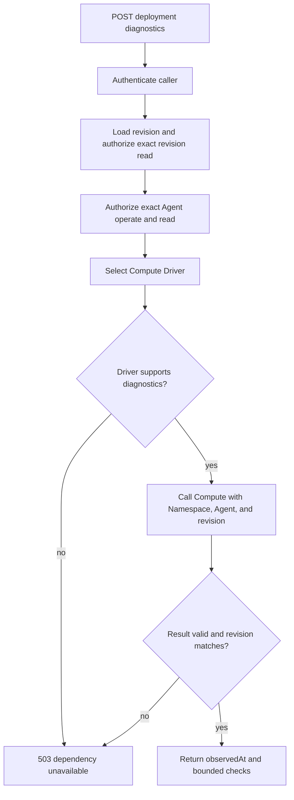

# Agent Deployment Diagnostics Flow

## Overview

An authorized caller asks OpenClaw Control Plane (OCC) for a fresh runtime
diagnostic observation for one admitted AgentRevision. The HTTP API authorizes
the exact Agent and revision, OCC invokes the selected Compute Driver's optional
diagnostics method, validates the bounded result, and returns generic checks to
the caller. The flow stops at the response envelope; it does not mutate queued
work, persisted deployment status, Agent state, or runtime resources.

## Entry Points

- `apps/controller/src/index.ts:createFastifyApp` handles bodyless
  `POST /namespaces/:namespaceId/agents/:agentId/deployments/:deploymentId/diagnostics`.
- `apps/controller/src/index.ts:requiredPermissions` declares exact Agent
  `read` and `operate`, plus exact AgentRevision `read`.
- `packages/occ/src/index.ts:OpenClawController.diagnoseAgentDeployment` resolves
  the revision and invokes the selected Compute Driver.

The caller is an authenticated browser session, service API key, or CLI command
with the same HTTP permissions. The request body must be empty; the
`deploymentId` is the AgentRevision ID returned by deployment admission.
The shared ComputeDriver contract defines the optional diagnostics capability
and response shape.

## Flow

## Execution Trace

### 1. Route authorization binds the exact Agent and revision

`packages/contracts/src/api/routes.ts:diagnoseAgentDeployment`

`apps/controller/src/index.ts:requiredPermissions`

The route belongs to Agent deployments and uses the same
`namespaceId`/`agentId`/`deploymentId` path parameters as deployment status GET.
It has no request body. The API permission table requires exact Agent `operate`,
exact Agent `read`, and exact AgentRevision `read`. These permissions keep the
fresh runtime observation from becoming a read-only status poll.

### 2. OCC resolves the revision before invoking Compute

`apps/controller/src/index.ts:createFastifyApp`

`packages/occ/src/index.ts:OpenClawController.diagnoseAgentDeployment`

The controller handler calls `diagnoseAgentDeployment(actorId, namespaceId,
agentId, deploymentId)` and wraps the returned value in `{ data, meta }`.
OCC first calls `getRevision`, which enforces the revision's exact Namespace and
Agent ownership and authorizes the caller's revision read. It then authorizes
exact Agent `operate` and `read` before selecting the Compute Driver.

The read transaction reloads the Namespace and Agent by their requested parent
IDs. If the Agent does not belong to that Namespace, OCC fails the request rather
than calling the Driver with caller-selected identities.

### 3. Compute owns native collection

`packages/contracts/src/index.ts:ComputeDriver.diagnoseAgentDeployment`

OCC passes `{ namespace, agent, revision }` to the selected Compute Driver. The
Driver owns any Kubernetes, container, host, or provider-specific collection and
maps native observations into generic checks. It must validate that the observed
runtime still belongs to the requested revision and must not return credentials,
raw provider output, logs, or backend-specific secret material.

A Driver without `diagnoseAgentDeployment` returns dependency unavailable. An
unexpected Driver failure is also returned as dependency unavailable so native
errors and secret-bearing messages do not cross the API boundary.

### 4. OCC validates and returns bounded diagnostics

`packages/occ/src/index.ts:OpenClawController.deploymentDiagnostics`

The result must use the requested revision ID, an ISO timestamp for `observedAt`,
and at most 32 checks. Each check must provide nonempty `component` and `check`
strings, one of the supported states, nullable `checkedAt`, and an optional
nonempty safe `code`. Invalid evidence becomes dependency unavailable.

The response is an immediate observation. It does not update the durable
deployment work row, Agent active revision, plugin warnings, startup failure
evidence, or audit lifecycle result. Use the deployment status GET for historical
startup failure evidence and a separate model or channel workflow to prove
actual responses.

## Debugging and Verification

- `403` means the caller lacks one of the exact Agent or AgentRevision
  permissions.
- `404` means the Namespace, Agent, or revision does not match the requested
  parent path.
- `503 DEPENDENCY_UNAVAILABLE` means the selected Compute Driver is unavailable,
  does not implement diagnostics, failed collection, or returned invalid
  evidence.
- `occ agent deployment diagnostics AGENT_ID DEPLOYMENT_ID --output json`
  exercises the same HTTP route as the console's **Run current diagnostics**
  action.

This flow proves only the diagnostics envelope and current Compute observation.
It does not prove model access, Slack or Teams delivery, startup failure
persistence, or live message execution.

## Related docs

- [Agent deployment status](../reference/agents.md#deployment-status)
- [ComputeDriver contract](../reference/drivers/compute.md#optional-runtime-diagnostics)
- [Console Agent editing and runtime requests](platform-console/agent-editing.md)
- [OCC CLI command reference](../reference/cli.md)

## Manual Notes

[keep this for the user to add notes. do not change between edits]

## Changelog

- 2026-09-20 21:22: Document the bodyless deployment diagnostics path from API authorization through Compute validation. (authoring-run/975423a5-058b-461b-80a9-35b1ed0f760f - aa6dd741)
