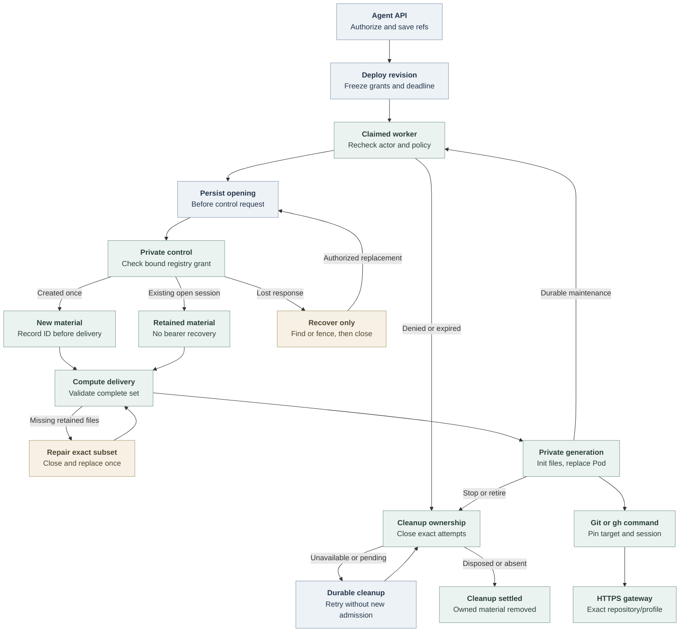

# Agent repository credential flow

## Overview

An authorized Agent creation or update selects approved repository references.
Deployment freezes those grants into a revision; durable worker reconciliation
opens bounded sessions and hands private client files to Compute. The embedded
OpenClaw Agent then runs ordinary Git and selected GitHub CLI commands. This
flow ends at command dispatch to the credential service or revision cleanup;
the [service flow](repository-credentials.md) owns token acquisition, forwarding
and provider retirement.

The bundled path uses Kubernetes Compute-owned embedded OpenClaw, `api_key`
Harness authentication and no Sandbox Driver. This trace describes current
source. Installed-runtime, model-turn and live-provider evidence are separate
checks in the [testing guide](../testing/repository-credentials.md).

## Entry Points

- `apps/controller/src/index.ts:createFastifyApp` registers Agent creation,
  update and deployment routes. Existing exact Agent/configuration IAM checks
  apply before repository selection is persisted.
- `packages/occ/src/index.ts:OpenClawController.deployAgent` admits an immutable
  revision and queues work under its original actor.
- `apps/controller/src/worker.ts:ControllerWorker.prepareRevision` prepares
  repository sessions before invoking the selected Compute Driver.

The Installation selects a repository Driver and Provider, all three control
processes use the same immutable registry, and the Namespace is ready. Agents
without repository bindings bypass this capability.

## Flow

## Execution Trace

### 1. Resolve Namespace policy during Agent admission

`packages/occ/src/index.ts:OpenClawController.repositoryBindingSelections`
uses `resolveRepositoryBindings` after existing authorization. The public input
contains distinct opaque references and optional profiles, not provider tokens
or caller-selected grant identities. The concrete
`apps/controller/src/drivers/repository-credentials/github.ts:GitHubRepositoryCredentialDriver.resolve`
uses local registry policy and defaults an omitted profile to `git-write`.
It performs no control-socket or GitHub call.

`apps/controller/src/providers/repository-credentials/github/registry.ts:resolveGitHubRepositoryBinding`
requires the exact Namespace/reference/profile combination. Its fingerprint
binds provider/App/installation/repository identity, duration policy and the
Namespace's complete profile policy. The same registry supports several
repositories under one App installation, with one grant per selected binding.
OCC stores normalized selections on the Agent; an update's omitted array
preserves them and an empty array clears future selection.

### 2. Freeze a deployable revision

`packages/occ/src/index.ts:OpenClawController.admitRepositoryCredentials`
resolves the draft again, asks Compute to validate the supported topology, and
freezes Driver identity, exact grants and an absolute deadline. With duration
`86400`, the deadline is 24 hours after admission. Renewals and recovery cannot
move it. The public `clientRevision` serializer in
`apps/controller/src/index.ts` returns only Driver identity, references, profiles
and deadline from that snapshot.

`apps/controller/src/composition/repository-credentials/platform.ts:composeRepositoryCredentialDriver`
constructs the thin Driver around a Provider-owned Unix client, validated registry
and public CA. The API and worker do not load the token engine or private App
key. The [production startup flow](production-startup.md) owns composition and
sidecar launch; the service validates its own protected inputs before listening.

### 3. Record ownership before opening a session

`apps/controller/src/worker/repository-credentials.ts:RepositoryCredentialLifecycle.prepare`
rechecks the original actor, ready Namespace, running Agent, exact revision,
selected Driver, unchanged grant and deadline. Each fresh attempt commits its
request identity in State under the live work claim and Namespace/Agent locks
before dispatch. `RepositoryCredentialLifecycle.open` then calls the Driver
outside the transaction. State stores recovery identifiers and phases, never
bearers or client files.

`apps/controller/src/providers/repository-credentials/control-client.ts:UnixRepositoryCredentialControlClient`
sends the bound request over the private socket. The service independently
resolves and compares the grant through
`apps/controller/src/providers/repository-credentials/github/registry-factory.ts:createGitHubRegistryDriverFactory`.
Only a created control response contains the bearer. The concrete Driver encodes
transient files with
`apps/controller/src/drivers/repository-credentials/client/config.ts:encodeRepositoryCredentialSessionFiles`
and returns session status plus that closed file map. The worker records the
session ID before passing files solely through
`ComputeRevisionContext.repositoryCredentials`.

A confirmed open session produces a `retained` binding without new files. An
unfinished opening attempt uses `recoverOnly` to find or fence the original
admission, closes any recovered session, then permits a fresh authorized attempt.
`apps/controller/src/drivers/repository-credentials/control.ts:createControlAdmission`
never reissues a bearer and records a cancellation fence for a missing fresh ID.
Transport failure or overload cannot establish absence.

### 4. Deliver and retain one complete runtime generation

`apps/controller/src/drivers/compute/kubernetes/repository-material.ts:repositoryMaterialSpec`
checks the complete `new | retained` binding set against the revision and derives
a generation from sorted reference/session pairs.
`apps/controller/src/drivers/compute/kubernetes/repository-material-store.ts:RepositoryMaterialStore.prepare`
validates exact ownership and file contents before creating immutable
Agent/revision/session-owned Secrets. It reports the precise missing retained
subset. The worker's `RepositoryCredentialLifecycle.repair` closes and replaces
only that subset, then retries Compute once; it does not pretend status recovery
recovered credential bytes.

`apps/controller/src/drivers/compute/kubernetes/repository-material.ts:repositoryMaterialDeployment`
mounts Secret projections only in the init container. The init entrypoint in
`apps/controller/src/drivers/compute/kubernetes/repository-material-init.ts:REPOSITORY_MATERIAL_INIT_ENTRYPOINT`
validates a complete projection, then writes mode-0700 directories and mode-0600
files into memory-backed storage. The serving container mounts the resulting
private directory read-only. Its manifest contains public routing metadata and
session identifiers; separate files contain gateway bearers.

`apps/controller/src/drivers/compute/kubernetes/index.ts:KubernetesComputeDriver.activateRevision`
compares material generations as well as revision identity. A changed generation
replaces the actual embedded gateway Pod, even for the same revision. The runtime
Pod PATH includes the image-owned Git/gh shims, but native exec prepends its
login-shell PATH. For material-enabled revisions, `prepareRevision` therefore
uses `apps/controller/src/drivers/compute/kubernetes/repository-native-configuration.ts:repositoryNativeConfiguration`
to put the shim directory first in native `tools.exec.pathPrepend` before writing
the runtime ConfigMap. It preserves other configured paths and exec settings,
including per-agent overrides and inherited paths, without changing the stored
revision. The Harness's model environment remains intact. App keys, JWTs,
installation tokens and the control socket never enter this material set.

### 5. Pin each Git or GitHub CLI command

`apps/controller/src/drivers/repository-credentials/client/router.ts:routeRepositoryClient`
reads one protected manifest generation and selects from the parsed command
or effective Git remotes. The actual Git context includes accepted global
options and worktree selection. A clone uses the admitted gateway URL while
preserving ordinary destination behavior. Directory names are not binding
identities; approved repositories remain selectable after a rename.

Explicit references must agree with explicit network targets. Ambiguous remotes,
unapproved destinations, conflicting rewrites and multiple network destinations
fail before client dispatch. Known local Git operations use a credential-free
environment. Each network command owns its private HOME and selected session;
concurrent commands do not edit shared routing configuration. Git child processes
of `gh` inherit the same nonsecret selection pin and cannot switch repositories.
The actual client executables use absolute paths to avoid shim recursion.

The [service exchange flow](repository-credentials.md#4-reserve-acquire-and-dispatch)
then enforces the bearer, immutable repository/profile, capacity and deadlines.
It acquires fresh installation tokens on demand under the same grant, allowing
continuous use within the revision deadline without a long-lived GitHub token.

### 6. Maintain, recover and retire ownership

`apps/controller/src/worker.ts:ControllerWorker.completeActivatedRevision`
commits completion and the next maintenance work together, preserving the
original actor. Repository-bearing revisions use the selected Driver's
30-second maintenance interval, or a shorter Compute interval. Worker restart
resumes durable queued work; it does not invent actors through a startup scan.
An unavailable session after service restart is invalidated and replaced through
the same authorized material path, within the frozen deadline.

`apps/controller/src/worker.ts:ControllerWorker.finalizeActiveRevision`
can atomically fail one bounded observation and enqueue its successor while the
same active revision remains authorized. Stop, policy drift, expiry and revoked
authority cannot use that continuation to reopen sessions.

`packages/occ/src/state/postgres-work-queue.ts:PostgresWorkQueue.enqueueRepositoryCleanup`
and terminal queue transitions transfer exact obligations to durable cleanup.
`RepositoryCredentialLifecycle.closeRevision` marks attempts closing and records
cleanup together. `ControllerWorker.processRepositoryCleanup` consumes only
validated owner-bound work, without policy resolution, new admission or material
delivery; it remains possible after the original actor loses ordinary permissions.
`CLOSED` denies local use but stays pending until disposal or authoritative
absence. Outage defers cleanup and does not prevent workload shutdown.

Compute retirement waits for owned Pods to stop before removing their material.
It preserves Secrets referenced by actual Pods and current Deployments, and
limits deletion to exact ownership with UID preconditions. Service restart can
settle missing local-session records but cannot prove remote token revocation.

## Debugging and Verification

Run `occ agent get AGENT_ID --output json` in the selected Namespace and compare
`activeRevisionId` with the admitted revision. Inspect worker events for
`REPOSITORY_BINDING_CHANGED`, `REPOSITORY_CREDENTIAL_DEADLINE_EXCEEDED`,
`REPOSITORY_CLEANUP_PENDING` or `REPOSITORY_CLEANUP_COMPLETE`. Check registry
identity and deadline before treating these as transient failures.

For client errors, `repository-not-admitted` identifies an unselected target;
`name-one-repository-target` or `name-one-repository-ref` requires explicit
selection. Check private material metadata and Pod generation without printing
bearers or Secret data. A ready Pod or a successful local command does not prove
live GitHub writes. Use the [test guide](../testing/repository-credentials.md) for
State/worker, real-client, installed/runtime and live-provider checks.

## Related docs

- [Repository credential reference](../reference/repository-credentials.md)
- [Install repository access](../guides/repository-credentials/installation.md)
- [Create and use a repository Agent](../guides/repository-credentials.md)
- [Controller worker lifecycle](controller-worker.md)
- [Credential service execution](repository-credentials.md)

## Manual Notes

[keep this for the user to add notes. do not change between edits]

## Changelog

- 2026-09-18 04:55: Trace the accompanying native exec PATH projection for repository material, including per-agent overrides. (authoring-run/7e9ee7cd-e36a-4de7-8f67-29f3b03bd94d - e3012a8cee0c5ea60bc02943ebed88a1c88eb0d2)
- 2026-09-18 03:04: Trace the accompanying Agent admission, durable session lifecycle, Kubernetes material generation and concurrent client integration. (authoring-run/7e9ee7cd-e36a-4de7-8f67-29f3b03bd94d - 8500b2da103063b4503b62e5529f3910513e84a9)
