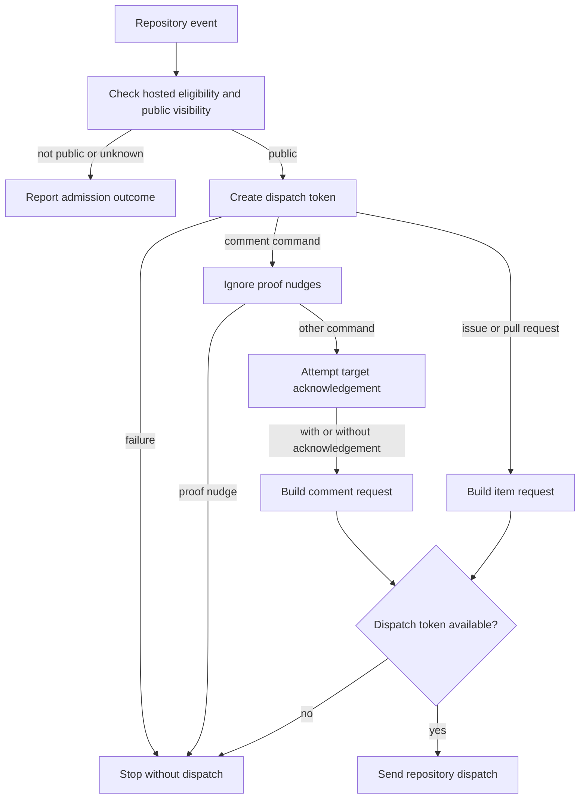

# ClawSweeper dispatch flow

## Overview

Repository issue, pull request, and comment events can hand off review requests
to ClawSweeper. This trace ends when the repository dispatch request is sent;
it does not establish that a review ran or completed.

## Entry Points

- `.github/workflows/clawsweeper-dispatch.yml:3`: issue, issue-comment, and pull-request-target events.
- `.github/workflows/clawsweeper-dispatch.yml:19`: the pinned hosted-target admission workflow receives the repository name and App private key.
- Setup requires the `CLAWSWEEPER_APP_PRIVATE_KEY` secret and App installations with the permissions requested by the token steps. The dispatch token requests contents write on `openclaw/clawsweeper`; target acknowledgement tokens request issue write and, for comments, pull-request read on this repository.

## Flow

## Execution Trace

### 1. Admit the target

`.github/workflows/clawsweeper-dispatch.yml:19`

The called [admission workflow](https://github.com/openclaw/clawsweeper/blob/7829cdce71310b549c119c670e7bd69e04f7e242/.github/workflows/hosted-target-admission.yml) checks the target against its eligibility registry, then checks current GitHub repository identity and public visibility. The executable workflow is pinned; its separate registry input defaults to `main`, so eligibility can change independently. A terminal or unverifiable result prevents dispatch and produces a notice or warning.

### 2. Prepare credentials and acknowledgements

`.github/workflows/clawsweeper-dispatch.yml:44`

The job creates a central dispatch token and filters comments for commands. A
command's target token and its optional reaction or status comment are best
effort: target-token failure does not prevent the command handoff. The target
status comment is attempted for owner, member, or collaborator comments; this
acknowledgement is not an authorization decision for downstream work. Pull
request acknowledgement is also best effort. A missing dispatch token causes
the dispatch step to exit without a request; a failed central token step can
fail the job before that step.

### 3. Hand off the event

`.github/workflows/clawsweeper-dispatch.yml:202`, `.github/workflows/clawsweeper-dispatch.yml:339`

For issues and pull requests, the workflow builds a request with the item identity
and available source revision information. For command comments it sends the
repository, item, comment, and event identity; it includes a status comment ID
only if one was created. Proof-nudge comments are ignored. ClawSweeper owns
subsequent command interpretation and review; the dispatch response is not proof
of either result.

## Debugging and Verification

- Inspect the Actions run for admission notices, token-step failures, and the dispatch step result. A target acknowledgement failure can coexist with a successful dispatch.
- Check the ClawSweeper side separately for the received event and its final outcome. Local workflow syntax or shell fixtures do not prove hosted admission, App installation permissions, delivery, or review.

## Related docs

- [GitHub Actions testing](../testing/ci.md)
- [Runtime flows](../contributing/runtime-flows.md)

## Manual Notes

[keep this for the user to add notes. do not change between edits]

## Changelog

- 2026-09-30 00:24: Document admission and best-effort acknowledgement in the accompanying workflow change. (authoring-run/87dad345-a295-4885-a18f-5d6813b458ea - 97f7c1ca923328adc530160fb9d73eadb74bc36f)
