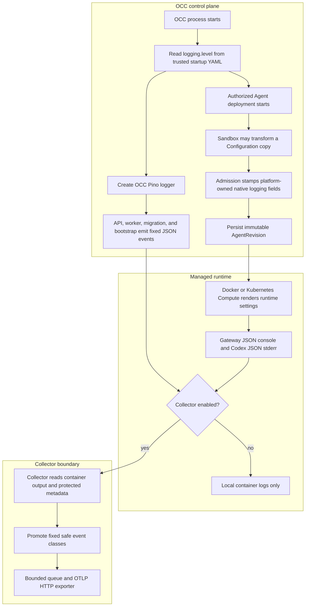

# Common Operational Logging Flow

## Overview

Trusted startup configuration selects one OCC operational logging level. The API,
worker, migration, and bootstrap processes use that level immediately. An
authorized Agent deployment freezes the same level into the admitted native
runtime configuration, and Compute renders gateway and Codex logging from the
saved AgentRevision. Optional Docker Compose or Helm Collector configuration
then converts reviewed container records into OTLP Logs. This flow ends at the
Collector exporter; PostgreSQL audit remains the durable evidence boundary.

## Entry Points

- Trigger: start the API, worker, migration, or bootstrap process; deploy an
  Agent; enable the optional Docker Compose or Helm logging Collector.
- Source: `apps/controller/src/composition/installation-config.ts:loadOperationalLoggingConfiguration`
- Source: `packages/occ/src/index.ts:OpenClawController.deployAgent`
- Source: `deploy/logging/collector.yaml` and `deploy/helm/openclaw-enterprise/templates/collector.yaml`
- Assumptions: trusted startup YAML, an authorized deployment request, selected
  Compute Driver support, and operator-owned Collector configuration when remote
  export is enabled.

## Flow

## Execution Trace

### 1. OCC reads the startup logging level

`apps/controller/src/composition/installation-config.ts:loadOperationalLoggingConfiguration`

The startup reader loads the trusted YAML selected by `OCC_CONFIG_PATH` when it
is present. `logging` is an optional closed block with one supported key,
`level`. Missing configuration returns the default `info`; invalid levels or
unknown logging keys fail startup before the process serves requests or claims
work. Development without `OCC_CONFIG_PATH` uses the same default path. The
Compose logging override mounts `deploy/logging/occ.yaml` and points the OCC
services at it.

### 2. API, worker, and scripts create structured OCC loggers

`apps/controller/src/server.mjs:start`

Related startup paths are `apps/controller/src/worker.mjs`,
`scripts/bootstrap-installation.mjs`, and `scripts/migrate-production.mjs`.

Each process creates an OCC Pino logger with the selected level. The API passes
that logger into Fastify as `loggerInstance` and disables Fastify request
logging, so OCC owns the HTTP event shape. The worker wraps the logger with
`createWorkerLogEmitter`. Bootstrap and migration keep machine-protocol success
records on stdout while sending structured failure diagnostics to stderr.

### 3. OCC emits fixed controller event classes

`apps/controller/src/index.ts:createFastifyApp`, `apps/controller/src/worker.ts`,
and `apps/controller/src/logging.ts`

The API records `http.completed` after each response with generated request ID,
route template, method, status, and duration. It records
`http.unexpected_error` only for unexpected internal failures. The worker records
`worker.started`, debug-level `worker.health`, `worker.completed`,
`worker.error`, and `worker.stopped`. The sanitizer keeps reviewed scalar fields
such as request, Namespace, Agent, revision, work, attempt, outcome, and code;
it drops unapproved fields, credentials, provider payloads, request/reply
objects, and unsafe strings before Pino writes the record.

### 4. Admission freezes native runtime logging

`packages/occ/src/index.ts:OpenClawController.deployAgent`

Deployment reads the exact Namespace-owned Configuration and allows a selected
SandboxDriver to transform a frozen copy. OCC then stamps the platform-owned
native logging fields after sandbox configuration and before validation:
`logging.level`, matching `logging.consoleLevel`, `logging.consoleStyle: json`,
`logging.redactSensitive: tools`, and `diagnostics.otel.logs: false`. The stored
source Configuration is unchanged. The admitted document is persisted inside the
existing immutable AgentRevision, so a later OCC restart or Configuration edit
cannot change that revision's runtime logging policy.

### 5. Compute renders gateway and Codex settings from the revision

`apps/controller/src/drivers/compute/docker/index.ts:DockerComputeDriver.prepareRevision`

The Kubernetes counterpart is
`apps/controller/src/drivers/compute/kubernetes/index.ts:KubernetesComputeDriver.deployment`;
Codex app-server launch arguments come from
`apps/controller/src/drivers/compute/kubernetes/runtime-entrypoints.ts`.

Docker and Kubernetes Compute call `admittedLoggingLevel` on the saved revision.
That helper requires the native level fields to agree, JSON console style to be
present, tool-sensitive redaction to be enabled, and native OTLP Logs to be off.
Gateway containers receive the admitted native JSON logging configuration.
Dedicated Codex app-servers receive `LOG_FORMAT=json`,
`RUST_LOG=<level>,codex_otel=off`, and host-owned `codex` arguments for
`otel.exporter="none"` and `otel.log_user_prompt=false`. Codex stdout remains
protocol output; Collector export admits Codex stderr records only.

Lifecycle hooks and SecretBindings cannot override these settings. The hook
validator rejects `LOG_FORMAT`, `RUST_LOG`, `OTEL_*`, `OPENCLAW_*`, and other
reserved environment names. Secret binding normalization rejects the same
reserved destinations before admission and rendering.

### 6. Docker development collection is explicitly enabled

`compose.logging.yaml`, `deploy/logging/docker.yaml`, and
`apps/controller/src/drivers/compute/docker/index.ts`

The normal development stack works without a Collector. Adding
`compose.logging.yaml` starts the pinned Collector and routes migrate,
bootstrap, controller, worker, gateway, and Codex Agent containers through the
Docker `fluentd` logging driver. The receiver listens on `0.0.0.0:24224` inside
the Collector container and is published as `127.0.0.1:${OTEL_COLLECTOR_PORT:-24224}`.
Docker Compute reads `OCC_DOCKER_LOGGING_ADDRESS` and applies a nonblocking
`fluentd` `LogConfig` with finite buffer, cache, and write-timeout settings to
managed runtime containers. The address must be reachable from the Docker
Engine, not merely from other containers.

### 7. Kubernetes production collection is explicitly enabled or reused

`deploy/helm/openclaw-enterprise/templates/collector.yaml:logging.collector.enabled`

The rendered receiver configuration comes from `deploy/logging/kubernetes.yaml`.

Production can reuse an existing cluster Collector only when that Collector
already reads the OCC and tenant CRI log files and applies an equivalent native
Collector policy: the reviewed Kubernetes receiver/metadata mapping,
transform/filter/privacy policy, native-export and stdout exclusions, one route
per stream, dedicated exporter credentials, exporter-only egress, and finite
queues/state. Otherwise operators should enable the bundled Collector or install
the same `deploy/logging/kubernetes.yaml` and `deploy/logging/collector.yaml`
policy in their existing Collector. When `logging.collector.enabled` is true,
Helm renders a pinned Collector DaemonSet with dedicated config and exporter
Secrets, read-only `/var/log/pods`, k8s metadata RBAC, restricted Pod/container
security settings, and egress only to DNS, the Kubernetes API, and one approved
exporter or proxy `/32`. The Collector uses `filelog` with container parsing,
`32KiB` record bounds, file offset storage, and Kubernetes labels to derive OCC,
gateway, Codex, Namespace, Agent, and revision identity.
The file patterns also include release-named initialization Jobs. Identity is
mapped onto every record before a separate resource transform removes internal
Pod labels; removing shared labels inside the record loop would discard later
records in the same batch, including bootstrap stderr after protocol stdout.

The built-in state volume is a bounded `emptyDir`. File offsets and exporter
queue entries can survive process and container restart in the same Pod, but
Pod or node replacement loses that state. Operators needing stronger replay must
provide or reuse Collector infrastructure with durable state and the same filter
contract.

### 8. Collector filters and exports bounded operational records

`deploy/logging/collector.yaml:transform/operational`

The backend exporter configuration comes from `deploy/logging/exporter.yaml`.

The shared Collector policy keeps transport-derived identity before parsing
untrusted JSON. It promotes fixed OCC event names, gateway records whose
subsystem begins with `gateway`, and Codex stderr records whose target begins
with `codex_app_server`. It maps severity explicitly, derives remote resource
identity from protected metadata, and changes the exported body to the safe
event class. Request IDs, Namespace IDs, Agent IDs, revision IDs, and worker
fields remain attributes.

Malformed, oversized, unclassified, content-bearing, and protocol stdout records
are dropped before remote export. Exporter credentials and TLS settings live in
Collector-only configuration. The exporter uses finite queues and retry limits;
outage or overflow may lose operational logs, but it cannot block API service,
worker reconciliation, or PostgreSQL audit persistence.

## Debugging and Verification

- Check the effective startup YAML first. Invalid `logging.level` or unknown
  logging keys fail before API serving, worker claiming, bootstrap, or migration
  completion.
- For runtime workloads, compare the AgentRevision's admitted logging fields
  with Docker `LOG_FORMAT` / `RUST_LOG`, Kubernetes environment variables, and
  the gateway configuration ConfigMap mounted into the active revision.
- For Docker collection, verify `compose.logging.yaml` is active,
  `OTEL_EXPORTER_OTLP_LOGS_ENDPOINT` is set for the Collector, and the Docker
  Engine can reach `OCC_DOCKER_LOGGING_ADDRESS`.
- For Kubernetes collection, verify `logging.collector.enabled`, the dedicated
  Collector Secrets, the read-only `/var/log/pods` mount, the exporter `/32`
  NetworkPolicy, and Collector drop/queue/export metrics.
- Packaging and Collector configuration tests prove rendered configuration,
  filtering, bounded queues, and startup boundaries. Real runtime suites must be
  selected separately before claiming gateway, Codex, model-turn, or OpenShell
  deployment proof; generated contract tests cover only rendered launch
  contracts.

## Related docs

- [Settings reference](../reference/settings.md)
- [Controller reconciliation](../reference/controller.md)
- [Harness execution](../reference/harness-execution.md)
- [Security controls](../reference/security.md)
- [Deployment guide](../guides/deploy.md)
- [Common OpenTelemetry logging spec](../../specs/20-common-otel-logging.md)

## Manual Notes

[keep this for the user to add notes. do not change between edits]

## Changelog

- 2026-09-02 10:42: Added the source-backed common logging flow for startup policy, revision admission, runtime rendering, and Collector export. (cody/01a06333-d27e-7b00-b27d-f4a17262849b - 1242406b6863c8953abe4827c601c2173129ee50)
