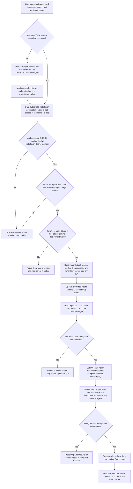

# Coordinated production image upgrade flow

## Overview

An operator runs `scripts/upgrade-production-images` to replace the matched
controller and runtime image pair for a production Kubernetes Installation.
The script establishes a running-Agent baseline, which may be empty, lets Helm
replace the OCC API and worker, then submits exact-Agent deployments
concurrently and waits for all new revisions. The flow ends after image and
deployment convergence; model, channel, and data-recovery proof remain operator
checks.

## Entry Points

- Trigger: Run `scripts/upgrade-production-images` with explicit protected
  inputs, image digests, source SHA, cluster selection, and evidence directory.
- Required state: A healthy production Helm release, complete administrator
  inventory, private API access, reviewed release companions, and no concurrent
  upgrade or Agent draft edits.
- Source: `scripts/upgrade-production-images`,
  `packages/occ/src/index.ts:OpenClawController.getInstallationDeploymentInventory`,
  `deploy/helm/openclaw-enterprise/templates/deployments.yaml`, and
  `packages/occ/src/index.ts:OpenClawController.deployAgent`.

## Flow

## Execution Trace

### 1. Bootstrap the inventory operation when required

`docs/guides/deploy/production-upgrade.md:60`

An older controller cannot prove complete fleet visibility because its
collection operations omit unauthorized resources. For first adoption, the
operator performs a reviewed controller-only Helm upgrade while retaining the
old Installation startup Secret and runtime images. The operator verifies the
candidate controller digest, OCC authentication, and the complete-inventory
operation before starting the coordinated command. This prerequisite is not an
automatic fallback and does not redeploy Agents.

### 2. Admit inputs and freeze the baseline

`packages/occ/src/index.ts:OpenClawController.getInstallationDeploymentInventory`

The script requires owner-only kubeconfig, values, Installation, service-key,
and optional CA files. It rejects mutable image tags, abbreviated source SHAs,
an existing evidence path, and unavailable dependencies. It saves live and
protected inputs before mutation. The live Installation startup Secret must
carry the `openclaw.dev/installation-id` marker established after production
bootstrap. The script requires that marker to equal the authenticated OCC
Installation ID, binding API operations to the selected kube context and
namespace. It then canonicalizes the protected and live Helm values without the
controller image and the protected and live Installation configuration without
the two runtime images. Any other difference stops the upgrade before rendering
or mutation, so stale recovery files cannot overwrite live configuration.

The script calls `occ installation deployment-inventory`. OCC requires
Installation `administer`, then checks exact `read` access to every Namespace
and Agent. It also checks exact `deploy` access for each eligible running Agent.
Any denial fails the complete operation; it never becomes an omitted resource.

OCC correlates every recorded Agent-revision operation with its durable work.
Malformed or missing work fails the request. Queued and claimed work is marked
in progress, and the script rejects the baseline before mutation when any such
work exists. The target set freezes Agents that are active, desire `running`,
have an active revision, and belong to a ready Namespace. A running Agent without
an active revision also blocks the upgrade because initial deployment may still
be in flight.

### 3. Render the matched image candidate

`scripts/upgrade-production-images:188`

The script writes the controller digest to candidate Helm values and one runtime
digest to both Kubernetes Compute image slots. It hashes the complete candidate
Installation file and writes that SHA-256 digest to
`controlPlane.installationChecksum`. `helm template` and Kubernetes server-side
dry run check the chart against the selected cluster before mutation. These
checks establish structural rendering only; they do not prove image contents,
startup, compatibility, or model behavior.

### 4. Replace OCC through Helm

`deploy/helm/openclaw-enterprise/templates/deployments.yaml:20`

The script copies the admitted candidates to the protected operator inputs,
replaces the Installation startup Secret, and invokes the canonical Helm chart.
Helm runs its initialization hook and replaces API and worker Pods when either
the controller image or Installation checksum changes. The checksum is a Pod
template annotation, so a controller-only first adoption cannot prevent the
later runtime configuration from restarting both processes. The script waits
for rollout and verifies both named containers use the candidate digest before
retrying authenticated Installation access. A failure here stops before Agent
deployment fan-out.

### 5. Fan out exact-Agent deployment

`internal/occcli/cli.go:application.agentCommand`

The script starts every `occ agent deploy` request before waiting for any
request process. OCC handles each as an independent exact-Agent mutation:
`OpenClawController.deployAgent` authorizes the Agent and referenced resources,
reads the current draft, freezes a new immutable revision, records attributable
work, and returns its revision ID. Failed or unknown responses remain separate;
the script never converts the group into one unauditable bulk mutation.
An empty target set skips this fan-out and continues to final Helm evidence. It
updates the persisted runtime selection but does not prove that runtime image
can start.

### 6. Fan in on durable results

`internal/occclient/client.go:Client.GetAgentDeployment`

The `occ agent deployment-status` command reads the existing durable deployment
resource. The script polls all returned revision IDs until each succeeds, one
fails, or the shared timeout expires. It then verifies every Agent selected its
returned revision and waits for every revision-labeled Pod to report `Running`
and `Ready`. Gateway and Agent containers must use the runtime digest; a wrong
image fails immediately, while missing or unready Pods share the bounded upgrade
deadline. The script preserves before/after workload inventories and every
response under the private evidence directory.

### 7. Hand off runtime acceptance

`docs/guides/deploy/production-upgrade.md:96`

Script success proves Helm convergence, durable OCC deployment completion,
active-revision selection, and observed container image references. The
operator next proves fresh model responses, provider/channel behavior,
credential boundaries, workspace continuity, native UI access, and any required
restore capability. Those checks are intentionally outside automatic upgrade
success.

## Debugging and Verification

- Inspect `server-dry-run.txt` for chart or admission failures before mutation.
- Inspect `helm-upgrade.txt`, initialization Job logs, and API/worker rollout
  status when OCC does not recover.
- Inspect `dispatch/*.error`, revision history, and `status/*.json` before
  deciding whether a failed or unknown Agent request can be retried.
- Compare `before-workloads.json` and `after-workloads.json` for PVC identity and
  untargeted workload changes.
- Run the credentialed production Kubernetes integration with distinct old and
  candidate image pairs for end-to-end proof. Source checks and mocked commands
  do not establish a real upgrade.

## Related docs

- [Production upgrade guide](../guides/deploy/production-upgrade.md)
- [Production installation](../guides/deploy/production-installation.md)
- [Production Agent verification](../guides/deploy/production-agents.md)
- [Agent deployment reference](../reference/agents/deployment.md)
- [Production startup flow](production-startup.md)
- [Controller worker flow](controller-worker.md)
- [Authoritative platform design](../design.md)

## Manual Notes

[keep this for the user to add notes. do not change between edits]

## Changelog

- 2026-09-24: Record cluster/OCC identity binding, live/protected input equivalence, the supported empty-fleet path, and runtime Pod readiness discovered by the production rehearsal.
- 2026-09-24 13:43: Trace fail-closed inventory admission, nonterminal deployment rejection, and the one-time controller-only bootstrap for older OCC versions. (authoring-run/0fc7c19b-0e15-498c-8328-e436bc702f37 - a7a609d5867398dd0dfd3bb77cfebf91b2cad116)
- 2026-09-23 12:32: Trace matched image replacement and concurrent exact-Agent deployment through durable status convergence. (authoring-run/d29bdbc5-2a6a-46fa-a8e5-6ad78ea2e486 - 78cf9fd25f08e91158617fbd0ae3e42a22e54361)
