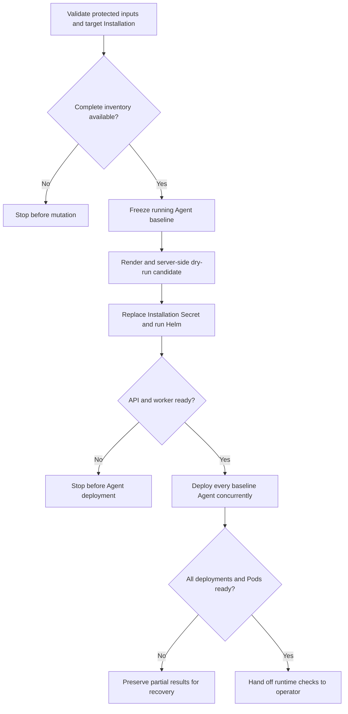

# Coordinated production image upgrade flow

## Overview

`scripts/upgrade-production-images` updates the production Helm release and then
deploys a new revision for every Agent that was running when the command began.
The flow ends when OCC and the selected Agent Pods are ready on the requested
images. Model, channel, workspace, and restore checks remain operator tasks.

## Entry Points

- Trigger: an operator runs `scripts/upgrade-production-images` with explicit
  cluster, release, image, source, and protected-file inputs.
- Required state: a healthy production Helm release, complete authorized fleet
  inventory, matching OCC and Kubernetes Installation identity, and no Agent
  deployment in progress.
- Source: `scripts/upgrade-production-images`,
  `packages/occ/src/index.ts:OpenClawController.getInstallationDeploymentInventory`,
  and `packages/occ/src/index.ts:OpenClawController.deployAgent`.

## Flow

## Execution Trace

### 1. Bootstrap complete inventory when required

`docs/guides/deploy/production-upgrade.md:Adopt the inventory API once`

An older controller cannot return a complete fleet inventory. For first adoption,
the operator updates only the API and worker, leaving runtime configuration and
Agent revisions unchanged. The coordinated command starts only after the new
controller image, OCC authentication, and inventory operation are verified.

### 2. Validate the target and freeze the fleet

`packages/occ/src/index.ts:OpenClawController.getInstallationDeploymentInventory`

The script requires private protected files and immutable image references. It
compares the authenticated OCC Installation ID with the marker on the live
Installation Secret, then compares protected configuration with live Helm and
Secret state while excluding only the image fields it owns.

OCC requires Installation `administer`, exact `read` access to every Namespace
and Agent, exact `read` access to each selected Agent's active revision, and exact
`deploy` access to every eligible running Agent. It fails the whole inventory
when authorization or durable work data is incomplete. The operator's revision
read grant must also cover each replacement revision so status polling can
continue after deployment.

The baseline includes active Agents that request `running`, have an active
revision, and belong to a ready Namespace. Any nonterminal deployment, running
Agent without a revision, or running Agent in an unready Namespace stops the
command. Stopped and deleting Agents are excluded. An empty baseline is valid.

### 3. Build and validate the candidate

`scripts/upgrade-production-images:188`

The script writes the controller digest to candidate Helm values and the runtime
digest to both Kubernetes Compute image fields. It hashes the complete candidate
Installation document and places that checksum on both OCC Pod templates, so a
runtime configuration change restarts the API and worker even when the controller
digest is unchanged.

`helm template` and Helm server-side dry run validate the chart against the
selected cluster. They do not prove image contents, startup, compatibility, or
model behavior.

### 4. Replace OCC through Helm

`deploy/helm/openclaw-enterprise/templates/deployments.yaml:20`

The script saves recovery inputs, updates the protected files, replaces the
Installation Secret without losing its identity marker, and runs Helm. Helm owns
initialization, database migration, and the OCC rollout.

The script waits for both Deployments and verifies their controller image before
retrying authenticated OCC access. A failure stops the flow before Agent fan-out.

### 5. Deploy the recorded fleet

`internal/occcli/cli.go:application.agentCommand`

The script starts one ordinary `occ agent deploy` process for each baseline
Agent before waiting for any process. Each request repeats exact-resource IAM,
creates an immutable revision from the current draft, records durable work, and
emits the normal deployment audit event.

Responses remain separate. A failed or unknown response is never converted into
a bulk success or automatically replayed.

### 6. Wait for durable and runtime readiness

`internal/occclient/client.go:Client.GetAgentDeployment`

The script polls every returned revision until all succeed, one fails, or the
shared deadline expires. It then confirms that each Agent selected its returned
revision and that revision-labeled Pods are `Running` and `Ready`. Gateway and
Agent containers must use the candidate runtime digest. Embedded execution
requires one gateway workload; dedicated execution requires both gateway and
Agent workloads.

The evidence directory retains dispatch responses, durable status, Pod state,
Helm status, and before/after workload inventories.

### 7. Hand off application verification

`docs/guides/deploy/production-upgrade.md:Verify the release`

Command success proves image selection, Helm convergence, durable deployment
completion, active revision selection, and Pod readiness. The operator next
checks real model responses, providers, channels, credential delivery, workspace
continuity, native access, and required restore behavior.

## Debugging and Verification

- Before mutation, inspect `server-dry-run.txt` for chart or admission failures.
- For OCC rollout failures, inspect `helm-upgrade.txt`, initialization Job logs,
  and API and worker rollout status.
- For Agent failures, inspect `dispatch/*.error`, revision history, and
  `status/*.json` before retrying anything.
- Compare `before-workloads.json` and `after-workloads.json` for PVC continuity
  and unexpected workload changes.
- Use the credentialed production Kubernetes integration with distinct baseline
  and candidate image pairs for end-to-end proof. Mocked commands prove only
  script control flow.

## Related docs

- [Production upgrade guide](../guides/deploy/production-upgrade.md)
- [Production installation](../guides/deploy/production-installation.md)
- [Production Agent verification](../guides/deploy/production-agents.md)
- [Agent deployment reference](../reference/agents/deployment.md)
- [Production startup flow](production-startup.md)
- [Controller worker flow](controller-worker.md)
- [Authoritative platform design](../design.md)

## Manual Notes

[keep this for the user to add notes. do not change between edits]

## Changelog

- 2026-09-24 21:21: Separate operator instructions from the runtime trace; require revision-read admission, HTTPS, bounded Kubernetes reads, and the complete execution-mode workload set. (authoring-run/613d1e94-a661-4781-bae5-e28613aa3cf9 - c799988036f43ce1bb828373233f03cc77bb0ea9)
- 2026-09-24: Record cluster/OCC identity binding, live/protected input equivalence, the supported empty-fleet path, and runtime Pod readiness discovered by the production rehearsal.
- 2026-09-24 13:43: Trace fail-closed inventory admission, nonterminal deployment rejection, and the one-time controller-only bootstrap for older OCC versions. (authoring-run/0fc7c19b-0e15-498c-8328-e436bc702f37 - a7a609d5867398dd0dfd3bb77cfebf91b2cad116)
- 2026-09-23 12:32: Trace matched image replacement and concurrent exact-Agent deployment through durable status convergence. (authoring-run/d29bdbc5-2a6a-46fa-a8e5-6ad78ea2e486 - 78cf9fd25f08e91158617fbd0ae3e42a22e54361)
