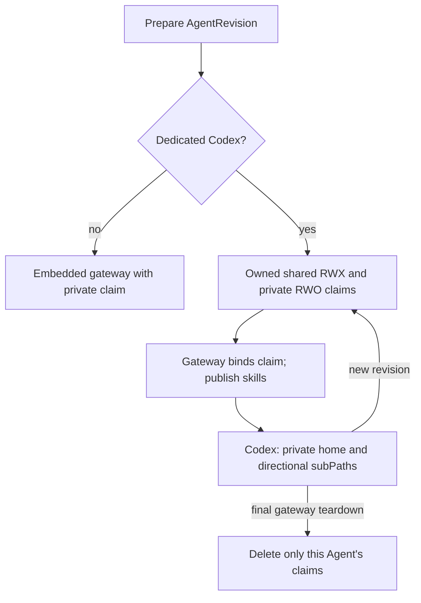

# Dedicated Harness Shared Workspace Drive Flow

## Overview

Dedicated Pods share one Agent-owned `40Gi` `ReadWriteMany` claim. Each real
gateway also mounts a private disk for SQLite state and retained media. The
dedicated Harness cannot access it and Codex credentials stay ephemeral.

## Entry Points

- `apps/controller/src/drivers/compute/kubernetes/index.ts:KubernetesComputeDriver.prepareRevision`

## Flow

## Execution Trace

### 1. Dedicated workload lifecycle

1. `index.ts:KubernetesComputeDriver.prepareRevision` verifies the Agent-owned
   shared and private claims before its gateway; waiting for `Bound` deadlocks
   `WaitForFirstConsumer`. Embedded gateways need only the private claim, including their default workspace.
2. `index.ts:KubernetesComputeDriver.deployment` initializes private state as
   non-root to avoid `EACCES`. Gateway init mounts its private claim root to
   create SQLite/media subdirectories; Harness init receives no private claim.
   Neither init receives secrets or elevated privileges.
3. `runtime-entrypoints.ts:GATEWAY_RUNTIME_ENTRYPOINT` publishes skills before
   Codex: workspace RW/RW; sessions and skills RW/RO; images RO/RW. Claim roots,
   `CODEX_HOME`, credentials, and tokens stay private. The gateway's state,
   agent database directory, and media persist on its own claim, with the nested
   gateway Codex home overmounted from ephemeral storage. Embedded gateways
   retain their attested default workspace on that same private claim; dedicated
   gateways continue to use the shared workspace.
4. `index.ts:KubernetesComputeDriver.removeRetiredGateway` preserves storage
   across revisions/restarts, then requests deletion of both exact-owned claims
   by UID before deleting the final gateway. PVC protection waits for consumers
   to unmount; retiring a predecessor does not delete the current gateway's claims.

## Debugging and Verification

- Private storage and UID ownership checks:
  `node --test tests/conformance/kubernetes-compute.test.mjs`.
- [Real k3d verification](../reference/drivers/kubernetes-compute.md#verification-evidence)
  exercises directional sharing, real transcript/media continuity after gateway
  Pod replacement, isolation, SQLite integrity, and embedded execution.
  Its dedicated case requires a gateway image that writes the real conversation
  to SQLite; older JSONL transcript images and version assertions alone cannot
  establish that behavior. Missing cluster/runtime prerequisites are a
  verification gap, not passing proof.
- Real dedicated Docker proves an authenticated provider response with credentials only in Codex.

## Related docs

- [Shared-drive specification](../../specs/12-dedicated-harness-shared-workspace-drive.md)
- [Kubernetes Compute Driver](../reference/drivers/kubernetes-compute.md)

## Manual Notes

[keep this for the user to add notes. do not change between edits]

## Changelog

- 2026-08-28 17:58: Updated moved feature-reference links for the documentation organization. (01a036f4-cf1d-7cc1-bbc1-000879038ac8 - 4270aa29b7015562049f46c6027962fd85b584a9)
- 2026-08-25 13:27: Removed duplicate mount, storage, and verification reference material while preserving lifecycle and security boundaries. (01a03a9a-9e6b-7e91-afc2-d1b38d1244a6 - a3d40a1d4c48077cd48c8943a239c208da7d1c54)
- 2026-08-25 11:47: Documented the real-k3d EACCES failure and dedicated-only non-root private-state initialization without PVC, secrets, added images, or elevated privileges. (01a03a20-cad9-7a92-82e5-e9a1ab62db07 - a359394f17b44b26265ba52a681bd74c434b974c)
- 2026-08-25 11:28: Distinguished namespace-scoped worker RBAC from driver-enforced exact-Agent ownership and documented source-verified claim-first cleanup ordering. (01a03a20-cad9-7a92-82e5-e9a1ab62db07 - a359394f17b44b26265ba52a681bd74c434b974c)
- 2026-08-25 11:14: Documented dedicated Kubernetes Agent-owned shared-drive reconciliation, five directional mounts, privacy, lifecycle, fail-closed ownership, and genuine Kubernetes/Docker verification. (01a03a20-cad9-7a92-82e5-e9a1ab62db07 - a359394f17b44b26265ba52a681bd74c434b974c)
