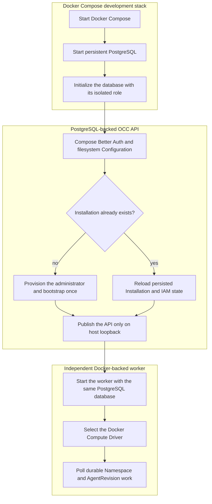

# Development Startup Flow

## Overview

Start the supported OpenClaw Control Center (OCC) development environment with
Docker Compose. Compose starts PostgreSQL, initializes the database, launches
the API, bootstraps a fresh singleton Installation, and starts the independent
controller worker. PostgreSQL is required; there is no in-memory development
mode. This flow ends when the loopback-published API accepts authenticated
requests and the Docker-backed worker begins polling durable work.

For prerequisites, startup commands, and production differences, use the
[deployment guide](../guides/deploy.md). The [quickstart](../guides/quickstart.md)
owns the first authenticated session and resource walkthrough.

## Entry Points

- Trigger: Run `docker compose up --build` from the repository root.
- Source: `apps/controller/src/server.mjs:start`,
  `apps/controller/src/composition/development-postgres.ts:composePostgresDevelopment`,
  and `apps/controller/src/worker.mjs:configuration`.
- Assumptions: Docker Engine, existing approved gateway/Codex runtime images,
  a provider credential for real model turns, persistent PostgreSQL and
  configuration volumes, and an API published only on host loopback.

## Flow

## Execution Trace

### 1. Compose supplies the process environments and network boundary

`compose.yaml:services.controller`, `compose.yaml:services.worker`,
`apps/controller/src/server.mjs:configuration`

[`compose.yaml`](../../compose.yaml) supplies separate API and worker
process environments and publishes the controller only on
`127.0.0.1:${OPENCLAW_DEV_PORT:-3000}`. The API binds to `0.0.0.0` inside the
private Compose bridge only when `OCC_DEVELOPMENT_TRUSTED_BRIDGE_CIDR` is
explicit; direct host-process debugging must bind `127.0.0.1` or `::1`.
Forwarded identity headers, bearer credentials, and non-local clients remain
rejected.

The worker receives the configured gateway/Codex image references and the
existing provider credential. These are inputs to later authorized runtime
creation; starting the control plane alone does not launch an Agent workload.

### 2. Start persistent PostgreSQL and initialize the development database

`apps/controller/src/server.mjs:start`

Compose starts PostgreSQL first and retains controller metadata in its
`occ_postgres_data` named volume. Its isolated initialization service prepares
the database before the controller starts; the API and worker receive only the
lower-privilege application-role connection.

The [controller entrypoint](../../apps/controller/src/server.mjs) rejects a
missing `OCC_DATABASE_URL` in development and production. It always enters
[`composePostgresDevelopment`](../../apps/controller/src/composition/development-postgres.ts)
for development; no in-memory API composition or fallback exists.

### 3. Compose authentication, configuration, and one Installation

`apps/controller/src/composition/development-postgres.ts:composePostgresDevelopment`

The development composition opens PostgreSQL, loads the singleton Installation
when present, and creates Better Auth with the configured authentication
secret and loopback origin. Without `OCC_CONFIG_PATH`, it selects the native
IAM Driver, the Docker Compute Driver, and a filesystem Configuration Driver
rooted at `/app/.development/configurations`.

Only the controller mounts the persistent `occ_configuration_data` volume.
PostgreSQL owns platform metadata, audit, IAM, sessions, and durable work; the
filesystem Driver owns native Configuration documents. The worker and Agent
workloads never receive that configuration volume.

On a fresh database, the controller provisions `OPENCLAW_DEV_EMAIL` and
`OPENCLAW_DEV_PASSWORD`, signs in internally, and calls the existing
authenticated bootstrap route with `OPENCLAW_DEV_INSTALLATION_NAME`. This
happens once before normal serving. Reusing existing Compose volumes reloads
the Installation without replacing its account, password, IAM policy, or
existing revision history.

### 4. Become ready and start the independent worker

`apps/controller/src/worker.mjs:configuration`

The API registers its existing Fastify routes, binds inside the private Compose
network, and becomes reachable at `http://127.0.0.1:3000` by default. Compose
starts the worker only after the controller health check succeeds.

The [worker entrypoint](../../apps/controller/src/worker.mjs) independently
opens the same application-role PostgreSQL database and selects
`compute-docker-development` when no trusted `OCC_CONFIG_PATH` overrides the
Driver bundle. It validates the persisted Installation and IAM policy, emits
`worker.started`, and begins polling durable Namespace and AgentRevision work.

Only the worker receives the Docker Engine socket. It creates an isolated
Docker network for each Namespace and starts the selected embedded OpenClaw or
dedicated Codex runtime only after an authorized deployment. The Docker socket,
provider credential, and configuration volume never appear together in the
API or Agent-owned workload containers.

### 5. Hand off to authenticated requests and durable reconciliation

`apps/controller/src/index.ts:createFastifyApp`

After bootstrap and listening complete, Better Auth verifies sign-in requests
and issues the controller session cookie. The Installation already exists;
normal clients do not bootstrap it again. Protected OCC requests resolve that
session and separately authorize the requested operation through IAM. Follow
the [quickstart](../guides/quickstart.md) for the sign-in procedure.

The worker does not receive the administrator password or Better Auth secret
and does not open an HTTP listener. Accepted lifecycle operations continue
through the [controller worker flow](controller-worker.md); their Docker
infrastructure effects are traced in the
[Docker Compose development flow](docker-compose-development.md).

## Debugging and Verification

- Run `docker compose ps` and confirm PostgreSQL, the controller, and the
  worker are available after initialization completes.
- Expect the API to emit `listening` and the worker to emit
  `{"event":"worker.started","computeDriverId":"compute-docker-development"}`,
  followed by `worker.health`.
- The quickstart's authenticated `GET /installation` must return the persisted
  Installation. A missing, invalid, expired, or revoked session returns `401`; an
  authenticated Principal without the required IAM permission returns `403`.
- `startup-error` identifies invalid API mode, listener, authentication, or
  database settings. `OCC_DATABASE_URL must be explicitly configured in
development.` means the application-role PostgreSQL connection is missing.
- `worker.startup-error` identifies an invalid worker mode, missing PostgreSQL
  URL, absent Installation, unavailable Docker Engine, or rejected Driver
  configuration. Never mount the Docker socket into the API as a workaround.
- Run the focused source-backed startup check with
  `node --test tests/integration/configuration-startup.test.mjs`. This does not
  prove a real Docker model turn; the
  [Docker Compose development flow](docker-compose-development.md) owns the
  full runtime verification boundary.

## Related docs

- [Deployment guide: development and production](../guides/deploy.md)
- [Quickstart](../guides/quickstart.md)
- [Controller worker execution flow](controller-worker.md)
- [Controller and Installation configuration](../reference/settings.md)
- [Controller worker operation](../reference/controller.md)
- [Docker Compose development flow](docker-compose-development.md)
- [Docker Compute Driver](../reference/drivers/docker-compute.md)
- [Authentication](../reference/authentication.md)
- [Shared platform startup flow](platform-startup.md)
- [Production startup flow](production-startup.md)
- [Installation Driver package loading flow](driver-plugin-loading.md)
- [Authoritative platform design](../design.md)

## Manual Notes

[keep this for the user to add notes. do not change between edits]

## Changelog

- 2026-08-28 17:54: Separated startup execution from operator setup and sign-in instructions, linking the deployment guide and quickstart. (01a036f4-cf1d-7cc1-bbc1-000879038ac8 - 4270aa29b7015562049f46c6027962fd85b584a9)
- 2026-08-26 23:13: Replaced the removed in-memory path with PostgreSQL-only Docker Compose startup, automatic Installation bootstrap, filesystem configuration, and Docker-backed worker ownership. (01a036f4-cf1d-7cc1-bbc1-000879038ac8 - 02638f10ed52b413d41378ae0f6b45ca19b8b149)
- 2026-08-25 03:43: Added the development API, Better Auth sign-in, Installation bootstrap, persistence selection, and independent worker startup flow. (01a036f4-cf1d-7cc1-bbc1-000879038ac8 - 2e9769c751d7)
