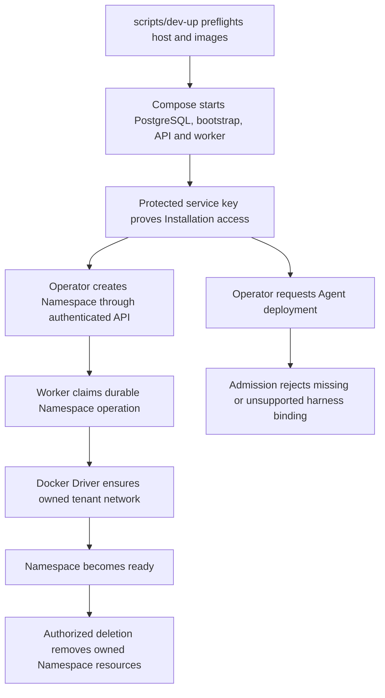

# Docker or Podman Compose Development Flow

## Overview

`scripts/dev-up` performs host preflight, selects Docker Engine or Podman,
selects or verifies runtime images, starts Compose, waits for PostgreSQL
migration, Installation bootstrap, API health and worker readiness, and proves
authenticated Installation access with a protected local bootstrap service key.
The worker can then reconcile Namespace infrastructure. Agent deployment stops
at harness authentication admission because Docker Compute rejects bindings;
this flow does not reach model execution or TUI attachment.

## Entry Points

- Trigger: `./scripts/dev-up [--key-output PATH] [-- COMPOSE_GLOBAL_OPTIONS...]`
  from the repository root, followed by authenticated Namespace operations.
- Source: `scripts/dev-up`, `apps/controller/src/worker.ts:ControllerWorker`, and
  `apps/controller/src/drivers/compute/docker/index.ts:DockerComputeDriver`.
- Assumptions: Docker Engine with Compose, or Podman with `podman-compose` and
  `yq` v4; Bash, curl and Python 3; writable PostgreSQL and Configuration volumes;
  loopback API publication. Startup needs no model credential.

## Flow

## Execution Trace

### 1. Start and initialize the local stack

`scripts/dev-up`, `apps/controller/src/server.mjs:start`

[Docker or Podman Compose startup](docker-compose-development/startup.md) owns
engine selection, database initialization, local API admission and worker startup.

### 2. Prepare Namespace infrastructure and enforce Agent admission

`apps/controller/src/drivers/compute/docker/index.ts:DockerComputeDriver`

[Namespace execution and Agent admission](docker-compose-development/agent-execution.md)
traces API authorization, durable work, tenant network ownership, unsupported
Agent authentication and exact resource removal.

## Debugging and Verification

- `dev-up` should show database readiness, completed initialization, a ready API
  and worker, a private copied service-key path and authenticated Installation access.
- `<engine> network ls --filter label=org.openclaw.enterprise.compute-driver=docker`
  should show the owned network for a ready development Namespace.
- Agent deployment must reject a missing or unsupported harness binding before
  workload creation. A worker `OPENAI_API_KEY` cannot make it supported.
- Retained Docker/Podman model suites currently cannot pass through this admission
  boundary. See [Docker test status](../testing/docker.md); old model-turn evidence
  does not establish current support.
- Namespace deletion removes its owned resources while preserving unrelated ones.

## Related docs

- [Development and production deployment](../guides/deploy.md)
- [Quickstart](../guides/quickstart.md)
- [Docker Compute Driver](../reference/drivers/docker-compute.md)
- [Kubernetes Agent deployment and TUI](../guides/deploy/production-agents.md)
- [Controller worker flow](controller-worker.md)

## Manual Notes

[keep this for the user to add notes. do not change between edits]

## Changelog

- 2026-09-17 00:48: Correct current harness admission and metadata-only dispatch boundaries after implementation review. (01a0acbf-4d5a-7413-9411-dce911f3ad23 - 107900e9551b90c3e9ac24d30f8ea866f17e5dbb)

- 2026-09-09: Added automatic Podman selection, API socket delivery, Podman
  status and bootstrap-copy handling, and the Docker-only Fluentd and Agent
  runtime verification boundaries while retaining the Docker Compose path.

- 2026-09-01 22:09: Document explicit runtime image rebuilding and link packaged-plugin and Codex compatibility checks. (01a05f89-ff1c-7643-a77f-7e1e3aed9e5f - 5fa47a6)

- 2026-09-01 19:09: Merge the development startup trace into the canonical Docker Compose flow and clarify the `dev-up` readiness proof versus later API deployment and TUI attachment. (01a05f95-dd80-7011-990f-d1c46b5bb3cc - aa366c49c44834d59f74994c5fd37fb8096f169f)
- 2026-08-31 20:33: Trace the shared installation initializer, startup ordering, and initializer-owned credential delivery. (01a05a3d-526f-7553-8cd8-070bd1847acb - b6f213cbcee11ba3dd69886c936c7e5abe233eb3)

- 2026-08-31 19:14: Document bootstrap service-key API access and operator credential cleanup for the TUI path. (codex/01a05a3d-526f-7553-8cd8-070bd1847acb - 06c4bccb95543d3d545d011e72074f805f339aa8)

- 2026-08-31 17:45: Align bootstrap identity and protected service-key storage with the current startup path. (codex/01a05a69-3fbe-7441-9e6d-20394758cf94 - 0797098646028ac00cb26cd4afcbc9b2cf8bcb24)
- 2026-08-31 15:40: Added the compact development TUI runtime trace and two-turn verification boundary. (01a059f9-e5cc-7b01-9479-0c5087f5e58f - 3a04cee)
- 2026-08-28 17:54: Clarified the Docker workload execution boundary and linked operator setup, quickstart, and worker traces. (01a036f4-cf1d-7cc1-bbc1-000879038ac8 - 4270aa29b7015562049f46c6027962fd85b584a9)
- 2026-08-25 10:13: Removed the deleted bootstrap sidecar/script from the Compose flow and documented controller-owned fresh-database self-bootstrap. (01a03630-cd9f-7352-9e64-1d30de98c7dd - c56867448b187304723d20043dd5a0e184736ef2)
- 2026-08-25 08:46: Clarified that Docker E2E verification may invoke gateways through Namespace networking or published loopback ports. (01a03630-cd9f-7352-9e64-1d30de98c7dd - 949e57ba008486c7ad60978df79dc53cce31bee9)
- 2026-08-24 22:43: Added API-only filesystem Configuration Driver volume boundaries and removed stale Docker subnet knobs. (01a03630-cd9f-7352-9e64-1d30de98c7dd - 63890cf94cfc15f848f62f8f957eb766d2101f55)
- 2026-08-24 21:40: Documented Docker Compose development startup and Docker Compute Driver runtime flow. (01a03630-cd9f-7352-9e64-1d30de98c7dd - 63890cf94cfc15f848f62f8f957eb766d2101f55)
