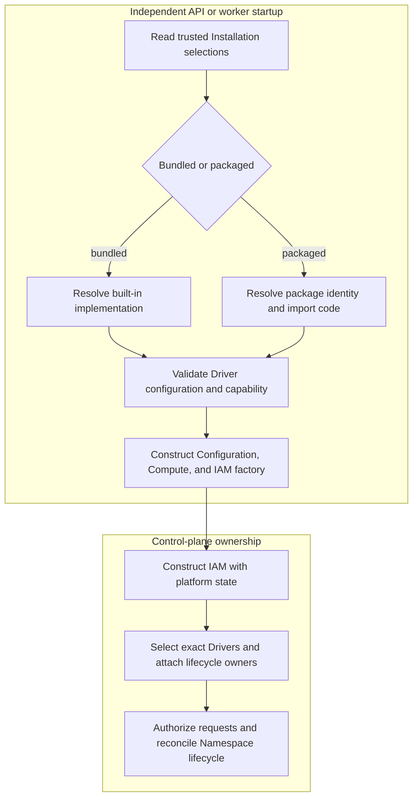

# Installation Driver Package Loading Flow

## Overview

The API and worker independently resolve the operator-selected IAM, Compute,
and Configuration Drivers, then hand them to OCC. Each selection may use its
bundled implementation or an installed package in development or production.
This trace stops when OCC owns Driver selection and Namespace reconciliation.

## Entry Points

- Trigger: Start `apps/controller/src/server.mjs` or
  `apps/controller/src/worker.mjs` with trusted Installation configuration.
- Source:
  `apps/controller/src/composition/installation-config.ts:loadInstallationConfiguration`,
  `apps/controller/src/composition/production.ts:composeProduction`, and
  `apps/controller/src/worker.ts:ControllerWorker.start`.
- Assumptions: An operator has installed and selected the reviewed package;
  [Install Driver packages](../reference/drivers/selection.md) owns installation,
  package formats, configuration examples, private registries, and deployment.

## Flow

## Execution Trace

### 1. Resolve and validate selected Driver implementations

`apps/controller/src/composition/installation-config.ts:loadInstallationConfiguration`

Each process reads the same trusted startup YAML, selects bundled Drivers or
explicit operator-installed packages, and derives packaged implementation
identity from installed metadata. The
[operator installation guide](../reference/drivers/selection.md) defines the package,
pinning, registry, and configuration contract. TypeBox checks each selected
Driver's closed schema before implementation-owned semantic validation;
invalid package exports, identity, capability, or lifecycle wiring reject
startup without fallback.

Installed packages run arbitrary, unsandboxed code with controller database,
credential, Kubernetes, tenant, and authorization authority. An untrusted or
malicious package can violate authorization and tenant isolation; package
validation and lockfile integrity do not establish publisher trust.

### 2. Construct the single authoritative runtime bundle

`apps/controller/src/composition/installation-config.ts:loadInstallationConfiguration`

One asynchronous call returns the validated Installation, Configuration Driver,
Compute Driver, and required `createIAMDriver(state)` function. Bundled and
packaged IAM receive the same controller-owned platform state. The bundled IAM
Driver loads current policy for each identity lookup and authorization decision;
packaged Drivers must do the same, which operator review verifies because the
runtime cannot enforce package internals. Configuration is constructed before
Compute; packaged factories must return their exact server-owned capability
and identity.

Kubernetes-specific image, projected-credential, and preflight requirements
apply only to bundled Kubernetes Compute. Startup enforces the
[production revision-stage contract](../reference/drivers/compute.md#production-revision-stages)
before returning any production runtime; development can use a four-operation
Driver, and the worker still fails closed if a required stage becomes unavailable.

### 3. Load current policy and hand off lifecycle ownership

`apps/controller/src/worker.ts:ControllerWorker.start`

API and worker construct separate process-local Driver instances. Production
composition validates persisted policy, creates the selected IAM Driver with
platform state, and registers exact IAM, Compute, and Configuration
identities with OCC. Worker startup attaches selected lifecycle owners once.
The bundled IAM Driver loads current policy for identity lookup and
authorization; installed IAM Drivers must honor the same contract. Neither is
rebuilt or replaced after account or policy changes.

OCC owns exact-resource authorization and invokes Compute only during Namespace
or AgentRevision reconciliation. Embedded OpenClaw and dedicated Codex retain
their existing Harness-owned runtime topology.

## Debugging and Verification

- Run `node --test tests/integration/driver-plugin-installation.test.mjs` for
  real installed IAM, Compute, and Configuration packages; production admission;
  IAM allow/deny evidence; Configuration CRUD; and OCC provisioning of
  `/tmp/local-test`.
- Startup failures emit `startup-error` or `worker.startup-error`; inspect
  Driver identity, persisted policy, capability contracts, and lifecycle stages.
- The integration uses `InMemoryPlatformState`; it does not prove a running
  PostgreSQL worker, live Kubernetes, private registry, gateway, or model turn.

## Related docs

- [Install Driver packages](../reference/drivers/selection.md)
- [Platform startup flow](platform-startup.md)
- [Configuration Driver and Agent Revision flow](configuration-driver.md)
- [Compute Driver lifecycle-hook flow](compute-driver-lifecycle-hooks.md)
- [ComputeDriver contract](../reference/drivers/compute.md)

## Manual Notes

[keep this for the user to add notes. do not change between edits]

## Changelog

- 2026-08-28 17:58: Updated moved feature-reference links for the documentation organization. (01a036f4-cf1d-7cc1-bbc1-000879038ac8 - 4270aa29b7015562049f46c6027962fd85b584a9)
- 2026-08-24 19:46: Pass controller-owned platform state directly to bundled and installed IAM Drivers. (01a036c0-9a0e-7ee0-8428-17824f5172a0 - 786b7ce)
- 2026-08-24 17:12: Documented the controller-owned current-policy loader supplied to bundled and installed IAM Drivers. (01a0352c-debe-73b1-baa6-379855af874f - 4502d7e)
- 2026-08-24 17:12: Removed IAM policy snapshots and Driver rebuilding; bundled and installed IAM Drivers load current policy for every authorization decision. (01a0352c-debe-73b1-baa6-379855af874f - 4502d7e) (NOT_IN_SPEC)
- 2026-08-21 20:53: Consolidated startup phases, linked canonical package and Compute contracts, and clarified unsandboxed authorization and tenant-isolation risk. (01a0269c-0551-7f01-9dfc-ffb2a0896c94 - f6491502262d6190c95d2a910ee46283c30244f9)
- 2026-08-21 20:12: Required both typed Compute revision stages before production startup while preserving four-method development Drivers. (01a0269c-0551-7f01-9dfc-ffb2a0896c94 - b651c4ae38310032f8cda47c868a9b282fb12ff3)
- 2026-08-21 20:05: Consolidated the package flow into runtime order and linked canonical operator guidance; clarified metadata identity, TypeBox, required IAM factory, and unsandboxed authority. (01a0269c-0551-7f01-9dfc-ffb2a0896c94 - b651c4ae38310032f8cda47c868a9b282fb12ff3)
- 2026-08-21 19:28: Enabled all reviewed Driver capabilities in both modes and documented state-aware IAM, structural production Compute, and honestly scoped production-admission proof. (01a0269c-0551-7f01-9dfc-ffb2a0896c94 - a45b01d258c6a6b10db2301cad3303e2fa520f09)
- 2026-08-21 17:28: Consolidated startup into one async Driver bundle, removed hidden module-cache state, and preserved fail-closed factory and integration proof. (01a0269c-0551-7f01-9dfc-ffb2a0896c94 - d17a87541cbebc8e333bd00bd90c42e734d91a80)
- 2026-08-21 16:27: Recorded exact dependency pins, conditional ESM exports, isolated tarball exception, simplified factories, and frozen production installation proof. (01a0269c-0551-7f01-9dfc-ffb2a0896c94 - 4fe8091c5f7faa1a56445beb022e075b59787bee)
- 2026-08-21 16:19: Documented trusted Driver package startup, capability restrictions, isolated installation, and real development Namespace provisioning. (01a0269c-0551-7f01-9dfc-ffb2a0896c94 - 9e356f7228c51fe68d85327cf7b47dbd04e420a4)
