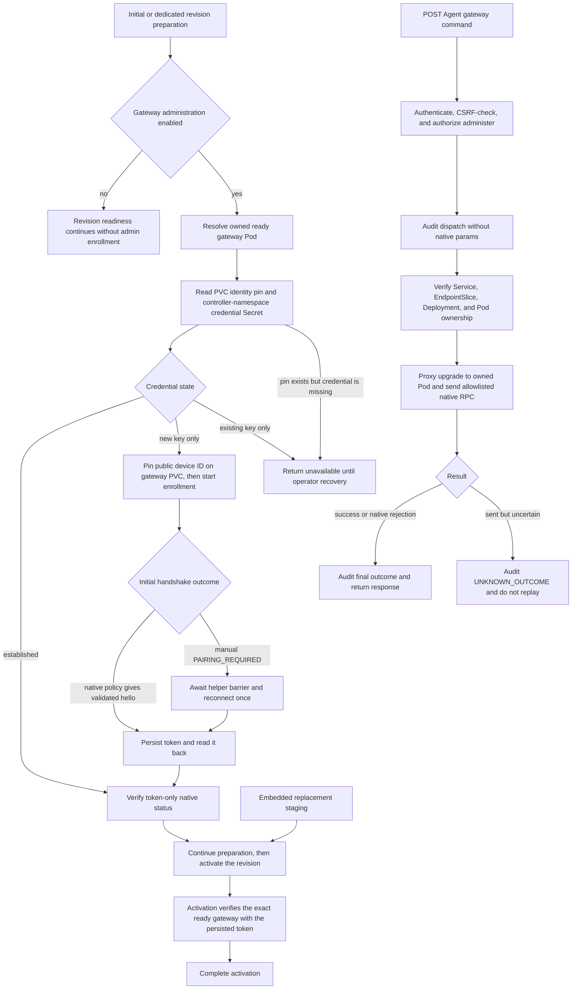

# Gateway Administration Flow

## Overview

OCC gateway administration enrolls one controller-owned native operator device
for each bundled Kubernetes Agent gateway, stores its token in a private
controller-namespace Secret, and dispatches allowlisted native commands for an
authorized active Agent. The flow starts during AgentRevision preparation and
later continues at `POST /namespaces/:namespaceId/agents/:agentId/gateway/`.
It stops at the native gateway response, native rejection, or an explicitly
unknown outcome after a sent command.

## Entry Points

- Trigger: worker prepares an admitted AgentRevision, then an authorized caller
  posts an allowlisted native command to the Agent gateway route.
- Source: `apps/controller/src/drivers/compute/kubernetes/index.ts:KubernetesComputeDriver.prepareGatewayAdministration`,
  `apps/controller/src/drivers/compute/kubernetes/index.ts:KubernetesComputeDriver.dispatchGatewayAdministrationCommand`,
  and `apps/controller/src/index.ts:createFastifyApp`.
- Assumptions: the bundled Kubernetes Compute Driver is selected, runtime
  `gatewayAdministration.controllerNamespace` is configured, matching Helm RBAC
  exists, the Agent has one active ready gateway, and the caller has exact Agent
  `administer`.

## Flow

## Execution Trace

### 1. Revision preparation opts into gateway administration

`apps/controller/src/drivers/compute/kubernetes/index.ts:KubernetesComputeDriver.prepareRevision`

After the worker reconciles the Agent-owned gateway resources, the bundled
Kubernetes Driver checks `runtime.gatewayAdministration`. If the option is
absent, revision readiness proceeds without an OCC native device. If present,
the driver enters gateway administration preparation before reporting the
revision ready; a ready gateway port alone is not enough.
For a dedicated replacement revision, preparation verifies the currently
deployed gateway and leaves it serving until activation. Embedded replacement
preparation retains its existing staging-only behavior so a broken old gateway
cannot block recovery. In both modes, activation verifies device-token access
to the ready replacement before completing. Each access check validates the
actual gateway revision and preserves the same Agent-owned device identity.
The admitted native profile must use explicit `gateway.auth.mode: token` and
omit `gateway.roles`. Unsupported profiles fail before credential access or
native dispatch.

### 2. The worker selects the exact owned gateway Pod

`apps/controller/src/drivers/compute/kubernetes/index.ts:KubernetesComputeDriver.prepareGatewayAdministration`

The driver resolves the tenant namespace and selects one ready Pod labelled as
the Agent gateway. It verifies Namespace and Agent ownership, revision
annotations, Pod phase, readiness, and Pod IP. Multiple ready Pods or ownership
mismatches fail closed instead of selecting an arbitrary target. Real native
gateway readiness executes a bounded HTTP `/readyz` request over Pod loopback.
This avoids misclassifying kubelet probes without forwarded headers when the
kubelet node address is also an explicitly trusted API proxy source.

### 3. OCC creates or reads the controller-owned native identity

`apps/controller/src/drivers/compute/kubernetes/gateway-administration.ts:gatewayAdministrationSecretName`

The credential Secret is named from the Namespace and Agent IDs and is stored
in `runtime.gatewayAdministration.controllerNamespace`. It contains the OCC
Ed25519 private key, public key, device ID, and, after successful enrollment,
the native device token and scopes. A newly created key-only record is the only
state that may start first-time enrollment. An existing key-only record is a
terminal incomplete enrollment state until explicit operator recovery.
Before sending the first handshake, the worker pins the public device ID in
the existing gateway PVC's `openclaw.dev/occ-gateway-device-id` annotation and
reads it back. This retained pin prevents a missing Secret from being mistaken
for first enrollment. Missing or mismatched credentials fail closed; private
keys and device tokens remain only in the controller Secret.

### 4. The one-shot helper approves or verifies the exact native device

`apps/controller/src/drivers/compute/kubernetes/index.ts:KubernetesComputeDriver.prepareGatewayAdministration`

For first enrollment, the worker starts a fixed `node -e` helper through
Kubernetes `pods/exec` in the verified gateway container and starts one native
SDK shared-token connection with the same OCC identity. The helper uses the
existing Agent gateway transport token over Pod loopback. It verifies an
already-paired native device when native policy already paired the exact OCC
public key and device ID as `operator` with `operator.admin`; otherwise it
approves exactly one pending request matching that public key, device ID, role,
and scope. It does not approve newest/all requests, grant broader scopes, or
serve as a caller-controlled exec tunnel.

### 5. The SDK token is durable before readiness

`apps/controller/src/gateway/native-client.ts:connectOpenClawGatewayNativeWithBootstrap`

If native policy returns a validated hello on the initial
connection, the SDK uses that connection's token handoff directly. When the
gateway instead pauses with manual `PAIRING_REQUIRED`, the SDK stops the paused
client, waits for one helper approval barrier, and opens exactly one new
shared-token connection through the same Kubernetes Pod proxy with the
same OCC identity and remaining enrollment budget. That reconnect exists only
to complete the initial token handoff after native approval; it is not an RPC
replay and is never restarted for an existing key-only credential. The SDK
returns a device token through host callbacks before those callbacks can await
Kubernetes persistence. The driver captures the token, writes it into the same
controller-owned Secret, reads the Secret back, and proves a token-only
`status` request before returning gateway administration ready. If token
persistence is uncertain, a read-back decides the state: a saved token uses the
token-only path; a remaining key-only Secret requires operator recovery.

### 6. The API admits one Agent-scoped command

`apps/controller/src/index.ts:createFastifyApp`

`POST /namespaces/:namespaceId/agents/:agentId/gateway/` requires a valid
session or service API key. Session callers must match the configured public
origin; service keys bypass cookie CSRF but still require IAM. The controller
authorizes exact Agent `administer`, rejects methods outside the native
allowlist, and appends an audit dispatch record before contacting the gateway.
The audit detail names the native method but omits native parameters and
results.
For `config.get`, OCC omits the upstream internal
`sourceConfigBeforeMigrations` field: OpenClaw 2026.8.1 does not redact that
snapshot. The supported public config fields retain native redaction and values.

### 7. Dispatch uses Kubernetes Pod proxy to the owned Pod

`apps/controller/src/drivers/compute/kubernetes/index.ts:KubernetesComputeDriver.dispatchGatewayAdministrationCommand`

The driver reads the established controller-namespace credential Secret,
verifies the current Service, EndpointSlice, ready Deployment, and ready Pod
for the Agent's active revision, and opens an authenticated `pods/proxy` WebSocket upgrade to that Pod's
gateway port. It does not dial the Service directly and does not require a new
gateway Service ingress rule. The native SDK sends the single allowlisted RPC
with the persisted device token. The controller exposes an ephemeral loopback
WebSocket bridge to the SDK and authenticates the upstream upgrade with
existing Kubernetes TLS credentials. The API server connects to the Pod IP
and adds proxy metadata, preserving remote-client pairing semantics. A
port-forward connection would instead trigger native local-backend self-pairing
bypass without creating the durable device record required for OCC access.
Native Configuration must explicitly trust the exact verified API-server-to-Pod
source addresses in `gateway.trustedProxies`; Kubernetes must supply a
non-loopback forwarded client IP. The bridge drops caller forwarded headers,
so only the Kubernetes-generated attribution crosses this boundary. Missing
or mismatched native proxy trust fails closed before pairing.

### 8. First-response semantics decide the terminal HTTP result

`apps/controller/src/gateway/native-client.ts:requestOpenClawGatewayNative`

The SDK waits for the first native response or typed native rejection. Once a
request is sent, timeout, disconnect, or cancellation becomes an unknown
outcome because the gateway might still have received the command. OCC records
that outcome and returns `UNKNOWN_OUTCOME`; it does not retry or retarget a
mutation. If the native call returns normally, the API records success or
`NATIVE_REJECTION` and returns the native payload or error in the standard OCC
response envelope.

## Debugging and Verification

- Confirm the Installation startup YAML and Helm values use the same
  `gatewayAdministration.controllerNamespace`; for a separate namespace,
  create it before installing the chart.
- Inspect Helm-rendered RBAC for controller-namespace Secret access: worker
  `get/create/update`, API `get`, and no Secret `list/delete`.
- Inspect tenant RoleBindings for API and worker `pods/proxy` GET, and
  worker-only `pods/exec`.
- Run the real Kubernetes gateway access integration after parent runtime proof
  is ready. It should pin `@openclaw/gateway-client` `2026.8.1-beta.3` with
  `@openclaw/gateway-protocol` `2026.8.1-beta.3`, run against native runtime
  `2026.8.1`, set native
  `gateway.nodes.pairing.autoApproveLocal=false` for the explicit approval
  case, prove an unrelated pending device stays pending, and repeat token-only
  dispatch after restart.
- Treat fixture-only Kubernetes checks, Helm rendering, and a ready TCP port as
  insufficient for native enrollment or command dispatch proof.

## Related docs

- [Agents](../reference/agents.md#gateway-administration)
- [Kubernetes Compute Driver](../reference/drivers/kubernetes-compute.md)
- [Settings reference](../reference/settings.md#required-production-controller-environment)
- [Production deployment](../guides/deploy.md#enable-gateway-administration)
- [OCC gateway access spec](../../specs/15-occ-gateway-access.md)

## Manual Notes

[keep this for the user to add notes. do not change between edits]

## Changelog

- 2026-08-31 12:52: Corrected the native SDK pin and documented manual pairing pause, single helper barrier, and one reconnect under the enrollment deadline. (cody/01a04ae1-7ba7-7372-88a4-488e01f690ae - 61542d0)
- 2026-08-31 12:41: Documented bundled Kubernetes native gateway enrollment, controller-owned token readiness, Agent-scoped dispatch, and unknown-outcome handling. (cody/01a04ae1-7ba7-7372-88a4-488e01f690ae - 61542d0)
