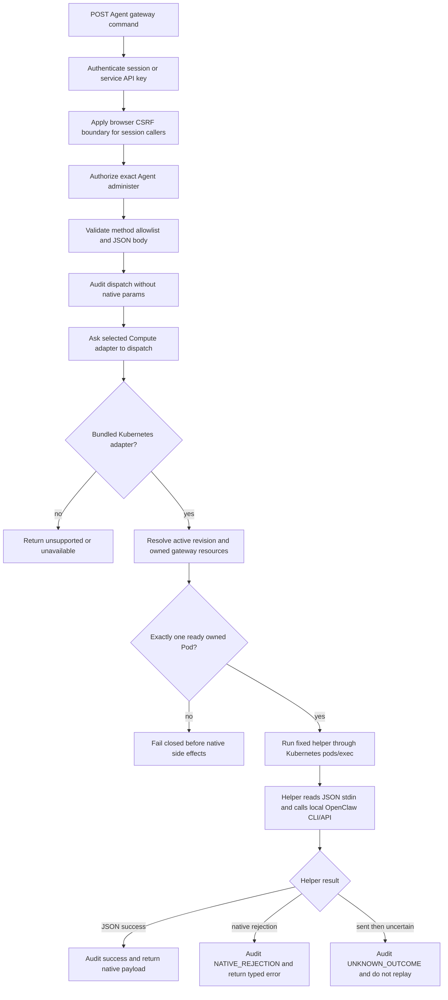

# Gateway Administration Flow

## Overview

OCC gateway administration dispatches one allowlisted native gateway command for
an authorized active Agent by running a fixed helper inside that Agent's current
owned Kubernetes gateway Pod. The flow starts at
`POST /namespaces/:namespaceId/agents/:agentId/gateway/`, crosses through OCC
authentication, IAM, audit, Kubernetes ownership resolution, and `pods/exec`,
then stops at the helper's captured JSON response, a native rejection, or an
explicitly unknown outcome after dispatch.

The path uses the gateway's existing local OpenClaw CLI/API configuration. It
does not enroll an OCC native device, store a gateway administration token
Secret, pin identity on the gateway PVC, open a native WebSocket proxy, or
project OCC private keys or controller Kubernetes credentials into Agent
workloads.

## Entry Points

- Trigger: an authenticated caller posts an allowlisted native command to the
  Agent gateway route.
- Source: `apps/controller/src/index.ts:createFastifyApp`,
  `apps/controller/src/drivers/compute/kubernetes/index.ts:KubernetesComputeDriver.dispatchGatewayAdministrationCommand`,
  and `apps/controller/src/drivers/compute/kubernetes/gateway-administration.ts`.
- Assumptions: the bundled Kubernetes Compute Driver is selected, the Agent has
  one active ready gateway Pod for its current revision, the controller API has
  tenant-local read and `pods/exec` permissions, and the caller has exact Agent
  `administer`.

## Flow

## Execution Trace

### 1. The API admits one Agent-scoped command

`apps/controller/src/index.ts:createFastifyApp`

`POST /namespaces/:namespaceId/agents/:agentId/gateway/` requires a valid
Better Auth session or a scoped service API key. Session callers must satisfy
the configured public-origin CSRF boundary. Service API keys bypass cookie CSRF
but still authenticate a non-Agent principal and must pass IAM. Agent
ServicePrincipal credentials are rejected at authentication admission.

The route authorizes exact Agent `administer` before discovering runtime state.
It then validates the request body as one method plus optional JSON parameters,
rejects extra top-level fields, and checks the code-owned native method
allowlist. Caller-selected URLs, shell fragments, process arguments, native
device administration, and arbitrary RPC methods fail before any Kubernetes or
gateway call.

### 2. OCC records the dispatch boundary

`packages/contracts/src/api/common.ts:GATEWAY_COMMAND_METHODS`

After admission succeeds, OCC writes an audit dispatch event that names the
native method and the OCC caller. The audit record omits native parameters and
later omits native results so file contents, chat text, and configuration values
do not enter audit details. The route's terminal audit event records success,
`NATIVE_REJECTION`, or `UNKNOWN_OUTCOME`.

### 3. The private adapter resolves the current owned Pod

`apps/controller/src/drivers/compute/kubernetes/index.ts:KubernetesComputeDriver.dispatchGatewayAdministrationCommand`

The controller asks the selected Compute implementation to dispatch the command.
This endpoint currently supports only the bundled Kubernetes Compute Driver;
Docker and external Compute implementations remain unsupported. The bundled
Kubernetes adapter continues only after resolving the Agent's active revision
and verifying the current Service, EndpointSlice, Deployment, and one ready
gateway Pod owned by that Namespace, Agent, and revision.

Stopped Agents, inactive revisions, multiple ready gateway Pods, missing
Endpoints, and mismatched ownership fail closed. These checks happen before the
helper starts, so a caller cannot retarget the request to a sibling Agent,
foreign Pod, arbitrary URL, or stale revision.

### 4. Kubernetes exec starts one fixed helper

`apps/controller/src/drivers/compute/kubernetes/gateway-administration.ts:buildGatewayAdministrationCliScript`

The adapter starts a bounded, controller-owned helper in the verified gateway
container through Kubernetes `pods/exec`. The helper is a fixed command selected
by OCC code. It receives the validated native method and parameters as JSON on
stdin, not as shell text or caller-selected arguments, and it exits after one
command.

The helper calls the ordinary OpenClaw CLI/API against the Pod-local gateway
port using the gateway's existing local configuration and authentication. It
captures the native JSON result, removes the upstream
`sourceConfigBeforeMigrations` snapshot from `config.get` output before stdout
leaves the Pod, and writes a bounded JSON response for OCC to parse. Workloads
do not receive OCC private keys, a controller-owned native device token, or
controller Kubernetes credentials.

### 5. Native response shape controls the HTTP result

`apps/controller/src/index.ts:createFastifyApp`

If the helper returns a successful native payload, OCC records success and
returns that payload in the standard response envelope. For `config.get`, the
helper has already removed the upstream `sourceConfigBeforeMigrations` snapshot
because that migrated source can contain unredacted secret material. Native
public configuration fields keep their ordinary redaction.

If native returns a typed rejection, OCC records `NATIVE_REJECTION` and returns
the typed error. If the request was sent and the exec stream times out,
disconnects, or is cancelled before OCC can classify the result, OCC records
`UNKNOWN_OUTCOME`. It does not retry, retarget, or automatically replay unknown
writes because the gateway may already have applied the operation.

`chat.send` returns the native started acknowledgment. It does not wait for the
assistant message or claim model-turn completion. A caller that needs the result
uses `chat.history` after the accepted send.

## Debugging and Verification

- Confirm the caller authenticates with a Better Auth session satisfying CSRF or
  with a scoped service API key, then verify exact Agent `administer`.
- Inspect Helm-rendered RBAC for API read access to Services, EndpointSlices,
  Deployments, and Pods plus `pods/exec` access in tenant namespaces. No
  controller-namespace gateway administration Secret RBAC is required.
- Inspect the active Agent and Kubernetes labels when the route returns
  unavailable. There must be exactly one ready owned gateway Pod for the active
  revision.
- Run the selected real gateway administration scenario described in
  [Testing](../testing.md#kubernetes-model-turns-and-secrets). It is one
  scenario in the ordinary four-case, non-Slack real-runtime suite.
- Treat fixture-only Kubernetes checks, Helm rendering, and a ready gateway Pod
  as insufficient for native command-dispatch proof.

## Related docs

- [Agents](../reference/agents.md#gateway-administration)
- [Kubernetes Compute Driver](../reference/drivers/kubernetes-compute.md)
- [Settings reference](../reference/settings.md#required-production-controller-environment)
- [Production deployment](../guides/deploy.md#enable-gateway-administration)
- [OCC gateway access spec](../../specs/15-occ-gateway-access.md)

## Manual Notes

[keep this for the user to add notes. do not change between edits]

## Changelog

- 2026-09-01 08:38: Replaced the superseded native-device enrollment flow with the current fixed CLI execution path through Kubernetes exec. (cody/01a05d9c-4cb5-7602-8df5-56d7f8309f44 - 7b4a819f02d6950e8cc2a2e08eb29c2f668493ad)
- 2026-08-31 16:49: Documented canonical private-key storage with derived native identity; the independent PVC identity pin remains unchanged. (cody/01a04ae1-7ba7-7372-88a4-488e01f690ae - f2e164c)
- 2026-08-31 12:52: Corrected the native SDK pin and documented manual pairing pause, single helper barrier, and one reconnect under the enrollment deadline. (cody/01a04ae1-7ba7-7372-88a4-488e01f690ae - 61542d0)
- 2026-08-31 12:41: Documented bundled Kubernetes native gateway enrollment, controller-owned token readiness, Agent-scoped dispatch, and unknown-outcome handling. (cody/01a04ae1-7ba7-7372-88a4-488e01f690ae - 61542d0)
