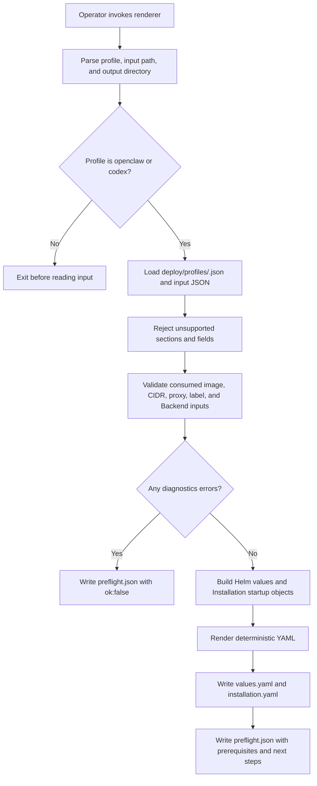

# Installation Profile Rendering Flow

## Overview

Installation profile rendering starts when an operator runs
`scripts/render-installation-profile.mjs` with a selected profile, a JSON input
file, and an output directory. The renderer validates that each supplied input
belongs to the profile contract, then writes the Helm values overlay,
Installation startup YAML, and preflight report. This flow stops at rendered
files; Kubernetes Secret creation, Helm apply, cluster provisioning, hosted
plugin and `codex_pat` token setup, optional ChatGPT service-account setup,
repository registry creation, and Slack consumer configuration remain
operator-owned steps.

## Entry Points

- Trigger: `node scripts/render-installation-profile.mjs --profile openclaw|codex --input <json> --out-dir <dir>`.
- Source: `scripts/render-installation-profile.mjs:parseArgs`,
  `scripts/render-installation-profile.mjs:buildInput`, and
  `scripts/render-installation-profile.mjs:buildRendered`.
- Assumptions: The caller runs from the repository root with installed
  dependencies, a trusted profile under `deploy/profiles/`, and site inputs that
  contain no plaintext credentials.

## Flow

## Execution Trace

### 1. Parse arguments and select the profile

`scripts/render-installation-profile.mjs:parseArgs`

The command accepts exactly three operator inputs: `--profile`, `--input`, and
`--out-dir`. The profile flag selects either `openclaw` or `codex`; there is no
`default` profile. Release name and namespace live in the JSON input so they
have one owner and can feed both Helm instructions and Installation settings.
Unsupported flags fail before any file is rendered.

### 2. Load profile and site input

`scripts/render-installation-profile.mjs:readProfile`

The renderer reads the small profile definition from `deploy/profiles/`. The
profile owns only profile identity and PluginDriver selection. It does not
carry environment-specific image names, domains, CIDRs, Secrets, or repository
registry names. The input JSON supplies those values so repeated runs with the
same profile and input render the same output.

### 3. Validate every supplied input

`scripts/render-installation-profile.mjs:buildInput`

Input validation is closed at each section. Unknown fields produce preflight
errors instead of being ignored, which keeps the contract deterministic and
prevents unused readiness flags. Profile-specific checks reject Codex-only
inputs under the OpenClaw profile. The hosted discovery and `codex_pat` runtime
token value is intentionally absent from the input schema because current
Installation startup configuration does not consume it; `preflight.json` tells
the operator to add that credential later as a same-Namespace Secret or through
the Console. Managed `chatgpt_service_account` provisioning is optional and
renders only when `codex.managedServiceAccounts` is supplied. Preflight
validation mirrors the downstream contracts for IPv4 CIDRs, native-admin DNS
hostnames and shared cookie parent domains, and paired metrics scraper
selectors so invalid inputs fail before `values.yaml` or `installation.yaml`
are written.

### 4. Build Helm values

`scripts/render-installation-profile.mjs:buildRendered`

The Helm values output selects the control-plane image, Better Auth base URL,
bootstrap administrator, database and cluster egress CIDRs, API client
selectors, DNS peer, metrics, native admin, private gateway routing, optional
ChatGPT Backend mounting, optional logging collector, and optional repository
credential sidecar values. When `channels.slackProxyUpstreamCidrs` is supplied,
it also enables the chart-managed restricted Slack proxy Service. Native admin
is always enabled by both profiles, so gateway routing is also always enabled.
Repository values render only when the input explicitly sets
`repository.enabled: true`.

### 5. Build Installation startup YAML

`scripts/render-installation-profile.mjs:buildRendered`

The Installation output selects Kubernetes Configuration, native IAM,
Kubernetes Compute, Kubernetes Secrets, default Preset seeding, and the profile
PluginDriver. Compute settings consume the runtime image, DNS peer, trusted
proxy CIDRs, plugin-status proxy CIDRs, gateway routing identity, runtime
storage class, node selectors, and transport Secret prefix. The Codex profile
also consumes the reviewed `runtime.codexSeccompProfile` path. When optional
managed ServiceAccount inputs are supplied, it emits the ChatGPT Backend plus
matching ServiceAccount Driver; otherwise Codex Agents use the existing
`codex_pat` token path configured at Agent creation. If the chart-managed Slack
proxy is enabled, Compute receives the generated Service DNS URL and selector
for API-to-proxy egress. Repository opt-in adds the GitHub Backend, Repo Driver,
and worker peer expected by the broker sidecar.

### 6. Write outputs and preflight

`scripts/render-installation-profile.mjs:writeYaml`

Successful runs render deterministic YAML, then write `values.yaml`,
`installation.yaml`, and `preflight.json`. Failed validation writes only
`preflight.json` with `ok:false` and exits nonzero. The preflight report
includes warnings, external prerequisites, and the next operator steps. It does
not claim live readiness; Helm rendering, Secret creation, runtime proof,
hosted discovery, Slack consumer activation, and repository registry creation
are separate evidence.

## Debugging and Verification

- Run `node --test tests/integration/profile-renderer.test.mjs` to exercise the
  CLI and inspect generated profile output.
- Inspect `<out-dir>/preflight.json` first. `ok:false` means required input is
  missing or unsupported input was supplied; `values.yaml` and
  `installation.yaml` are intentionally absent.
- Run `helm template oce deploy/helm/openclaw-enterprise --namespace <namespace> --values <out-dir>/values.yaml`
  to check chart-level validation before applying the chart.
- For runtime proof, continue through the production installation and Agent
  deployment guides. Rendered files alone do not prove native admin access,
  Codex sandboxing, hosted discovery, Slack connectivity, or repository
  credential recovery.

## Related docs

- [Render installation profiles](../guides/deploy/installation-profiles.md)
- [Production startup flow](production-startup.md)
- [Kubernetes Compute Driver](../reference/drivers/kubernetes-compute.md)
- [Bundled PluginDriver implementations](../reference/drivers/plugin-bundled.md)

## Manual Notes

[keep this for the user to add notes. do not change between edits]

## Changelog

- 2026-09-28 15:36: Documented installation profile rendering flow. (authoring-run/6f2a325a-cf1c-4277-9ce3-7623626f68c6 - 6c56149f1f2b7290d8526d87c3624c9b7db09fbf)

- 2026-09-28 16:43: Updated the output step after removing the runtime YAML-loader dependency. (authoring-run/6f2a325a-cf1c-4277-9ce3-7623626f68c6 - 6c56149f1f2b7290d8526d87c3624c9b7db09fbf)

- 2026-09-28 17:04: Clarified that Codex defaults to existing `codex_pat` token credentials and renders managed ServiceAccount wiring only when explicitly supplied. (authoring-run/6f2a325a-cf1c-4277-9ce3-7623626f68c6 - 6c56149f1f2b7290d8526d87c3624c9b7db09fbf)

- 2026-09-28 17:31: Documented stricter profile preflight checks for IPv4 CIDRs, native-admin DNS domains, and paired metrics selectors. (authoring-run/6f2a325a-cf1c-4277-9ce3-7623626f68c6 - 6c56149f1f2b7290d8526d87c3624c9b7db09fbf)
