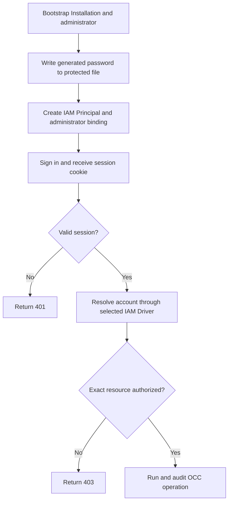

# Local Password Authentication Flow

## Overview

This flow covers human controller authentication with Better Auth email/password
sessions. Non-Agent automation uses the separate
[service API key flow](service-api-keys.md).
Installation bootstrap creates an administrator, delivers its generated password
through a protected file, and maps the account to an IAM Principal. This flow
ends when IAM authorizes or rejects a protected request.

## Entry Points

- Trigger: Production bootstrap, `POST /api/auth/sign-in/email`,
  `POST /api/auth/accounts`, or a protected controller request.
- Source: `scripts/bootstrap-production.mjs:randomPassword`,
  `apps/controller/src/auth/index.ts:createControllerAuth`, and
  `apps/controller/src/index.ts:createFastifyApp`.
- Assumptions: Migrated PostgreSQL, configured authentication, disabled public
  signup, and IAM authorization for the exact requested resource.

## Flow

## Execution Trace

### 1. Bootstrap the first administrator

`scripts/bootstrap-production.mjs:randomPassword` generates a 32-byte random
password. Bootstrap creates the configured output file exclusively with mode
`0600`, provisions the Better Auth account, and binds its user ID to an
administrator IAM Principal. Existing Installations retain their original
administrator and password. Credentials never appear in logs, audit records, or
API responses.

### 2. Construct session authentication

`apps/controller/src/auth/index.ts:createControllerAuth` configures Better Auth
email/password authentication, protected session cookies, and durable PostgreSQL
storage. Sign-in returns only `{ authenticated: true }`; the session token stays
in its HttpOnly cookie and is omitted from session-inspection responses. Sign-out
revokes the session, and public signup is disabled.

### 3. Admit and authorize protected API calls

`apps/controller/src/index.ts:createFastifyApp` validates the session, resolves
its installation-owned issuer and user ID through the selected IAM Driver, and
authorizes the exact resource through that same Driver. The Driver loads current
policy separately for identity lookup and authorization, so account and
permission changes are visible across controller instances. Missing or invalid
sessions return `401`; denied permissions return `403`; dependency failures fail
closed. Bearer credentials and caller-supplied identity headers are rejected.

### 4. Provision additional accounts

`apps/controller/src/index.ts:createFastifyApp` permits only an authorized
Installation administrator to create another account. The operation creates its
Better Auth user and IAM Principal, binds an explicitly selected existing role,
and records the mutation without creating a session or replacing the IAM Driver.
IAM or audit failure rolls back the provisioning; accounts never receive
implicit permissions.

## Debugging and Verification

- `node --test tests/integration/postgres-production-wireup.test.mjs` with
  `OCC_PRODUCTION_WIREUP_DATABASE_URL` proves actual bootstrap, protected random
  password delivery, administrator sign-in, and authenticated `GET /installation`.
- `node --test tests/integration/postgres-auth-accounts.test.mjs` with
  `OCC_TEST_DATABASE_URL` proves account provisioning and transactional rollback.
- `pnpm test`, `pnpm typecheck`, `pnpm build`, `pnpm openapi:check`,
  `pnpm format:check`, and `pnpm check:workspace` validate the complete feature.

## Related docs

- [Authentication](../reference/authentication.md)
- [Configuration reference](../reference/settings.md)
- [IAM](../reference/authorization.md)
- [Platform startup flow](platform-startup.md)
- [Feature spec](../../specs/10-local-password-authentication.md)

## Manual Notes

[keep this for the user to add notes. do not change between edits]

## Changelog

- 2026-08-28 21:20: Preserved PostgreSQL account provisioning and rollback verification in the renamed auth-account suite after removing local-test Compute coverage. (01a036f4-cf1d-7cc1-bbc1-000879038ac8 - 3ec166eb5fae39ed0f51ffb5ebd93338c4a2db94)
- 2026-08-28 17:58: Updated moved feature-reference links for the documentation organization. (01a036f4-cf1d-7cc1-bbc1-000879038ac8 - 4270aa29b7015562049f46c6027962fd85b584a9)
- 2026-08-24 17:12: Documented current-policy identity lookup, authorization, and cross-controller account visibility. (01a0352c-debe-73b1-baa6-379855af874f - 4502d7e)
- 2026-08-24 17:12: Removed IAM policy snapshots and Driver replacement; load current policy for every identity lookup and authorization decision. (01a0352c-debe-73b1-baa6-379855af874f - 4502d7e) (NOT_IN_SPEC)
- 2026-08-24 15:14: Documented redacted session inspection and account provisioning without implicit sessions. (01a0352c-debe-73b1-baa6-379855af874f - 08862be)
- 2026-08-24 14:10: Simplified the runtime trace and retained real PostgreSQL bootstrap and account-provisioning verification. (01a0352c-debe-73b1-baa6-379855af874f - 99111a5)
- 2026-08-24 13:17: Documented the cookie-only sign-in response and shared auth-account seed validation boundary. (01a0352c-debe-73b1-baa6-379855af874f - 4725aed)
- 2026-08-24 13:01: Documented Better Auth bootstrap, session admission, IAM authorization, account provisioning, and verification flow. (01a03552-00ba-7c42-b5ca-414c8972f20b - 2e9769c)
