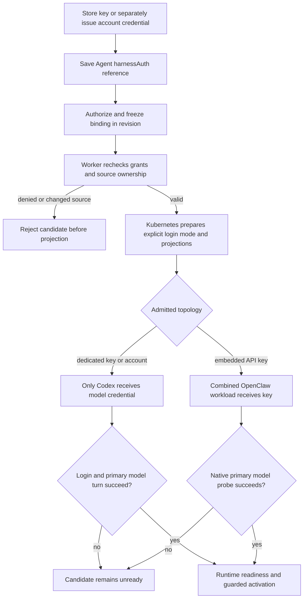

# Harness Authentication Binding Flow

## Overview

An operator stores an OpenAI API key as an OCC Secret or separately issues a
ChatGPT account credential, then selects that source through Agent `harnessAuth`.
Deployment freezes the authorized binding; the worker rechecks it and Kubernetes
renders the credential only into the model-executing workload. This flow ends
at runtime authentication and the existing guarded activation handoff. Issuance
and source storage retain their existing owners.

## Entry Points

- Trigger: Agent create/PATCH with `harnessAuth`, followed by the bodyless
  exact-Agent deployment action.
- Sources: `packages/occ/src/index.ts:OpenClawController.createAgent`,
  `OpenClawController.updateAgent`, and `OpenClawController.deployAgent`.
- Assumptions: ready Namespace at deployment, same-Namespace source, existing
  Secret value or issued account credential, exact actor permissions, a compatible
  configured Harness/model, and selected Compute support. API keys also require
  the Agent service principal's exact Secret `operate` at admission and dispatch.

## Flow

## Execution Trace

### 1. Save one source without issuing credentials

`packages/occ/src/index.ts:OpenClawController.createAgent`, `updateAgent`,
`authorizeHarnessAuthSource`

Creation omission stores `null`; PATCH omission preserves the binding and explicit
`null` clears it. API-key sources use stable OCC Secret references. The actor
needs exact Secret `operate`; a ChatGPT binding needs exact account `read`.
Namespace locks serialize source reference changes against deletion. Missing or
foreign sources fail closed. Binding never selects a different model, Provider,
Harness, or execution mode and cannot issue an account credential.

The [Secret storage flow](secret-storage-and-delivery.md) owns value storage;
[account issuance](service-account-driver-credential-delivery.md) owns upstream
credentials and their private Provider binding. Initial runtime provisioning
creates only transport/channel groups and cannot supply model authentication.

### 2. Freeze the admitted source and compatibility

`packages/occ/src/index.ts:OpenClawController.deployAgent`, `admitHarnessAuth`

Deployment requires a nonnull binding, exact Agent `deploy`, and Configuration
`read`. For a key, OCC checks the actor and Agent principal's Secret `operate`,
resolves the backend through the selected Secret Driver, and freezes the stable
reference and Driver identity. For a ChatGPT account, it verifies the issued
access-token reference and private Provider, member Driver, and workspace
ownership. The selected Compute validates the auth/Harness/model combination.

The revision contains references and safe internal metadata, never credential
bytes. Public revision serialization exposes the binding while omitting backend
locators and private account ownership. A later account credential cannot replace
the admitted reference; changing the draft affects the next explicit deployment.

### 3. Reauthorize the immutable revision before effects

`apps/controller/src/worker.ts:ControllerWorker.resolveRevisionProvider`,
`resolveRevisionSecretContext`

The worker authorizes the original deploying actor and required Agent Secret
grants against the admitted revision. It verifies current source ownership and
matches managed-account credential and Provider metadata against the frozen
snapshot. Revocation or a changed source rejects work before provisioning.

For an API key it resolves authoritative backend ownership from OCC state and
passes an ephemeral `ComputeRevisionContext`. It does not call the Secret Driver,
read the Kubernetes Secret, or rewrite the revision. Physical backend identity
is checked at API admission. A missing physical Secret/key later prevents workload
startup; replacement of a physical Secret by a Kubernetes administrator is outside
the dispatch metadata check. ChatGPT retains the exact account token/workspace source.
Inactive revision history keeps references without indefinitely retaining their
sources; drafts, active revisions, and pending deployments block source deletion.

### 4. Prepare and place the one credential projection

`apps/controller/src/drivers/compute/kubernetes/index.ts:prepareHarnessAuth`,
`KubernetesComputeDriver.prepareRevision`

One internal workload-rendering step converts validated references to supported
Secret projections and a closed login mode. Embedded OpenClaw receives the key
in its combined workload. Dedicated Codex receives the key or the directly
projected account token/workspace; its separate gateway receives neither.
Configuration secret bindings remain gateway-only and cannot choose model auth.

The selected Sandbox consumes these already-rendered
`HarnessWorkloadRequirements`, including the explicit login mode and projections.
It does not select or look up another credential. An upstream runtime unable to
honor genuine Secret projection fails explicitly. Network policies retain the
provider-login egress required by the admitted auth method. Gateway transport
and Kubernetes workload identity remain separate credentials.

### 5. Authenticate before readiness and activation

`apps/controller/src/drivers/compute/kubernetes/runtime-entrypoints.ts:AGENT_RUNTIME_ENTRYPOINT`,
`GATEWAY_RUNTIME_ENTRYPOINT`, `EMBEDDED_AUTH_PROBE_ENTRYPOINT`

Codex consumes explicit `CODEX_LOGIN_MODE`: API-key login receives the key through
stdin; account login forces the admitted workspace. Missing or conflicting
inputs and failed login prevent app-server startup. A bounded native turn against
the primary model must then complete successfully. The probe ignores user rules
and configuration, disables execution and external tools, and applies read-only
filesystem policy without approval grants. Tool events fail the probe. Login
state remains in the bounded ephemeral home.

Embedded OpenClaw consumes its native OpenAI key and runs a bounded native primary
model probe with tools and fallback disabled before starting its gateway. Its
16-token output limit meets the provider's minimum request size. A
replacement first runs that probe in an isolated, unroutable Deployment without
the serving gateway's credentials or persistent workspace. A failed preflight
therefore prevents embedded cutover while preserving the predecessor. Successful
cutover starts the actual gateway, which probes again because the referenced
Secret's bytes can change between processes. Failure of that second probe holds
the already-active replacement unready until restart or a new deployment; it
cannot restore the predecessor removed by the existing `Recreate` cutover.
Exact revision ownership governs temporary probe cleanup.

Both runtimes capture native output and hold failed probes unready with a fixed
message. Readiness polling does not repeat provider calls; restart or deployment
starts another attempt. These requests may incur usage charges and check only the
primary model. See [probe limitations](../reference/harness-execution.md#harness-authentication).

Readiness hands off to the [existing activation and recovery flow](harness-execution-topology.md#3-publish-safely-and-complete-activation-once).
Auth selection and successful storage do not establish provider acceptance.
Updating a Secret leaves existing process environments unchanged: deploy each
consumer, verify a real turn, then revoke the previous key upstream. Revision
history cannot restore historical Secret values.

## Debugging and Verification

- `node --test tests/integration/harness-topology-k3d-real.test.mjs` with
  `OCC_TEST_HARNESS_K3D_REAL=1` exercises the regular API binding/deploy path with
  disposable Kubernetes/PostgreSQL, genuine images, and an authorized API key.
  Dedicated Codex and embedded OpenClaw each require a provider-backed turn.
- [Managed-account testing](../testing/service-accounts.md) separately requires
  provider authorization, an issued ChatGPT credential, and a real Codex turn.
  API fixtures prove admission or persistence, not provider login.
- Verify Secret projections only on intended consumers, source-deletion guards,
  immutable revision metadata, dispatch denial after revoked grants, and failed
  auth preventing readiness. Use synthetic sentinels for serialized resources,
  logs, and audit disclosure checks; never print live credentials.
- [OpenShell testing](../testing/openshell.md) distinguishes explicit unsupported
  projection failure from genuine Secret delivery and model execution. A test-only
  bridge cannot establish production Sandbox support.

## Related docs

- [Agent harness authentication](../reference/agents.md#harness-authentication)
- [Credential renewal and revocation](../guides/deploy/credential-lifecycle.md)
- [Service Account Driver credential delivery flow](service-account-driver-credential-delivery.md)
- [Secret storage and gateway delivery flow](secret-storage-and-delivery.md)
- [Harness execution topology flow](harness-execution-topology.md)

## Manual Notes

[keep this for the user to add notes. do not change between edits]

## Changelog

- 2026-09-17 01:10: Trace bounded native model probes and predecessor-preserving embedded authentication checks. (01a0acbf-4d5a-7413-9411-dce911f3ad23 - 177a24e4)

- 2026-09-17 00:48: Correct current harness admission and metadata-only dispatch boundaries after implementation review. (01a0acbf-4d5a-7413-9411-dce911f3ad23 - 107900e9551b90c3e9ac24d30f8ea866f17e5dbb)

- 2026-09-17 00:30: Unify Secret-backed keys and issued account credentials through immutable Agent harness authentication and workload rendering. (01a0acc2-a404-77e3-b1a0-9fa4ffbbdb04 - d2bcbd1c53acb2582a774b5158f254d726abd33f)

- 2026-09-01 19:09: Clarified native API-key source Secret references and linked the separate OCC Secret delivery path. (01a05f95-dd80-7011-990f-d1c46b5bb3cc - aa366c49c44834d59f74994c5fd37fb8096f169f)
- 2026-09-01 08:47: Preserve providerless API-key execution and document Provider metadata checks before workload effects. (01a05d97-f2b0-71d0-bfc3-01ee7d6d58f9 - b079c4b755ef336a9c65bb4eb737e3aedbfdaa7d)

- 2026-08-28 17:58: Updated moved feature-reference links for the documentation organization. (01a036f4-cf1d-7cc1-bbc1-000879038ac8 - 4270aa29b7015562049f46c6027962fd85b584a9)
- 2026-08-24 20:03: Documented native account authorization, immutable deployment snapshot, independent exact-Secret materialization, harness-specific credential projection, and genuine dual-runtime verification. (01a03542-30ff-77a1-9967-587d55548ace - 6ff8b1b)
- 2026-08-24 21:11: Condensed account delivery, exact authorization, stale-secret handling, worker revocation, and dual-runtime proof. (01a0355c-d4b3-7342-bdc2-3c96af543416 - 1aa89e8)
