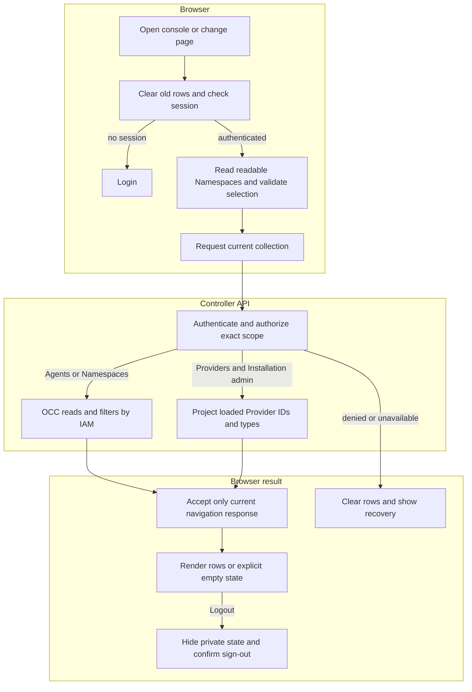

# Platform console request flow

## Overview

Opening `/console/` loads the controller's static browser client, resolves a
cookie session, and reads an authorized collection. This trace follows an Agents
page through Namespace selection, then the Provider branch and logout. It stops
at rendered rows or a cleared error/login view. The [console reference](../reference/console.md)
owns user-visible behavior; the API and IAM retain resource authority.

## Entry Points

- Browser: `apps/controller/src/console/console.mjs`.
- HTTP: `apps/controller/src/index.ts:createFastifyApp`.
- Startup: `apps/controller/src/composition/production.ts:composeProduction`
  and `development-postgres.ts:composePostgresDevelopment`.
- Assumptions: a bootstrapped Installation, provisioned account, selected IAM
  Driver, and the configured same-origin controller URL. Collection access
  requires the exact permissions in the [API reference](../reference/api.md).

## Flow

## Execution Trace

### 1. Compose discovery metadata and serve public assets

`apps/controller/src/composition/production.ts:composeProduction`

`apps/controller/src/composition/development-postgres.ts:composePostgresDevelopment`

Startup projects validated Provider definitions into safe `{id,type}` summaries
and passes them to `createFastifyApp`. This is a startup snapshot, not a live
configuration scan. The request path never reads credentials or contacts a
Provider. The existing [Provider lifecycle](provider-driver-lifecycle.md) owns
client construction and Driver activation.

`apps/controller/src/console-assets.ts:readConsoleAsset` maps the two public
asset URLs to fixed files and recognized page URLs to the HTML shell. Unknown
console paths receive the same shell with HTTP `404`. The controller sets the
HTML, CSS, or JavaScript MIME type and a same-origin content security policy.
Other routes retain canonical API JSON errors. The Dockerfile copies these
files into the existing controller image.

### 2. Resolve the session before private reads

`apps/controller/src/console/console.mjs:loadPage`

The browser clears the prior view, advances its navigation generation, and
requests `GET /api/auth/session`. No session opens login; unavailable session
inspection blocks private reads and offers Retry. Login submits exactly email
and password to the existing sign-in route.
`apps/controller/src/auth/index.ts:requireTrustedBrowserOrigin` compares browser
Origin to the configured controller origin before either sign-in or sign-out.
The server SDK calls do not run Better Auth's request-origin middleware, so this
HTTP boundary performs that check while retaining headerless CLI requests.
Better Auth then owns the session cookie and password verification; the browser
stores no credentials or tokens.

After authentication, the client reads `GET /namespaces`. It validates the URL's
explicit selection against that readable list, or chooses the first ready
Namespace followed by the first readable one. An unavailable explicit ID stays
unavailable until the user selects another. The selection is carried in the URL
through global pages and history, without becoming an API query selector.

### 3. Authorize the selected collection

`apps/controller/src/index.ts:perform`, `requireInstallationAdmin`

`packages/occ/src/index.ts:OpenClawController.listNamespaces`, `listAgents`

Agents use the selected Namespace's route. OCC requires Namespace read authority
and filters Agents by exact read permission; Namespace listing similarly filters
its Installation-wide collection. With no readable selection, the browser makes
no Agent request. Providers use `GET /providers` independently of selection:
Installation `administer` precedes the safe startup-summary response. Explicit
empty configuration is a successful empty list; absent wiring and dependency
failure return errors.

### 4. Commit only the current response, or clear the view

`apps/controller/src/console/console.mjs:loadPage`, `logout`

Navigation, Namespace changes, refocus, and logout invalidate prior reads. The
client cancels their requests and checks generation before accepting either
success or failure. A late response cannot restore rows, change selection, or
redirect a newer session. Current authorization and dependency errors clear
rows and expose recovery; protected `401` clears private state and opens login.
Global Providers and Namespaces pages remain visibly Installation-wide.

Logout first hides private state, then calls the existing sign-out endpoint.
Confirmed success or session inspection proving absence replaces history with
login. An unconfirmed logout stays blocked with Retry. The
[authentication flow](local-password-authentication.md) owns server revocation;
this client never infers it from a network error.

## Debugging and Verification

- Use the displayed request ID to associate API failures with controller logs.
  A Namespace-only user cannot discover Providers; check Installation authority
  before treating that denial as a configuration problem.
- The browser suite exercises real Fastify, Better Auth, and Native IAM with
  in-memory storage. It verifies user-visible navigation, list isolation, and
  auth behavior; it does not establish PostgreSQL persistence or runtime health.
- API tests cover safe discovery, permission boundaries, empty versus missing
  wiring, static MIME/allowlisting, and unchanged API JSON errors. See
  [Testing](../testing.md) for commands and the image smoke boundary.

## Related docs

- [Console reference](../reference/console.md)
- [Authentication](../reference/authentication.md)
- [Provider and Driver lifecycle](provider-driver-lifecycle.md)
- [Development startup](development-startup.md)
- [Production startup](production-startup.md)

## Manual Notes

[keep this for the user to add notes. do not change between edits]

## Changelog

- 2026-09-01 13:32: Trace static serving, session resolution, exact collection authorization, Namespace isolation, and logout. (01a05e1d-6dc8-7231-bf58-58c80ef580f3 - 97911d361ac02ddf561e46c8af0864ad66a6df45)
