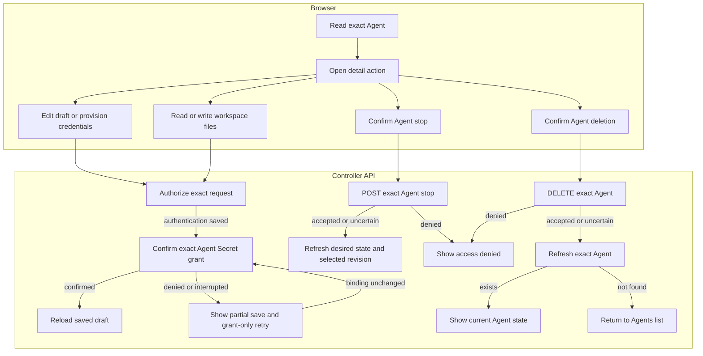

# Console Agent editing and runtime requests

## Overview

Follow authorized Agent detail requests through draft editing, initial
credentials, live workspace files, Agent stopping, and Agent deletion. This trace starts after
the console selects an exact Agent and ends with a rendered API response or the
return to the Agents list after confirmed deletion. See the
[parent flow](../platform-console.md) for the overall sequence.

## Entry Points

- `apps/controller/src/console/agents/detail.mjs:renderAgentDetail` loads the exact Agent and composes the detail actions.
- `apps/controller/src/console/agents/credentials.mjs:createRuntimeCredentialsPanel` submits explicitly entered credentials.
- `apps/controller/src/console/agents/workspace.mjs:renderWorkspaceFiles` opens live workspace files.
- A signed-in caller must hold each action's permission on the exact resource.

## Flow

## Execution Trace

### 4. Render draft, revision, or channels

`apps/controller/src/console/agents/detail.mjs:renderAgentDetail`

The detail page reads the Agent, revisions, and current Configuration or selected
immutable AgentRevision. The badge uses `activeRevisionId`, which may differ from
the viewed revision. Snapshots show saved status, not live health; they are read-only.
**Edit current Configuration** opens the draft without copying history. Stop and
deletion target the Agent.

In the draft Configuration tab, **Edit Configuration** opens the native JSON
editor. It accepts an object and submits only `{ values }` to the existing exact
Namespace Configuration PATCH route, retaining omitted `secretBindings`. Before
writing, the browser rereads the Agent and Configuration and rejects a changed
Configuration ID or generation. This is a preflight check, not an atomic
compare-and-swap: a write can still race after the reads. The API retains
Configuration authorization and generation ownership.

A successful save reloads the draft; admitted snapshots and active revision
selection remain unchanged. Invalid input, denied writes, and stale drafts retain
editor text. An uncertain mutation outcome blocks another save until successful
readback. A read can race a delayed write and does not prove that write has settled. Unsaved or unresolved edits block deployment of the old saved values.
Ordinary edits survive tab, revision, and page navigation; pending or unresolved
Configuration saves still block tab and revision changes until readback.
Saving and deploying remain separate explicit actions.

`apps/controller/src/console/drafts.mjs:createDraftStore` owns document-local
snapshots. `console.mjs:resetReads` and `detail.mjs:renderTab` capture selected
fields before teardown, excluding passwords. Namespace and Agent keys isolate
editors; expiry, user changes, logout, and page exit clear captures. Browser
storage and URLs never carry drafts. Preset variables, Create Agent, and Agent
search share this store. Configuration, authentication, and channel captures retain
save baselines; a changed channel baseline disables Save until Cancel. Successful
saves, Cancel, and reload discard captures; unresolved saves retain their guard.

The draft **Repositories** tab uses `createRepositoryFields` for exact-Agent
update discovery and saves inheritance intent as `repositoryAccess` via Agent
PATCH. Dirty, pending, or uncertain saves block tab changes and deployment;
reversing edits or Undo clears dirty state. Reloading choices resets search,
pagination, and dismissed results. Failed discovery leaves access unverified;
only a successful catalog can establish unavailability. Deployment compares
repository intent, bindings, execution mode, Provider, and plugins with the opened
draft. These preflight reads cannot prevent later concurrent writes. Deployment
locks the editor and revision controls while pending. Navigation away or focus
and visibility refresh can discard repository edits; readback cannot prove an
interrupted write has settled.

`apps/controller/src/console/channels.mjs:renderChannels` renders supported
Slack channel settings in **New revision** only. Slack uses fixed unresolved
`SLACK_APP_TOKEN` and `SLACK_BOT_TOKEN` environment references. Existing native
Teams settings remain in Configuration JSON, with no card or editor. The
deployment guard still refuses Teams-enabled drafts because Console credential
readiness cannot be established for them. The Slack editor requires
dedicated execution for enabled channels and may refuse native documents that it
cannot round-trip, including non-Socket Slack settings, non-standard credential
references, wildcard channel maps, mixed Slack mention settings, mixed channel
sender lists, sender IDs that cannot be represented in a comma-separated field,
and unsupported plugin shapes.

`apps/controller/src/console/channels/slack.mjs:appendFields` separates channel
senders from DMs. Wildcard, empty, or omitted `users` selects **Allow everyone**;
explicit IDs and mention settings are independent. `updatedSlack` preserves
unrelated settings and bindings. Existing omitted DM policies remain omitted;
new setup uses Allowlist. Validation rejects empty or wildcard allowlists and
unsupported organization-wide policies. Open writes `allowFrom: ["*"]`; moving
to Allowlist or Pairing clears that input. Untouched lists and native `dm.enabled`
remain unchanged. Redeployment applies saved settings; see
[Slack policies](../../reference/configuration/secrets.md#native-channel-configuration).

The channel editor receives the Namespace, saved bindings, and Credentials URL.
`apps/controller/src/console/channels/slack.mjs:credentialReferenceField` lists
Secrets through an authorized collection read; `packages/occ/src/index.ts:listSecrets`
filters each by exact read without calling the Secret Driver. Pickers stage the
current or a readable same-Namespace reference; Cancel discards it.
`openCreateSecretDialog` immediately POSTs a new Namespace Secret and stages its
reference, but closing the drawer does not delete it. The dialog clears passwords
and blocks repeat submission after an uncertain outcome. The [Secret storage flow](../secret-storage-and-delivery.md)
owns recovery. Metadata and Credentials links open separately; values are never read back.

Saving channels first rereads the Agent and Configuration, then checks that the
Agent still references the same Configuration generation. The subsequent PATCH
sends `{ values: updatedValues }`, adding `secretBindings` only when selections
changed. It preserves unrelated bindings. If that PATCH is rejected, no new
Secret grant is written for the staged channel selection.

After PATCH, `apps/controller/src/console/agents/secret-access.mjs:ensureSecretOperateBinding`
grants the Agent's service principal access to the final Secrets through Namespace
IAM. These separate writes block deployment and Agent tab or revision navigation
while pending. If a grant fails, Configuration stays saved; reload and inspect
Credentials, and ask a Namespace administrator to grant access if needed. The
editor does not retry a rejected grant as a new channel save. Created Secrets
remain Namespace-owned. Preflight cannot prevent later writes; an uncertain PATCH
blocks deployment, navigation, and further channel writes until explicit reload,
which cannot prove a delayed write settled. Disabling a draft channel does not stop
the running Agent. See the [console reference](../../reference/console.md#inspect-detail-revisions-and-channel-drafts).

### 5. Save authentication and provision initial runtime credentials

`apps/controller/src/console/agents/detail.mjs:renderAgentDetail` rereads the
Agent before saving authentication, rejecting a changed Configuration or binding.
After the Agent PATCH succeeds, it drops the cached detail snapshot and calls
`apps/controller/src/console/agents/secret-access.mjs:ensureSecretOperateBinding`
for a direct Secret source (`api_key` or `codex_pat`). The helper reads or creates
a role containing only Secret `operate`, then reads or creates an exact binding
for the Agent service principal and selected Secret in the current Namespace.
Grants use the signed-in actor's IAM authority. Issued accounts and runtime
authentication skip this path.

A failed grant preserves saved authentication and freezes its controls. **Retry
credential access** rereads the Agent, refuses changed bindings, and repeats only
the grant check, recovering a lost committed response from existing bindings. An
unknown PATCH blocks another save and requires **Reload authentication source**
before a grant attempt. Unresolved access survives navigation and blocks deployment
until confirmed or reloaded. Server admission remains authoritative; confirmed
access does not establish provider readiness.

`apps/controller/src/console/agents/credentials.mjs:createRuntimeCredentialsPanel`

The **Operator-managed credentials** selection saves `{ "method": "runtime" }`
without a source field. This mode skips managed credential metadata and provisioning; it still requires readable revision history and unchanged draft
state before submitting deployment. API authorization and selected-driver
compatibility checks remain authoritative.

For managed methods, **New revision** reads the exact Agent's `runtime-credentials`
metadata. Stored groups do not establish provider validity or runtime health.
Pending authentication or credential saves block deployment and tab or revision
navigation. Uncertain writes require explicit draft reload and inspection; metadata
refresh alone cannot clear uncertainty.

OCC authorizes and locks the Namespace and Agent, rejecting provisioning after any
revision exists. The Compute Driver verifies ownership before writing. Kubernetes
creates missing whole Secrets and server-side transport tokens, preserving existing
matching groups on retry. Configuration and audit events receive no credential
bytes. External Secret creation cannot roll back with the transaction; errors require readback.

Slack fields separately derive bound state from Configuration `secretBindings`.
Each field uses the shared Secret reference picker: it lists readable Namespace
Secrets, shows the current Secret reference by name when metadata is readable,
falls back to the bound Secret ID when metadata is unavailable, and can create a
new Namespace Secret without reading any existing value back.

On explicit submission, the browser rereads the Agent and Configuration before
PATCHing bindings. A changed Configuration ID or generation blocks credential
saves and deployment until the draft is reloaded. This read is not atomic with
the following writes, so a concurrent update can still race after the check.
Creating a new Secret in the picker is an immediate, separate action.

On explicit submission, the browser PATCHes selected Secret references while
preserving other bindings, then calls `ensureSecretOperateBinding` for changed
and pending Secrets. A post-PATCH grant failure leaves bindings saved and blocks
deployment in the current view. Subsequent saves retry still-referenced pending
grants. Picker edits and rejected PATCHes preserve that warning; only a confirmed
grant or confirmed removal of its reference clears the pending Secret. Explicit
refresh resets local outcome tracking; the API always enforces Secret access.
Pickers switch references; shared Secret value rotation remains a separate operation.

### 6. Read and replace live workspace files

`apps/controller/src/console/agents/workspace.mjs:renderWorkspaceFiles` opens from
`tab=workspace` after an exact Agent read. It bypasses Configuration and revision
history reads, because workspace contents belong to the live Agent. An Agent
without an active revision gets an unavailable explanation without file requests.

The editor issues one GET for each supported filename. A successful response
reauthorizes file access before restoring retained text, including empty edits.
Retained drafts keep their original baseline; explicit Reload replaces them with
the current file. `404` permits an explicit create attempt, and other
failures leave it disabled. Save sends `{ content }` to the same exact-Agent PUT
route. It neither patches Configuration nor admits a revision. The existing
[workspace flow](../workspace-files.md) owns authorization and native file transport.
Each result stays local to its file. Unknown write outcomes require a successful
reload before another save; the editor never retries a write automatically.

Creation uses the same channel editor to stage initial Configuration values and
Secret bindings before its POST; see the [creation trace](../platform-console.md#3-authorize-the-selected-page-resource).
Separately, `apps/controller/src/console/agents/create.mjs` submits the
four workspace textarea values as `initialWorkspaceFiles` plus
`workspaceDefaultsId` in the Agent POST. OCC stages these exact-Agent inputs
privately until Compute initializes the workspace before execution. This does
not require a deployed gateway. The [workspace setup flow](../workspace-files.md)
owns initialization, retry, and completion cleanup; the live editor above
becomes available after deployment.

### 7. Request a stop and read back the Agent

`apps/controller/src/console/agents/stop.mjs:createAgentStop` renders the control
composed by `apps/controller/src/console/agents/detail.mjs:renderAgentDetail`. Confirmation sends a
bodyless `POST` to the exact Agent's `/stop` route. OCC's
`packages/occ/src/index.ts:stopAgent` checks exact-Agent `operate`, persists the
requested stopped state, and queues reconciliation. The response proves
admission, not completed Compute shutdown.

**Refresh stop status** reads the exact Agent again. The control displays its
desired runtime state and selected revision without inferring live health or
completion from a missing revision. A permission denial stays inline. A
change to desired state or selected revision reloads the surrounding detail
view so native-admin and workspace controls refresh too. An uncertain write
blocks another stop until a successful read; the browser never
retries the mutation automatically. Deployment remains the resume operation,
admitting a new revision. The
[stop lifecycle](../../reference/agents/deployment.md#stop-and-resume) owns worker
shutdown and preservation of existing revisions, credentials, and state.

### 8. Confirm deletion and read back the Agent

`apps/controller/src/console/agents/deletion.mjs:createAgentDeletion`

The **Delete Agent** area requests explicit confirmation before sending a
bodyless `DELETE` to the exact Agent URL. The controller requires Agent `delete`
permission; a `403` stays visible on the detail page. An accepted request starts
asynchronous cleanup and keeps the detail page in a deleting state, with
**Refresh deletion status** for an exact Agent read. Only a not-found read after
an accepted or uncertain request, or when an already-deleting Agent is opened,
returns to the Agents list in the selected Namespace. An
uncertain deletion blocks another write until a successful read establishes the
current state; the browser never automatically retries the deletion.

`packages/occ/src/index.ts:deleteAgent` owns deletion admission. The
[Agent deletion reference](../../reference/agents.md#deletion) covers the
subsequent worker cleanup and the Namespace-owned resources it preserves.

## Debugging and Verification

- A denied Secret list requires collection `read`; a missing menu entry may lack
  exact Secret `read`. Saving bindings also requires caller `operate` on those
  Secrets, Configuration update, and Namespace IAM authority to grant Agent use.
- After a partial save, inspect the Configuration, Secret metadata, and Agent IAM
  bindings before retrying. Storage and binding do not prove runtime delivery;
  explicitly deploy and verify the consuming Agent.
- Stop requires exact-Agent `operate`. An accepted stop or an empty selected
  revision does not independently prove that Compute shutdown has finished.
- On `403`, check `delete` permission on the exact Agent; Agent `read` and
  `operate` do not authorize deletion. Use the displayed request ID when present.
- An accepted deletion remains in progress until the exact Agent read reports
  not found. A failed refresh does not establish whether cleanup finished.
- See [console failures](../../reference/console.md#failures-and-logout) for
  session, permission, and network recovery.

## Related docs

- [Return to the parent flow](../platform-console.md).
- [Console reference](../../reference/console.md)
- [Agent lifecycle reference](../../reference/agents.md#deletion)

## Manual Notes

[keep this for the user to add notes. do not change between edits]

## Changelog

- 2026-09-26 03:09: Reconcile repository editing and credential preflight with retained drafts. (authoring-run/ef70a4fa-4f10-413d-a2ce-2c8e9d5c2989 - be1e00549af5ea02775ee0d910ca32da515633d1)

- 2026-09-25 01:15: Trace DM policy selection, sender validation, and organization-wide restrictions. (01a0d5e6-743e-7743-8a5e-2d8c24b78b81 - 919f92c3bb3ea63acf7042b138e9a0c6e1d97719)

- 2026-09-25 00:24: Trace authentication Secret grants, partial-save recovery, and persistent deployment errors in the accompanying change. (01a0d5ee-ab06-7571-8d4a-9ae0f33d5737 - 5f2f3a7448c7f5f0f4a5ed08be2395f2c5623ed7)
- 2026-09-24 22:03: Trace shared document-local drafts, navigation capture, explicit discard, and retained save baselines. (01a0d557-f6e3-7da2-af52-993d05735554 - a91cbfdd37b64c88b7ee48647096ff6bfd993e02)

- 2026-09-24 20:12: Check the saved draft before channel Secret writes. (public-pr/374 - 5fda9d8a7770b95aff6e67a03bbb796639e8ada0)

- 2026-09-24 20:00: Trace deployment checks for Agent settings and pending credential and channel writes. (public-pr/374 - 22fc4b0e18d5a6a1a7923d42c1503c1de3b7bf72)

- 2026-09-24 19:41: Trace unavailable discovery and the repository-access deployment check. (public-pr/374 - 43d99e7dce02fbd34b072c877868ad1beef4d245)

- 2026-09-24 07:53: Trace draft repository editing and save guards. (public-change/repository-picker - 81b18912)

- 2026-09-23 19:52: Record unsupported mixed Slack sender lists, unrepresentable sender IDs, and channel wildcard maps in the simple drawer. (01a0d150-104a-71a3-9e56-6c5e3ee510ea - 77aedc620f443056f9ee859050b8dc657a9c3133)

- 2026-09-23 08:30: Trace Slack Secret menus, immediate creation, staged bindings, and explicit IAM grants before Configuration save. (01a0cd92-fd3f-7d83-a51e-f6264ef6be09 - 941edc9f6971a24ae29a74a6ca749b6375e6ec01)

- 2026-09-23 02:26: Trace Slack credential navigation and preservation of unsaved channel edits; remove the generic drawer sharing footnote. (01a0cd92-fd3f-7d83-a51e-f6264ef6be09 - 380f7706e2856f1ac1e3bed7f5ddd9c71d133ba8)
- 2026-09-24: Use shared Secret pickers for draft harness authentication and Slack runtime credential bindings; switching references no longer overwrites existing Secret values.

- 2026-09-22 23:30: Trace native Configuration draft editing, save checks, and immutable snapshot navigation. (01a0ccc0-00fa-7173-ab45-f7a5fb55b3b6 - 0dabaafb97326254e5ae173491be014aaa6388c6)

- 2026-09-22 20:56: Rename the deployment-facing Console view to New revision. (01a0cc48-2eda-7fc2-a19e-096b68fccb7b - 081bccfcf3f5b114588dde1b42a0deb07f326017)

- 2026-09-22 20:43: Add confirmed Console stop requests and exact Agent state refresh. (01a0cc48-2eda-7fc2-a19e-096b68fccb7b - 6adfd148a517e84ae064a8e08438b051f80820fb)
- 2026-09-22 20:35: Trace metadata-derived Slack token masks and replacement-only Secret writes. (01a0cc48-2eda-7fc2-a19e-096b68fccb7b - 43776d25c5007e017f7d0ffdca6b06f063afcd37)
- 2026-09-22 20:23: Align Agent editing with supported Console controls. (01a0cc48-2eda-7fc2-a19e-096b68fccb7b - 43776d25c5007e017f7d0ffdca6b06f063afcd37)
- 2026-09-22 20:23: Remove the placeholder serving-status banner and unsupported Teams editor; retain deployment evidence and the Teams deployment guard. (01a0cc48-2eda-7fc2-a19e-096b68fccb7b - 43776d25c5007e017f7d0ffdca6b06f063afcd37) (NOT_IN_SPEC)
- 2026-09-21 21:46: Trace Agent deletion, readback, and recovery from denied or uncertain requests. (01a0c76f-2534-7991-932a-345782408759 - b61c3cae6c35e28db4153eaee9b477e8f5637894)
