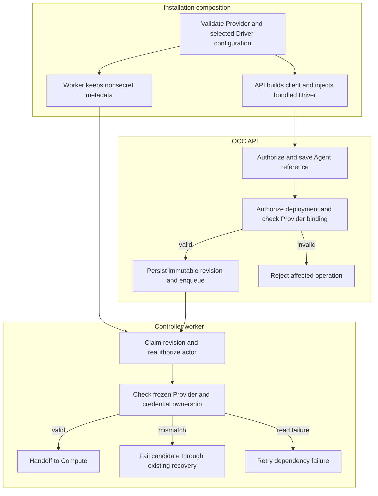

# Provider and Driver lifecycle flow

## Overview

Installation composition constructs the API's Provider client and bundled
Driver. An authorized deployment freezes an Agent's nullable Provider reference;
the worker verifies exact credential ownership before handing it to Compute.
This flow stops at that handoff. The [Provider reference](../reference/providers.md)
owns configuration and policy; the [credential delivery flow](service-account-driver-credential-delivery.md)
covers token projection and Codex login.

## Entry Points

- Startup: `apps/controller/src/server.mjs:start` and `apps/controller/src/worker.mjs`.
- API: `packages/occ/src/index.ts:OpenClawController.createAgent`, `updateAgent`, `deployAgent`.
- Queue: `apps/controller/src/worker.ts:ControllerWorker`.
- Assumptions: initialized PostgreSQL Installation, valid Driver configuration,
  API-only mounted admin key when ChatGPT is selected, and exact caller permissions.
  Account creation and credential issuance remain separate operations.

## Flow

## Execution Trace

### 1. Construct the API client and its member Driver

`apps/controller/src/composition/installation-config.ts:loadInstallationConfiguration`

`apps/controller/src/server.mjs:start`

The loader validates Provider definitions and the required selected
`service_account` member. The API reads `apiKeyPath`, constructs `ChatGPTClient`,
and injects its Provider into the bundled factory. Controller/state injection
and Compute credential storage retain their existing lifecycle. The worker
loads only nonsecret definitions. Neither process scans saved references at
startup; stale records can be repaired through the API.

### 2. Save Agent intent and manage credentials separately

`packages/occ/src/index.ts:OpenClawController.createAgent`, `updateAgent`

Exact-resource authorization precedes persistence. Create omission saves null;
PATCH omission preserves the reference, and explicit null clears it. A nonnull
ID must be configured. These requests make no provider call.

Separately, `apps/controller/src/drivers/service-account/chatgpt.ts:ChatGPTServiceAccountDriver`
creates accounts and issues/deletes credentials. Its private binding records
Provider, Driver, workspace, exact Namespace/account, and issuance identity.
Operations recheck that binding; existing compensation and Secret storage own
cleanup. Changing configuration cannot adopt an old account under a new owner.

### 3. Freeze the revision and enqueue work

`packages/occ/src/index.ts:OpenClawController.deployAgent`

Under admission locks, OCC authorizes the Agent, Configuration, account and
Secrets, resolves its Provider, and calls `validateServiceAccountProviderBinding`
from `packages/occ/src/providers.ts` for managed tokens. Provider, member Driver,
workspace, exact account scope, and issuance must match; dedicated Codex is
required. Native API-key credentials can remain providerless.

The transaction inserts an immutable revision and queues reconciliation. The
snapshot uses `occ.agent_revisions.provider_id`, protected by the existing
whole-row immutability trigger. The API returns `202`; later draft edits do not
change the admitted reference or imply candidate activation.

### 4. Reauthorize and check metadata before Compute effects

`apps/controller/src/worker.ts:ControllerWorker.resolveRevisionProvider`

After claiming work and current IAM authorization, the worker resolves the
frozen reference and reads `findServiceAccountProviderBinding` for the exact
Namespace/account. Only Provider, Driver, workspace and issuance metadata leave
the repository; upstream IDs, admin keys, and secret values remain private.

Valid candidates enter Compute reconciliation. Missing Providers produce
`PROVIDER_UNAVAILABLE`; binding mismatches produce
`SERVICE_ACCOUNT_PROVIDER_MISMATCH`. Both use existing permanent-failure
recovery. Unexpected metadata reads use `DEPENDENCY_UNAVAILABLE` retries.
An earlier active workload is preserved where existing recovery supports it.

## Debugging and Verification

- A process starting does not prove every saved Provider reference is valid.
  Repair stale drafts through the authorized API; restore original configuration
  to clean up old managed accounts. See [Provider changes](../reference/providers.md#startup-identity-and-safe-provider-changes).
- Agent `400`/`404`: check nullable/configured `providerId` and PATCH's required `configurationId`.
- Managed-token `409`: verify exact binding scope, Provider/Driver/workspace,
  issuance, and dedicated Codex. A failed candidate must not activate.
- PostgreSQL tests verify column snapshots, isolation, stale-reference repair,
  worker mismatch/retry and cleanup. API/Driver tests cover nullable input and
  lifecycle behavior. [Testing](../testing.md) owns commands and prerequisites.
- Helm/image tests verify packaging and API-only key access. They do not prove
  live account operations or model turns; the [real provider suite](../../tests/integration/service-account-driver-real.test.mjs)
  requires authorized credentials and selected disposable runtime infrastructure.

## Related docs

- [Providers](../reference/providers.md)
- [Platform startup](platform-startup.md)
- [Production startup](production-startup.md)
- [Controller worker](controller-worker.md)
- [Credential delivery](service-account-driver-credential-delivery.md)

## Manual Notes

[keep this for the user to add notes. do not change between edits]

## Changelog

- 2026-09-01 10:18: Keep ownership checks at use, remove global startup traversal, and store revision Provider references in immutable columns. (01a05d6b-e21d-7fc0-b1bd-b5cb15b365c6 - 1c7eae4d11e6c474cc7f1bbbb05d2c2e7052a158)
- 2026-09-01 09:22: Narrowed worker binding projection description and separated validation mismatch from retryable metadata read failure. (01a05dc0-eaf1-74b0-820f-27166af28dec - 7baefec9779b87a18d188bbf428697f0028fd3d7)
- 2026-09-01 08:47: Trace Provider membership, API client injection, nullable Agent admission, immutable deployment, and worker metadata checks. (01a05d97-f2b0-71d0-bfc3-01ee7d6d58f9 - b079c4b755ef336a9c65bb4eb737e3aedbfdaa7d)
