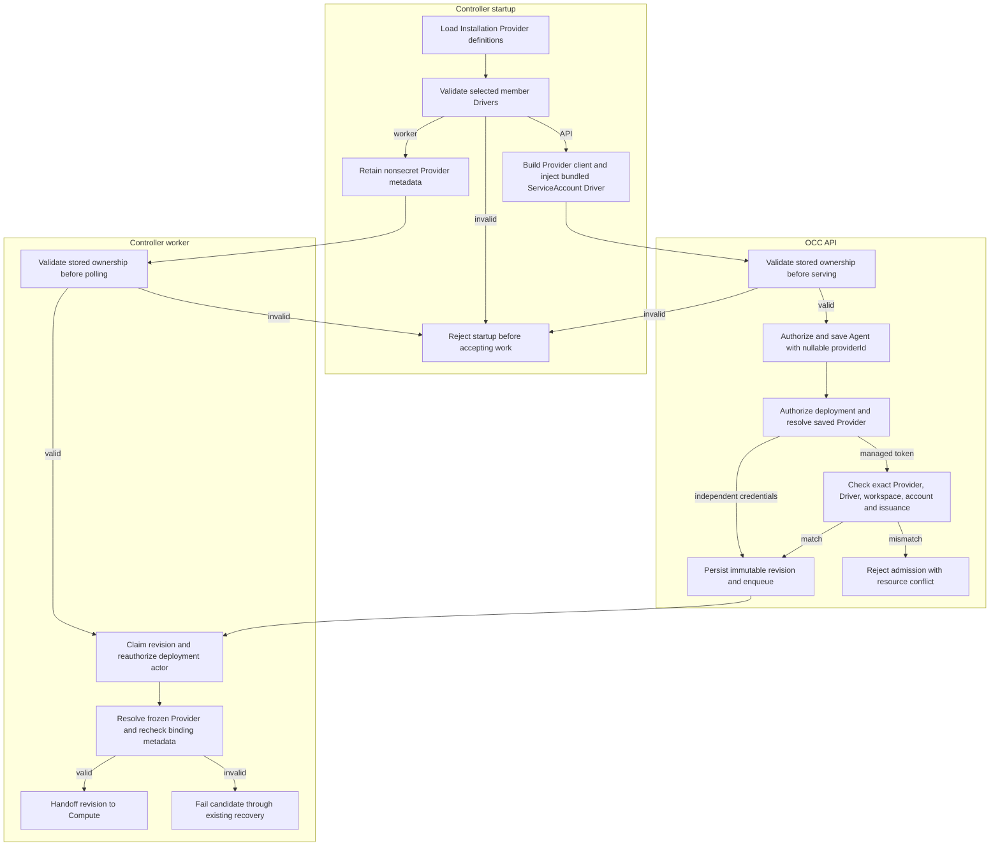

# Provider and Driver lifecycle flow

## Overview

Installation startup resolves a Provider's required Drivers, creates its client
only in the API process, and validates persisted ownership before accepting work.
An authorized Agent deployment freezes its optional Provider reference into a
revision. The worker checks that reference and any managed credential binding
before handing the revision to Compute. This flow stops at that handoff; the
[credential delivery flow](service-account-driver-credential-delivery.md) covers
token projection and Codex login.

The [Provider reference](../reference/providers.md) owns configuration, nullable
association semantics, cleanup requirements, and deferred capabilities.

## Entry Points

- Startup: `apps/controller/src/server.mjs:start` and the top-level
  `apps/controller/src/worker.mjs` load the same Installation configuration.
- API: `packages/occ/src/index.ts:OpenClawController.createAgent`, `updateAgent`,
  and `deployAgent` admit exact Namespace-scoped requests.
- Queue: `apps/controller/src/worker.ts:ControllerWorker` reconciles an admitted
  AgentRevision after lease acquisition and IAM reauthorization.
- Assumptions: the selected PostgreSQL Installation is initialized; configuration
  declares exact Driver membership; the API has its protected mounted admin key;
  callers have existing exact Configuration, Agent, ServiceAccount, and Secret
  permissions. Account creation and credential issuance are separate operations.

## Flow

## Execution Trace

### 1. Parse Provider definitions and member selections

`apps/controller/src/composition/installation-config.ts:loadInstallationConfiguration`

The API and worker independently parse trusted `provider` definitions alongside
ordinary Driver selections through the shared
`packages/occ/src/providers.ts:validateProviderDefinitions`. `provider[].drivers` is the sole membership source;
the bundled `chatgpt` definition requires its selected `service_account` member.
The loader rejects duplicate IDs, missing or unselected related Drivers, and
conflicting ownership. It preserves one Installation-selected Driver per
capability and existing installed-package factory arguments.

Omitting Providers or using `[]` leaves independent Drivers and providerless
Agents available. Retired integration keys fail with a format-change hint.

### 2. Establish API client ownership and validate saved identity

`apps/controller/src/server.mjs:start`

`apps/controller/src/composition/production.ts:composeProduction`

`packages/occ/src/index.ts:OpenClawController.validateProviderConfiguration`

The API reads `apiKeyPath`, constructs the ChatGPT client, and supplies its
`Provider<ChatGPTClient>` to the bundled ServiceAccount factory. That factory
receives controller and PostgreSQL state later during composition; it preserves
Compute credential-storage support. The returned Driver declares its Provider
ID before registry use. Its client uses the fixed trusted provider endpoint,
bounded requests, sanitized errors, and existing exact deletion behavior.

The worker shares only the nonsecret definition and selected identities. It
constructs neither a runtime Provider client nor a ServiceAccount Driver. Both
processes validate stored managed binding identities, draft references, and
active or nonterminal revision references against configuration before accepting
work through `packages/occ/src/providers.ts:validateProviderState`. A missing or retargeted Provider rejects startup without adopting old
accounts. Key or TTL changes preserve identity; historical inactive revisions
do not prevent a cleaned-up Provider's removal.

### 3. Admit the Agent draft and bind managed credentials separately

`packages/occ/src/index.ts:OpenClawController.createAgent`

`packages/occ/src/index.ts:OpenClawController.updateAgent`

Existing exact-resource authorization precedes draft persistence. A nonnull
`providerId` must name configured metadata. Create omission saves `null`; update
omission preserves the saved value; explicit `null` clears it. No client call,
account creation, credential issuance, or deployment occurs here.

Separately, `ChatGPTServiceAccountDriver.create` and `createCredential` in
`apps/controller/src/drivers/service-account/chatgpt.ts` perform authorized
provider operations. PostgreSQL stores the private Provider, Driver, workspace,
Namespace/account binding and issued credential identity. Issuance and deletion
recheck exact ownership. Existing transaction compensation and account-owned
Secret storage remain responsible for cleanup.

### 4. Freeze the Provider reference during deployment admission

`packages/occ/src/index.ts:OpenClawController.deployAgent`

Within existing admission locks, OCC authorizes the exact Agent, Configuration,
and optional account/Secrets, then resolves the draft's saved Provider and
required selected Drivers. `validateServiceAccountProviderBinding` in
`packages/occ/src/providers.ts` handles managed `access_token` ownership: the private binding
must match the Provider, selected member Driver, configured workspace, and exact
Namespace/account, with recorded credential issuance. A missing or mismatched
Provider rejects admission as a resource conflict. Native API-key references
remain valid with `providerId: null`.

OCC persists the immutable revision with `providerId`, the admitted configuration,
Harness/Compute selections, and opaque credential reference, then enqueues work
in the existing transaction. The API returns `202`; this means admitted and
queued, not active. Subsequent Agent edits do not change this snapshot.

### 5. Recheck metadata before worker effects

`apps/controller/src/worker.ts:ControllerWorker.processRevision`

`packages/occ/src/state/platform-state.ts:ServiceAccountReadRepository.findServiceAccountProviderBinding`

After claiming work and reauthorizing its requesting actor through current IAM,
`ControllerWorker.resolveRevisionProvider` resolves the revision's frozen Provider
metadata. It repeats the
managed credential ownership check through the read-only binding projection,
which exposes only Provider, Driver, workspace, and issuance metadata. The exact
Namespace/account scope is enforced by the repository query predicate. External
account and credential IDs remain private; no admin key, provider call, or
secret value crosses this boundary.

Success hands the admitted revision to existing Compute reconciliation and its
ordered lifecycle hooks. An unavailable Provider produces the permanent result
`PROVIDER_UNAVAILABLE`. A validation mismatch in the managed binding metadata
produces `SERVICE_ACCOUNT_PROVIDER_MISMATCH`; an unexpected metadata read failure
uses the existing retry result, `DEPENDENCY_UNAVAILABLE`. These paths prevent
candidate activation and follow existing finalization/recovery, preserving an
earlier active workload where supported. Provider association adds no hook
coordinator or credential fallback.

## Debugging and Verification

- Startup rejection after a Provider edit: compare exact configured Provider,
  member Driver, and workspace identity with saved bindings and live references.
  Restore the original configuration to finish cleanup; do not retarget old
  bindings. Follow [safe Provider changes](../reference/providers.md#startup-identity-and-safe-provider-changes).
- Agent create/PATCH `400` or `404`: check that `providerId` is null or a known
  nonempty ID. PATCH still requires `configurationId`.
- Managed-token deployment conflict: verify a matching nonnull Provider, exact
  same-Namespace account, selected member Driver, configured workspace, issued
  credential, and dedicated Codex Harness. Credential kind alone is insufficient.
- Compare Agent and AgentRevision reads after a draft edit: the current draft
  changes, while the admitted revision retains its previous `providerId`.
- Focused configuration, API, ServiceAccount, PostgreSQL, and Helm suites provide
  local contract checks; use [testing](../testing.md) for invocation and
  infrastructure requirements. This document records source behavior, not a
  successful live test run. The opt-in
  [real provider suite](../../tests/integration/service-account-driver-real.test.mjs)
  requires authorized credentials, disposable Kubernetes/PostgreSQL, and real
  runtime images before it can prove upstream lifecycle or a model response.
- Inspect rendered Helm Deployments and NetworkPolicies: the API alone mounts
  `/etc/openclaw/chatgpt/admin-key` and receives provider TCP/443 `/32` egress.
  The Installation `apiKeyPath` must equal that mounted path.

## Related docs

- [Providers](../reference/providers.md)
- [Agents](../reference/agents.md)
- [Service accounts](../reference/service-accounts.md)
- [Driver selection](../reference/drivers/selection.md)
- [Shared platform startup](platform-startup.md)
- [Production startup](production-startup.md)
- [Controller worker](controller-worker.md)
- [Provider-managed credential delivery](service-account-driver-credential-delivery.md)
- [Implementation specification](../../specs/17-provider-driver-abstraction.md)

## Manual Notes

[keep this for the user to add notes. do not change between edits]

## Changelog

- 2026-09-01 09:22: Narrowed worker binding projection description and separated validation mismatch from retryable metadata read failure. (01a05dc0-eaf1-74b0-820f-27166af28dec - 7baefec9779b87a18d188bbf428697f0028fd3d7)
- 2026-09-01 08:47: Trace Provider membership, API client injection, nullable Agent admission, immutable deployment, and worker metadata checks. (01a05d97-f2b0-71d0-bfc3-01ee7d6d58f9 - b079c4b755ef336a9c65bb4eb737e3aedbfdaa7d)
