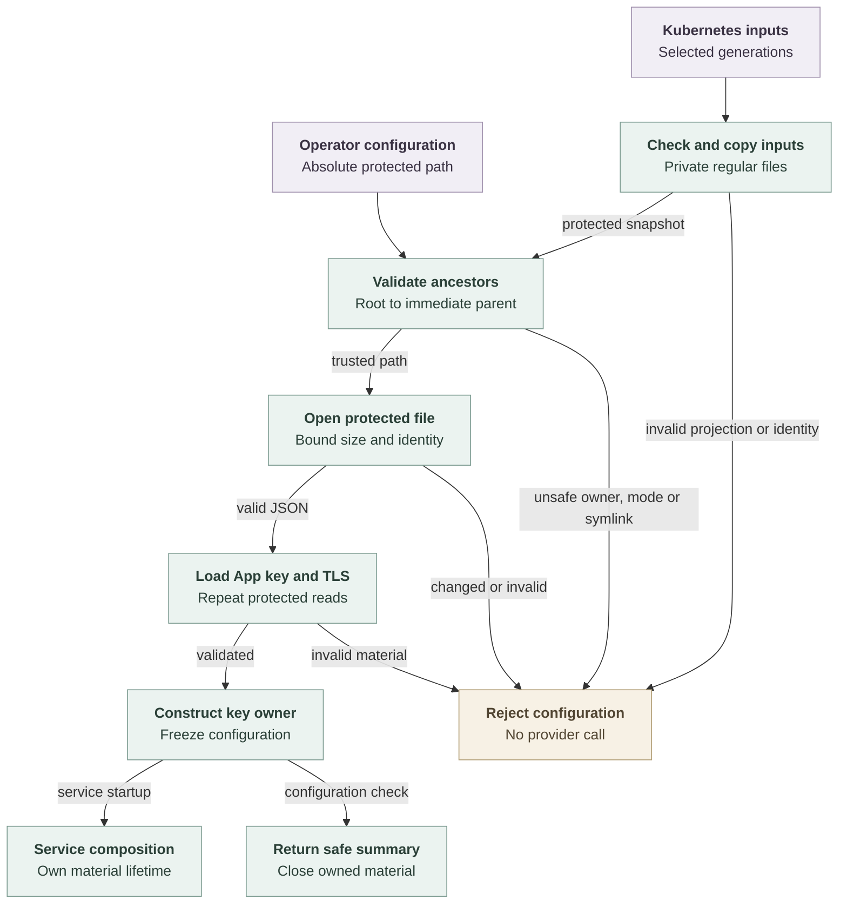

# Repository credential configuration flow

## Overview

Controller composition validates repository credential configuration, GitHub
App key material and TLS files before returning a frozen configuration owner to
the separate service process. Standalone startup reads protected operator files;
Kubernetes startup first snapshots selected projections into private files. The
configuration check reports a nonsecret summary and closes its owner. This flow
stops before provider requests or listener startup.

## Entry Points

- Trigger: `pnpm credentials:check-config /absolute/path/service.json`.
- Source: `apps/controller/src/composition/repository-credentials/check-config.ts:checkConfiguration`
  and `apps/controller/src/composition/repository-credentials/config.ts:loadConfiguration`.
- Kubernetes startup: `apps/controller/src/composition/repository-credentials/projected-inputs.ts:prepareProjectedInputs`.
- Assumptions: Node 24, prepared build output, operator-selected absolute paths,
  and the ownership and permission policy in the [reference](../reference/repository-credentials.md#configuration).

## Flow

## Execution Trace

### 1. Snapshot Kubernetes inputs when selected

`apps/controller/src/composition/repository-credentials/projected-inputs.ts:prepareProjectedInputs`

Kubernetes composition selects one generation of the service projection and one
generation of the canonical registry. It validates regular files with bounded
reads and stable inode identities, then checks the expected gateway origin,
listener, control socket and Provider identity. It rewrites material paths to a
service-owned mode-0700 directory and writes mode-0600 snapshots. Restart cleanup
removes only known private regular files after checking the complete directory
and each file's unchanged identity; unknown entries fail startup.

The snapshots enter the same protected loader as standalone configuration.
Projection handling does not relax that loader's ancestor policy. App and TLS
private keys remain confined to service inputs. Temporary read buffers are
cleared on success or failure. Standalone configuration skips this phase.

### 2. Establish a protected path from the filesystem root

`apps/controller/src/composition/repository-credentials/config.ts:readProtected`

The loader requires a normalized absolute path and validates its directory
ancestors in root-to-leaf order. Each accepted prefix therefore protects the
next path component against replacement by another local user. Ancestors must
be directories owned by root or the service user. Group/other writes fail except
for a root-owned sticky ancestor above the immediate parent. The immediate
parent remains unwritable by those users.

The loader opens the final basename without following symlinks. It checks the
file owner, mode, link count, type, and size, performs a bounded read, and compares
the open file with the named inode and its original metadata. Invalid or replaced
files fail before their contents become configuration.

### 3. Validate configuration and construct material owners

`apps/controller/src/composition/repository-credentials/config.ts:loadConfiguration`

Composition validates the service policy and either one GitHub repository or the
canonical registry, then repeats protected reads for the App key, certificate and
TLS key. Registry policy remains bounded to its installation, repository and
Namespace/profile grants. The GitHub key
owner accepts the configured RSA signing key; TLS context creation validates
the certificate and private-key pair. The frozen result owns the selected
factory and TLS buffers. Failure closes any constructed owner and clears loaded
buffers before returning `invalid-configuration`.

### 4. Close validation material or hand it to service startup

`apps/controller/src/composition/repository-credentials/check-config.ts:checkConfiguration`

The check returns the gateway origin, configured profiles, and maximum session
duration. Its `finally` block closes the material owner, and the CLI prints only
the safe summary. It creates no session, listener, or provider request.
The Kubernetes check similarly closes the loaded owner before reporting success;
it also rejects a shutdown grace beyond the Pod's allowed service cleanup window.
Normal startup instead passes the owner to
`apps/controller/src/composition/repository-credentials/service.ts:runService`,
which retains it until startup failure or process shutdown. The
[service flow](repository-credentials.md) owns that lifetime.

## Debugging and Verification

Run `pnpm credentials:build`, then the configuration command from the
[operator guide](../guides/repository-credentials.md). Success prints JSON with
`valid: true`; failure prints `invalid-configuration`. Inspect every ancestor
when safe-looking files still fail validation. A shared writable deployment
directory can permit substitution of an otherwise private configuration tree.

Run the configuration and emitted-package cases in the [testing guide](../testing/repository-credentials.md).
They exercise real generated RSA/TLS files and the actual loader. They establish
startup validation, not live GitHub behavior or platform integration.

## Related docs

- [Repository credential reference](../reference/repository-credentials.md)
- [Repository credential operator guide](../guides/repository-credentials.md)
- [Repository credential tests](../testing/repository-credentials.md)
- [Credential service startup and shutdown](repository-credentials.md)
- [Current architecture](../ARCHITECTURE.md)

## Manual Notes

[keep this for the user to add notes. do not change between edits]

## Changelog

- 2026-09-18 09:45: Trace the accompanying controller-owned protected loader and Kubernetes private projection snapshots without relaxing ancestor validation. (authoring-run/99b8e474-5c94-4558-bce6-e7d6032f832c - 6fd1516de000bde46d4cd43e0d21ec3f0167d65e)

- 2026-09-18 03:32: Document protected ancestor validation and configuration ownership with the accompanying security correction (codex/01a0b287-be12-7492-8826-a168e5b53103 - 2d4877aaf438c919a2240109cb2e7067e4d75b4d)
