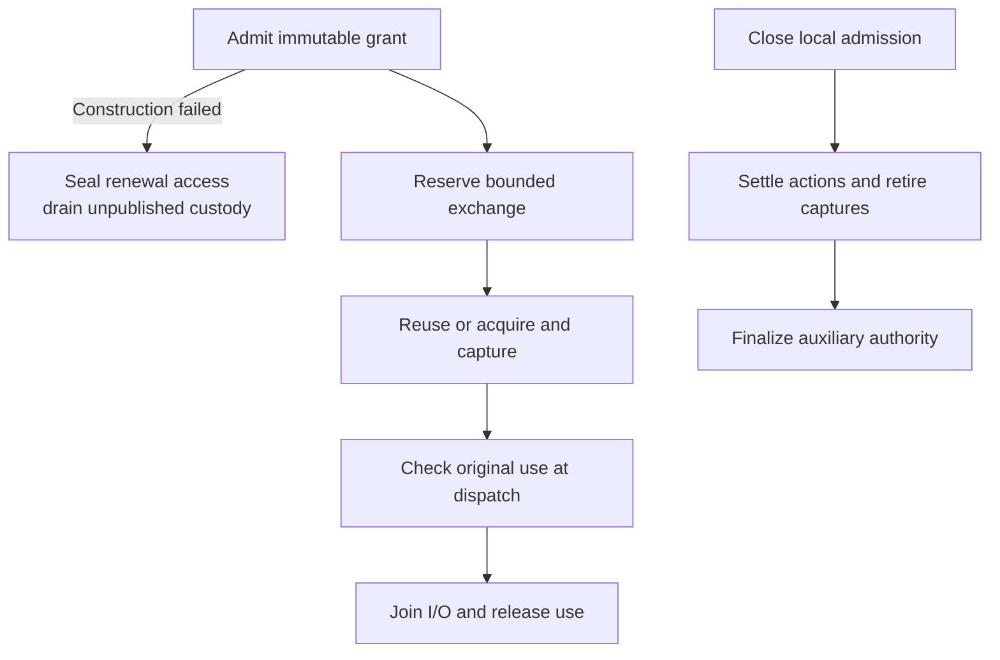

# Repository credential lifecycle flow

## Overview

The callable service binds an immutable grant to one ephemeral session and owns credential use and cleanup.

## Entry Points

`apps/repository-credentials/src/service.ts:createCredentialService` composes admission, reserve, execute, status, close, and shutdown operations.

## Flow

## Execution Trace

### 1. Admit, execute, and close

`apps/repository-credentials/src/service.ts:createCredentialService` admits the trusted profile and deadline. `sessions.ts` retains bearer digests and immutable bindings. `custody.ts` owns original attempts, captured material, and use leases. `lifecycle.ts` coalesces acquisition, checks sufficient validity, and coordinates replacement and retirement through the bound factory. `provider-queue.ts` bounds provider work; `lifecycle/exchange.ts` joins tracked exchange work before releasing use. Closure prevents new admission before cleanup and original settlement. Uncertainty does not imply successful revocation.

`apps/repository-credentials/src/custody.ts:createCustody` anchors cleanup and authentication deadlines to original capture. `apps/repository-credentials/src/lifecycle.ts:createLifecycle` uses the earlier authentication deadline at acceptance, reuse and dispatch; delayed settlement does not extend it. Failed construction seals every renewal handle before awaiting callbacks, retains bounded custody and counts pending work during shutdown until disposal.

## Debugging and Verification

Run the available common-owner and adapter cases listed in the [testing guide](../testing/repository-credentials.md). Controlled time advances beyond hour thirteen without changing the admitted bearer. Inspect active uses and pending/uncertain cleanup separately. Listener/client and delivered-container qualification are pending.

## Related docs

- [Reference](../reference/repository-credentials.md)
- [Build and configuration](../guides/repository-credentials.md)

## Manual Notes

[keep this for the user to add notes. do not change between edits]

## Changelog

- 2026-09-18 01:53: Document accompanying capture deadlines and failed-construction cleanup. (01a0b098-e407-7d42-bc53-9bce979ac912 - cce878092910f39770aa27baa64c6d710f9651f8)

- 2026-09-17 21:49: Document callable common lifecycle ownership. (extraction-preparation - 2f8435756d0e82f0cc5205b009f5f1e0df692808)
