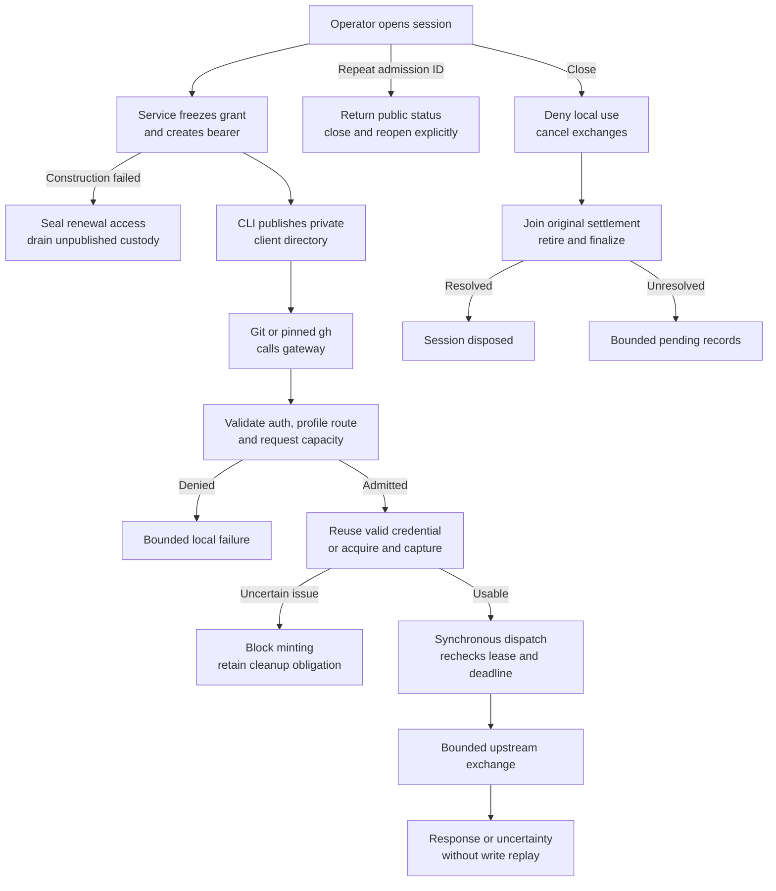

# Repository credential service flow

## Overview

A trusted operator admits a bounded session over a private Unix socket. The
client uses its gateway bearer to send Git or selected GitHub API requests over
HTTPS. One process owns credential acquisition, use and cleanup. This flow ends
at upstream response delivery or categorized failure, and then local session
closure with separately tracked cleanup. It describes source composition;
container and live-provider qualification have separate evidence.

## Entry Points

- `apps/controller/src/repository-credentials.ts:main` starts the dedicated service process from protected configuration.
- `apps/controller/src/drivers/repo/github/credentials/client/operator.ts:callControl` carries operator admission/status/close requests over the private Unix socket.
- `apps/controller/src/drivers/repo/credentials/server.ts:startListeners` accepts HTTPS client traffic after protected startup succeeds.

The service has one configured repository and approved profiles. The operator
owns the control socket directory and protected files. Clients receive only
private session files and public connection/trust configuration.

## Flow

## Execution Trace

### 1. Load protected startup inputs

`apps/controller/src/composition/repository-credentials/check-config.ts:checkConfiguration` and
`apps/controller/src/composition/repository-credentials/service.ts:startCredentialService` share the protected configuration
loader, whose private file owner is
`apps/controller/src/composition/repository-credentials/protected-file.ts:readProtectedFile`.
The [configuration flow](repository-credential-configuration.md) traces its
path checks and byte disposal.
`apps/controller/src/drivers/repo/credentials/configuration.ts:validateServiceConfig`
validates gateway settings, session policy and service limits. The standalone
check emits a safe summary without importing the session or listener owners. Normal startup constructs the system clock, bound backend
factory, common service, and listeners.
`apps/controller/src/drivers/repo/github/credentials/index.ts` exports the startup
API; `apps/controller/src/drivers/repo/github/credentials/factory.ts:createGitHubDriverFactory`
composes session-bound backends. It delegates grant resolution to
`apps/controller/src/drivers/repo/github/credentials/grants.ts:createGrantResolver`
and client authentication to
`apps/controller/src/drivers/repo/github/credentials/gateway-authentication.ts:createGatewayAuthentication`.
The App signing key belongs to the separate credential process, independently
of each session's installation tokens. Session-consumer types live in
`apps/controller/src/drivers/repo/credentials/service-contracts.ts`; backend extension contracts live
in `apps/controller/src/drivers/repo/credentials/backend-contracts.ts`. Service and transport
collaborators remain in `apps/controller/src/drivers/repo/credentials/internal-contracts.ts`.
The split preserves the original nominal handles and runtime owners. These modules
are private implementation details. The dedicated process entrypoint delegates
startup to composition; returned session controls are a separate frozen forwarding
object. The listener keeps the original exchange owner and its credential-bearing callbacks private.

### 2. Admit and publish a client session

`apps/controller/src/drivers/repo/credentials/control.ts:handleControl` validates the local
request method, target, content type and bounded body before invoking the common
service. `apps/controller/src/drivers/repo/credentials/service.ts:createCredentialService`
checks duration, allowed profile and capacity, then freezes the resolved binding.
The common service treats profile names as opaque configured values. The GitHub
factory resolves `git-read`, `git-write` and `git-full` to the exact permission
maps in the [reference](../reference/repository-credentials.md#configuration),
including the profile in the grant identity. Protected startup validation rejects
unknown names, including `read-write`; the example default remains `git-write`.
Bearer lookup retains a digest. Only the original admission response contains
the bearer.

`apps/controller/src/drivers/repo/credentials/server.ts:startListeners` owns and disposes the
bounded correlation registry from
`apps/controller/src/drivers/repo/credentials/control.ts:createControlAdmission`. Before
opening a session, it binds the admission ID to the effective profile and duration.
Known nondelivery before response transmission closes the new session. Ambiguous
response loss permits public-status reconciliation with the same ID; it does
not recover the bearer, change the original binding/deadline, or replay provider
operations.

If the factory throws or returns an invalid binding, the service closes
construction admission before starting
`apps/controller/src/drivers/repo/credentials/custody.ts:disposeAllRenewal`.
Every retained handle is sealed before any callback is awaited. The service
retains this unpublished custody until callbacks settle and byte disposal
completes; failed construction continues occupying bounded session capacity.

`apps/controller/src/drivers/repo/github/credentials/client/config.ts:writeClientConfiguration`
creates a private staging directory and private files, synchronizes writes, and
renames it into the requested new session directory. Normal CLI output contains
the session status and file location. A failed file write after admission causes
the CLI to attempt closure and report the session ID for operator follow-up.

### 3. Authenticate the selected client

`apps/controller/src/drivers/repo/github/credentials/client/launch.ts:launchClient` owns the temporary
home, subprocess, signal forwarding and cleanup. Cleanup retries transient removal
failures up to three times. An unresolved removal emits the temporary directory
path separately and preserves the child exit status or original launch error.
It composes
`apps/controller/src/drivers/repo/github/credentials/client/environment.ts:createClientEnvironment`
for the isolated environment and
`apps/controller/src/drivers/repo/github/credentials/client/commands.ts:prepareClientCommand` for
command validation and arguments. Git receives an exact destination helper and
command-level prompt/redirect/auth configuration. Before launch, Git reads its
effective configuration using the same repository-selection options; the launcher
resets inherited URL-specific HTTP protections at matching specificity and
rejects user-agent values containing carriage returns or newlines before starting
the client, including values from included configuration. Ordinary user-agent
values remain intact. It also rejects custom trust, client certificates, cookies
and DNS overrides. It rejects HTTP(S) userinfo in remote fetch/push URLs and
`insteadOf`/`pushInsteadOf` destinations, as well as direct network-command URLs,
before Git can transmit URL credentials in place of the session helper. The same
surfaces reject explicit remote-helper syntax. Clone options are validated before
inspection; config/template/submodule options, inherited `init.templateDir` and conditional
includes refuse because they introduce state or transports after preflight. The helper reads the gateway
bearer only after matching HTTPS host and repository path. API execution checks
`gh` 2.100.0 and retains canonical GitHub identity while selecting the configured
gateway API host. Absolute API destinations and unqualified commands refuse.

### 4. Reserve, acquire and dispatch

`apps/controller/src/drivers/repo/credentials/server.ts:startListeners` bounds each listener's
sockets independently, preserving private operator admission when the public
listener is full. TLS handshakes and incomplete HTTP headers each have a bounded
wait. The HTTPS header timer belongs to the secured socket; after authentication
and exchange reservation, `apps/controller/src/drivers/repo/credentials/transport/agent.ts:createAgentHandler`
clears that timer so credential acquisition can continue under the exchange
deadline. The control listener retains its raw-socket header timer. The Agent
handler checks generic framing and delegates authentication to the bound factory. A valid
Git route with no credentials receives the local Basic challenge. Authenticated
requests reserve common exchange capacity before body forwarding. The GitHub
backend plans admitted routes through
`apps/controller/src/drivers/repo/github/credentials/routes.ts:createRoutePolicy`, using
`apps/controller/src/drivers/repo/github/credentials/routes/classification.ts:classifyRoute`
for target, method, profile and query classification. This provider-owned decision admits upload-pack discovery and execution for all
three profiles, but rejects receive-pack discovery and execution for `git-read`.
It admits REST and GraphQL only for `git-full`: selected repository metadata,
PRs, issues and issue comments, plus `GET /meta` and `POST /graphql`, subject to
the existing method, query, framing and media-type checks. Both Git-only profiles
reject API reads as well as writes before upstream dispatch. GraphQL bodies are
forwarded under the exact installation-token grant; this route check does not
perform per-field GraphQL or branch-only authorization. GitHub may return
permitted public information, and every GraphQL POST is treated as a possible write.

`apps/controller/src/drivers/repo/credentials/service.ts:createCredentialService` reserves the
exchange and delegates execution to
`apps/controller/src/drivers/repo/credentials/lifecycle/exchange.ts:executeExchange`, which
coordinates acquisition and owner-bound use. The lifecycle may reuse sufficient
remaining validity or acquire replacement material under common custody.
Concurrent misses share one acquisition in
`apps/controller/src/drivers/repo/credentials/lifecycle.ts:createLifecycle`. When its last
waiter leaves, the lifecycle cancels the original attempt. While that attempt's
settlement remains pending, requests needing acquisition return `not-dispatched`
without attaching new waiters or starting another acquisition. The original
owner retains capture, settlement and cleanup obligations until they resolve.
Custody captures the original monotonic timestamp and a cleanup deadline from
the declared lifetime. After settlement, the lifecycle anchors the acquired
use lifetime to that same capture timestamp, capped by the cleanup deadline.
Acceptance, cached reuse, dispatch and authentication use this earlier deadline;
cleanup retains its separate expiry and callback-drainage requirements. Later
wall-clock changes cannot shorten custody or restart the use lifetime.

`apps/controller/src/drivers/repo/github/credentials/driver.ts:createGitHubDriver`
composes acquisition and capture through
`apps/controller/src/drivers/repo/github/credentials/driver/acquisition.ts:createCredentialAcquisition`,
authentication through
`apps/controller/src/drivers/repo/github/credentials/driver/access.ts:createCredentialAuthentication`,
retirement through
`apps/controller/src/drivers/repo/github/credentials/driver/retirement.ts:createCredentialRetirement`,
and session-bound plans, credentials and original outcomes through
`apps/controller/src/drivers/repo/github/credentials/driver/state.ts:createGitHubDriverState`.
Acquisition observes and captures material inside the transport response callback
through `apps/controller/src/drivers/repo/github/credentials/driver/acquisition-response.ts:observeAcquisitionResponse`.
Its pure `classifyAcquisitionResponse` checks status, scope and usable lifetime;
acquisition then rechecks admission synchronously before accepting the original
credential. Rejected material retains its cleanup owner.
Its bounded credential transport,
`apps/controller/src/drivers/repo/github/credentials/provider-transport.ts:createProviderTransport`,
uses `apps/controller/src/drivers/repo/github/credentials/provider-transport/request.ts:sendProviderRequest`
to dispatch and join the actual request close event. An original
dispatch gate rechecks admission synchronously after authentication preparation,
registers cancellation and opens the exchange without an intervening await.
The handler and sender independently capture their allowed upstream origins.
`apps/controller/src/drivers/repo/credentials/transport/request-headers.ts:createUpstreamHeaders`
validates adapter fields, rejects case-insensitive duplicates and reconstructs
bounded transport headers before dispatch. Credential bytes stay
inside private adapter/sender callbacks. The sender's final-response-header wait
starts after the bounded input pipeline finishes, unless headers have already
arrived. Connection, upload, stall and total deadlines remain active in their
respective phases.

### 5. Deliver an outcome and release ownership

`apps/controller/src/drivers/repo/credentials/transport/response-headers.ts:responseHeaders`
checks upstream header bounds and framing. The GitHub route plan carries the
policy from `apps/controller/src/drivers/repo/github/credentials/response.ts:createResponsePolicy`
for provider response headers, pagination and explicitly followed resource fields.
It composes URL validation and pagination rewriting from
`apps/controller/src/drivers/repo/github/credentials/response-urls.ts:createUrlRewriter`
and `rewritePaginationLinks`, and resource-field rewriting from
`apps/controller/src/drivers/repo/github/credentials/response-resources.ts:createResourceRewriter`.
The URL owner maps response links using the configured GitHub repository ID
to the admitted `/repos/owner/repository` path before checking the route and
resource purpose. A different repository ID remains refused. Issue-list
pagination accepts bounded `after` and `before` cursors; rewritten links retain
the gateway origin, so subsequent client requests pass through the same session
and profile checks.
Informational nested labels, milestones, repository metadata and human content
remain unchanged. Transport applies
`apps/controller/src/drivers/repo/credentials/transport/response-headers.ts:safeResponseHeaders`
before writing response headers to the client.

`apps/controller/src/drivers/repo/credentials/lifecycle/exchange.ts:executeExchange` joins
tracked I/O before releasing credential use and returning exchange capacity to
the service owner. Transport returns completed, not-dispatched or
possibly-dispatched outcomes. The Agent handler ignores the normal response
`close` event after `writableFinished`; a premature close cancels the exchange,
whose I/O is joined before its lease and capacity are released. A possibly dispatched
mutation has no automatic replay. Provider settlement and cleanup retain their
original ownership even when an outward request ends earlier.

### 6. Close locally and finish cleanup

`apps/controller/src/drivers/repo/credentials/service.ts:createCredentialService` closes the
session before cancelling its exchanges and advancing lifecycle cleanup. A
session becomes disposed only after exchanges, original actions, captures,
renewal state and auxiliary finalization are resolved. If the provider queue is
full before cleanup dispatch, `apps/controller/src/drivers/repo/credentials/lifecycle.ts`
keeps retirement/finalization unattempted and registers one capacity waiter per
session through `apps/controller/src/drivers/repo/credentials/provider-queue.ts`. Available
capacity wakes cleanup; queue rejection alone does not mark an action uncertain.

`apps/controller/src/composition/repository-credentials/service.ts:runService` stops admission on shutdown, asks
the service to close sessions, and bounds cleanup by an independent process
timer. A grace expiry reports unresolved status and exits with unresolved
obligations still counted. It does not establish disposal or remote revocation,
and restart loses the provider cleanup inventory. The process closes the shared
App key after shutdown disposition.

Failed construction custody also participates in shutdown drainage. Its
pending obligation contributes to `pendingAuxiliary` without inventing a
published or disposed session; disposal wakes the shutdown waiters.

## Emitted packaging

`scripts/build-repository-credentials.mjs` follows the credential entrypoints in
the controller's emitted tree into separate service/client artifacts. Source
placement does not combine their running processes or private mounts.

| Artifact context                        | Runtime entrypoints beneath `dist/`                                               |
| --------------------------------------- | --------------------------------------------------------------------------------- |
| `.build/repository-credentials/service` | `repository-credentials.js`, `composition/repository-credentials/check-config.js` |
| `.build/repository-credentials/client`  | `drivers/repo/github/credentials/client/{launch,operator,git-helper}.js`          |

The Dockerfiles under `deploy/runtime/repository-credentials/` consume those
separate contexts. `deploy/examples/repository-credentials/compose.yaml` keeps
service inputs/control and client session/workspace mounts separate. The
[operator guide](../guides/repository-credentials.md#container-images) owns image
builds and entrypoint inspection. The
[test guide](../testing/repository-credentials.md#record-each-evidence-boundary)
distinguishes detached loading, combined test images, rendered mounts and
observations of separate running containers; none alone establishes live-provider
or platform integration.

## Debugging and Verification

Run `pnpm credentials:build` and `pnpm credentials:check-config CONFIG_FILE` for
the separate emitted startup path. Run the client configuration and package
integration tests for private files, actual Git helper behavior and detached
runtime loading. Inspect session status after close: a closed session can still
have pending or uncertain cleanup.

A helper failure reports a fixed category without credentials. Diagnose the
configured HTTPS host/path and private file ownership first. API failures also
require checking that the session uses `git-full`, then the pinned CLI, canonical
host, gateway DNS/SAN and port 443.
The [test guide](../testing/repository-credentials.md) owns controlled upstream,
client and alternate-adapter checks. Detached service/client artifacts prove
module closure. Separate-container isolation and live-provider behavior require their own selected qualification.
A structural flow check does not establish any of those runtime results.

## Related docs

- [Supported behavior and configuration](../reference/repository-credentials.md)
- [Operator procedures](../guides/repository-credentials.md)
- [Qualification and test setup](../testing/repository-credentials.md)

## Manual Notes

[keep this for the user to add notes. do not change between edits]

## Changelog

- 2026-09-19 21:58: Align emitted Docker contexts and container qualification with the separate service and client artifacts. (public authoring-run/8a16053e-895f-4ea3-8114-5bbe459856a0 - 99d01c1759ef28fe1ec2e6e22496879e752b5cb5)

- 2026-09-19 21:46: Reconcile transport and client ownership with accompanying detached service/client build and runtime checks. (public authoring-run/9feb5f57-7456-4831-8474-1fc7871d17c6 - bd3af4a7214c3e7b2142ef38183137786226cde9)

- 2026-09-18 18:51: Refresh operation, authentication and protected-input owners after behavior-preserving extraction. (source `d29fac7d363eb1cfb3dab6306a81cc3b8daf395d`)

- 2026-09-18 12:03: Keep admitted TLS exchanges outside the header timeout while bounding incomplete handshakes and headers. (source `b0b0b8b7ba98d2c8506ba261334aba1e769a87ef`)

- 2026-09-18 03:38: Capture upstream origin authority and construct canonical bounded private request headers before dispatch. (source `7c26fe8660e0af5d223baa2da83689974df36ebe`)

- 2026-09-18 03:33: Start upstream final-response-header deadlines after completed upload and preserve early-response handling. (source `7f2fd5988dfce4a485db48d33f0480b3f9485b86`)

- 2026-09-18 03:29: Preserve private control admission under public socket saturation. (source `0d34c2159d6a8fbec213cacf6ba42ca66aa9170a`)

- 2026-09-18 03:28: Document accompanying protected-path package startup and runtime session-control facade. (source `0d34c2159d6a8fbec213cacf6ba42ca66aa9170a`)

- 2026-09-18 01:59: Document accompanying admission reconciliation, failed-construction drainage and separate use/cleanup deadlines. (01a0b098-e407-7d42-bc53-9bce979ac912 - 87e5c418d7a6c45688ce3be87c204660b431c703)

- 2026-09-17 23:47: Refresh configuration, route classification, driver composition and provider request source pointers from the accompanying adapter extraction. (source `251bf5662df1fd61e132ca57a36008409add1996`)

- 2026-09-17 23:40: Refresh contract and response-policy source owners after extraction; preserve the existing lifecycle. (source `3f0ce26cf864a8909c52104c1c6b6092ca21c857`)

- 2026-09-17 22:22: Document accompanying git-read, default git-write and git-full profile changes and provider-owned route authorization. (01a0b0e4-839a-71b3-9ec1-3b1000b5d06a - c4ecf32727aef09a6b4caeec16870bf391f7a505)

- 2026-09-17 22:10: Refuse new waiters after acquisition cancellation while retaining original settlement and cleanup ownership. (source `2f8435756d0e82f0cc5205b009f5f1e0df692808`)

- 2026-09-17 21:39: Reject late clone configuration and helper-qualified URLs; preserve child outcomes when temporary-home cleanup fails. (source `2f8435756d0e82f0cc5205b009f5f1e0df692808`)

- 2026-09-17 21:19: Reject Git URL userinfo before remote and direct network operations. (source `2f8435756d0e82f0cc5205b009f5f1e0df692808`)

- 2026-09-17 20:59: Reject inherited user-agent header injection before client launch. (source `2f8435756d0e82f0cc5205b009f5f1e0df692808`)

- 2026-09-17 20:40: Enforce repository HTTP settings and selected-session mounts; clarify response completion, URL preservation and cleanup capacity wakeups. (source `2f8435756d0e82f0cc5205b009f5f1e0df692808`)

- 2026-09-17 20:17: Correct source ownership after adapter and transport refactors. (source `2f8435756d0e82f0cc5205b009f5f1e0df692808`)

- 2026-09-17 20:12: Clarify client composition and exchange ownership source pointers. (source `2f8435756d0e82f0cc5205b009f5f1e0df692808`)

- 2026-09-17 19:55: Document accompanying standalone service and client implementation. (source `2f8435756d0e82f0cc5205b009f5f1e0df692808`)
