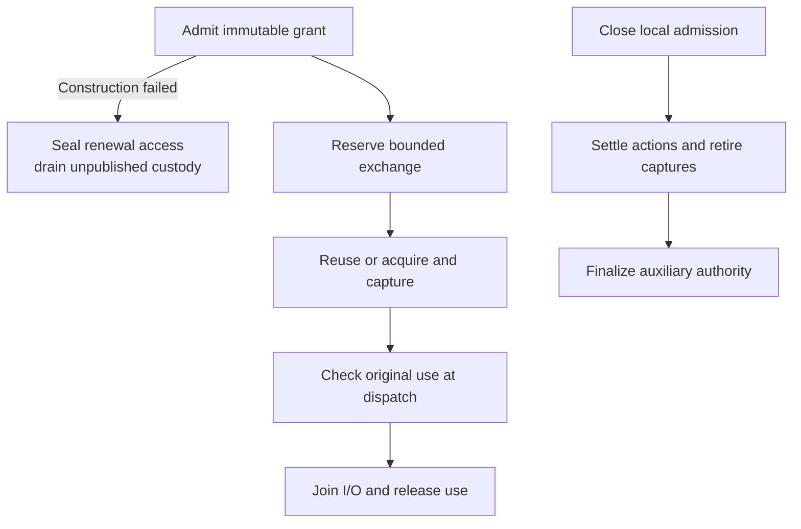

# Repository credential lifecycle flow

## Overview

The callable service binds an immutable grant to one ephemeral session and owns
credential use and cleanup. Trusted composition selects the backend and policy;
the service retains the original session, grant, and deadline throughout use.
This flow covers the callable core. Listeners, clients, and platform admission
are not connected at this stage.

## Entry Points

`apps/controller/src/drivers/repo/credentials/service.ts:createCredentialService`
composes admission, reserve, execute, status, close, and shutdown operations.
It receives validated service configuration, a bound `RepositoryBackendFactory`,
and a clock. Protected operator inputs are assembled by the
[configuration flow](repository-credential-configuration.md).

## Flow

## Execution Trace

### 1. Admit and retain the original authority

`apps/controller/src/drivers/repo/credentials/service.ts:createCredentialService`
admits the trusted profile and deadline. Its sibling `sessions.ts` retains bearer
digests and immutable bindings. The common engine uses private contracts in
`backend-contracts.ts` and `service-contracts.ts`; GitHub policy and credential
operations live under `apps/controller/src/drivers/repo/github/credentials/`.

### 2. Capture, acquire, and execute

`apps/controller/src/drivers/repo/credentials/custody.ts:createCustody` owns
original attempts, captured material, and use leases. It anchors cleanup and
authentication deadlines to original capture, so delayed settlement cannot extend
credential validity. `lifecycle.ts:createLifecycle` coalesces acquisition and
coordinates replacement and retirement through the bound backend. It checks
sufficient validity at acceptance, reuse, and dispatch. `provider-queue.ts` bounds
provider work; `lifecycle/exchange.ts:executeExchange` joins tracked exchange work
before releasing the original use.

### 3. Close admission and settle cleanup

`apps/controller/src/drivers/repo/credentials/service.ts:createCredentialService`
closes local admission before cancellation and cleanup. Original actions retain
their settlement and custody obligations; uncertainty does not imply successful
revocation. Failed construction seals every renewal handle before awaiting
callbacks, retains bounded custody, and counts pending work during shutdown.

A closed session reaches `DISPOSED` only after exchanges, actions, captures, and
auxiliary renewal authority finish. The private status keeps active-use and
cleanup counters. `shutdown(graceMs)` waits for disposal within its finite grace
period and returns the remaining obligations when that period expires. Process
exit loses the in-memory inventory and does not prove provider revocation; see
[the lifecycle contract](../reference/repository-credentials.md#common-lifecycle).

## Debugging and Verification

Run the common-owner and backend cases listed in the
[testing guide](../testing/repository-credentials.md). Controlled time advances
beyond hour thirteen without changing the admitted bearer or deadline. Inspect
active uses and pending/uncertain cleanup separately. These cases do not qualify
listeners, clients, containers, or live-provider behavior.

## Related docs

- [Reference](../reference/repository-credentials.md)
- [Build and configuration](../guides/repository-credentials.md)

## Manual Notes

[keep this for the user to add notes. do not change between edits]

## Changelog

- 2026-09-19 21:29: Update common/backend ownership and source paths; distinguish finite shutdown from completed disposal. Verify composed source. (public authoring-run/a55f804b-53b3-40df-a5d5-b6a2f425544b - 5d8329753f4e17402f619d392acc8fc3d112f620)

- 2026-09-18 02:02: Document accompanying capture deadlines and failed-construction cleanup. (source `cce878092910f39770aa27baa64c6d710f9651f8`)

- 2026-09-17 21:49: Document callable common lifecycle ownership. (source `2f8435756d0e82f0cc5205b009f5f1e0df692808`)
