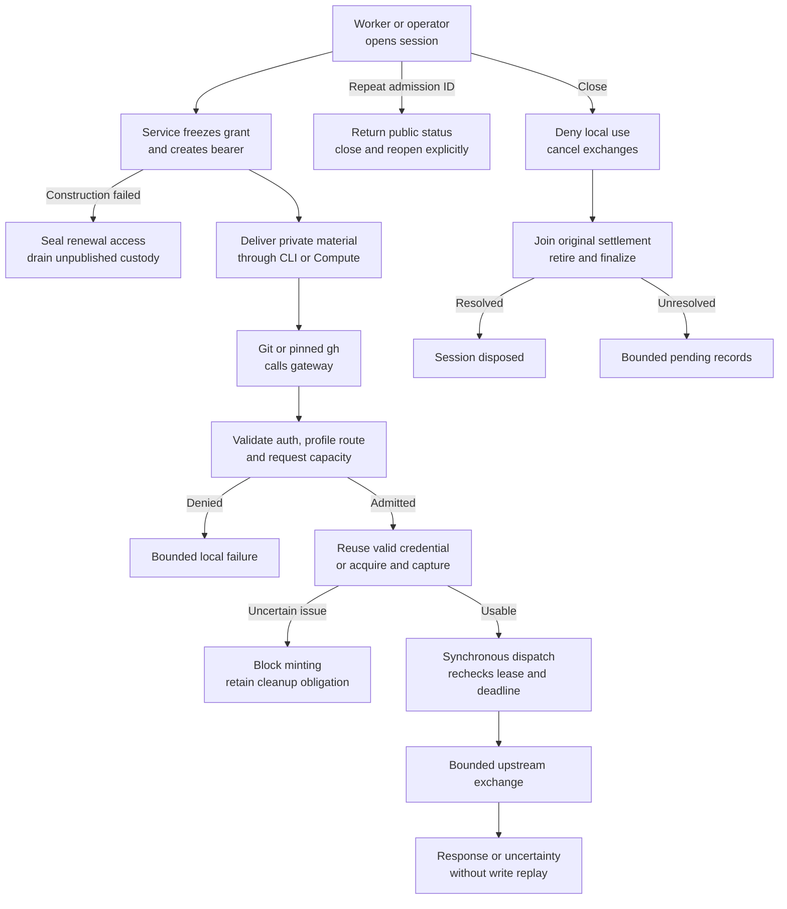

# Repository credential service flow

## Overview

An operator or controller worker admits a bounded session over a private Unix
socket. Clients send Git or selected GitHub API requests over HTTPS using its
gateway bearer. A separate process owns acquisition, use and cleanup. This flow
traces the credential engine through response delivery, local closure and
separately tracked cleanup. Container and live-provider qualification require
separate evidence. The [Agent flow](agent-repository-credentials.md) owns ordinary
Agent admission, durable records, Compute delivery and retirement.

## Entry Points

- `apps/controller/src/repository-credentials.ts:main` delegates protected-path startup to `startCredentialService` in controller composition.
- `apps/controller/src/drivers/repo/github/credentials/client/operator.ts:callControl` carries operator admission/status/close requests over the private Unix socket.
- `apps/controller/src/drivers/repo/credentials/server.ts:startListeners` accepts HTTPS client traffic after protected startup succeeds.

Standalone configuration selects one repository; the registry supports several
approved repositories under one App installation. Each session binds exactly one
repository. The operator owns the protected files and control socket; clients
receive session files and public connection/trust configuration.

## Flow

## Execution Trace

### 1. Load protected startup inputs

`apps/controller/src/composition/repository-credentials/check-config.ts:checkConfiguration` and
`apps/controller/src/composition/repository-credentials/service.ts:startCredentialService` share the protected configuration
loader at `apps/controller/src/composition/repository-credentials/config.ts:loadConfiguration`.
The [configuration flow](repository-credential-configuration.md) traces its
root-to-leaf protected-path validation and Kubernetes projection snapshots.
`apps/controller/src/drivers/repo/credentials/configuration.ts:validateServiceConfig`
validates gateway settings, session policy and service limits. The standalone
check emits a safe summary without importing the session or listener owners.
Normal startup constructs the system clock and explicitly selects the GitHub
factory. `apps/controller/src/composition/repository-credentials/service.ts:runService`
then composes the common service and listeners without starting the controller
API or worker.
`apps/controller/src/drivers/repo/github/credentials/factory.ts:createGitHubDriverFactory`
composes session-bound backends. It delegates grant resolution to
`apps/controller/src/drivers/repo/github/credentials/grants.ts:createGrantResolver`
and client authentication to
`apps/controller/src/drivers/repo/github/credentials/gateway-authentication.ts:createGatewayAuthentication`.
A registry-selected factory retains the frozen repository identity and access profile.
The App signing key belongs to the process, independently of each session's
installation tokens. The public `RepoDriver`, grant identity and four-field status
live in `packages/contracts/src/repo.ts`. Full private status, admission and
bearer-result contracts live in
`apps/controller/src/drivers/repo/credentials/service-contracts.ts`; the six-field
client DTO lives in its dependency-free sibling `client-contracts.ts`. Type-only
imports let Compute and the closed Git/gh bundle retain their distinct validators
without importing service initialization.
The private backend protocol and nominal custody handles live in
`apps/controller/src/drivers/repo/credentials/backend-contracts.ts`.
The frozen runtime facade exposes `open`, `status`, `close` and `shutdown`;
listeners retain the private exchange owner. The artifact contains runnable
JavaScript. The [Agent flow](agent-repository-credentials.md) traces the platform
Driver's session-control and local policy ownership.

Registry startup selects
`apps/controller/src/drivers/repo/github/credentials/registry-factory.ts:createGitHubRegistryDriverFactory`
from the same canonical authority loaded by API and worker. App and TLS private
keys remain service-only. `startListeners` can reclaim only an owned,
private, refused stale Unix socket after checking that its identity is unchanged;
a live or ambiguously owned socket fails startup.

### 2. Admit and publish a client session

`apps/controller/src/drivers/repo/credentials/control.ts:handleControl` validates the local
request method, target, content type and bounded body before invoking the common
service. `apps/controller/src/drivers/repo/credentials/service.ts:createCredentialService`
checks duration, allowed profile and capacity, then freezes the resolved binding.
The common service treats profile names as opaque configured values. The GitHub
factory resolves `git-read`, `git-write` and `git-full` to the exact permission
maps in the [reference](../reference/repository-credentials.md#configuration),
including the profile in the grant identity. Protected startup validation rejects
unknown names, including `read-write`; the example default remains `git-write`.
Bearer lookup retains a digest. Only the original admission response contains
the bearer.

`apps/controller/src/drivers/repo/credentials/server.ts:startListeners` owns and disposes the
bounded correlation registry from
`apps/controller/src/drivers/repo/credentials/control.ts:createControlAdmission`. Before
opening a session, it binds the admission ID to the complete effective request.
Platform requests include Namespace, repository reference, normalized profile,
expected grant and absolute deadline. Registry mode requires that bound form and
independently resolves its fingerprint before creating authority. A
`recoverOnly` lookup returns status or absence without creation; a fresh missing
ID is fenced against a delayed first request until its admission window closes.
Known nondelivery before response transmission closes the new session. Ambiguous
response loss permits public-status reconciliation with the same ID; it does
not recover the bearer or replay provider operations. Correlation remains while
a closed session owns unresolved cleanup, even after its deadline; reclamation
requires disposal or absence.

If the factory throws or returns an invalid binding, the service closes
construction admission before starting
`apps/controller/src/drivers/repo/credentials/custody.ts:disposeAllRenewal`.
Every retained handle is sealed before any callback is awaited. The service
retains this unpublished custody until callbacks settle and byte disposal
completes; failed construction continues occupying bounded session capacity.

`apps/controller/src/drivers/repo/github/credentials/client/config.ts:writeClientConfiguration`
creates a private staging directory and private files, synchronizes writes, and
renames it into the requested new session directory. Normal CLI output contains
the session status and file location. A failed file write after admission causes
the CLI to attempt closure and report the session ID for operator follow-up.

### 3. Authenticate the selected client

`apps/controller/src/drivers/repo/github/credentials/client/launch.ts:launchClient` owns the temporary
home, subprocess, signal forwarding and cleanup. Cleanup retries transient removal
failures up to three times. An unresolved removal emits the temporary directory
path separately and preserves the child exit status or original launch error.
It composes
`apps/controller/src/drivers/repo/github/credentials/client/environment.ts:createClientEnvironment`
for the isolated environment and
`apps/controller/src/drivers/repo/github/credentials/client/commands.ts:prepareClientCommand` for
command validation and arguments. Git receives an exact destination helper and
command-level prompt/redirect/auth configuration. Before launch, Git reads its
effective configuration using the same repository-selection options; the launcher
resets inherited URL-specific HTTP protections at matching specificity and
rejects user-agent values containing carriage returns or newlines before starting
the client, including values from included configuration. Ordinary user-agent
values remain intact. It also rejects custom trust, client certificates, cookies
and DNS overrides. It rejects HTTP(S) userinfo in remote fetch/push URLs and
`insteadOf`/`pushInsteadOf` destinations, as well as direct network-command URLs,
before Git can transmit URL credentials in place of the session helper. The same
surfaces reject explicit remote-helper syntax. Clone options are validated before
inspection; config/template/submodule options, inherited `init.templateDir` and conditional
includes refuse because they introduce state or transports after preflight. Compose
mounts only the selected session at `/session`, keeping sibling sessions outside
the container. The helper reads the gateway
bearer only after matching HTTPS host and repository path. API execution checks
`gh` 2.100.0 and retains canonical GitHub identity while selecting the configured
gateway API host. Absolute API destinations and unqualified commands refuse.

### 4. Reserve, acquire and dispatch

`apps/controller/src/drivers/repo/credentials/server.ts:startListeners` bounds
each listener's sockets independently, preserving private control admission when
the public listener is full. HTTPS bounds the TLS handshake separately and arms the `headerMs` timer
on the `TLSSocket` at `secureConnection`; the Unix control listener retains its
raw-socket header timer. After an authenticated request reserves exchange
capacity, `apps/controller/src/drivers/repo/credentials/transport/agent.ts:createAgentHandler`
clears that same TLS socket timer before credential acquisition. The header
budget therefore cannot truncate an admitted acquisition; the exchange deadline
remains enforced.

`createAgentHandler` checks generic framing and delegates authentication to the bound factory. A valid
Git route with no credentials receives the local Basic challenge. Authenticated
requests reserve common exchange capacity before body forwarding. The GitHub
driver plans admitted routes through
`apps/controller/src/drivers/repo/github/credentials/routes.ts:createRoutePolicy`, using
`apps/controller/src/drivers/repo/github/credentials/routes/classification.ts:classifyRoute`
for target, method, profile and query classification. All three profiles admit
upload-pack; `git-read` rejects receive-pack. Both Git-only profiles deny API
reads and writes before upstream dispatch. `git-full` admits the selected REST
and GraphQL routes defined in the [reference](../reference/repository-credentials.md#profiles),
subject to method, query, framing and media-type checks. GraphQL uses the exact
installation-token grant without per-field authorization by this route check.

`apps/controller/src/drivers/repo/credentials/service.ts:createCredentialService`
reserves the exchange. Its
`apps/controller/src/drivers/repo/credentials/lifecycle/exchange.ts:executeExchange`
reuses sufficient credential validity or acquires replacement under common custody.
Concurrent misses share one acquisition in
`apps/controller/src/drivers/repo/credentials/lifecycle.ts:createLifecycle`. When its last
waiter leaves, the lifecycle cancels the original attempt. While that attempt's
settlement remains pending, requests needing acquisition return `not-dispatched`
without attaching new waiters or starting another acquisition. The original
owner retains capture, settlement and cleanup obligations until they resolve.
Custody captures the original monotonic timestamp and a cleanup deadline from
the declared lifetime. After settlement, the lifecycle anchors the acquired
use lifetime to that same capture timestamp, capped by the cleanup deadline.
Acceptance, cached reuse, dispatch and authentication use this earlier deadline;
cleanup retains its separate expiry and callback-drainage requirements. Later
wall-clock changes cannot shorten custody or restart the use lifetime.

`apps/controller/src/drivers/repo/github/credentials/driver.ts:createGitHubDriver`
composes acquisition and capture through
`apps/controller/src/drivers/repo/github/credentials/driver/acquisition.ts:createCredentialAcquisition`,
authentication through
`apps/controller/src/drivers/repo/github/credentials/driver/access.ts:createCredentialAuthentication`,
retirement through
`apps/controller/src/drivers/repo/github/credentials/driver/retirement.ts:createCredentialRetirement`,
and session-bound plans, credentials and original outcomes through
`apps/controller/src/drivers/repo/github/credentials/driver/state.ts:createGitHubDriverState`.
Acquisition observes and captures material inside the transport response callback
through `apps/controller/src/drivers/repo/github/credentials/driver/acquisition-response.ts:observeAcquisitionResponse`.
Its pure `classifyAcquisitionResponse` checks status, scope and usable lifetime;
acquisition then rechecks admission synchronously before accepting the original
credential. Rejected material retains its cleanup owner.
Its bounded credential transport,
`apps/controller/src/drivers/repo/github/credentials/provider-transport.ts:createProviderTransport`,
uses `apps/controller/src/drivers/repo/github/credentials/provider-transport/request.ts:sendProviderRequest`
to dispatch and join the actual request close event. Its opaque scope captures
the installation, repository and exact profile once. The adapter can issue that
scope or revoke a token; it cannot supply arbitrary request targets, bodies or
headers to the privileged transport. An original
dispatch gate rechecks admission synchronously after authentication preparation,
registers cancellation and opens the exchange without an intervening await.
The handler and sender independently capture their allowed upstream origins.
`apps/controller/src/drivers/repo/credentials/transport/request-headers.ts:createUpstreamHeaders`
validates adapter fields, rejects case-insensitive duplicates and reconstructs
bounded transport headers before dispatch. Credential bytes stay
inside private adapter/sender callbacks. The sender's final-response-header wait
starts after the bounded input pipeline finishes, unless headers have already
arrived. Connection, upload, stall and total deadlines remain active in their
respective phases.

### 5. Deliver an outcome and release ownership

`apps/controller/src/drivers/repo/credentials/transport/response-headers.ts:responseHeaders`
checks upstream header bounds and framing. The GitHub route plan carries the
policy from `apps/controller/src/drivers/repo/github/credentials/response.ts:createResponsePolicy`
for provider response headers, pagination and explicitly followed resource fields.
It composes URL validation and pagination rewriting from
`apps/controller/src/drivers/repo/github/credentials/response-urls.ts:createUrlRewriter`
and `rewritePaginationLinks`, and resource-field rewriting from
`apps/controller/src/drivers/repo/github/credentials/response-resources.ts:createResourceRewriter`.
The URL owner maps response links using the configured GitHub repository ID
to the admitted `/repos/owner/repository` path before checking the route and
resource purpose. A different repository ID remains refused. Issue-list
pagination accepts bounded `after` and `before` cursors; rewritten links retain
the gateway origin, so subsequent client requests pass through the same session
and profile checks.
Informational nested labels, milestones, repository metadata and human content
remain unchanged. Transport applies
`apps/controller/src/drivers/repo/credentials/transport/response-headers.ts:safeResponseHeaders`
before writing response headers to the client.

After the input pipeline completes successfully, an upstream failure before response
headers stops upstream I/O while preserving the incoming connection. Once that I/O
settles, the Agent handler sends a fixed `502 exchange-uncertain` error. Cancellation,
deadlines, input failures and failures after response headers still destroy the
incoming connection. A later cancellation also destroys a connection retained for
error delivery while the exchange remains owned.

`apps/controller/src/drivers/repo/credentials/lifecycle/exchange.ts:executeExchange` joins
tracked I/O before releasing credential use and returning exchange capacity to
the service owner. Transport returns completed, not-dispatched or
possibly-dispatched outcomes. The Agent handler ignores the normal response
`close` event after `writableFinished`; a premature close cancels the exchange,
whose I/O is joined before its lease and capacity are released. A possibly dispatched
mutation has no automatic replay. Provider settlement and cleanup retain their
original ownership even when an outward request ends earlier.

### 6. Close locally and finish cleanup

`apps/controller/src/drivers/repo/credentials/service.ts:createCredentialService` closes the
session before cancelling its exchanges and advancing lifecycle cleanup. A
session becomes disposed only after exchanges, original actions, captures,
renewal state and auxiliary finalization are resolved. If the provider queue is
full before cleanup dispatch, `apps/controller/src/drivers/repo/credentials/lifecycle.ts`
keeps retirement/finalization unattempted and registers one capacity waiter per
session through `apps/controller/src/drivers/repo/credentials/provider-queue.ts`. Available
capacity wakes cleanup; queue rejection alone does not mark an action uncertain.

`apps/controller/src/composition/repository-credentials/service.ts:runService` stops admission on shutdown, asks
the service to close sessions, and bounds cleanup by an independent process
timer. A grace expiry reports unresolved status and exits; it does not manufacture
revocation. The process closes the shared App key after shutdown disposition.

Failed construction custody also participates in shutdown drainage. Its
pending obligation contributes to `pendingAuxiliary` without inventing a
published or disposed session; disposal wakes the shutdown waiters.

## Debugging and Verification

Build with `pnpm credentials:build`; validate startup with
`pnpm credentials:check-config CONFIG_FILE`. The [test guide](../testing/repository-credentials.md)
covers private files, Git helpers, detached loading, alternate adapters, long
sessions and live providers. A structural flow check proves none of these.

After closure, inspect status for pending or uncertain cleanup. Fixed helper
errors omit credentials: first check HTTPS host/path and private-file ownership.
For API failures, check `git-full`, pinned CLI, canonical host, gateway DNS/SAN
and port 443.

## Related docs

- [Ordinary Agent admission and runtime delivery](agent-repository-credentials.md)
- [Supported behavior and configuration](../reference/repository-credentials.md)
- [Operator procedures](../guides/repository-credentials.md)
- [Qualification and test setup](../testing/repository-credentials.md)

## Manual Notes

[keep this for the user to add notes. do not change between edits]

## Changelog

- 2026-09-18 20:40: Tighten the combined flow while retaining ownership and failure semantics. (328943ef9e56e6450df4b07368e905c286abf10c)

- 2026-09-18 20:32: Trace the extracted Provider operations and preserve registry-selected authority through controller composition. (c426001fc353544f9623ead2e644c7857caa6d82)

- 2026-09-18 19:10: Keep internal admission and bearer results with the credential engine and identify the shared session status contract. (4221fc5591b750cd59b459815a7bc327e98f295c)

- 2026-09-18 18:51: Refresh operation, authentication and protected-input owners after behavior-preserving extraction. (d29fac7d363eb1cfb3dab6306a81cc3b8daf395d)

- 2026-09-18 12:03: Keep admitted TLS exchanges outside the header timeout while bounding incomplete handshakes and headers. (b0b0b8b7ba98d2c8506ba261334aba1e769a87ef)

- 2026-09-18 09:45: Integrate protected startup, frozen runtime controls, fixed provider scope and bounded listener/upload behavior with the accompanying controller-owned Agent path. (6fd1516de000bde46d4cd43e0d21ec3f0167d65e)

- 2026-09-18 06:22: Trace the accompanying HTTPS header-timer handoff to admitted exchange ownership while preserving handshake and control limits. (baada1ad2f288de44ba54ee4cd1e111fcb6bbba8)

- 2026-09-18 05:50: Document accompanying bounded upstream error delivery while preserving cancellation and exchange settlement. (6d886fc6017180c215ee61a1247df36a494fa97a)

- 2026-09-18 03:04: Describe accompanying bound registry admission, recovery-only fencing and Kubernetes startup; link the platform-owned Agent lifecycle. (8500b2da103063b4503b62e5529f3910513e84a9)

- 2026-09-18 02:21: Update source ownership and emitted delivery pointers for the accompanying controller/contracts refactor; preserve the separate credential process and current lifecycle. (cce878092910f39770aa27baa64c6d710f9651f8)

- 2026-09-18 03:38: Capture upstream origin authority and construct canonical bounded private request headers before dispatch. (7c26fe8660e0af5d223baa2da83689974df36ebe)

- 2026-09-18 03:33: Start upstream final-response-header deadlines after completed upload and preserve early-response handling. (7f2fd5988dfce4a485db48d33f0480b3f9485b86)

- 2026-09-18 03:29: Preserve private control admission under public socket saturation. (0d34c2159d6a8fbec213cacf6ba42ca66aa9170a)

- 2026-09-18 03:28: Document accompanying protected-path package startup and runtime session-control facade. (0d34c2159d6a8fbec213cacf6ba42ca66aa9170a)

- 2026-09-18 01:59: Document accompanying admission reconciliation, failed-construction drainage and separate use/cleanup deadlines. (87e5c418d7a6c45688ce3be87c204660b431c703)

- 2026-09-17 23:47: Refresh configuration, route classification, driver composition and provider request source pointers from the accompanying adapter extraction. (251bf5662df1fd61e132ca57a36008409add1996)

- 2026-09-17 23:40: Refresh contract and response-policy source owners after extraction; preserve the existing lifecycle. (3f0ce26cf864a8909c52104c1c6b6092ca21c857)

- 2026-09-17 22:22: Document accompanying git-read, default git-write and git-full profile changes and provider-owned route authorization. (c4ecf32727aef09a6b4caeec16870bf391f7a505)

- 2026-09-17 22:10: Refuse new waiters after acquisition cancellation while retaining original settlement and cleanup ownership. (2f8435756d0e82f0cc5205b009f5f1e0df692808)

- 2026-09-17 21:39: Reject late clone configuration and helper-qualified URLs; preserve child outcomes when temporary-home cleanup fails. (2f8435756d0e82f0cc5205b009f5f1e0df692808)

- 2026-09-17 21:19: Reject Git URL userinfo before remote and direct network operations. (2f8435756d0e82f0cc5205b009f5f1e0df692808)

- 2026-09-17 20:59: Reject inherited user-agent header injection before client launch. (2f8435756d0e82f0cc5205b009f5f1e0df692808)

- 2026-09-17 20:40: Enforce repository HTTP settings and selected-session mounts; clarify response completion, URL preservation and cleanup capacity wakeups. (2f8435756d0e82f0cc5205b009f5f1e0df692808)

- 2026-09-17 20:17: Correct source ownership after adapter and transport refactors. (2f8435756d0e82f0cc5205b009f5f1e0df692808)

- 2026-09-17 20:12: Clarify client composition and exchange ownership source pointers. (2f8435756d0e82f0cc5205b009f5f1e0df692808)

- 2026-09-17 19:55: Document accompanying standalone service and client implementation. (2f8435756d0e82f0cc5205b009f5f1e0df692808)
