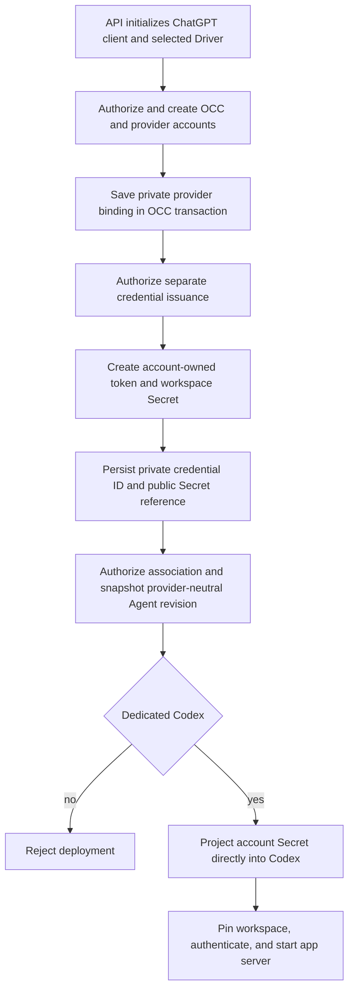

# Service Account Driver Credential Delivery Flow

## Overview

OCC creates a Namespace-owned account, separately issues its provider-backed
credential, and deploys an associated dedicated Codex Agent. The Driver owns
provider identities; Kubernetes Compute delivers the account Secret to Codex.

## Entry Points

- Trigger: `POST /namespaces/:namespaceId/service-accounts`, then
  `POST /namespaces/:namespaceId/service-accounts/:serviceAccountId/credentials`,
  Agent association, and deployment.
- Sources: `apps/controller/src/index.ts:perform` and
  `packages/occ/src/index.ts:OpenClawController`.
- Requires PostgreSQL, a ready Namespace, exact OCC permissions, the selected
  Drivers, and an API-only credential for an authorized ChatGPT workspace.

## Flow



## Execution Trace

### 1. Initialize the provider only in the API

`apps/controller/src/server.mjs:start`

`apps/controller/src/server.mjs` reads the mounted admin credential, creates
`ChatGPTClient`, and registers the concrete Driver after controller composition.
The worker receives neither the admin credential nor the client.

### 2. Create the account and private provider binding

`packages/occ/src/index.ts:OpenClawController.createServiceAccount`

`OpenClawController.createServiceAccount` authorizes the exact Namespace and
allocates its `sa_*` identity. `ChatGPTServiceAccountDriver.create` creates the
upstream account, registers rollback, and persists its private provider binding
in the same PostgreSQL transaction.

### 3. Issue the credential and create one account Secret

`apps/controller/src/drivers/service-account/chatgpt.ts:ChatGPTServiceAccountDriver.createCredential`

`OpenClawController.createServiceAccountCredential` authorizes account `update`
before `ChatGPTServiceAccountDriver.createCredential` issues a Codex-scoped
token. `KubernetesComputeDriver.storeServiceAccountCredential` stores it with
the workspace ID in one account-owned Secret. The private credential ID, public
`{ kind: "access_token", secretRef }`, and audit changes commit together;
confirmed failures compensate created provider and Kubernetes resources.

### 4. Associate the account and project its Secret

`apps/controller/src/drivers/compute/kubernetes/index.ts:KubernetesComputeDriver.prepareRevision`

`OpenClawController.deployAgent` authorizes account `read` and snapshots only
its OCC identity, credential kind, and Secret reference.
`KubernetesComputeDriver.prepareRevision` projects the account Secret directly
into dedicated Codex; embedded execution is rejected. The gateway receives no
model credential, and the worker receives no direct Secret API permission.

### 5. Authenticate Codex under the exact workspace

`apps/controller/src/drivers/compute/kubernetes/runtime-entrypoints.ts:AGENT_RUNTIME_ENTRYPOINT`

`AGENT_RUNTIME_ENTRYPOINT` authenticates with the projected token and workspace:

```sh
codex -c cli_auth_credentials_store=file \
  -c forced_chatgpt_workspace_id="<workspace-id>" login --with-access-token
```

It clears the token environment and starts its authenticated app server.
Refresh, rotation, and automated reconciliation remain deferred.

## Debugging and Verification

- Run `node --test tests/integration/service-account-driver-real.test.mjs`
  with `OCC_TEST_CHATGPT_SERVICE_ACCOUNT_REAL=1`, a protected admin-key file,
  `OCC_TEST_CHATGPT_WORKSPACE_ID`, disposable Kubernetes/PostgreSQL, and real
  digest-pinned OpenClaw/Codex images; do not use `OPENAI_API_KEY`.
- Verify the provider account, private credential ID, exact-account Secret,
  direct Codex-only projection, and genuine model response. For ownership,
  compensation, and ambiguous commits, see the [service-account guide](../reference/service-accounts.md)
  and [security model](../reference/security.md).

## Related docs

- [Service accounts](../reference/service-accounts.md)
- [Service Account Driver specification](../../specs/11-service-account-driver.md)
- [Platform design](../design.md)
- [Kubernetes Compute Driver](../reference/drivers/kubernetes-compute.md)
- [Native service account credential delivery](native-service-account-credential-delivery.md)
- [Harness execution topology](harness-execution-topology.md)

## Manual Notes

[keep this for the user to add notes. do not change between edits]

## Changelog

- 2026-08-28 17:58: Updated moved feature-reference links for the documentation organization. (01a036f4-cf1d-7cc1-bbc1-000879038ac8 - 4270aa29b7015562049f46c6027962fd85b584a9)
- 2026-08-24 23:35: Documented API-only provider integration, private transactional account and credential bindings, scoped Kubernetes Secret ownership, immutable account association, dedicated Codex token login, compensation boundaries, and genuine provider-backed verification. (01a03542-30ff-77a1-9967-587d55548ace - 51033bee121374332df2791e90e2290a5c892e5d)
- 2026-08-25 00:27: Consolidated the execution trace around the direct Driver-owned binding and shared API initialization while preserving security, rollback, and verification boundaries. (01a03542-30ff-77a1-9967-587d55548ace - 96a841f)
- 2026-08-25: Consolidated repeated implementation and security detail into the canonical service-account and security guides.
