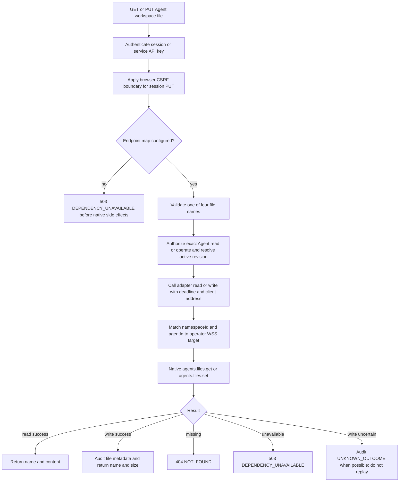

# Agent Workspace Files Flow

## Overview

OCC exposes a narrow HTTP shim for four mutable native Agent workspace files:
`AGENTS.md`, `SOUL.md`, `IDENTITY.md`, and `USER.md`. The flow starts at
`GET` or `PUT /namespaces/:namespaceId/agents/:agentId/workspace/files/:name`,
crosses through OCC authentication, exact Agent authorization, request
validation, the optional server-side `workspaceFilesAccess` adapter, and the
native gateway's `agents.files.get` or `agents.files.set` method.

This is not the removed generic gateway administration surface. OCC no longer
documents a public `POST /gateway/` native command route, Kubernetes
`pods/exec` helper, general CLI execution path, chat bridge, status/config
bridge, device enrollment path, or full native administration UI for this
change.

## Entry points

- Trigger: an authenticated caller reads or replaces one allowed file on one
  active Agent.
- Source: `apps/controller/src/server.mjs:start`,
  `apps/controller/src/composition/workspace-files.ts:loadWorkspaceFilesAccess`,
  `packages/contracts/src/api/routes.ts`, `packages/contracts/src/api/common.ts`,
  `apps/controller/src/index.ts`, and
  `apps/controller/src/gateway/workspace-files-client.ts`.
- Current deployment assumption: the API reads an optional operator-owned
  endpoint map from `OCC_WORKSPACE_FILES_CONFIG_PATH` and injects
  `workspaceFilesAccess` only when that map is configured.

## Flow

## Execution trace

### 1. API startup loads the endpoint map

`apps/controller/src/server.mjs:start`

`apps/controller/src/composition/workspace-files.ts:loadWorkspaceFilesAccess`

If `OCC_WORKSPACE_FILES_CONFIG_PATH` is set, the API validates that it is an
absolute path, reads the YAML once during startup, builds `workspaceFilesAccess`,
and passes that adapter into the controller app. Invalid YAML, unsupported
top-level keys, malformed endpoints, duplicate Enterprise Agent mappings,
non-WSS URLs, embedded URL credentials, URL query strings, URL fragments,
reserved identity headers, or invalid fingerprints fail startup before the API
serves requests. OCC does not reload this file after startup.

### 2. The API admits one file operation

`apps/controller/src/index.ts:createFastifyApp`

`GET` requires a valid Better Auth session or scoped service API key and exact
Agent `read`. `PUT` requires the same authentication, exact Agent `operate`, and
the browser CSRF boundary for session callers. Service API keys bypass cookie
CSRF but still authenticate a non-Agent principal and must pass IAM. Agent
ServicePrincipal credentials are rejected at authentication admission.

The route rejects unsupported file names before provider access. `PUT` accepts
only `{ "content": "..." }`, rejects extra fields, rejects NUL bytes and
unpaired UTF-16 surrogates, enforces a 16 KiB UTF-8 content limit, and uses a
48 KiB HTTP request-body limit.

### 3. The route matches the endpoint map

`apps/controller/src/composition/workspace-files.ts:createWorkspaceFilesAccess`

The route depends on the optional `workspaceFilesAccess` adapter. The supported
packaged wiring comes from `OCC_WORKSPACE_FILES_CONFIG_PATH`, an absolute YAML
file read by the API process during startup. Each endpoint maps one Enterprise
`namespaceId` and `agentId` to a native `wss://` URL, `nativeAgentId`, identity
value, identity header name, and optional SHA-256 TLS fingerprint. If no map is
configured, if no endpoint matches the exact Agent, if target resolution fails
before dispatch, or if the request deadline expires before provider dispatch,
OCC returns `503 DEPENDENCY_UNAVAILABLE` before native side effects.

### 4. The native client uses a trusted-proxy WSS target

`apps/controller/src/gateway/workspace-files-client.ts:createNativeWorkspaceFilesAccess`

The shared native client accepts only the operator-configured `wss://` URL,
native Agent ID, identity value, identity header name, and optional TLS
fingerprint for the exact Enterprise Namespace and Agent pair in the request.
It connects as a backend operator through the native trusted-proxy path. The
gateway hello may grant `operator.admin` for either operation; reads also accept
`operator.read`.

The operator owns the assertion that the configured URL and `nativeAgentId`
belong to the exact Enterprise Agent. OCC does not derive this relationship from
Compute state, does not bind it to an AgentRevision, and does not record a
native attestation. Current Agent runtime defaults still use plain in-cluster
`ws://` plus token-based gateway or Codex transport; they do not satisfy this
no-device-auth WSS path by themselves.

The private TLS proxy must authenticate OCC before forwarding the trusted
identity header and must derive `x-forwarded-for` from the actual OCC peer
connection. It must not trust user-supplied forwarded headers or accept direct
browser and workload callers. Native trusted-proxy configuration must grant the
service identity `operator.admin`; OCC still enforces user-facing Agent `read`
or `operate` before contacting the proxy. Native OpenClaw 2026.8.1-b9d rejects
`gateway.auth.mode: "trusted-proxy"` when `gateway.auth.token` is also present,
so trusted-proxy native Configuration must omit `gateway.auth.token`. Docker and
Kubernetes Compute omit automatic `OPENCLAW_GATEWAY_TOKEN` projection for that
explicit mode; token-mode gateways keep the existing automatic token behavior.
Native rejects all-loopback forwarded addresses, so local development needs a
real non-loopback OCC-to-proxy connection such as a separate proxy container.
OCC does not supply a fake IP, bypass TLS, require global ingress, or manage
certificate issuance and renewal.

### 5. Responses preserve the narrow file boundary

`apps/controller/src/index.ts:createFastifyApp`

Reads return `{ name, content }` and re-check the 16 KiB response content limit.
Writes return `{ name, size }` using the accepted request content size. OCC does
not store file bytes in PostgreSQL, does not expose native file revision or
compare-and-swap fields, and does not list or delete files through this shim.
Docker development runtimes store the native workspace under `/home/node` tmpfs,
so those files last only for the container runtime. The current persisted-file
proof is the Kubernetes gateway PVC path across gateway Pod replacement.

Write audit events record only resource, authorization, outcome, reason code
when present, and `workspaceFileName`. Audit details omit file contents. If a
write is sent and the provider outcome becomes unknown, OCC returns
`503 UNKNOWN_OUTCOME` and does not automatically replay the write.

## Debugging and verification

- A `503 DEPENDENCY_UNAVAILABLE` on both read and write is expected when the
  API starts without `OCC_WORKSPACE_FILES_CONFIG_PATH`, the Agent is unmapped,
  or the configured WSS endpoint is offline.
- A `400 INVALID_REQUEST` before provider access means the file name or JSON
  body does not match the four-file contract.
- A `403 FORBIDDEN` on a browser `PUT` can come from CSRF admission or missing
  exact Agent `operate`; a `GET` uses exact Agent `read`.
- Route conformance covers read/write authorization, validation, file-state
  mapping, metadata-only audit, request deadlines, client disconnects, and
  unknown write outcomes.
- Native WSS client coverage exercises the four-file gateway round trip under a
  TLS target. It does not prove Docker or Kubernetes workspace-file production
  deployment until the operator endpoint map, proxy, and runtime wiring are
  tested together.

## Related docs

- [Agents](../reference/agents.md#workspace-files)
- [Kubernetes Compute Driver](../reference/drivers/kubernetes-compute.md)
- [Settings reference](../reference/settings.md#required-production-controller-environment)
- [Production deployment](../guides/deploy.md#agent-workspace-files)
- [HTTP API](../reference/api.md)

## Manual Notes

[keep this for the user to add notes. do not change between edits]

## Changelog

- 2026-09-01 12:03: Documented the operator-configured endpoint map, API startup loading, Helm ConfigMap mount, and private WSS proxy boundary. (NOT_IN_SPEC)
- 2026-09-01 12:03: Added the trusted-proxy native Configuration precondition that omits gateway auth tokens and recorded Docker/Kubernetes automatic token projection omission for that explicit mode. (NOT_IN_SPEC)
- 2026-09-01 12:03: Clarified Docker tmpfs workspace lifetime and Kubernetes PVC workspace-file persistence proof boundaries. (NOT_IN_SPEC)
- 2026-09-01 13:24: Replaced the superseded generic gateway administration flow with the current four-file workspace route and recorded the missing WSS target provisioning gap. (NOT_IN_SPEC)
- 2026-09-01 08:38: Replaced the superseded native-device enrollment flow with the current fixed CLI execution path through Kubernetes exec. (cody/01a05d9c-4cb5-7602-8df5-56d7f8309f44 - 7b4a819f02d6950e8cc2a2e08eb29c2f668493ad)
- 2026-08-31 16:49: Documented canonical private-key storage with derived native identity; the independent PVC identity pin remains unchanged. (cody/01a04ae1-7ba7-7372-88a4-488e01f690ae - f2e164c)
- 2026-08-31 12:52: Corrected the native SDK pin and documented manual pairing pause, single helper barrier, and one reconnect under the enrollment deadline. (cody/01a04ae1-7ba7-7372-88a4-488e01f690ae - 61542d0)
- 2026-08-31 12:41: Documented bundled Kubernetes native gateway enrollment, controller-owned token readiness, Agent-scoped dispatch, and unknown-outcome handling. (cody/01a04ae1-7ba7-7372-88a4-488e01f690ae - 61542d0)
