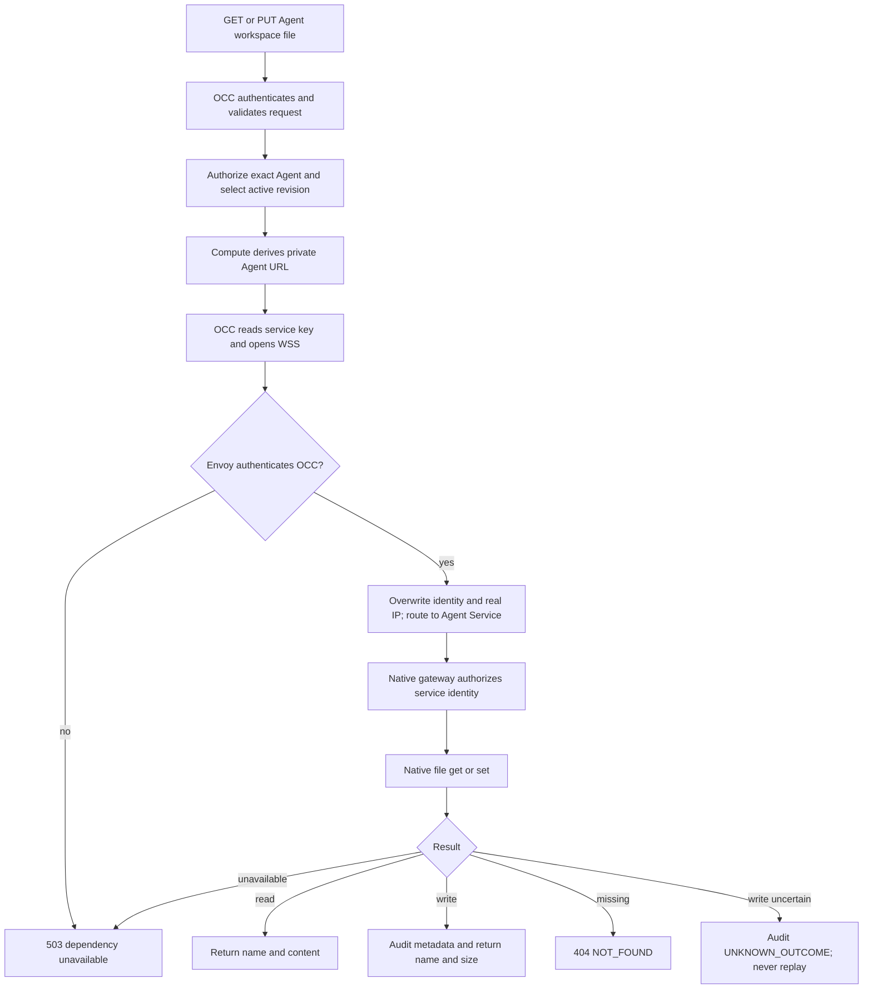

# Agent Workspace Files Flow

## Overview

An authenticated caller reads or replaces `AGENTS.md`, `SOUL.md`, `IDENTITY.md`,
or `USER.md` on an active Agent. OCC authorizes the exact Agent, derives its
private endpoint through Compute, and sends one native file RPC through Envoy
Gateway. The flow ends with a bounded response and, for writes, metadata-only
audit evidence. File contents remain in the native workspace.

## Entry Points

- `apps/controller/src/index.ts:createFastifyApp` handles `GET` and
  `PUT /namespaces/:namespaceId/agents/:agentId/workspace/files/:name`.
- `apps/controller/src/composition/workspace-files.ts:createWorkspaceFilesAccess`
  binds the Installation-selected Compute Driver and mounted service-key file.
- `apps/controller/src/gateway/workspace-files-client.ts:createNativeWorkspaceFilesAccess`
  connects using the published native gateway client.

The Kubernetes worker must have provisioned the Agent's private HTTPRoute and
native gateway. Installation operators enable the shared Envoy Gateway,
native trust, and network restrictions described in
[deployment](../guides/deploy/workspace-routing.md#agent-workspace-files). The
[routing reference](../reference/gateway-routing.md) owns the current transport
and credential contract.
By default, the chart requests a private CA and listener certificate from
cert-manager and uses a derived Service DNS hostname. Operators can provide
an existing issuer and explicit hostname instead.

## Flow

## Execution Trace

### 1. Composition configures private access

`apps/controller/src/server.mjs:start` validates the optional absolute
`OCC_GATEWAY_API_KEY_PATH` before opening the database. Production and
PostgreSQL development composition bind the selected Compute Driver to
`createWorkspaceFilesAccess`. The worker uses the same mounted service key
for native node enrollment. Node loads any `NODE_EXTRA_CA_CERTS` trust
bundle at startup.

For the chart's automatic CA, API and worker Pods wait for cert-manager's generated
root Secret and receive only its public certificate. They do not receive the
CA signing key. An explicit external issuer uses the configured public CA
bundle, or Node's existing trust store when no bundle is configured.

There is no per-Agent map. Kubernetes endpoint derivation uses the admitted
Namespace and Agent IDs plus trusted Installation routing settings. A Driver
without the optional endpoint capability cannot serve this file feature.

### 2. OCC admits one exact-Agent file operation

`apps/controller/src/index.ts:createFastifyApp` requires a valid user
session or scoped service API key. Native Agent credentials cannot invoke this
administration surface. `GET` needs Agent `read`; `PUT` needs Agent `operate`
and, for session callers, passes the browser CSRF boundary. OCC resolves the
active AgentRevision before invoking Compute endpoint resolution.

Only the four names are accepted. `PUT` accepts only `{ "content": "..." }`,
rejects NUL and unpaired UTF-16 surrogates, enforces 16 KiB of UTF-8 content,
and uses a 48 KiB request-body limit. The deadline and disconnect signal cover
admission and native access.

### 3. Compute resolves a route and OCC loads the current key

`apps/controller/src/composition/workspace-files.ts:createWorkspaceFilesAccess`
uses `ComputeDriver.getGatewayEndpoint(revision)`. Kubernetes returns
`wss://<hostname>/namespaces/<namespaceId>/agents/<agentId>` without reading
Kubernetes resources. The optional hostname defaults to the same Service DNS
name used by Helm, derived from the shared Gateway's name and namespaces.
Preparation and activation create or repair the route;
resolution itself does not prove that the gateway is serving.

`apps/controller/src/drivers/compute/kubernetes/index.ts:reconcileGatewayRoute`
also provisions a distinct `/node` HTTPRoute and route SecurityPolicy for
runtime-enabled dedicated revisions. They share the same TLS listener and
Agent Service. The node route strips administrative identity headers and
relies on native device authentication; it never uses OCC's service key.
The node route keeps the deployed Gateway's revision during candidate preparation;
activation transfers ownership after replacing the Gateway Deployment.
Preparation also repairs a missing node route under the serving revision, so
first enrollment does not wait for the candidate's activation.
`removeStoppedGateway` and `removeRetiredGateway` remove the exact revision's
node endpoint before its policy, with ownership and UID checks. The
[node endpoint contract](../reference/gateway-routing.md#native-node-endpoint)
separates this route provisioning from Harness enrollment and launch.

The enrollment integration is in progress; it is not a deployable storage split.
The local Compute path in
`apps/controller/src/drivers/compute/kubernetes/index.ts:prepareWorkspaceNode`
uses native setup RPCs through
`apps/controller/src/gateway/node-enrollment-client.ts:createGatewayNodeEnrollment`:

- A revision-owned Secret holds the setup code and then the confirmed device ID.
  Subsequent observations use that ID rather than expiring setup-status records.
  Readiness requires a connected node with admitted `file.fetch`, `file.stat`,
  `file.write`, `file.create`, and `dir.list` commands; a node missing attachment
  upload support is not ready.
- The Harness PVC stores node identity in a revision-specific subdirectory,
  mounted at `/home/node/.openclaw-node`, outside the project workspace. Pod
  replacement reuses that directory; another revision mounts a different one.
  Retirement deletes the enrollment Secret. Saved identity files remain until
  the Agent's Harness PVC is deleted; there is no separate node PVC lifecycle.
- `AGENT_WITH_NODE_ENTRYPOINT` first runs native `setup --baseline` in the
  Harness workspace. Missing default documents are created without replacing
  existing edits; initialization failure stops startup. Compute passes only the
  admitted `skipBootstrap` and `skipOptionalBootstrapFiles` options to this
  setup, not the Gateway config or credentials. It then supervises the
  existing Codex entrypoint and native node separately. Only the file node receives its setup code; neither child
  receives OCC's administrative key. Compute starts the supervisor under `tini`
  to reap descendants left by failed wrappers; the Sandbox command carries the
  same invocation.
- Activation reads the exact revision's saved device ID. `GATEWAY_RUNTIME_ENTRYPOINT`
  adds the native `file-transfer.config.workspaces.main` binding to its runtime
  config; the immutable revision ConfigMap stays unchanged. Candidate preparation
  leaves the serving revision's binding intact. Losing an established binding
  fails rather than restoring local file reads.
- Default node grants allow reading the four owner documents, `BOOTSTRAP.md`, and
  `MEMORY.md`, and writing the four owner documents. Enabled `bootstrap-extra-files`
  declarations add exact read grants for literal, supported document paths inside
  the workspace, including bracketed names. They do not add write grants or
  override an explicit node policy. Glob traversal and contained symlinks remain
  unsupported by these defaults. The native attachment
  preparer can read `media/inbound/openclaw-staged-*` to check the input directory
  and read/write `media/inbound/openclaw-staged-*/**` for its files. `file.create`
  carries these inputs over the existing node connection without replacing
  Harness edits. Reply attachments under `media/outbound/**` have a read-only
  grant; this adds no permission to edit outputs or fetch arbitrary project files.
  The upstream workspace reader retains unary fetches up to 16 MiB and retries
  larger files over binary `file.fetch`, bounded by caller and node policy.
  This requires an updated node. The runtime also defaults Codex's existing
  `appServer.remoteWorkspaceRoot` to the Harness workspace, preserving explicit
  configuration. That selects native reply-artifact staging before client cleanup,
  without granting the file node access to every project file. Real Codex delivery
  through this configuration remains unverified.
  Explicit node policies are preserved; the owner API retains
  its four-file allowlist. This requires the upstream attachment implementation;
  native runtime and Envoy transfer verification remain pending.
  The node also advertises `dir.list` for workspace discovery. Directory and file
  operations still require native path grants; enabling the command alone does
  not grant directory access or permit fetching its contents.

The chart supplies worker credentials and public trust; Compute installs
Harness-to-Envoy egress before enrollment. The node also declares `workspace.memory`.
The File Transfer adapter connects the shared Memory client to the existing native
file worker over node duplex; default grants cover Memory files and maintenance
outputs, while owner document editing retains its four-file allowlist. The index
and embedding configuration remain on Gateway. Local native-worker read, write
and watch checks pass; deployment verification remains pending.

`workspace.skills` supplies workspace discovery, source reads and dependency
installation. Gateway-provided Skills remain local; the
[ownership table](../../specs/30-storage-split-integration.md#where-data-lives)
distinguishes these from Harness-owned files. Gateway checks policy before
requesting dependency installation on Harness. Each launcher runs
`runtime-entrypoints.ts:initializeRuntimeAssets` from its own image; this replaces
shared asset mounts, not local Gateway discovery. Remote-derived channel menus
are deferred to [#241](https://github.com/openclaw/openclaw-enterprise/issues/241).
Local discovery, reads, npm installation and Harness image initialization pass;
deployed integration remains unverified.
`kubernetes/index.ts:deployment` mounts the workspace and generated-image PVC
only on Harness. Dedicated Gateway sessions move to its private state PVC;
Harness no longer receives them. The existing Codex remote-media reader transfers
generated-image bytes into Gateway media storage, so Gateway has no image-directory
mount. Embedded mode keeps its existing storage layout.

The Harness PVC still requests RWX because `worker.ts:observeRevision` prepares a
new Harness revision before retiring the old one. This preserves the existing
rollout behavior; the workspace interface itself does not require RWX. Removing
that remaining backend requirement would require a separate revision/storage
choice. The cutover has manifest checks, not deployed Enterprise proof.
The custom-bootstrap limitations above remain explicit.

The API reads the mounted key for each operation, so new connections pick up
Secret rotation without an API restart. Missing routing, missing or invalid
key material, expired deadlines, and unavailable targets fail closed. No URL
or credential comes from caller JSON or headers.

### 4. Envoy authenticates and routes the native connection

`apps/controller/src/gateway/workspace-files-client.ts:requestNativeWorkspaceFile` opens WSS with only the
service key in `x-api-key`. The client verifies the server hostname and CA;
there is no leaf pin, device enrollment, native token, or client-certificate
option. It connects as a backend operator with `deviceIdentity: null` and no
self-asserted scopes.

The Gateway-level Envoy SecurityPolicy verifies and strips the key. The exact
Agent HTTPRoute overwrites `x-occ-identity`, removes forwarded and native-scope
headers, and sets `X-Real-IP` to Envoy's direct downstream socket address. It
rewrites the upgrade path to `/` and selects the existing same-namespace Agent
gateway Service. Namespace attachment labels, route ownership checks, and
restricted Kubernetes RBAC protect this mapping.

Native trusted-proxy configuration recognizes the Envoy socket source and the
fixed identity. `allowRealIpFallback` accepts its genuine nonloopback OCC
connection address even within a shared Pod CIDR. NetworkPolicy admits only
Envoy to the native gateway; the CIDR is not an independent authentication
boundary. Native Configuration omits a gateway token in this mode. The native
hello must grant `operator.admin` for writes; reads also accept `operator.read`.

### 5. Native file access returns a bounded result

`apps/controller/src/gateway/workspace-files-client.ts:requestNativeWorkspaceFile`

The client invokes only `agents.files.get` or `agents.files.set` for the native
primary Agent `main`. Reads re-check the response content limit and return
`{ name, content }`; writes return `{ name, size }`. There is no list, delete,
compare-and-swap, generic RPC, chat bridge, or PostgreSQL file copy.

The Harness PVC retains the dedicated workspace across Pod replacement.
Certificate renewal under the same trusted CA affects new WSS connections
without restarting OCC. Root-CA replacement follows the
[trust rotation requirements](../reference/gateway-routing.md#tls-and-certificate-lifecycle).

Writes audit only the Agent resource, authorization action, outcome, reason
when present, and file name. If a dispatched write has an unknown outcome,
OCC returns `503 UNKNOWN_OUTCOME`, attempts the corresponding audit, and never
replays it. The native client closes in the operation's cleanup path.

## Debugging and Verification

- For `503 DEPENDENCY_UNAVAILABLE`, check the Compute routing settings and key
  mount, then the Gateway, Certificate, SecurityPolicy, and HTTPRoute status.
  Check DNS/CA trust and exact NetworkPolicy peers before changing native auth.
- `400 INVALID_REQUEST` indicates a file-name or content-contract violation.
- `403 FORBIDDEN` can indicate missing exact-Agent IAM or session PUT CSRF
  rejection. Granting a native service scope does not change human IAM.
- An authenticated native upgrade failure can indicate missing trusted-proxy
  configuration, a simultaneous token, a loopback real IP, or absent native
  identity scopes. Do not fix it by inventing a forwarded address.
- [Testing](../testing/README.md) separates API conformance, Helm rendering, and the
  real Envoy/cert-manager/native-runtime proof. A calculated URL, ready proxy,
  or rendered chart does not establish file writes or model consumption.

## Related docs

- [Agents](../reference/agents.md#workspace-files)
- [Kubernetes Compute Driver](../reference/drivers/kubernetes-compute.md)
- [Settings reference](../reference/settings/production.md#required-production-controller-environment)
- [Production deployment](../guides/deploy/workspace-routing.md#agent-workspace-files)
- [HTTP API](../reference/api.md)

## Manual Notes

[keep this for the user to add notes. do not change between edits]

## Changelog

- 2026-09-18 14:15: Clarified Skill source ownership and deferred remote channel menus; corrected dedicated workspace persistence. (01a082d6-50c7-7953-808f-7e609f6fc7cb - 56e4fa74eacb0c411f51353f4f726444fc572336)

- 2026-09-18 13:22: Reused Harness storage for revision-specific node identity; removed the separate node PVC lifecycle. (01a082d6-50c7-7953-808f-7e609f6fc7cb - e257c4d96934895de7d3e06980dddce05ae19725)

- 2026-09-18 00:02: Confirmed that Compute returns the standard private Service endpoint; local routing proof now runs OCC inside Kubernetes instead of adding a host-only port seam. (authoring-run/245cc03e-4bd3-48b3-ba17-8d5e2768262d - 782017d5405e156116bd31e78fa744ef20c540cc)
- 2026-09-17 20:24: Removed dedicated Gateway workspace/image mounts and made sessions Gateway-private; Harness revision storage remains RWX. (authoring-run/81318408-6a1f-4628-b3f2-04ab723554c8 - 14ad14c04deeeaa79f325b14d492ab13730adc7f)

- 2026-09-17 20:10: Initialized bundled/plugin Skills from each host image and removed their shared mounts; native Harness initialization and owner-edit preservation passed. (authoring-run/81318408-6a1f-4628-b3f2-04ab723554c8 - 14ad14c04deeeaa79f325b14d492ab13730adc7f)

- 2026-09-17 20:00: Added Skills node command, path grants and Harness dependency PATH; discovery and reads verified locally, installation and storage cutover remain incomplete. (authoring-run/81318408-6a1f-4628-b3f2-04ab723554c8 - 14ad14c04deeeaa79f325b14d492ab13730adc7f)

- 2026-09-17 19:43: Added Memory node command and path grants; native-worker proof passed locally, deployment verification remains pending. (authoring-run/81318408-6a1f-4628-b3f2-04ab723554c8 - 14ad14c04deeeaa79f325b14d492ab13730adc7f)

- 2026-09-17 19:09: Limited completion gates to normal storage workflows; kept unsupported custom bootstrap behavior explicit. (authoring-run/aaa352ba-dcbd-49b1-b031-0580d511f561 - 14ad14c04deeeaa79f325b14d492ab13730adc7f)

- 2026-09-17 13:18: Connected the existing Codex remote reply-artifact path in the runtime configuration; live delivery verification remains pending. (authoring-run/d81f8dbd-ab58-4115-bad4-7d4d50382e04 - 14ad14c04deeeaa79f325b14d492ab13730adc7f)

- 2026-09-17 13:13: Reused exact command-bound grants for declared extra bootstrap files without expanding owner writes; glob and symlink support remain pending. (authoring-run/2a92b4f3-ac86-4352-a64a-3a0126288787 - 14ad14c04deeeaa79f325b14d492ab13730adc7f)

- 2026-09-17 13:08: Required attachment upload support for node readiness and connected the routed test to the production enrollment client; real routed verification remains pending. (authoring-run/545cf8dc-f67c-4e84-aa23-e80359fea1d3 - 14ad14c04deeeaa79f325b14d492ab13730adc7f)

- 2026-09-17 06:09: Updated the upstream binary output-read dependency; retained final-artifact and Enterprise runtime verification gaps. (authoring-run/7783310f-9f59-4cd0-9109-ca74877c066f - 14ad14c04deeeaa79f325b14d492ab13730adc7f)

- 2026-09-17 05:35: Added the output-folder read grant for pending native attachment delivery; retained transfer-size and staging verification gaps. (authoring-run/999ece5a-22b2-40a7-80fa-7d0d1f35bda2 - 14ad14c04deeeaa79f325b14d492ab13730adc7f)

- 2026-09-17 05:13: Added the staging-directory read grant required by attachment preparation; native process verification exposed the missing grant. (authoring-run/e4b0b1f2-63ce-4291-8214-aa218ba984aa - 14ad14c04deeeaa79f325b14d492ab13730adc7f)

- 2026-09-17 05:01: Connected the native attachment command and restricted input-directory grants in the pending runtime integration. (authoring-run/87bd4d73-3f20-4949-8db1-54a3691ca4fe - 14ad14c04deeeaa79f325b14d492ab13730adc7f)

- 2026-09-17 03:44: Enabled the native directory-list command without broadening file path grants; custom bootstrap grant selection remains pending. (authoring-run/e253e9b6-4a46-4c3c-84e6-f2f8ab34cc91 - 14ad14c04deeeaa79f325b14d492ab13730adc7f)

- 2026-09-17 03:35: Added native Harness workspace initialization before node and Codex startup; runtime image verification remains required. (authoring-run/b75fab11-a672-432b-a966-61bb491af2b4 - 14ad14c04deeeaa79f325b14d492ab13730adc7f)

- 2026-09-17 03:24: Traced revision-owned node binding into native runtime configuration and its lost-binding failure; retained initialization and workflow parity gaps. (authoring-run/7804ba57-dbe8-4a75-8a04-b02ff9f03b38 - 14ad14c04deeeaa79f325b14d492ab13730adc7f)

- 2026-09-17 03:13: Added worker credentials, restricted node egress, and init-based descendant reaping; corrected CA rotation scope. Native workspace binding remains pending. (authoring-run/be0c5601-ea50-414b-a5f7-fdbc2aa6ef0d - 14ad14c04deeeaa79f325b14d492ab13730adc7f)

- 2026-09-17 02:54: Added the pending Compute enrollment trace and serving-revision route repair; distinguished process tests from native container proof. (authoring-run/9238ab38-287b-43d6-818f-132a2aeab7df - 14ad14c04deeeaa79f325b14d492ab13730adc7f)

- 2026-09-17 01:36: Added dedicated native node route provisioning and exact-owned cleanup through Compute; real Envoy node authentication remains pending verification. (authoring-run/e63c5d56-929f-40cb-9b31-e80f856690ca - 14ad14c04deeeaa79f325b14d492ab13730adc7f)

- 2026-09-01 17:26: Replaced per-Agent endpoint maps with Compute-owned private Envoy routes, API-key authentication, and cert-manager certificate renewal. (01a04ae1-7ba7-7372-88a4-488e01f690ae - 3e26931d31ba03a7fa187c12009867c636a86041)

- 2026-09-01 12:03: Documented the operator-configured endpoint map, API startup loading, Helm ConfigMap mount, and private WSS proxy boundary. (NOT_IN_SPEC)
- 2026-09-01 12:03: Added the trusted-proxy native Configuration precondition that omits gateway auth tokens and recorded Docker/Kubernetes automatic token projection omission for that explicit mode. (NOT_IN_SPEC)
- 2026-09-01 12:03: Clarified Docker tmpfs workspace lifetime and Kubernetes PVC workspace-file persistence proof boundaries. (NOT_IN_SPEC)
- 2026-09-01 13:24: Replaced the superseded generic gateway administration flow with the current four-file workspace route and recorded the missing WSS target provisioning gap. (NOT_IN_SPEC)
- 2026-09-01 08:38: Replaced the superseded native-device enrollment flow with the current fixed CLI execution path through Kubernetes exec. (cody/01a05d9c-4cb5-7602-8df5-56d7f8309f44 - 7b4a819f02d6950e8cc2a2e08eb29c2f668493ad)
- 2026-08-31 16:49: Documented canonical private-key storage with derived native identity; the independent PVC identity pin remains unchanged. (cody/01a04ae1-7ba7-7372-88a4-488e01f690ae - f2e164c)
- 2026-08-31 12:52: Corrected the native SDK pin and documented manual pairing pause, single helper barrier, and one reconnect under the enrollment deadline. (cody/01a04ae1-7ba7-7372-88a4-488e01f690ae - 61542d0)
- 2026-08-31 12:41: Documented bundled Kubernetes native gateway enrollment, controller-owned token readiness, Agent-scoped dispatch, and unknown-outcome handling. (cody/01a04ae1-7ba7-7372-88a4-488e01f690ae - 61542d0)
