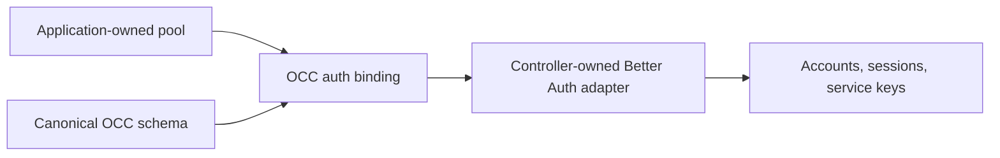

# PostgreSQL authentication binding

The controller connects Better Auth to OCC's canonical PostgreSQL schema through
`createPostgresAuthBinding` from `@openclaw-enterprise/occ`. This public API replaces
controller lookups into OCC's source tree and private dependency installation.

## Composition

Supply the application's node-postgres `Pool`. OCC returns a Drizzle database
bound to that pool and the complete canonical schema. The controller passes both
to its Better Auth adapter:

```ts
import { createPostgresAuthBinding } from "@openclaw-enterprise/occ";
import { drizzleAdapter } from "better-auth/adapters/drizzle";

const binding = await createPostgresAuthBinding(pool);
const database = drizzleAdapter(binding.database, {
  provider: "pg",
  schema: binding.schema,
  camelCase: true,
  transaction: true,
});
```



Structural pool wrappers and checked-out clients are rejected: Drizzle must
recognize the pool to use one dedicated connection per transaction. Construction
performs no database I/O and creates no pool. The application owns migrations
and pool shutdown. Construction failures reject without a memory fallback.

Sharing a pool does not join Better Auth transactions to OCC transactions.
Account provisioning retains its separate IAM transaction and cleanup on failure.
See [authentication](authentication.md) for account, session, API key, and
authorization behavior.

## Type contracts

`@openclaw-enterprise/occ` exports the binding, factory, adapter-option, and
complete-schema types. The schema type
retains each canonical table's inferred columns and query results.

For test setup, focused checks, and database failure diagnosis, see
[PostgreSQL tests](../testing/postgresql.md#authentication-binding).
