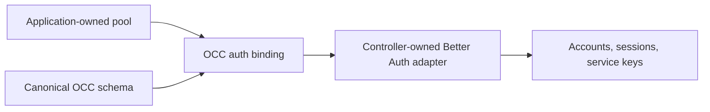

# PostgreSQL authentication binding

The controller connects Better Auth to OCC's canonical PostgreSQL schema through
`createPostgresAuthBinding` from `@openclaw-enterprise/occ`. This public API replaces
controller lookups into OCC's source tree and private dependency installation.

## Composition

The application supplies its existing node-postgres `Pool` instance. Structural
pool wrappers and checked-out clients are rejected: Drizzle must recognize the
pool so each transaction uses one dedicated connection. OCC constructs a Drizzle
database with that exact pool and the complete canonical schema, then returns
both values. The controller owns the Better Auth adapter and supplies the
returned database and schema together:

```ts
import { createPostgresAuthBinding } from "@openclaw-enterprise/occ";
import { drizzleAdapter } from "better-auth/adapters/drizzle";

const binding = await createPostgresAuthBinding(pool);
const database = drizzleAdapter(binding.database, {
  provider: "pg",
  schema: binding.schema,
  camelCase: true,
  transaction: true,
});
```



Construction does not acquire a connection, run migrations, or create another
pool. The application retains responsibility for closing the supplied pool.
Import or construction failures reject the promise; PostgreSQL setup does not
fall back to memory authentication.

Sharing a pool does not join Better Auth transactions to OCC transactions.
Existing account provisioning retains its separate IAM transaction and account
cleanup on failure. This binding adds no account features, changes no tables,
and does not alter session, API key, or authorization rules. See
[authentication](authentication.md) for those supported behaviors.

## Type contracts

`@openclaw-enterprise/occ` exports the binding, factory, adapter-option, and
complete-schema types. The schema type
retains each canonical table's inferred columns and query results.

For test setup, focused checks, and database failure diagnosis, see
[PostgreSQL tests](../testing/postgresql.md#authentication-binding).
