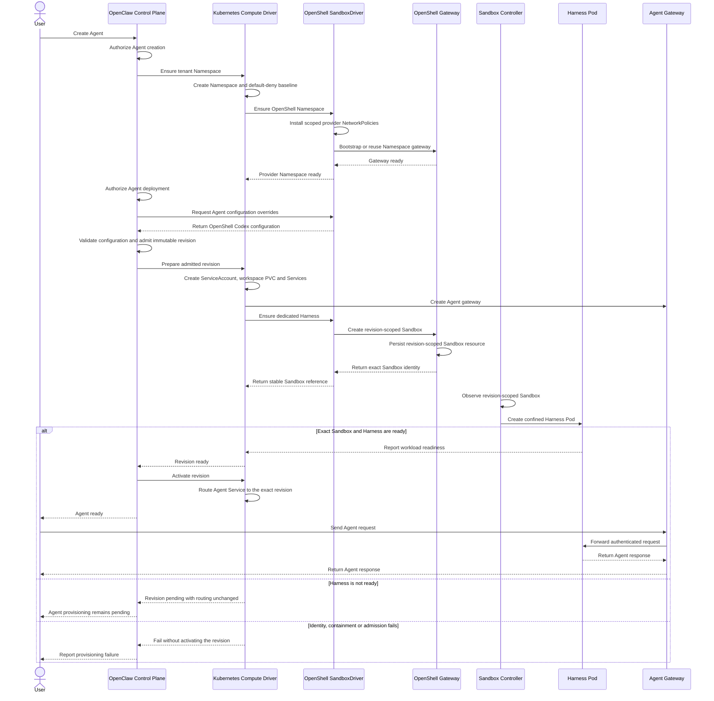

# Proposal: SandboxDriver Provisioning and Lifecycle

## Summary

Introduce the SandboxDriver primitive which enables constraining agent actions across different facets such as networking, filesystem, and process execution.

This spec goes over how these drivers should be provisioned and provides a grounding implementation for OpenShell deployed using the KubernetesComputeDriver.

## Concepts

- **Installation:** Deploys the OpenClaw control plane and selects one
  SandboxDriver.
- **Namespace:** Isolates one tenant's Agents, workloads, policies, and
  credentials inside a Kubernetes namespace.
- **Agent:** Runs inside a Namespace and owns a gateway, ServiceAccount,
  workspace, and revisions.
- **AgentRevision:** Captures an immutable snapshot of an Agent's configuration
  and workload requirements.
- **Agent gateway:** Receives Agent requests and forwards them to the Harness.
- **OpenShell gateway:** Coordinates OpenShell Sandboxes for one Namespace.
- **Harness:** Runs the Agent's Codex process and accesses approved workspace
  directories.
- **ComputeDriver:** Provisions infrastructure, manages Agent gateways, routes
  traffic, and manages the revision lifecycle.
- **SandboxDriver:** Constrains the Harness across one or more networking,
  filesystem, or process facets.
- **Sandbox:** Identifies a dedicated Harness for one AgentRevision. Its
  controller manages the Harness Pod, and its identity survives Pod replacement.

In **embedded mode**, the Harness runs in the Agent gateway workload. In
**dedicated mode**, the Harness runs separately and the gateway connects to it
over an authenticated transport. This spec covers dedicated OpenShell
Harnesses. Embedded OpenShell support is deferred.

## Non-Goals

- Defining SandboxPolicy, standard configuration, presets, or per-Agent driver
  selection.
- An `exec` facet, per-tool sandboxes, or command-specific exec controls.

## Ownership and authority

- **OpenClaw Control Plane (OCC):** Owns authorization, revision admission,
  driver selection, and activation.
- **ComputeDriver:** Owns Namespaces, Agent gateways, ServiceAccounts,
  per-Agent persistent volume claims (PVCs), NetworkPolicies, Services, routing,
  and revision lifecycle.
- **OpenShell:** Owns its Namespace-local gateway and revision-scoped Sandbox.
- **Sandbox controller:** Owns the Harness Pod.

The SandboxDriver uses Compute's authenticated Kubernetes client and
Namespace-scoped role-based access control (RBAC). It cannot escalate
privileges or access a different Namespace.

Compute creates one ServiceAccount per Agent. OpenShell must bind its Sandbox
to that account and preserve the Harness's projected token, including its exact
audience, bounded expiration, token path, and read-only mount. Its separate
gateway bootstrap token must authenticate against the expected ServiceAccount,
Pod UID, and Sandbox identity; it cannot replace the Harness token. These
identity guarantees require upstream support and are not implemented today.

## Containment facets

Each facet constrains one part of Harness execution. A SandboxDriver must
implement and declare at least one facet; each individual facet is optional.

### Networking

Networking controls where the Harness can send and receive traffic. Compute
starts with a default-deny NetworkPolicy. OpenShell adds narrowly scoped
policies for its gateway, control plane, and required callbacks.

These policies must be enforced before the provider gateway is considered
ready. Because Kubernetes NetworkPolicies are additive, operators must prevent
other policies from widening the allowed traffic.

### Filesystem

Filesystem controls which paths the Harness can read or write. The Harness can
access its image filesystem and approved subpaths on its Agent's PVC. Sessions
and skills are read-only; workspace and generated-image paths are writable.

The provider must prevent access to the PVC root, host filesystem, and other
Agents' volumes. Required filesystem enforcement must fail closed when the
underlying kernel or runtime cannot provide it.

### Process

Process controls the identity and privileges of Harness processes. The Codex
process and its descendants run inside the dedicated Harness workload as a
nonroot user, drop all Linux capabilities, and cannot escalate privileges or
access host process resources.

Trusted OpenShell components may need additional privileges for enforcement;
those privileges do not transfer to the Harness.

## SandboxDriver contract

```ts
type SandboxFacet = "networking" | "filesystem" | "process";

interface SandboxDriver extends Driver {
  readonly capability: "sandbox";
  readonly facets: readonly SandboxFacet[];
  configureAgent?(
    configuration: Readonly<OpenClawConfigurationDocument>,
  ): OpenClawConfigurationDocument;
  ensureNamespace?(context: SandboxNamespaceContext): Promise<void>;
  provisionHarness?(context: SandboxHarnessContext): Promise<SandboxResourceRef>;
  cleanup(context: SandboxNamespaceContext & { revision?: Readonly<AgentRevision> }): Promise<void>;
}

interface SandboxNamespaceContext {
  readonly namespace: Readonly<Namespace>;
  // Compute's authenticated native KubernetesObjectApi client.
  readonly kubernetes: unknown;
  // Needed to propagate cancellation through Kubernetes and provider operations.
  readonly signal: AbortSignal;
}

interface SandboxHarnessContext extends SandboxNamespaceContext {
  readonly revision: Readonly<AgentRevision>;
  readonly requirements: HarnessWorkloadRequirements;
}

interface HarnessWorkloadRequirements {
  readonly image: string;
  readonly command: readonly string[];
  readonly serviceAccountName: string;
  readonly serviceAccountToken: {
    readonly audience: string;
    readonly expirationSeconds: number;
    readonly mountPath: string;
    readonly path: string;
    readonly readOnly: true;
  };
  readonly workspaceMounts: readonly SandboxWorkspaceMount[];
  readonly environment: readonly SandboxEnvironmentVariable[];
  readonly labels: Readonly<Record<string, string>>;
}

interface SandboxWorkspaceMount {
  readonly claimName: string;
  readonly subPath: string;
  readonly mountPath: string;
  readonly readOnly: boolean;
}

type SandboxEnvironmentVariable =
  | { readonly name: string; readonly value: string }
  | {
      readonly name: string;
      readonly valueFrom: {
        readonly secretKeyRef: { readonly name: string; readonly key: string };
      };
    };

type SandboxHarnessResult =
  // Compute creates and owns the Harness workload; the provider adds containment.
  | { readonly ownership: "compute" }
  // The provider owns the Harness workload and returns its stable Sandbox identity.
  | { readonly ownership: "provider"; readonly sandbox: SandboxResourceRef };

interface SandboxResourceRef {
  readonly namespaceName: string;
  readonly resourceName: string;
  readonly agentId: string;
  readonly revisionId: string;
}
```

OCC calls `configureAgent` before admitting the immutable AgentRevision. The
driver can contribute provider-specific gateway configuration, while OCC
validates and owns the final admitted configuration.

`ensureNamespace` is optional for providers that need no Namespace-local
infrastructure. When `provisionHarness` is absent, Compute creates and owns the
ordinary Harness Deployment. When present, the provider creates the Harness
workload and immediately returns its stable, exact Sandbox reference; the
controller may create or replace its Pod asynchronously. Providers make
provisioning idempotent; Compute observes only the revision-labeled Pod for
readiness. Cleanup receives the immutable revision, allowing the provider to
derive and delete its stable Sandbox even when no Pod remains. Compute does not
inspect provider-specific Sandbox resources or require Sandbox API permissions.

The Sandbox controller may create or replace the Harness Pod asynchronously.
Compute checks readiness and cleans up provider resources using the stable
Sandbox identity, not the temporary Pod identity.

The admitted revision records only `sandboxDriverId`; supported facets are
validated during admission without duplicating them in revision metadata.
Environment entries allow nonsecret literals and exact Agent-scoped
`secretKeyRef` values, including `APP_SERVER_TOKEN`. Raw secrets never enter
revision metadata, logs, or provider configuration. Provider-owned Harnesses
must preserve Compute's projected ServiceAccount token without substituting a
gateway token or weakening its audience or expiration.

## Compute lifecycle

```ts
interface ComputeDriver extends Driver {
  ensureNamespace(namespace: Namespace): Promise<NamespaceEnsureResult>;
  prepareRevision(revision: AgentRevision): Promise<ComputeReadiness>;
  activateRevision?(revision: AgentRevision): Promise<void>;
  deactivateRevision?(revision: AgentRevision): Promise<void>;
  retireRevision(revision: AgentRevision): Promise<void>;
  deleteNamespace(namespace: Namespace): Promise<NamespaceDeleteResult>;
}
```

1. `ensureNamespace` creates the Kubernetes namespace and applies the
   default-deny NetworkPolicy.
2. `SandboxDriver.ensureNamespace` provisions one OpenShell gateway per
   Namespace, applies provider NetworkPolicies, and checks gateway readiness.
   Retries and concurrent workers converge on the same gateway.
3. OCC calls `SandboxDriver.configureAgent`, validates the returned
   configuration, and admits the immutable AgentRevision.
4. `prepareRevision` creates the Agent gateway, ServiceAccount, per-Agent PVC,
   Services, and workload requirements. Optional `SandboxDriver.provisionHarness`
   creates a provider-owned Sandbox and returns its stable reference; otherwise,
   Compute creates the Harness workload.
5. The Sandbox controller creates the Harness Pod. Once the Pod is ready,
   Compute routes the Agent Service to that revision.
6. `deactivateRevision` removes routing only if the Agent Service still points
   to that revision. Retiring the revision deletes its Sandbox without
   interrupting an active replacement. Namespace cleanup waits for all Agent
   Sandboxes to drain.

Missing prerequisites, invalid identities, unsupported facets, rejected
admission, and unavailable workloads must not activate an Agent.

## Agent provisioning sequence

The following sequence shows the intended provisioning flow for a dedicated
OpenShell Harness:



## Workspace and admission

The Agent gateway and Harness share one per-Agent PVC. The Harness receives the
following baseline mounts, each with an explicit `claimName`, nonempty
`subPath`, `mountPath`, and `readOnly` value:

| PVC subpath        | Harness mount path                                  | Access |
| ------------------ | --------------------------------------------------- | ------ |
| `workspace`        | `/home/node/workspace`                              | RW     |
| `sessions`         | `/home/node/.openclaw/agents/main/sessions`         | RO     |
| `generated-images` | `/home/node/.codex/generated_images`                | RW     |
| `bundled-skills`   | `/home/node/openclaw-runtime-assets/bundled-skills` | RO     |
| `plugin-skills`    | `/home/node/openclaw-runtime-assets/plugin-skills`  | RO     |

OpenShell may require additional approved PVC subpaths for its own runtime. The
PVC root, host mounts, and unapproved paths must never be exposed.

OpenShell requires an operator-approved RuntimeClass exempt from Pod Security
Admission. Because the exemption applies to the entire Pod, an operator-managed
admission policy must restrict it to the trusted controller, approved Namespace,
digest-pinned images, expected identities, and the following privileges:

| Component                    | Identity           | Approved additional capabilities          |
| ---------------------------- | ------------------ | ----------------------------------------- |
| Network init container       | Trusted, root      | `NET_ADMIN`, `NET_RAW`, `CHOWN`, `FOWNER` |
| Binary-aware network sidecar | Trusted, root      | `SYS_PTRACE`, `DAC_READ_SEARCH`           |
| Agent Harness container      | Untrusted, nonroot | None; drop `ALL`                          |

The privileged OpenShell containers are trusted infrastructure. The Harness is
untrusted and must not escalate privileges. Admission must reject unapproved
root containers, capabilities, host access, ServiceAccounts, volumes, and
foreign labels.

## OpenShell integration

OpenShell creates the dedicated Sandbox with the Compute-created ServiceAccount,
its exact audience-bound, short-lived projected ServiceAccount token, all
approved workspace subpaths, exact startup Secret references, revision labels,
sidecar topology, and the trusted RuntimeClass. Its default workspace claim must
be disabled without mounting the Agent PVC root.

Production integration depends on upstream support for per-Sandbox
ServiceAccount selection, identity-bound gateway authentication, projected
ServiceAccount token volumes, approved PVC subpaths, and Secret-backed startup
environment variables. The current OpenShell release does not support
`secretKeyRef` environment entries. Deployments fail closed until all upstream
prerequisites are available.

## Deferred work

The following work is deferred to future specifications:

- **Embedded OpenShell:** Define provider integration and admission
  requirements for a Harness embedded in the Agent gateway workload.
- **`exec` facet:** Define execution-specific controls separately from the
  existing networking, filesystem, and process containment facets.
- **OpenShell identity and startup secrets:** Add per-Sandbox ServiceAccount
  binding, identity-bound gateway authentication, and support for Secret-backed
  startup environment variables.
- **OpenShell credentials and shared gateway:** Model credential handling as a
  separate `CredentialGatewayDriver`, implemented by an
  `OpenShellCredentialGatewayDriver`. Extract OpenShell gateway bootstrapping
  and shared gateway lifecycle into reusable provider logic so
  `OpenShellSandboxDriver` and `OpenShellCredentialGatewayDriver` share one
  Namespace-scoped gateway without duplicating provisioning.
