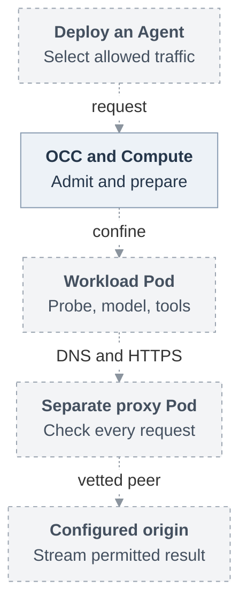

# Basic Agent egress proxy

## Problem and goal

An operator needs an Agent to reach its configured model and approved HTTPS tools
without giving untrusted tool code unrestricted network access. OpenClaw Enterprise
(OCE) must enforce that choice outside the workload. An allowed destination alone
cannot establish who requested an operation or who may use a credential.

This RFC selects a separate proxy for each revision-owned execution. The first
usable delivery confines an ordinary embedded OpenClaw Agent on Kubernetes. Later
selected deliveries add genuine managed Git contribution and protected dedicated
execution with external model credentials, authentic requester authority and
bounded withdrawal. C1 has no gVisor or workload-identity prerequisite. Completing
C1 does not complete the selected goal.

## Proposed journey

An authorized user creates a native Configuration and embedded Agent, references
an existing API-key Secret, provisions transport credentials and deploys through
the normal API. OpenClaw Control Plane (OCC) admits an immutable policy. Compute
prepares the network and proxy, then the actual authentication probe, gateway and
tool child use the admitted route.

Proposed restricted journey. Dashed edges are pending connections, including those
between existing components. C2 uses a separate private credential-service route.
C3 adds receiving identity and operation authority to the protected paths.

## MVP boundary and present evidence

**Status:** Accepted for implementation against historical baseline
[`046e12b`](https://github.com/openclaw/openclaw-enterprise/commit/046e12b007bb1b4928bd3f7497a2353714be11a8).
Acceptance establishes neither runtime availability nor release qualification.

The selected increments have distinct completion evidence:

- **C0:** Concrete producer and consumer contracts make implementation reviewable.
- **C1:** One qualified ordinary runtime and Container Network Interface (CNI)
  passes the real probe, streams configured
  `POST https://api.openai.com/v1/responses` and runs an approved HTTPS tool child.
  An explicitly open Agent remains the same-runtime compatibility control.
- **C2:** Ordinary managed Git/`gh` completes authorized contribution through the
  reviewed credential service, with live provider readback and cleanup evidence.
- **C3:** Dedicated gVisor execution composes authentic invocation, protected
  receiving, external model custody and measured withdrawal.

Responses is the first configured fixture, not a platform provider constant.
C1 retains a model key visible to the executing workload. Its network confinement
provides neither copied-key protection outside the Pod nor protected authority
withdrawal. Route matching grants no application permission or content-loss
prevention.

The historical baseline `724dcb5` grants namespace DNS and public-IPv4 TCP/443.
This RFC proposes the policy and startup contracts. The earlier native adapter
has no controller/Harness caller at separate integration supplier `6538069`,
which is not merged main. Neither those components nor this proposal qualify
C1, C2 or C3. Extra protocols, pooling and exact-container origin proof remain
separately triggered work.

## Supporting design

- [Architecture](31-basic-egress-proxy/architecture.md) explains admission,
  separate Pods, network ownership and protected startup order. Its
  [vertical lifecycle](31-basic-egress-proxy/architecture.md#request-lifecycle)
  and [SVG](31-basic-egress-proxy/request-lifecycle.svg) show the proposed request
  and refusal path.
- [Security](31-basic-egress-proxy/security.md) connects threats to controls and
  distinguishes recorded custody limits from unresolved qualification work.
- [Interfaces](31-basic-egress-proxy/interfaces.md) contains the complete proposed
  policy, Compute resolution and startup shapes. It identifies owner decisions
  without inventing bridge or close protocols.
- [Protocol and routing](31-basic-egress-proxy/protocol-and-routing.md) follows
  DNS admission, TLS verification and each streamed HTTP request through closure.
  It also defines the separate private repository route.
- [Delivery](31-basic-egress-proxy/delivery.md) sets independent C0–C3 gates,
  receiver-observed negative cases and the evidence needed to claim completion.

## References

- [Historical Kubernetes networking](https://github.com/openclaw/openclaw-enterprise/blob/724dcb5cb80b5e76a62e8267a21185a2e91a85c2/apps/controller/src/drivers/compute/kubernetes/index.ts#L3475)
  and [probe environment](https://github.com/openclaw/openclaw-enterprise/blob/724dcb5cb80b5e76a62e8267a21185a2e91a85c2/apps/controller/src/drivers/compute/kubernetes/runtime-entrypoints.ts#L552).
- [Policy and startup proposal](31-basic-egress-proxy/interfaces.md)
  and [earlier unconnected native adapter at the separate integration supplier](https://github.com/openclaw/openclaw-enterprise/blob/65380694085693d6edb5218372ccddbc2ba493d9/docs/flows/external-model-egress.md).
- [Kubernetes NetworkPolicy lifecycle](https://kubernetes.io/docs/concepts/services-networking/network-policies/#pod-lifecycle)
  and [IANA public-address classification](https://www.iana.org/assignments/iana-ipv4-special-registry/).
