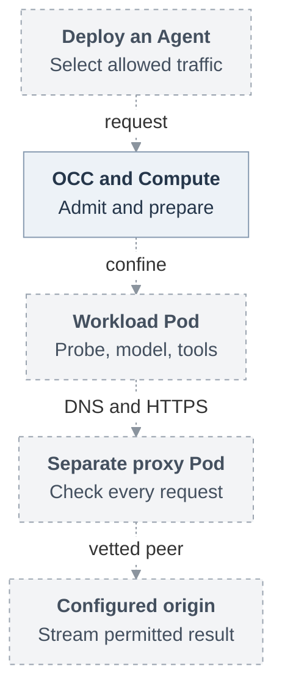

# Basic Agent egress proxy

**Status:** Accepted for implementation against historical baseline
[`046e12b`](https://github.com/openclaw/openclaw-enterprise/commit/046e12b007bb1b4928bd3f7497a2353714be11a8).
Acceptance establishes neither runtime availability nor release qualification.

## Problem and proposal

An Agent needs its configured model and approved HTTPS tools, but unrestricted
outbound access also lets untrusted tool code contact other destinations. This
RFC proposes a restricted egress policy enforced outside the Agent workload.
Authorized users select an operator-defined policy or explicitly permitted open
compatibility. Workload configuration cannot broaden that selection.

OpenClaw Control Plane (OCC) authorizes the selection and freezes its policy in the
AgentRevision. Compute prepares one trusted proxy in a separate Pod for each
revision-owned execution. The workload reaches permitted public origins through
that proxy's DNS and HTTPS listeners; internal services require separately
admitted peers and ports. The proxy checks each request's origin, method, path
and query, and verifies upstream TLS independently of its workload-facing
certificates. Unsupported profiles and failed dependencies refuse access without
falling back to open networking.

Proposed C1 path; dashed connections require implementation and qualification.
C2 adds a separate private route to the repository credential service.
See the [full request lifecycle](31-basic-egress-proxy/architecture.md#request-lifecycle)
for admission, refusal and closure.

## First usable milestone and selected scope

**C1 is the first usable milestone:** an ordinary embedded OpenClaw Agent on one
qualified Kubernetes runtime and network implementation passes its real
authentication probe, streams a configured model response and runs an approved
HTTPS tool child. An explicitly open Agent on the same runtime provides the
compatibility control. C1 requires neither gVisor nor workload identity. Its model
key remains visible to the workload, so confinement does not protect a copied key
used outside the Pod or establish permission for a protected operation.

The full proposal also includes:

- **C2 — managed repository contribution.** Ordinary Git/`gh` uses the reviewed
  credential service to clone, fetch, edit, commit, push and open a same-repository
  PR within an explicitly authorized profile. Embedded C2 can precede dedicated
  execution.
- **C3 — protected dedicated execution.** Compose [gVisor](https://github.com/openclaw/openclaw-enterprise/pull/248),
  [execution identity](https://github.com/openclaw/openclaw-enterprise/pull/247),
  external model credentials and bounded withdrawal. Protected receivers must
  verify the original personal/team invocation, current IAM and exact operation;
  execution identity or a credential session alone grants no permission.

[Delivery](31-basic-egress-proxy/delivery.md) defines the C0 contract prerequisites,
independent C1–C3 acceptance, and remaining startup, receiving and withdrawal
choices. Additional runtimes and protocols, pooling and proof of the sending
container within a Pod are deferred. C1 completion does not remove C2 or C3.

## Design details

- [Architecture](31-basic-egress-proxy/architecture.md): admission, separate Pods,
  network containment, startup order and compatibility.
- [Interfaces](31-basic-egress-proxy/interfaces.md): policy selection, immutable
  snapshots, Compute resolution and proxy startup.
- [Protocol and routing](31-basic-egress-proxy/protocol-and-routing.md): DNS,
  certificate custody, HTTP streaming, closure and the private repository route.
- [Security](31-basic-egress-proxy/security.md): credential limits, personal/team
  authority, withdrawal bounds and safe audit facts.
