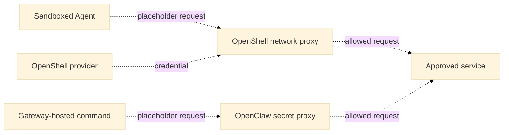

# Basic Agent egress proxy

## Problem and decision

Agents need model and tool access without exposing credentials or unrestricted
networking to untrusted commands. For 0.x, **use OpenShell's network and
credential proxy for workloads in OpenShell** and defer the custom Enterprise
egress proxy. Integrate and verify these protections before release.

OpenShell gives the Agent a placeholder; its network proxy substitutes the real
credential for an allowed HTTP request to a bound destination. The trusted proxy
may hold the credential. This is an integration goal, not a deployed OCE capability. [OpenShell credential injection](https://github.com/NVIDIA/OpenShell/blob/d1155aa70042d3e2ee49dbfa15346b108b7c1d92/docs/sandboxes/manage-providers.mdx#how-credential-injection-works)
describes the upstream behavior.

Dashed arrows show the intended integration, not installed behavior.

## Scope and boundaries

- **OpenShell:** Apply its network policy and credential injection to traffic
  inside the sandbox. Credential binding does not grant network access. Injection
  requires an inspectable request; opaque TLS needs a separately qualified path.
- **OpenClaw Gateway:** For commands hosted on the Gateway, use OpenClaw's
  [secret proxy](https://docs.openclaw.ai/gateway/secrets/secret-store-and-egress#secret-egress-proxy).
  Direct sockets can bypass its traffic allowlist. Sandboxed and remote tools do
  not automatically inherit this path.
- **Codex:** For commands outside OpenShell, use Codex's
  [sandbox and network controls](https://learn.chatgpt.com/docs/agent-approvals-security#network-access).
  Codex model and authentication traffic is outside its command-network policy.

OCE retains Agent, credential and operation authority. Network permission does
not authorize an operation or prevent data disclosure to an allowed destination.

## Implementation

**TODO:** Integrate OpenShell's provider and credential proxy with the Enterprise
Agent lifecycle and the OpenClaw tool sandbox. The current
[Enterprise adapter](https://github.com/openclaw/openclaw-enterprise/blob/3b58323f762f5742e8b44be3e269af0696ed7cde/docs/reference/drivers/openshell-sandbox.md)
supports dedicated Codex only. It rejects embedded OpenClaw and cannot deploy
production Agents with stock OpenShell because required Secret references and
projected workload identity are unsupported. It disables the inner Codex
sandbox, so the outer policy and complete Kubernetes network-policy union must
be qualified. Privileged OpenShell components also require the documented
fail-closed admission restrictions.

Deployments are admitted as immutable revisions; a `202` is not readiness. Check
[deployment status](https://github.com/openclaw/openclaw-enterprise/blob/e387b38cc259ee4a55936ecb848bbce8210bcd68/docs/reference/agents/deployment.md#revisions-and-deployment)
and workload separately. Stop records intent; verify routing and execution
termination. A failed replacement can require repair or redeployment. The [runtime reference](https://github.com/openclaw/openclaw-enterprise/blob/e387b38cc259ee4a55936ecb848bbce8210bcd68/docs/reference/harness-execution.md#harness-authentication)
owns recovery.

## Verification

For each path, prove useful allowed requests and real-child denials, including
direct sockets where confinement is claimed. Verify credential placement and
stop or replacement separately. Pin the runtime, configuration and network
policy. Documentation is not installed-runtime or release evidence.

## Open questions

- Which provider, endpoint bindings and credential sources will OCE configure?
- How will OpenClaw tools join OpenShell, and which runtime images will be supported?
- Which unmet 0.x requirements block release? Record owners and evidence before
  proposing a new proxy service.

## Historical status

The earlier custom-proxy proposal was **accepted for implementation** against
[`046e12b`](https://github.com/openclaw/openclaw-enterprise/commit/046e12b007bb1b4928bd3f7497a2353714be11a8),
but is deferred for 0.x. Its [architecture](31-basic-egress-proxy/architecture.md),
[interfaces](31-basic-egress-proxy/interfaces.md),
[protocol](31-basic-egress-proxy/protocol-and-routing.md),
[security](31-basic-egress-proxy/security.md), and
[delivery](31-basic-egress-proxy/delivery.md) retain the original contracts and
C0–C3 milestones for reference, not current release approval.
