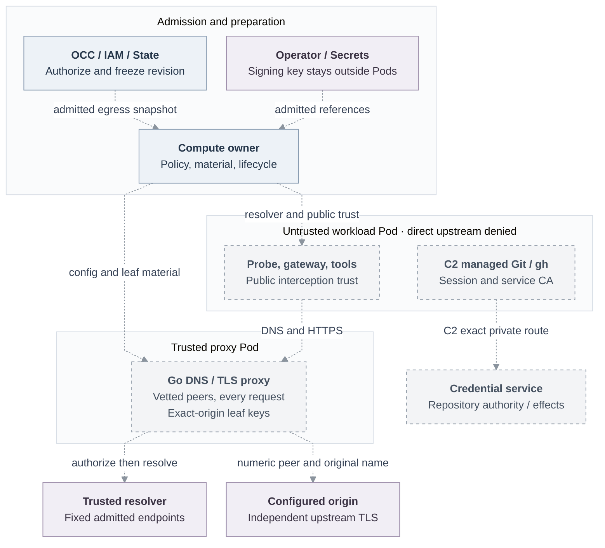

# Basic Agent egress proxy

**Status:** Accepted for implementation against historical baseline
[`046e12b`](https://github.com/openclaw/openclaw-enterprise/commit/046e12b007bb1b4928bd3f7497a2353714be11a8).
Acceptance establishes neither runtime availability nor release qualification.
**Owners:** OCC/State admission, Kubernetes Compute lifecycle, Go mediation;
existing Harness, IAM, gateway, plugin, workspace, tool, credential and Audit
owners retain their boundaries.

## Decision

An authorized user creates a native Configuration and embedded OpenClaw Agent,
references an API-key Secret, provisions transport credentials and deploys through
the normal API. On one qualified ordinary Kubernetes runtime and Container Network
Interface (CNI) tuple, restricted
mode must pass the actual authentication probe, stream configured
`POST https://api.openai.com/v1/responses`, and run an approved HTTPS tool child.
An explicitly open Agent remains the compatibility control. Responses is the
first fixture, not a platform constant; bootstrap routes need demonstrated use
by the pinned runtime.

C1 delivers network confinement without gVisor or workload identity. C2 adds
ordinary managed Git/`gh` contribution. C3 adds authentic invocation, protected
receiving, external model credentials and bounded withdrawal with the selected
[dedicated gVisor](31-gvisor-container-support.md) and
[execution identity](basic-agent-identity-mvp.md) consumers. All three remain selected.

## Current boundary and scope

At public baseline `724dcb5`, [Kubernetes Compute](https://github.com/openclaw/openclaw-enterprise/blob/724dcb5cb80b5e76a62e8267a21185a2e91a85c2/apps/controller/src/drivers/compute/kubernetes/index.ts#L3475)
still grants namespace DNS and public-IPv4 TCP/443. The
[probe child](https://github.com/openclaw/openclaw-enterprise/blob/724dcb5cb80b5e76a62e8267a21185a2e91a85c2/apps/controller/src/drivers/compute/kubernetes/runtime-entrypoints.ts#L552)
receives `OPENAI_API_KEY` in an explicit environment. C1 retains that key and
guarantees only traffic confinement from the qualified network profile: no
external key custody, verified execution, copied-key off-Pod protection or
protected withdrawal. Route matching grants neither application authority nor
content-loss prevention.

Separately reviewed [policy/startup definitions](https://github.com/openclaw/openclaw-enterprise/blob/e0a2ca6e3a289d1ab24e4725f61b10b527e910aa/packages/contracts/src/egress.ts)
do not establish connected listeners or installed enforcement. The earlier
[native adapter](https://github.com/openclaw/openclaw-enterprise/blob/559764103f8902a0a89de0882a44caa16f7ba3fd/docs/flows/external-model-egress.md)
has no controller/Harness caller at that separate integration revision.

Open preserves approved networking, authentication, session, IAM and tenant
isolation; it grants no arbitrary private access and records absent execution
assurance. Docker, SSH and external Drivers preserve supported open behavior and
reject unsupported restricted profiles. Pinned-certificate, IP-literal, opaque
or HTTP/2-only clients need separately authorized compatibility or remain
unsupported. Restricted failures—including proxy, resolver, certificate,
identity, renewal or dependency loss—never select open.

## Design and failure behavior

All dashed edges are proposed connections for restricted execution, including
C2's private credential route. Existing components do not prove these joins or
installed confinement; public-origin DNS answers return the proxy address only
after vetted numeric peers are committed.

### Admit and prepare

Installation owns Namespace defaults, permitted modes, named policy generations,
trusted resolvers, finite bounds and immutable runtime/service images. Accept
only `{mode:"open"}` or `{mode:"restricted",policyId}`. Materialize omitted input
from the operator default; absent Installation configuration and legacy Agents
receive explicit open compatibility. Only authorized selection changes
enforcement; workload configuration, environment and headers cannot broaden it.
OCC authorizes the exact Agent and every referenced resource.

| Handoff            | Required contract                                                                                                                                                                                                                                                                                                                                                                                                                                 |
| ------------------ | ------------------------------------------------------------------------------------------------------------------------------------------------------------------------------------------------------------------------------------------------------------------------------------------------------------------------------------------------------------------------------------------------------------------------------------------------- |
| OCC → Compute      | Side-effect-free support resolution for exact Namespace, Agent, Harness, authentication, Configuration and selection; typed denied/unsupported before effects. Qualified `runtimeProfile/networkProfile` differs from a Pod class.                                                                                                                                                                                                                |
| OCC/State → worker | Existing mutation atomically freezes mode, policy identity/generation/digest, exact origin/method/escaped-path/query rules, internal peers, tuple, finite bounds and applicable original expiry with mandatory admission fact and reconcile intent. Recover uncertain acceptance through its original owner; never invent rollback or another revision. Worker validates persisted policy/Driver and reauthorizes, without re-resolving defaults. |
| Compute → Go       | `EgressDataplaneConfigV1`: exact revision/resource generation, snapshot, DNS/HTTPS/health listeners, fixed resolver endpoints, proxy address, leaf/key references and independent upstream roots. Strict bounded decoding, complete origin material, validity and handshake-key checks precede listeners.                                                                                                                                         |

Use nominal identifiers and curated exports. Extra capabilities, callbacks or
context require actual producers/consumers. Compute prepares one separate proxy
Pod per revision-owned execution using existing Secret ownership. Probe,
gateway and tool child receive supported public trust and normal TLS verification;
readiness requires admitted generation and the real probe. New origins and
replacement require newly admitted material and distinct resource identity.

### Contain the network

Compute alone stamps `openclaw.dev/network-profile` as `broad-egress-v1`,
`restricted-egress-v1` or `egress-proxy-v1`; missing/unknown classes receive no
compatibility grants. Transition legacy workloads through trusted classification.
Preserve default-deny and approved ingress; constrain DNS to compatibility and
runtime/authentication public-443 grants to open. Inspect the additive union of
transport, channel, plugin, Helm and Sandbox policies in managed/adopted
namespaces. Unsupported Sandbox composition rejects activation.

Cover embedded `gateway` and admitted dedicated `agent` roles using full
Namespace/Agent/revision/role/resource-generation ownership. Stable Deployment
names and Agent-only selectors cannot authorize retired executions. Proxy labels
must not inherit controller DNS/database/API grants. Tools cannot relabel, mutate
policies, run privileged/host-network, obtain `NET_ADMIN`/`NET_RAW`, or mount
writable host paths. Node, CNI, control plane and proxy remain trusted.

Restricted Pods use `dnsPolicy: None`, the exact revision resolver, only proxy
DNS/TLS listeners and separately admitted internal peers/ports. Proxy grants name
exact resolver/control peers and necessary public upstreams. Qualify UDP/TCP
resolver Service-VIP/backend routing and node/private-path denial early; unsupported
tuples fail before resource construction, without ambient DNS or broad-CIDR fallback.

Restrictions must precede readiness. **Proposal — security/Compute/CNI decision
pending:** qualify containment before _any_ untrusted init/startup/tool/replacement
code, or refuse activation. Policy creation/readback or a fixed delay does not
prove enforcement; Kubernetes supplies no standard enforcement acknowledgment.
See [NetworkPolicy lifecycle](https://kubernetes.io/docs/concepts/services-networking/network-policies/#pod-lifecycle).

### Mediate and close

| Boundary | Mandatory behavior                                                                                                                                                                                                                                                                                                                                                                                                                                                                                                                                                                                                                                                                                                                                |
| -------- | ------------------------------------------------------------------------------------------------------------------------------------------------------------------------------------------------------------------------------------------------------------------------------------------------------------------------------------------------------------------------------------------------------------------------------------------------------------------------------------------------------------------------------------------------------------------------------------------------------------------------------------------------------------------------------------------------------------------------------------------------- |
| DNS      | Bounded UDP/TCP, IPv4 A, hostname HTTPS; controlled negatives otherwise. Authorize canonical original question before fixed-resolver lookup. Bound CNAME depth, answers, wire size, concurrency, cache and TTL. Reject loops, broken continuity and whole answer sets containing unusable/non-public addresses, including [benchmark/documentation ranges](https://www.iana.org/assignments/iana-ipv4-special-registry/). Commit globally routable numeric peers under binding/generation/original-origin before answering. Expiry blocks fresh dial until resolution; failed refresh cannot extend data. Existing valid streams use their separate lifetimes. Internal names and proxy addresses are separate classes; no generic allow-private. |
| TLS      | Require admitted DNS SNI and matching-SAN leaf; reject absent/IP SNI and unsupported protocols. Signing CA keys stay outside proxy/tools; workload gets public interception trust, proxy only necessary short-lived leaf keys. Dial admitted numeric peers with original DNS `ServerName`. Before application bytes, verify independent upstream roots and reject every verified chain containing any admitted interception key, including peer-supplied alternate chains.                                                                                                                                                                                                                                                                        |
| HTTP     | HTTP/1.1 streaming; every request, including keepalive, matches TLS origin/port, case-sensitive method, escaped path and explicit query policy. Reject absolute-form targets, encoded-separator/dot ambiguity, conflicting framing, CONNECT, upgrades, unsupported versions and DoH operations. Rebuild fixed authority/framing and sanitized hop-by-hop headers. No ambient proxy, redirect following, upstream reuse or uncertain-mutation retry.                                                                                                                                                                                                                                                                                               |
| Closure  | Bound DNS work, connections, handshakes, goroutines, headers, bodies, responses, dialing, idle time, streams and shutdown; reserve control/close capacity under saturation. Stop, retirement, applicable expiry and shutdown deny new admissions before cleanup, cancel requests and close sockets. Failed setup/stale generation closes readiness/access; restart extends no original validity and revives no terminal protected binding.                                                                                                                                                                                                                                                                                                        |

Extend authenticated Compute deletion/process shutdown to the exact proxy role,
generation and original object UID, preserving successors on retries. Close is
private, idempotent and terminal with a safe reason. Observe proxy termination;
pending/unknown cleanup is not completion.

### Compose credentials and protected authority

C2 consumes the exact reviewed credential Driver/runtime binding. Managed Git/`gh`
uses its own session configuration, allowlisted environment, service CA and exact
private peer; model interception and direct GitHub access cannot substitute.
The [credential owner](https://github.com/openclaw/openclaw-enterprise/blob/eb52cc4cfe68f08017e7ece6585fe7e937e0747a/docs/reference/repository-credentials.md)
retains parsing, authorization, sessions, custody, dispatch, deadlines and uncertain
effects. A revision session identifies no human requester. Restart loses provider
cleanup inventory: local closure does not prove token revocation; tokens can
remain valid until original expiry.

C3 reuses one proxy per current assignment. State/Compute observes incarnation
and enforces private ingress; identity owns constrained operator-managed SPIRE
registration and rotating relay identity. Relay certificates identify relays;
trusted assignment/ingress associates the Agent, without proving its sending container.

C3 must observe with protected serving disabled → bind → persist immutable
credential attempt → open/read back → deliver without incarnation change →
validate currentness → enable serving. Changed incarnation requires fresh admission.
**Owner integration proposal:** distinguish observation from readiness; after
delivery run an owner-authorized protected bootstrap probe, then establish
current-serving selection and predecessor withdrawal before enabling serving.
Compute/Harness/identity/credential owners must fix the probe purpose and authority
without impersonating a human.

Egress owns the accepting Go listener/authenticated Go–TypeScript bridge;
identity verification and credential effects retain their owners. Preselect an admitted
exact peer before TLS; hints, headers and serialized identity are insufficient.
Every protected route, including `checkContinue`, retains the same native
connection/request/stream and recipient through waits and dispatch. Shared
acquisition requires a current original waiter: withdrawing one neither authorizes
its work nor cancels another's. Recheck after waits; final currentness/session
fences immediately precede effect creation and result delivery without unguarded
awaits. Preserve late settlement custody and idempotent close.

Receivers check original [personal/team invocation](31-basic-rbac.md) or repository
authority, current IAM, exact execution/resource/operation, authority sequence and
original absolute ceiling. Identity grants no permission. Protected model
substitution covers only admitted origin/operation; no real provider key enters
the workload, including renderer/probe/tool paths. Reject external, sibling-Agent,
copied-bearer and retired-assignment replay. Dedicated material/consumer integration stays with its
runtime owner.

RBAC/State orders renewal against durable withdrawal. Finite authenticated
currentness preserves scope/ceiling, rejects stale positives and never revives
closure. Owners must fix committed starting event, evidence age, request-start/skew,
monotonic deadline, cadence and closure reserve. Renewal loss expires access locally.
Measure **≤30 seconds** to both new-request refusal and last protected bytes/closed
active exchanges, including blocked consumers and saturation; selected stricter
five-second contracts prevail. Refuse before awaited cleanup. Record route/session
closure, provider cleanup, stop request, observed physical stop and possibly
dispatched effects separately; stream closure never permits mutation replay.
Runtime stop remains pending until Compute observes termination.

### Keep implementation and facts with their owners

Use the root Go module, thin `cmd/occ-egress-proxy`, private `internal/egressproxy`
and `deploy/runtime/egress-proxy.Dockerfile`. Contracts owns shared types;
OCC/State owns admission/persistence and reserves migration order; Compute owns
resources, association, readiness, replacement and observed termination. Preserve
existing credential extensions. The service issues no IAM authority. Add no issuer,
credential registry, audit store,
supervisor, general Provider framework, VM/nftables, shared-memory or replacement
Harness machinery.
Reuse reviewed invariants and defensive cases; copied code retains source/modification
attribution, notices/licenses and dependency inventory in source/distribution records.

[Audit/State](31-basic-observability.md) owns bounded closed facts: authentic
initiator/executor/authority references, policy generation, route, decisions,
dispatch, counts and observed/unknown outcomes. Exclude credentials, keys,
headers, cookies, bodies, full queries, raw URLs/paths and provider errors.
Diagnostics cannot manufacture durable acceptance or physical outcomes; evidence
failure cannot block local protective refusal or fabricate committed withdrawal.

## Acceptance and delivery

| Increment | Required evidence; each remains unqualified here                                                                                                                                                                                                                                                                    |
| --------- | ------------------------------------------------------------------------------------------------------------------------------------------------------------------------------------------------------------------------------------------------------------------------------------------------------------------- |
| C0        | Accepted RFC plus real policy/admission/State/Compute/Go producer-consumer contracts; fix tuple, certificate custody, owned close and migration reservation before implementation.                                                                                                                                  |
| C1        | Real API/IAM/PostgreSQL admission/readback, worker persistence/reauthorization, DNS/TLS/HTTP peers and lifecycle. Non-root, read-only image with public roots, no network-administration capabilities and pinned dependencies. One installed artifact passes actual probe/model/tool and same-runtime open control. |
| C2        | Genuine reviewed credential join; actual managed clone/fetch, edit/commit, admitted push and same-repository PR using deliberately authorized `git-full`; explicit `git-read` control, profile/direct-bypass denial, live provider readback and cleanup/uncertainty. Embedded C2 does not await dedicated delivery. |
| C3        | Real authority/current-serving/receiving/safe-fact exports; same installed artifact proves authentic requester, protected model/probe/repository use, dedicated gVisor, off-Pod denials, rotation/replacement, concurrent withdrawal, renewal loss and both timing endpoints.                                       |

Required receiver-observed negatives: mixed forbidden DNS/rebinding, malformed
answers, wrong/overlapping upstream certificates, SNI/Host mismatch, ambiguous
targets/framing, later keepalive, unsupported tunnels, blocked streams, saturation,
restart/replacement; direct IP, alternate DNS, DoT/DoH, IPv6/QUIC, sibling,
private/metadata/node and forbidden platform routes except exact admitted internal
peers. Denied receivers observe no unintended application bytes. Installed cases
cannot be skipped or replaced by fixtures.

Follow the [Kubernetes verification guide](https://github.com/openclaw/openclaw-enterprise/blob/724dcb5cb80b5e76a62e8267a21185a2e91a85c2/docs/testing/kubernetes.md).
Retain source/tree/build/image digests, runtime/CNI, policy/material versions,
results and credential limits; distinguish source, composed, installed,
live-provider and release evidence. Preserve accepted C1 commit/tree/manifest;
continue through genuine reviewed supplier joins. Backport demonstrated C1 defects
with minimal reviewed regressions and bring fixes forward. Update Agents, Compute,
networking, Harness and deployment/credential/testing references under the
[platform design](https://github.com/openclaw/openclaw-enterprise/blob/724dcb5cb80b5e76a62e8267a21185a2e91a85c2/docs/design.md).

## Alternatives and follow-ups

Finite exact routes and prepared leaves avoid wildcard policy, online CA,
generic discovery, close RPC and C1 lease machinery. Additional runtimes,
providers, protocols or pooling require a named consumer and Compute/Harness/Go
route, custody and closure qualification. Stronger same-Pod origin requires
runtime/identity proof; independent physical expiry during control-plane failure
requires runtime-owned enforcement and observed termination. Provider cleanup
recovery belongs to the credential owner and needs durable custody plus restart,
late-settlement and provider-readback evidence if selected.

**Proposal — Installation/product and authority owners:** distinguish prospective
default edits from explicit audited withdrawal of existing weaker admissions.
Fix offered tuples, affected sessions, effective event and renewal eligibility;
no grace period, automatic downgrade or retroactive assurance is selected.
Changed requirements need fresh admission; live enforced sessions retain their
requirements until closure. Containment-at-start and bootstrap/bridge mechanisms
above remain owner decisions; none removes C2/C3 or waives their guarantees.
