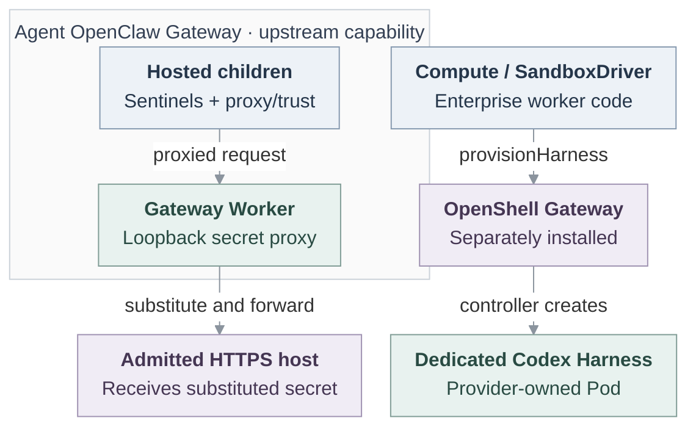

# Basic Agent egress proxy

## Problem and Decision

An Agent needs model/tool access without exposing credentials or unrestricted
networking to untrusted commands. **The 2026-09-24 decision defers the custom Enterprise
proxy for 0.x** and selects wiring and verification of existing runtime protections.
This [direction](https://github.com/openclaw/openclaw-enterprise/pull/249#issuecomment-5754828001)
supersedes earlier implementation selection. Historical C0–C3 remain reference
proposals, not current approval or release gates.

## Scope

Each path must deliver useful allowed work, meaningful refusal,
and separate credential and stop/replacement evidence. One path cannot complete
the others. No new egress service is selected. The historical
[delivery contract](31-basic-egress-proxy/delivery.md#increments-and-qualification)
preserves C1 embedded confinement, C2 repository contribution and C3 protected
dedicated execution. Extra protocols, runtimes and pooling remain separately
triggered future work.

## Contract

### Three execution boundaries

- **Gateway-hosted commands:** [Upstream OpenClaw](https://docs.openclaw.ai/gateway/secrets/secret-store-and-egress#secret-egress-proxy)
  documents a loopback secret proxy in a Gateway Worker. Hosted
  children receive opaque secret placeholders (sentinels) and proxy/trust settings. The Worker substitutes
  plaintext only for each secret's admitted HTTPS destinations, then forwards.
  Direct sockets can bypass traffic allowlisting. Sandbox and remote commands do
  not automatically inherit this material. Enterprise wiring remains TODO.
- **Sandboxed OpenClaw tools:** OpenShell is the selected confinement direction.
  The [Enterprise adapter](https://github.com/openclaw/openclaw-enterprise/blob/3b58323f762f5742e8b44be3e269af0696ed7cde/docs/reference/drivers/openshell-sandbox.md)
  accepts dedicated Codex only, rejects embedded OpenClaw and cannot provision
  production Agents with stock v0.1.0. The OpenClaw tool integration remains TODO.
- **Codex commands:** [Command network controls](https://learn.chatgpt.com/docs/agent-approvals-security#network-access)
  exclude model/authentication requests. Networking alone does not select
  destination filtering. Enterprise OpenShell sets inner Codex
  `danger-full-access`, requiring qualification of its outer binary-scoped policy
  and the complete additive Kubernetes policy union.

The operator installs a RuntimeClass or equivalent exemption for OpenShell's
trusted privileged components. Pod Security Admission exempts the whole Pod.
A separate fail-closed admission policy must restrict the exemption to approved
image digests, ServiceAccounts, Namespaces, labels and exact elevated capabilities. The
[pinned admission requirements](https://github.com/openclaw/openclaw-enterprise/blob/3b58323f762f5742e8b44be3e269af0696ed7cde/docs/reference/drivers/openshell-sandbox.md#kubernetes-and-admission-requirements)
own that prerequisite.

Compute owns resources, routing and retirement. Its SandboxDriver is worker
integration code calling a separate OpenShell Gateway whose controller owns the
Harness Pod. Dedicated Agent Gateway/private state and Harness/workspace occupy
control-plane and data-plane targets respectively. [Placement](https://github.com/openclaw/openclaw-enterprise/blob/e387b38cc259ee4a55936ecb848bbce8210bcd68/docs/design.md#implementation-status)
is a source property, not proof of disjoint installed nodes. The historical Go
proxy is a separate, deferred Pod.

Solid edges show source capability, not installed qualification. The OpenClaw tool
join remains TODO. The [editable diagram source](31-basic-egress-proxy/current-boundaries.mmd)
can be refined as the design is reviewed.

### Deploy and observe

Illustrative source-backed sequence, unexecuted:

1. The operator supplies a ready Namespace, bundled Kubernetes Compute, pinned
   runtime, native Configuration, Agent `harnessAuth` references and transport
   prerequisites. OpenShell attaches at Installation `drivers.sandbox`, requires
   a separately installed Gateway and uses operator Workspaces. Managed mode is
   unsupported. Follow the [configuration owner](https://github.com/openclaw/openclaw-enterprise/blob/3b58323f762f5742e8b44be3e269af0696ed7cde/docs/reference/drivers/openshell-sandbox.md#configuration).
2. An authorized caller sends bodyless
   `POST /namespaces/:namespaceId/agents/:agentId/deploy`. Exact Agent deployment,
   Configuration read and credential-source permissions apply. `202` admits an
   immutable revision and queues work. Historical `EgressSelection` is not its body.
3. Poll `GET /namespaces/:namespaceId/agents/:agentId/deployments/:deploymentId`
   with the returned revision ID. Use durable status for the deployment outcome,
   then check readiness and actual child behavior separately. [Deployment](https://github.com/openclaw/openclaw-enterprise/blob/e387b38cc259ee4a55936ecb848bbce8210bcd68/docs/reference/agents/deployment.md#revisions-and-deployment)
   and [status](https://github.com/openclaw/openclaw-enterprise/blob/e387b38cc259ee4a55936ecb848bbce8210bcd68/docs/reference/agents.md#deployment-status) own these operations.

OpenClaw Control Plane (OCC) authorizes admission. State atomically freezes effective
configuration, Compute/Sandbox selection, credential references and reconcile
intent, not Kubernetes/provider effects. References do not preserve historical
Secret bytes.

For example, Compute passes `HarnessWorkloadRequirements` through
`SandboxHarnessContext.requirements` to `SandboxDriver.provisionHarness`.
An illustrative, unexecuted `requirements.environment` entry is
`{name:"OPENAI_API_KEY",valueFrom:{secretKeyRef:{name:"<owned-secret>",key:"<key>"}}}`.
It carries a reference, not plaintext. Stock v0.1.0 refuses it before Sandbox
creation, preventing activation. Literal secrets or a test bridge are no
substitute. The [declared handoff](https://github.com/openclaw/openclaw-enterprise/blob/e387b38cc259ee4a55936ecb848bbce8210bcd68/packages/contracts/src/index.ts#L686-L719)
and [consumer](https://github.com/openclaw/openclaw-enterprise/blob/3b58323f762f5742e8b44be3e269af0696ed7cde/apps/controller/src/drivers/sandbox/openshell.ts#L1122-L1177)
own the complete contract.

### Failure, recovery and limits

Upstream Worker failure closes protected egress and requires Gateway restart.
Embedded `Recreate` can stop the working Gateway before the replacement probe
succeeds. Failed credentials or provider access leave it unavailable until repair
and restart or redeployment, without automatic rollback. OpenShell cleanup derives
owned identity from the revision even after Pod loss. A missing create-time route
receipt requires owned stale-Sandbox removal, not a guessed later exposure.
[Runtime recovery](https://github.com/openclaw/openclaw-enterprise/blob/e387b38cc259ee4a55936ecb848bbce8210bcd68/docs/reference/harness-execution.md#harness-authentication)
and the Sandbox owner govern repair.

Stop `202` records intent. Observe routing and execution termination separately.
Revisions, credentials, Gateway state and workspace survive stop. Repository
[recovery](31-basic-egress-proxy/protocol-and-routing.md#private-repository-route)
distinguishes surviving sessions, lost material and uncertain provider effects.

There is no common egress-enable default or global withdrawal clock here.
Current embedded probes consume model credentials, and Kubernetes source still
allows broad public IPv4 TCP/443. Neither is destination-bound injection or
historical external custody. Historical [limits](31-basic-egress-proxy/interfaces.md#selection-and-policy)
are maxima, not operational defaults.

## Implementation

Pinned main [3b58323f](https://github.com/openclaw/openclaw-enterprise/blob/3b58323f762f5742e8b44be3e269af0696ed7cde/docs/flows/openshell-sandbox-provisioning.md)
contains the dedicated-Codex adapter and both Kubernetes-only and Compose-backed
development setup. Workspace readiness proves neither Agent creation nor model
execution. The first-Agent helper rejects OpenShell. The
[verification-only bridge](https://github.com/openclaw/openclaw-enterprise/blob/3b58323f762f5742e8b44be3e269af0696ed7cde/docs/testing/openshell.md#test-bridge-and-upstream-prerequisite)
observes an exposed route returning `401`, then runs the model turn on authenticated
Pod loopback. Production still refuses required projections.
[Source status](31-basic-egress-proxy/delivery.md#source-status-and-owner-dependencies)
separates current code, historical suppliers and dated upgrade observations.

## Verification

For **each path**, record runtime/image, effective configuration and traffic boundary.
In the enforcing environment, demonstrate useful allowed traffic and real-child
refusal with receiver observations, including direct sockets wherever confinement
is claimed. Fixtures cannot replace required cases.
Verify credential placement and stop/replacement separately from network permission
and model authentication. Follow [OpenShell qualification](https://github.com/openclaw/openclaw-enterprise/blob/3b58323f762f5742e8b44be3e269af0696ed7cde/docs/testing/openshell.md).
Documentation supplies no installed-runtime, live-provider or release proof.

## Open Questions

Runtime, Sandbox and Compute owners must select the pinned Gateway/Codex settings,
material delivery, actual OpenClaw tool entrypoint and its producer/consumer join.
Its deployable recipe remains unselected. Product/release owners
must record unmet 0.x requirements, release consequences, owners and
missing proof before proposing another proxy. Revival requires a later reviewed
scope decision. Historical [owner decisions](31-basic-egress-proxy/delivery.md#decisions-and-follow-ups)
remain unresolved, not accepted risks.

## Historical implementation status

**Status: Accepted for implementation** against historical baseline
[`046e12b`](https://github.com/openclaw/openclaw-enterprise/commit/046e12b007bb1b4928bd3f7497a2353714be11a8).
That status establishes neither runtime availability nor release qualification.

## References

[Architecture and lifecycle](31-basic-egress-proxy/architecture.md),
[complete interfaces](31-basic-egress-proxy/interfaces.md),
[protocol and repository routing](31-basic-egress-proxy/protocol-and-routing.md),
[security and withdrawal](31-basic-egress-proxy/security.md), and
[delivery and acceptance](31-basic-egress-proxy/delivery.md).

Current disposition: [Problem and Decision](#problem-and-decision).

Historical proposal: [architecture](31-basic-egress-proxy/architecture.md#historical-proposal-and-reading-path).

Historical milestones: [delivery](31-basic-egress-proxy/delivery.md#increments-and-qualification).

Historical journey: [admission](31-basic-egress-proxy/architecture.md#admission-and-preparation).

Supporting design: [References](#references).
