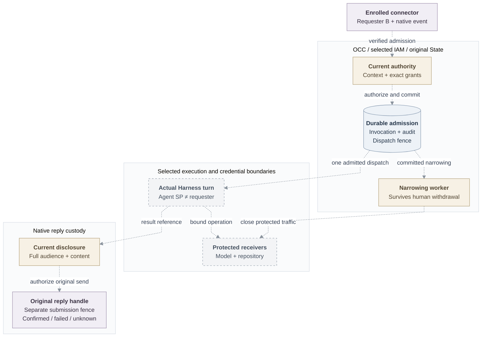

# RFC: Basic personal and team Agent access

**Date:** 2026-09-18  
**Status:** Proposed; implementation and qualification remain open.  
**Owner:** OCC authorization and Agent invocation.  
**Original source baseline:** `046e12b007bb1b4928bd3f7497a2353714be11a8`.

## Decision

An enrolled human invokes a private personal Agent through a verified Slack/Teams
DM, or an explicitly shared team Agent through an admitted channel mention, and
receives only currently authorized content. The human remains the requester;
team service authority never falls back to personal credentials.

Extend existing IAM, authentication, State, audit, lifecycle, native connector and
credential owners. The complete MVP retains local accounts, personal/team access,
both channels, separately qualified Codex/Claude Code adapters, exact repository
profiles and active withdrawal. First prove deployer A and distinct requester B
using Slack, dedicated Codex and one protected repository HEAD read. This
checkpoint does not complete the selected breadth.

## Current boundary and scope

[Main's authorization](https://github.com/openclaw/openclaw-enterprise/blob/724dcb5cb80b5e76a62e8267a21185a2e91a85c2/docs/reference/authorization.md)
supplies exact-action IAM. Separate
[policy definitions](https://github.com/openclaw/openclaw-enterprise/blob/5567878fe188fbd39c902093ff33fee41f0df492/packages/contracts/src/iam-policy.ts)
define administration units and grants. Neither establishes the connected
account/policy transaction, ordinary invocation, dedicated protected delivery or
installed withdrawal. Existing
[workspace consumers](https://github.com/openclaw/openclaw-enterprise/blob/724dcb5cb80b5e76a62e8267a21185a2e91a85c2/apps/controller/src/index.ts#L1960-L1964)
still use broader actions.

Installation `compatibility` preserves existing tools, authentication, IAM,
sessions, credentials and administrator setup; it claims neither verified
execution nor bounded withdrawal. Protected `enforced` admission requires its
installed capabilities and denies on missing evidence/outage without downgrade.
Security-profile edits require privileged configuration and audit. Server-selected
route/profile semantics must enforce narrow content actions; unsupported or
ambiguous combinations deny. Invocation callers cannot select compatibility, and legacy
`read/operate` cannot substitute for protected content checks.

[gVisor runtime](31-gvisor-container-support.md),
[egress C1](31-basic-egress-proxy.md) and complete
[protected identity](basic-agent-identity-mvp.md) are separate checkpoints, not
an automatically supported Cartesian product. Changed requirements require fresh
revision admission; pinned Compute identity and existing enforced requirements
survive default edits. **Proposal—Installation/product decision pending:** separate
prospective defaults from explicit protective withdrawal of existing weaker
admissions. Owners must fix offered combinations, affected sessions, effective
event and renewal eligibility; no implied grace period or stronger assurance.

## Design and failure behavior

All dashed edges are proposed or unconnected product handoffs. Existing IAM/State
source supplies components, not this complete path or installed/provider proof.

### Accounts and exact grants

[Human sign-in](31-human-federated-sign-in.md) owns one stable Principal and the
local/external-only account, method and session lifecycle. Enrollment is grant-free.
Account status/incarnation/version govern every controller; disable fences new
authentication and existing sessions, and re-enable revives none. Login adds no
repository/connector grant, implicit signup or same-email linking. Local withdrawal
covers every method; IdP disable alone does not withdraw OCC sessions.

**Proposal—OCC/IAM/connector decision pending:** OCC coordinates versioned contexts
in original State; IAM owns grants; connectors own complete audience evidence.
Personal context binds Principal/private Namespace/Agent; team context binds
Agent/Namespace-local human Group/shared baseline/service authority. Context changes
must narrow affected authority even without a policy revision change. Creation
profiles do not implement these records. Agent ServicePrincipal, requester,
execution and credential owner remain distinct.

Use the immutable
[twenty-role catalog](https://github.com/openclaw/openclaw-enterprise/blob/5567878fe188fbd39c902093ff33fee41f0df492/packages/iam/src/policy/catalog.ts#L25-L82),
including exact companion, creator, account and audit bundles:

| Agent role                 | Exact actions                                |
| -------------------------- | -------------------------------------------- |
| Viewer / content reader    | `read` / `read, read_content`                |
| Collaborator               | `read, invoke, read_content`                 |
| Editor                     | `read, update, write_content`                |
| Operator                   | `read, deploy, operate`                      |
| Repository assigner / user | `read, assign_repository` / `use_repository` |

`read` covers metadata/status; content actions cover workspace, conversation/run
history and results; `update` changes configuration; `deploy/operate` control
lifecycle. Agent `administer` denotes approved access administration, not the
initial human Installation gate. Repository user binds only the exact owning
Agent SP. Installation administration and the retained administrator bundle gain
no implicit content/audit actions; History needs `read_audit`, retention management
needs Installation `manage_audit_retention`. Direct human Groups and overriding
deny-only Restrictions remain effective. Self-granting policy administrators and
infrastructure operators remain trusted.

Four targets are allowed: exact resource; matching Agent/Configuration creator
sentinel on the exact Namespace; Namespace Agents for audit; retained exact Agent
audit with authentic State/History parentage. Both audit exceptions permit only
audit-reader grants. Approved creation profiles atomically grant only new-object
roles; deployment grants its ownership audience exact new-revision read. Existing
objects/source permissions are not bypassed. Namespace discovery and necessary
Configuration, Secret metadata/source-use and ServiceAccount access remain explicit;
Secret use never discloses provider material. Create without repositories, grant
the known SP exact source/use permissions, then assign. No broad administrator or
credential-mutation grant is needed.

### Policy transaction and recovery

Selected `IAMPolicyAdministrationV1.bindPolicy` binds original-State read/write
units; OCC exposes `readPolicy`, `applyChange`, `readPolicyOperation` and the catalog.
Unsupported Drivers reject without Native fallback. Human Installation `administer`
authorizes general administration. Authentication supplies actor; State resolves
Installation, authentic subjects and exact parentage. Group create/rename,
membership, fixed grants/revokes, Restrictions and creation profiles form a bounded
ordered batch with one operation reference, expected revision and digest.

One explicit READ COMMITTED transaction orders Installation authority → complete
sorted changed-account/session and additional recovery guards → all six native
policy tables/head → resources/authority → retention/audit. Bootstrap, enrollment,
Agent-SP creation and legacy writers join. Select write intent before locks;
no late upgrade, nested commit or unrestricted application SQL mutation. Live
tokens/candidates/evidence bind original owner, Driver, store and Installation;
copied, foreign or expired handles reject. Preserve supported service-key account
clients internally, complete multi-account repair, and one usable local-password
administrator under candidate Groups/Restrictions; external-only/service identities
cannot satisfy recovery.

Current authorization, mutation, revision, receipt, audit and narrowing commit
together. Failed acceptance poisons the transaction; admitted work drains before
COMMIT. Account-only narrowing may advance account version without policy revision.
Invocation/deployment/session admission and renewal register authority before
commit; racing revoke denies or includes it. External credentials open afterward.
Recovery cannot revive withdrawn generations or unindexed authority.

Outcomes are committed/conflict/denied/unavailable/unknown. Current authorization
and the same operation/digest recover original receipt/revisions despite later
head changes; changed digest conflicts. Absent evidence stays unknown, own-uncommitted
results stay prepared. No automatic replay or destructive compensation follows
uncertain COMMIT.

### Invocation and authorized reply

One dedicated Gateway per enrolled app authenticates as its exact non-Agent
connector SP, bound to app/tenant or workspace/generation. The image pins its
required native-hook ABI. It supplies verified transport, immutable sender,
conversation/mention, event/logical-message identities, digest and original reply
handle. OCC resolves current bindings; caller names, profiles and destinations
confer no authority. Missing/stale registration, failed admission, exception or
timeout blocks default dispatch.

`AgentInvocation` provides submit/status/result/cancel through the actual private
Gateway and Harness run/wait/history/cancel adapter. Durable State binds requester,
context/version, Agent/revision/SP, IAM/policy revision, generation, original deadline,
event/digest/idempotency, dispatch attempt, runtime turn/result and outcome.
Duplicates return the original invocation; conflicting reuse rejects. Separate
durable dispatch and native submission fences survive restart and audit expiry.
Unknown start/send never permits replay. Replies retain result digest, audience
revision/deadline and late observations without reopening sending eligibility.

Submit requires current `invoke` and baseline eligibility. Safe status requires
`read` plus original requester or `operate`, excluding content. Results require
current `read_content` and audience eligibility. Cancel-own requires active original
human plus `invoke`; cancel-other requires `operate`. Protective withdrawal survives
ordinary permission removal. Lifecycle reconciliation is not invocation Work.

Direct Slack in one workspace and authenticated Teams personal/standard-channel
activities in one tenant are selected. Every team's retained state/tools/integrations
must fit its shared baseline, and the complete destination audience must qualify.
An administrator-controlled channel needs a concrete membership/withdrawal procedure.
Unverified changes stop delivery; new members may read eligible history, while
stricter transitions need fresh context. Recheck current content permission,
audience and original reply authority before release. Record confirmed/failed/unknown
delivery. Per-Agent external channels and model-visible detached sends, broadcasts,
uploads, edits and proactive delivery are disabled; ordinary configuration cannot
enable bypasses. Native delivery alone holds connector credentials.

### Protected credentials and withdrawal

Reuse Secret, ServiceAccount and
[Harness authentication](https://github.com/openclaw/openclaw-enterprise/blob/724dcb5cb80b5e76a62e8267a21185a2e91a85c2/specs/30-harness-auth-binding.md)
owners for isolated auth state, scrubbed environments, delivery, refresh and
cancellation. One invocation selects one personal/team authority and exact admitted
integrations; no ambient user/operator login. Complete protection keeps long-lived
provider credentials outside tools and uses protected model/repository routes;
direct-Harness delivery remains weaker.

Extend the existing repository-binding owner: immutable assignment ID binds Agent
SP/Driver/resolved provider/repository/grant/profile, within the Namespace ceiling.
Assignment/widening needs human `assign_repository` and owning-SP `use_repository`;
explicitly select `git-read`. Changed tuples get new IDs; removal withdraws uses.
Deploy/open/renew recheck assignment/use; freeze tuple/original deadline in revision
and index sessions by assignment/generation. Driver owns minting/protocol/cleanup.
Reject unadmitted Secret/plugin/native-auth/Configuration credentials and direct
provider bypasses; an allowlisted domain does not authorize every operation.

[Identity](basic-agent-identity-mvp.md) and [egress](31-basic-egress-proxy.md)
own observe/bind/immutable-attempt/open/readback/deliver/probe/current-serving order,
actual connection/request proof and mandatory routes. Delivery must preserve the
observed incarnation; replacement requires fresh admission. Select a usable
execution per invocation, not redeployment per request. Owners must bind concurrent
operations to their original requester and recheck currentness after waits and
immediately before dispatch/delivery; a withdrawn waiter cannot cancel another's
valid work. Every protected receiver must deny stale, retired, sibling and off-Pod
replay; a copied bearer or serialized identity is insufficient.

Policy commit refuses new admission/results and records narrowing intent. The
protective worker can only narrow: member removal targets that human's work;
service revocation targets all uses. Until safe per-invocation cancellation,
stop the affected exact revision and close all sessions. Incident pause/termination
remains available; resume needs a fresh generation.

Measure **at most 30 seconds** to new-work refusal and last protected bytes,
including renewal loss. Preserve `account-currentness-v1`'s five-second ceilings
for dependency calls, operation starts, model rechecks and model closure; these
are not global five-second revocation.
Owners must define starting event, evidence age, clock/skew, monotonic expiry,
cadence and closure reserve without extending original horizons or renewing
withdrawn generations. Finite session closure cancels owned traffic; durable exact
Compute-stop retries continue. Receiver expiry progresses independently of the
Harness and refuses new work before awaited cleanup. Reconciliation cadence is no outage bound.
Receipts distinguish policy commit, refusal, credential closure, observed stop and
unresolved provider cleanup. Queued stop is not completion; copied direct keys
depend on provider expiry/revocation and accepted provider effects may finish.
Unknown dispatch/cleanup remains visible without replay.

Mandatory mutation/admission/credential-dispatch audit fails closed. Safe facts exclude credentials,
custody handles, identity claims/labels, URLs, headers, commands, paths, prompts,
response/provider bodies and exception text. Audit outage cannot prevent local
refusal/expiry/closure or manufacture durable completion.
[History](31-basic-observability.md) independently requires its current authorization,
retention/recovery and acknowledged-disclosure gates; its UI is not an invocation
prerequisite.

## Acceptance and delivery

| Increment                    | Required evidence; remaining limit                                                                                                                                                                                                                                   |
| ---------------------------- | -------------------------------------------------------------------------------------------------------------------------------------------------------------------------------------------------------------------------------------------------------------------- |
| Account/policy foundation    | Real limited-role PostgreSQL/controller grant-free enrollment → exact grants → create/operate; external-only/currentness, complete repair/last-admin races, all writers, batch replay/conflict/rollback and failure/unknown-COMMIT recovery.                         |
| Authentic turn/content       | Real Slack A≠B and dedicated Codex; narrow-role/cross-Namespace/content/audit denials, failed-hook zero dispatch, duplicates/restart/unknown start/send, full-audience changes. No protected repository claim yet.                                                   |
| Same-artifact protected read | Genuine managed Git HEAD under `git-read`, protected model, receiving proof, no profile widening/bypass, post-revoke result denial and cancellation after lost permission; measure both withdrawal endpoints, renewal loss, delayed positives and blocked consumers. |
| Complete breadth             | Installed personal/team Slack and Teams plus separately qualified Codex/Claude profiles; record finite combinations, exact source/images/runtime/CNI/provider evidence and distinct stop/cleanup outcomes.                                                           |

RFC first; independent security/SQL review, resolved findings and whole-change
polish precede acceptance. Update living authorization, authentication, content,
channel, Harness/repository references and flows with implemented consumers.
Component tests establish neither composed, installed, live-provider nor release
acceptance. OIDC independently qualifies enrolled/denied providers and protocol
negatives; OBS adds separately granted reader C to genuine A/B records after its
serving gates.

## Alternatives and follow-ups

Reuse the exact-action evaluator and original owners; a second account store,
repository ACL, queue or audit journal would duplicate authority.

| Deferred capability            | Trigger, owner and closure                                                                                                                                                                                                                                               |
| ------------------------------ | ------------------------------------------------------------------------------------------------------------------------------------------------------------------------------------------------------------------------------------------------------------------------ |
| Per-effect Work                | Selected successor: original Work/effect owner carries current IAM, exact resource/operation/digest, policy revision, original deadline and one-use dispatch; prove genuine effects and unknown recovery.                                                                |
| Custom/delegated policy        | Selected consumer: IAM supplies immutable role versions and grantable-role/scope ceilings; prove no escalation and withdrawal.                                                                                                                                           |
| Directory offboarding/SCIM     | Authoritative event/sync/reauthentication: identity owner projects only source-owned direct memberships through common writer; prove session/active withdrawal.                                                                                                          |
| Extra channel/service profiles | Named consumer: connector/provider owns verification, full audience, exact parsed operation before credential use/dispatch, protected source and mandatory route. Group DMs, implicit/relayed activation, general TLS interception and arbitrary parity remain separate. |
| Stronger isolation             | Selected privacy/assurance: runtime/content owners separate context/storage/tools/audience; operator resistance needs keys/attestation/protected execution. Identity/Compute separately prove exact-container origin or independent outage-time physical termination.    |

Context command/version, finite route mapping, complete audience procedure,
concurrent-operation association, durable fence lifetime and timing budget remain
owner decisions implementing these guarantees. Reducing selected breadth or
protection requires an explicit human scope decision.
