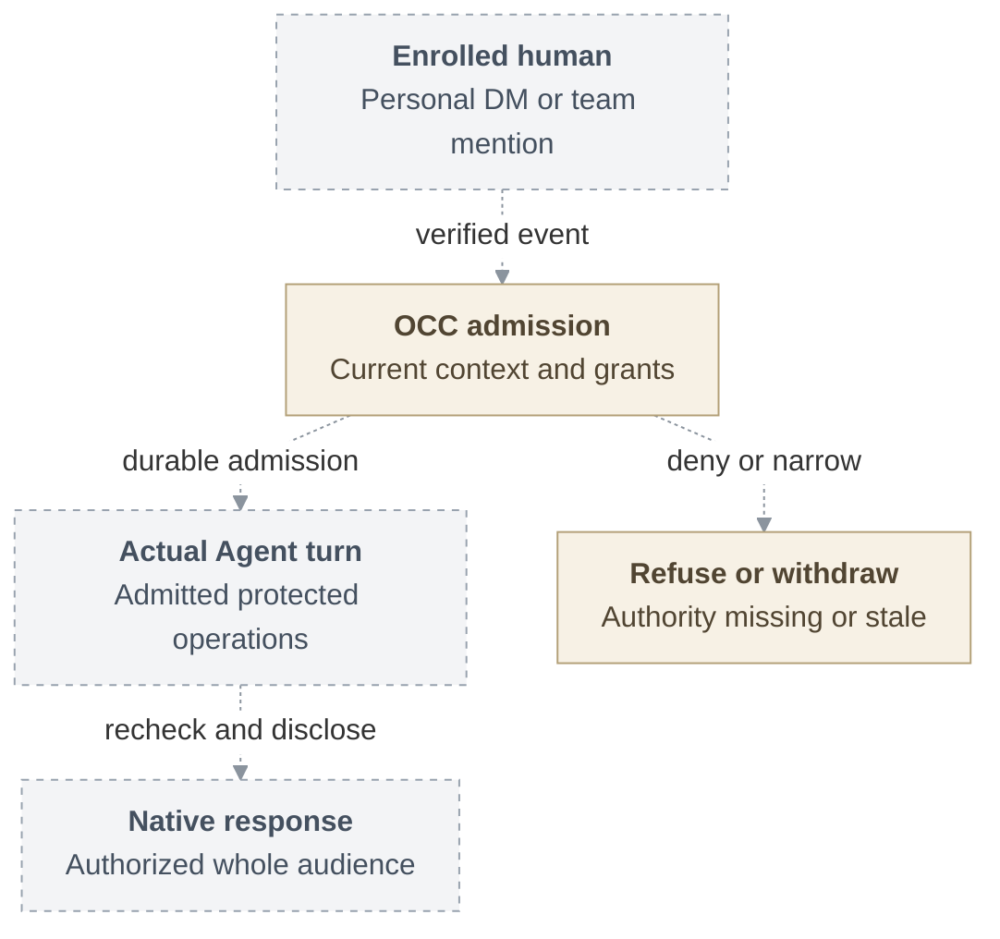

# RFC: Basic personal and team Agent access

## Problem and goal

A person needs to use a private personal Agent or an explicitly shared team Agent
without inheriting the deployer's authority or exposing another person's content.
The selected outcome is an enrolled human making a verified Slack or Teams request,
receiving only currently authorized content, and losing protected access when that
authority is withdrawn. The human remains the requester for authorization and audit.
A team Agent uses its admitted service authority and never falls back to the
requester's personal credentials.

This proposal extends OpenClaw Enterprise's existing identity and access management
(IAM), authentication, State, audit, lifecycle and credential owners. It includes
local accounts, personal and team access, both channels, separately qualified Codex
and Claude Code adapters, exact repository profiles and active withdrawal. Federated
sign-in is a separate stack that consumes the same stable human Principal and grants.

**Date:** 2026-09-18  
**Status:** Proposed. Implementation and qualification remain open.  
**Owner:** OCC authorization and Agent invocation.  
**Original source baseline:** `046e12b007bb1b4928bd3f7497a2353714be11a8`.

## Proposed journey

The dashed connections are proposed product handoffs. The OpenClaw Control Plane
(OCC) admits the request against current authority before the actual Harness runs
it. A Harness is the adapter that starts, observes and cancels the selected Agent
runtime. Native connectors retain provider verification and replies. Provider
adapters retain credential custody. A second current check governs disclosure to
the original conversation, so successful execution alone cannot authorize a reply.

## MVP boundary and present evidence

The first checkpoint uses deployer A and a different requester B in Slack, with a
dedicated Codex runtime and one protected repository HEAD read under `git-read`.
It must use the actual managed Agent and protected model path. That checkpoint is
narrower than the full selected result. Local accounts, Teams, personal and team
contexts, separately qualified Claude Code support, repository profiles and measured
withdrawal remain required later deliveries.

Pinned main supplies exact-action IAM. This RFC proposes policy administration
contracts and fixed roles. These definitions do not establish the
connected account/policy transaction, ordinary invocation, protected receiving path
or installed withdrawal. Source, composed checks, installed runtime, live-provider
qualification and release acceptance remain distinct evidence.

Compatibility mode preserves existing operation with its recorded assurance limits.
Enforced admission requires the selected installed capabilities and fails closed
without downgrade. gVisor, egress C1 and complete protected identity remain separate
checkpoints. The offered combinations and treatment of stronger future minima need
owner decisions. Per-effect authorization, custom roles, delegation, directory
synchronization and private compartments have separately triggered successors.

## Supporting design

- [Architecture](31-basic-rbac/architecture.md) explains the participating owners,
  original-State transaction, lock order and profile availability. Its
  [vertical request lifecycle](31-basic-rbac/architecture.md#request-lifecycle)
  shows admission, protected execution, disclosure and withdrawal in order.
  The [lifecycle SVG](31-basic-rbac/request-lifecycle.svg) is available separately.
- [Security](31-basic-rbac/security.md) identifies the assets and trusted actors,
  explains credential and content controls, and distinguishes traffic closure from
  physical termination and provider settlement.
- [Interfaces](31-basic-rbac/interfaces.md) contains the complete fixed-role catalog,
  known policy shapes, invocation permissions and repository assignments. It marks
  unresolved route and context designs instead of inventing wire contracts.
- [Invocation and content](31-basic-rbac/invocation-and-content.md) follows verified
  Slack and Teams conversations through context selection, whole-audience checks,
  actual runtime dispatch and the separate native reply fence.
- [Delivery](31-basic-rbac/delivery.md) defines the selected increments, consequential
  negative cases, independent qualification gates and owner decisions needed for
  acceptance. Documentation approval does not complete those gates.

## References

- [Current authorization at pinned main](https://github.com/openclaw/openclaw-enterprise/blob/e9766f35a25afa240ee109b41a6ef821fb68687e/docs/reference/authorization.md).
- [Proposed policy administration](31-basic-rbac/interfaces.md#policy-administration) and [fixed catalog](31-basic-rbac/interfaces.md#permissions-and-targets).
- [Human sign-in proposal](https://github.com/openclaw/openclaw-enterprise/pull/246),
  [protected identity](https://github.com/openclaw/openclaw-enterprise/pull/247),
  [gVisor](https://github.com/openclaw/openclaw-enterprise/pull/248),
  [egress](https://github.com/openclaw/openclaw-enterprise/pull/249) and
  [History](https://github.com/openclaw/openclaw-enterprise/pull/250).
