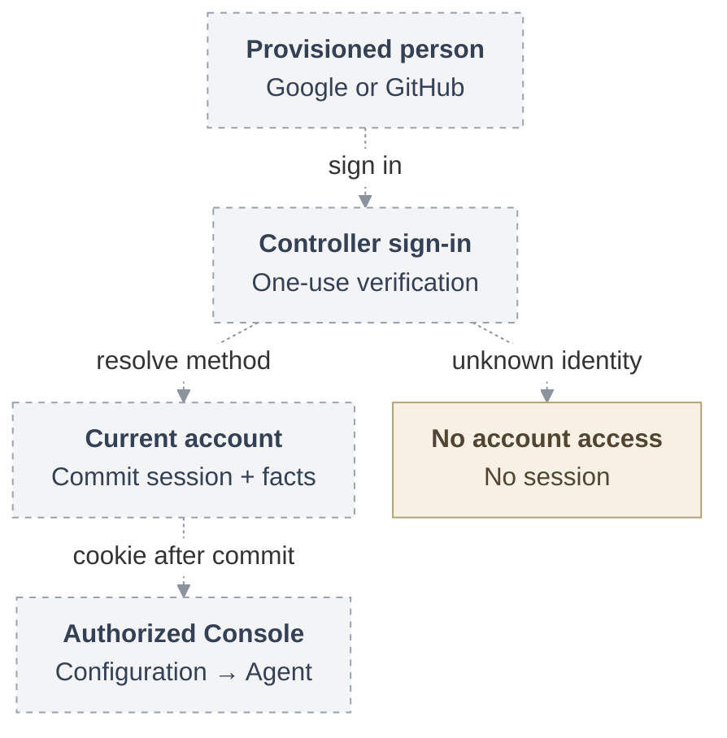

# RFC: Federated human sign-in

**Date:** 2026-09-18
**Status:** Draft. Shared account and policy interfaces under review.
**Owner:** OCC authentication, account lifecycle, and native IAM.
**Source baseline:** `openclaw/openclaw-enterprise` at `046e12b007bb1b4928bd3f7497a2353714be11a8`.

## Problem and proposal

People need to sign into OpenClaw Enterprise (OCE) with Google or GitHub while
keeping the same account and permissions. At the
[review baseline](31-human-federated-sign-in/architecture.md#current-source-and-proposed-joins),
the OpenClaw Control Plane (OCC) supports password sessions and service keys;
federated sign-in and joint account/policy administration remain proposed.

Add provider sign-in to the OCC Console for manually provisioned accounts.
Multiple sign-in methods identify one stable human account and its authorization
identity (Principal). Sign-in grants no resource access, creates no workspace,
and never links accounts by email. Existing Namespaces support personal and shared
workspaces without new Team, Organization, membership, or personal-workspace
resources. Agent runtime authority and repository credential custody remain
separate.

## First usable delivery

The browser milestone includes both Google and GitHub, manual account and method
administration, repair, explicit grants, and local session revocation. A person
must be able to see an authorized Namespace, create and read a Configuration,
create an Agent, and perform an allowed lifecycle operation. The selected identity
and access management (IAM) Driver checks every operation against its
[exact resource grants](31-human-federated-sign-in/account-lifecycle.md#console-grants).
Agent creation alone does not establish deployment.

Account and policy changes must commit together and preserve the last usable
local-password administrator. Empty `authentication.providers` preserves local
passwords, the explicitly provisioned development administrator, and service keys.
A provider outage leaves independent local recovery available; a failed selected
identity never silently selects another credential or person.

## Sign-in flow

Dashed arrows show the proposed connections. The controller verifies the provider
identity and resolves an existing active account. It discards provider tokens and
returns a cookie only after the commit of the session and required login facts is
acknowledged. An unknown verified person receives an actionable no-access result
without a session.
The [full request lifecycle](31-human-federated-sign-in/architecture.md#request-lifecycle)
shows callback consumption, verification, and commit ordering.

## Selected scope and exclusions

[Enterprise providers](31-human-federated-sign-in/interfaces.md#enterprise-profiles)
(standards-based OpenID Connect, Okta, tenant-bound Entra, and enterprise GitHub) and
[browser-assisted human CLI login](31-human-federated-sign-in/interfaces.md#human-cli)
remain selected later deliveries. The browser milestone can ship independently;
it does not complete that scope or require model execution or a History UI.

Public signup, invitations, self-service linking, automatic workspaces, SAML,
SCIM/directory synchronization, continuous provider offboarding, and
provider-derived repository grants remain excluded.

## Design details

- [Architecture](31-human-federated-sign-in/architecture.md) and
  [security](31-human-federated-sign-in/security.md) define component boundaries,
  protocol validation, and credential handling.
- [Account lifecycle](31-human-federated-sign-in/account-lifecycle.md) defines
  method repair, atomic policy changes, session invalidation, and recovery.
- [Interfaces](31-human-federated-sign-in/interfaces.md) defines browser,
  administration, enterprise, and CLI contracts. Browser lifetime configuration,
  no-access presentation, and operation-digest encoding remain open choices.
- [Delivery](31-human-federated-sign-in/delivery.md) defines the increments and
  the implementation, installation, and provider checks required for acceptance.
