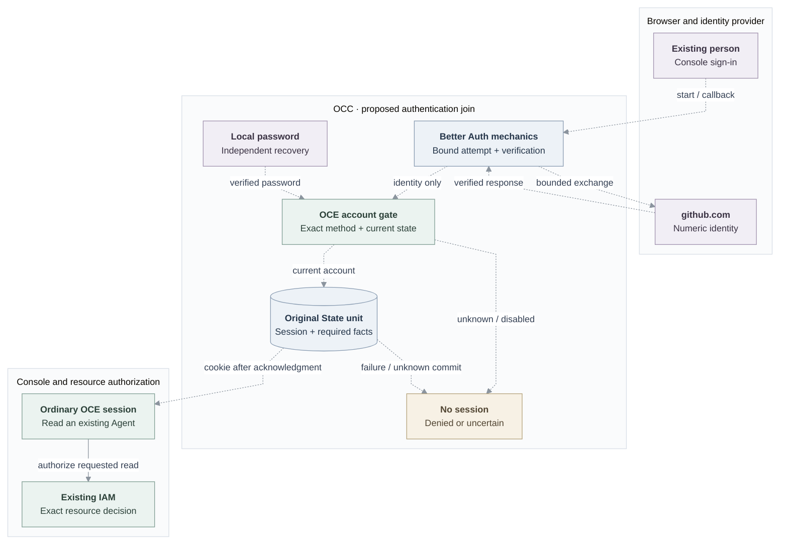

# RFC: GitHub sign-in for existing accounts

**Date:** 2026-09-22

**Status:** Draft; proposed integration and activation profile, not release qualification.

**Owner:** OCC Authentication, Account, State, and IAM.

**Source baseline:** [main at `311bc23`](https://github.com/openclaw/openclaw-enterprise/tree/311bc23012d0fd269483168b865adf79df630542).

## Problem and proposal

Use **Better Auth's provider and session machinery** to let an existing person
sign into OpenClaw Enterprise (OCE) with GitHub. OCE continues to own exact
account association, local admission and revocation, IAM authorization, and
required audit facts. The OpenClaw Control Plane (OCC) already uses Better Auth
for [password sessions](https://github.com/openclaw/openclaw-enterprise/blob/311bc23012d0fd269483168b865adf79df630542/apps/controller/src/auth/index.ts#L535-L585).
This proposal connects GitHub through curated routes and a guarded State adapter;
configuring a provider or adding an audit callback alone does not complete it.

Keep one stable OCE account and its existing authorization identity, or
**Principal**, with separate sign-in methods. An administrator attaches an exact
GitHub identity; login creates no account, Principal, permission, Namespace, or
Agent credential. Email never links accounts. Existing Namespaces remain the
personal and shared workspace boundary.

## First usable delivery

A current human Installation administrator attaches the configured github.com
numeric subject to an existing active account. The operation preserves its real
password, Principal, contact data, and grants, and invalidates its old sessions.
The person then chooses GitHub in Console, obtains an ordinary OCE session, and
reads an **existing authorized Agent**. The actual Console path is
`/api/auth/session` → `/namespaces` →
`GET /namespaces/:namespaceId/agents/:agentId`.

Existing accounts, resource setup, explicit IAM grants, and a usable protected
password administrator are prerequisites. IAM checks each requested operation;
optional panels may deny without adding permissions. Unknown identities receive
no session and a generic denial; administrators use a documented exact-subject
verification procedure. Local disable, account-wide revocation, and ordinary
logout remain required. A GitHub outage
must leave independently selected password recovery usable.

## Sign-in flow

Dashed edges are proposed joins; they do not mean asynchronous work. The solid
edge represents the existing resource-authorization path at the pinned baseline
([Console reader](https://github.com/openclaw/openclaw-enterprise/blob/311bc23012d0fd269483168b865adf79df630542/apps/controller/src/console/agents/detail.mjs#L153-L160),
[IAM decision](https://github.com/openclaw/openclaw-enterprise/blob/311bc23012d0fd269483168b865adf79df630542/packages/iam/src/index.ts#L899-L906)).
Neither edge style establishes installed or live-provider behavior.

The controller acknowledges one-use callback consumption before remote work.
After verification, one original State transaction rechecks the exact method and
active account and persists the fresh session with required facts. Only an
acknowledged, still-unexpired result releases a cookie. Audit failure or uncertain
commit releases none. Provider tokens are transient controller inputs and are
discarded. [Architecture](31-human-federated-sign-in/architecture.md#request-lifecycle)
owns the complete ordering; [security](31-human-federated-sign-in/security.md)
owns protocol, transport, and custody controls.

## Proposed activation and compatibility

The initial profile proposes one serving controller, one github.com **OAuth App**,
a fixed eight-hour absolute session lifetime without refresh, and a protected existing local
password administrator under qualified native IAM. Use one Installation, one
canonical HTTPS Console origin, host-only cookies, and restricted-role PostgreSQL.
Eight hours is this profile's
initial value, not a universal future maximum. Every retained password/GitHub
issuer, session reader, API admission path, and logout must use the same account
currentness checks.

Activation uses existing operator controls to close ingress, drain or terminate
admitted work, stop every old controller, and prevent automatic restart. Then
atomically establish recovery and currentness for existing accounts, invalidate
unbound legacy sessions, and persist activation. Start one compatible controller
and verify recovery and admission before reopening ingress. Preserve account IDs,
passwords, and grants. The installed procedure must prove exclusion; startup
checks alone are insufficient. Mixed-version serving, rolling upgrades, and
reverting to an old binary after activation are unsupported.

Before activation, absent GitHub configuration preserves the existing password
profile. After activation, missing required profile configuration prevents startup
until restored. This deliberate availability cost differs from a provider outage,
when password recovery must work.

The **initial implementation draft uses pre-activation accounts** and refuses
`POST /api/auth/accounts` after activation. Existing creator compatibility remains
an open acceptance obligation, not an approved permanent removal. Shared-cookie
native administration and additional auth readers are outside this initial profile;
refuse activation when enabled. Their compatibility obligations remain open. See the [support table](31-human-federated-sign-in/account-lifecycle.md#activation-and-supported-consumers).

## Implementation and acceptance

Deliver curated Better Auth routes, original-State attempt/session persistence,
authorized local controls, and the actual Console path as one reviewable increment.
Reuse existing stores; add no identity service or parallel policy writer.

Use the real controller, Console, selected native IAM, State/audit, and migrated
PostgreSQL with separate migrator and restricted application roles. Controlled
endpoints may replace only the remote provider. Record exact source/supplier
revisions, setup, routes, grants, results, and remaining gaps.

| Boundary                | Required evidence                                                                                                                                                                                                                                                                                                                                                  |
| ----------------------- | ------------------------------------------------------------------------------------------------------------------------------------------------------------------------------------------------------------------------------------------------------------------------------------------------------------------------------------------------------------------ |
| Identity and Console    | Unchanged password/GitHub account, Principal, and grants; positive existing-Agent read; optional email; exact subject uniqueness; unknown/same-email/disabled and cross-Namespace denial; grant removal and protected-content clearing. Label administrator-based proof honestly.                                                                                  |
| Protocol and custody    | Bound attempts, ambiguous callbacks, concurrent consumption, replay/fixation refusal, expiry/origin/return checks, finite local admission/work limits and persisted attempt/cleanup bounds; cancellation through body reads, byte limits, redirect refusal; no provider tokens in storage, cookies, controller or installed ingress logs, including failure paths. |
| Transactions            | Concurrent issuance/disable/revoke and actor-logout/revocation races; rollback, required-audit failure, unknown acknowledgment without credentials/replay/compensation; expected-version conflicts, authorized current-state inspection with unresolved request attribution, and stale/expired stored-session logout.                                              |
| Activation and recovery | Fresh/populated migration preserving identities, passwords, and grants; actual stop/drain/restart and incompatible-controller exclusion; rejected legacy sessions; configuration-removal refusal; every retained consumer; usable password administration during provider outage.                                                                                  |

Require independent changed-SQL and complete security-boundary review, resolve
defects, and update living references, operator guides, and source-backed flows.
Source review, composed integration, installed HTTPS/cookie/log custody, actual
GitHub registration, and release acceptance remain separate gates. This RFC
claims none of those product outcomes. Existing creator compatibility remains
open; neither passing tests nor draft publication grants a permanent waiver.

## Selected scope and exclusions

Google could follow through the same account/session path, with approved stable
subject enrollment and nonce/claim qualification. External-only onboarding and
individually qualified static Okta, Keycloak, or Entra connections are other
possible extensions. These are tentative directions, not a committed delivery
program. Broad method repair, combined policy administration, CLI approval,
bootstrap overhaul, and the fuller Configuration → Agent lifecycle remain outside
this increment.

Public signup, invitations, self-service linking, automatic workspaces,
SAML/SCIM/JIT, group synchronization, dynamic SSO administration, provider-driven
global logout/offboarding, and provider-derived repository grants are excluded.
Human login adds no SPIFFE/SPIRE, model-execution, or History-UI prerequisite.
Agent identity, repository GitHub App credentials, transport withdrawal, and
physical runtime stop retain their separate owners.

## Design details

[Architecture](31-human-federated-sign-in/architecture.md) owns the account,
transaction, activation, and no-access contracts; [security](31-human-federated-sign-in/security.md)
owns protocol and custody. The original [account](31-human-federated-sign-in/account-lifecycle.md),
[interface](31-human-federated-sign-in/interfaces.md), and
[delivery](31-human-federated-sign-in/delivery.md) paths remain as compact references.
