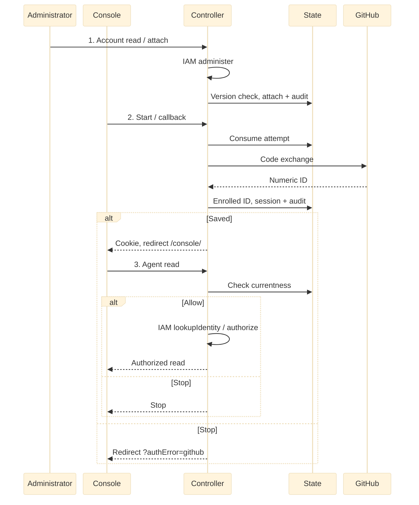

# RFC: GitHub sign-in for existing accounts

**Date:** 2026-09-22  
**Status:** Draft. Describes the contract implemented by [PR #305](https://github.com/openclaw/openclaw-enterprise/pull/305), which is unmerged; this RFC stays Draft until it lands. Deployment and live GitHub verification remain open.

**2026-09-23 amendment:** Use the repository integration's GitHub App for sign-in, superseding the OAuth-App-only choice. Login uses the client ID and secret. Repository access retains its separate private-key consumer.

## Problem and decision

An existing OpenClaw Enterprise (OCE) user signs in with GitHub to read an authorized Agent. An Installation administrator enrolls the identity through the account API. The local user, Installation Principal and grants remain. Login creates no account, link, IAM grant or repository access. Unknown or disabled identities are denied.

## Scope

One Installation and controller use native IAM, restricted-role PostgreSQL and one HTTPS origin. Mixed versions, shared-cookie native administration, other session readers and external account, policy and provisioning writers are excluded. Configured password recovery survives GitHub outages. Password-only binding is weaker. Service keys retain precedence.

Cancellation and denial recovery remains the product owner's decision. PR #305 returns the tab to the sign-in page with a generic GitHub error, offering a retry or password sign-in; it does not block tabs.

A future enabled event could enroll an identity and settle an administrator-configured, narrow, revocable shared-Agent or conversation entitlement through State and IAM, enforced by Gateway and sharing. This is tentative. Login never restores revoked grants. Google, enterprise OIDC, linking, broader CLI and stronger cross-tab guarantees remain future work. Possible follow-ups, not implemented by PR #305: an attempt identifier returned from start, a signed result receipt exchanged for the new session's key, a per-request session-key header narrowing the cookie session, discovery that pins session binding, and a stopped-writer maintenance CLI.

## Contract

Better Auth runs in the controller. PostgreSQL State owns attempts, account and method currentness, sessions and audit. The controller's IAM Driver resolves identity to a Principal and authorizes each exact action. Online account administration uses both: State locks actor and target accounts and rechecks the actor session, while IAM authorizes `administer` outside that transaction.

### Operator setup and activation

Provision password accounts and explicit IAM grants and verify password recovery. Configure the App, Installation, restricted database and trust, and auth settings. Register `/api/auth/providers/github/callback` on `OCC_AUTH_BASE_URL`. Allow controller HTTPS egress to GitHub token and user endpoints. Disable native administration.

1. Close ingress. Disable restarts, rollouts, and policy and provisioning writers. Drain or terminate admitted requests and stop every old controller.
2. Set `OCC_AUTH_GITHUB_CLIENT_ID`, `OCC_AUTH_GITHUB_CLIENT_SECRET` and `OCC_AUTH_GITHUB_RECOVERY_USER_ID` in protected API configuration. Partial configuration fails startup.
3. Start one compatible controller. Startup activates before serving: it validates configuration, the recovery password administrator, Installation, Drivers and IAM `administer`, enrolls existing password accounts, invalidates unbound sessions and refuses later account creation. There is no activate command. A failure keeps ingress closed.
4. Through restricted access, verify recovery, login, stale-session refusal and authorized Agent read. Reopen ingress, retaining one serving controller.
5. Administer accounts online through the HTTP interfaces below. Attach an independently verified 1–20 digit GitHub ID without a leading zero at the version just read. Stale versions and owned subjects are refused. Attachment preserves account and grants while invalidating sessions and proofs.

### Console sign-in and security

All paths begin with `/api/auth`. JSON results use the `{data, meta: {requestId}}` envelope.

| Operation                                 | Input and result                                                                                                                                         |
| ----------------------------------------- | -------------------------------------------------------------------------------------------------------------------------------------------------------- |
| `GET /providers`                          | Returns `{github: boolean}` so Console can show the button.                                                                                              |
| `POST /providers/github/start`            | Requires the configured browser `Origin`. Returns `{url}` and sets the attempt cookie. Accepts no provider override or return URL.                       |
| `GET /providers/github/callback`          | Receives `state` and `code` or provider `error`, with the matching browser cookie. Redirects to `/console/`, or `/console/?authError=github` on failure. |
| `GET /accounts/:userId`                   | Returns current `userId`, `principalId`, `version`, `disabled`, and `methods` with `methodId`, `providerId`, and `subject`.                              |
| `POST /accounts/:userId/providers/github` | Accepts `{subject, expectedVersion}`. Attaches the numeric GitHub identity and invalidates prior sessions and pending authentication proofs.             |
| `POST /accounts/:userId/disable`          | Accepts `{expectedVersion}`. Blocks login and invalidates sessions and pending proofs. Refuses the protected recovery account.                           |
| `POST /accounts/:userId/revoke`           | Accepts `{expectedVersion}`. Invalidates sessions and pending proofs while allowing a fresh login.                                                       |

Account operations require a current human session, the exact configured `Origin` and native IAM `administer` on the Installation. Service keys do not qualify. Mutations return `{userId}`, leave IAM grants unchanged and return `409 RESOURCE_CONFLICT` for a stale version.

Console shows **Continue with GitHub** after successful discovery; password login remains available if discovery fails. Callback consumes the browser-bound attempt once before exchange, including valid provider errors. It rejects ambiguity, uses S256 PKCE and fixed endpoints, reads the numeric ID and discards tokens. Client ID plus immutable numeric ID uniquely identifies the method. Email, username, domain and organization confer no authority. Changing client ID requires reattachment. Secret rotation preserves enrollment but invalidates pending attempts.

After session and audit commit, callback sets the session cookie and redirects to `/console/`. Denial, unknown identities and failures redirect to `/console/?authError=github` with a generic message, no new cookie and no automatic retry. Console then uses its existing session inspection, Namespace and Agent reads. Logout revokes the cookie's session and commits audit before clearing it; it does not cancel an in-flight sign-in. Late responses can change shared cookies.

For unsafe cookie-session requests, the controller requires the exact configured Console Origin before session lookup or effects; absent, malformed or different Origins and contradictory supplied Fetch Metadata are rejected. An invalid service key never falls back to a cookie; bearer credentials are rejected. The native proxy retains its separate policy. Host-only cookies are not this boundary. PR #305 checks the exact Origin on start and account routes; [PR #509](https://github.com/openclaw/openclaw-enterprise/pull/509) is the general cookie-mutation guard and is unmerged.

Attempts expire in five minutes. Provider calls share ten seconds, cap each response at 64 KiB and refuse redirects. Per controller, password admission is 30 per minute and four active, GitHub start/callback is 60 per minute and eight active. State caps 1,000 pending attempts per Installation and removes at most 100 expired rows per start. Sessions last eight hours without refresh and use host-only Secure, HttpOnly, SameSite=Lax cookies. Reject duplicate active-session cookie names and redact credentials, tokens, codes and raw provider errors. Local revocation does not continuously track GitHub suspension, stop Agents or close repository connections.

Proposed lifecycle. The controller composes IAM for both online administration and reads. Commit must be confirmed; read requires current identity and IAM allow. Denial or unknown outcome stops the path. [Source](31-human-federated-sign-in/request-lifecycle.mmd) and [SVG](31-human-federated-sign-in/request-lifecycle.svg).

### Recovery and uncertain outcomes

State commits local effects and audit together, not IAM reads, GitHub calls or browser delivery. On uncertain COMMIT discard the client without another query, fresh cookie, replay or compensation. A later read is current state, not a receipt. Preserve a potentially created account unless its owner proves no commit. An unknown administrative commit returns `503 DEPENDENCY_UNAVAILABLE` without replay or compensation; resolve it before choosing a new action and version. Account administration cannot disable recovery, but out-of-band changes can destroy it. Missing configuration prevents startup after activation. Rolling upgrade, old-binary rollback and method repair are unsupported.

## Implementation and verification

Extend controller, Console and State. Preserve main SQL and receipts, qualify receiving history and refuse unsupported predecessors. PR #305's `0031_human_authentication` migration must be renumbered to 0034 after main's 0031–0033, including its receipt names.

Acceptance requires startup activation under stopped maintenance, recovery, Console login and authorized Agent read, unknown or disabled refusal, stale-version and revocation checks, audit, uncertain outcomes, upgrade preservation and installed HTTPS with the actual GitHub App. Pinned [main](https://github.com/openclaw/openclaw-enterprise/blob/181b0472f9a5a9d422035edf5121d3a15c200cb5/docs/reference/authentication.md) has password authentication. A source review found that a sibling-origin cookie POST could stop an Agent; the GitHub-profile consequence is inferred, not demonstrated in a real database or browser. [PR #509](https://github.com/openclaw/openclaw-enterprise/pull/509) is that fix; it and the exact source review remain open. Prior local checks do not establish exact-head hosted CI, installed HTTPS, live GitHub, human approval or release.

## Open decisions and references

PR #305 documents setup and administration in [`docs/reference/authentication.md#github-sign-in-for-existing-accounts`](../docs/reference/authentication.md#github-sign-in-for-existing-accounts) and the procedure in [`docs/guides/deploy/production-installation.md#enable-github-browser-sign-in`](../docs/guides/deploy/production-installation.md#enable-github-browser-sign-in). Authenticated readback on the exact published stack gates publication. Anonymous 404 is not an intended-reader access test.

## Manual Notes
