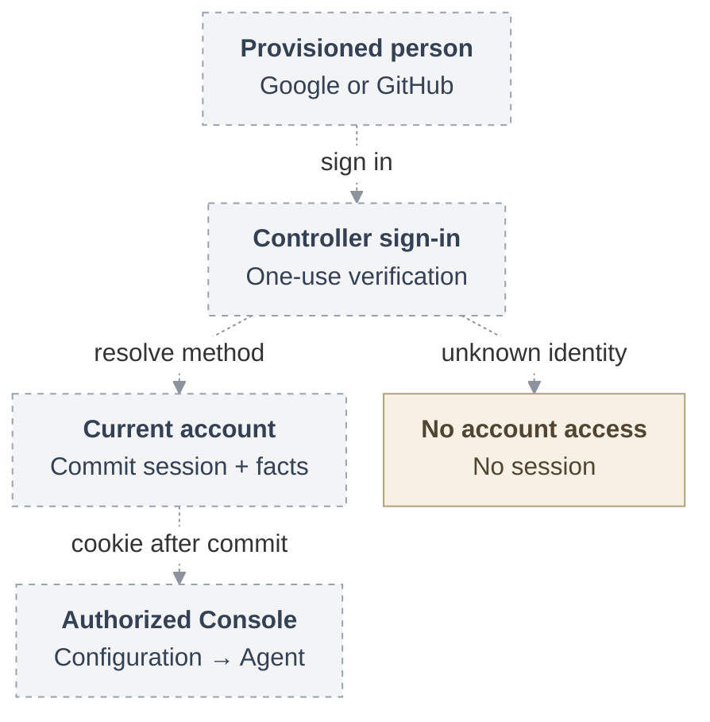

# RFC: Federated human sign-in

## Problem and goal

A person who uses Google or GitHub needs to enter an authorized workspace in
OpenClaw Enterprise (OCE) without acquiring a second platform identity or broader
permissions. The proposal lets a manually provisioned person sign into the
OpenClaw Control Plane (OCC) Console, see an authorized Namespace, create a
Configuration and Agent, and perform an allowed Agent lifecycle operation.
Several sign-in methods identify one stable human. Existing Namespaces serve
personal or shared workspaces without new Team, Organization, membership, or
personal-workspace resources.

**Date:** 2026-09-18
**Status:** Draft. Shared account and policy interfaces under review.
**Owner:** OCC authentication, account lifecycle, and native IAM.
**Source baseline:** `openclaw/openclaw-enterprise` at `046e12b007bb1b4928bd3f7497a2353714be11a8`.

The first browser delivery includes both providers, manual account and method
administration, repair, explicit grants, and local revocation. Enterprise providers
and browser-assisted human CLI login are selected subsequent deliveries. Completing
the browser checkpoint does not complete that selected goal.

## Proposed journey

Proposed journey. Dashed arrows identify unconnected handoffs, including joins
between existing components. This diagram does not establish installed federation.

The controller verifies the selected provider identity, resolves its existing
account association, and commits a fresh stored session and required login facts
before returning a cookie. The selected identity and access management (IAM)
Driver then authorizes each Console operation. Sign-in grants no resource access
by itself. An unknown verified person receives an actionable no-access result
without an OCE session.

## MVP boundary and present evidence

At review baseline `724dcb5`, OCC supports password sessions and service keys.
Federation is unsupported there, and account provisioning uses separate
authentication and IAM writes. The proposed joint transaction and connected
browser workflow still need implementation and qualification. The selected
[account and policy contracts](31-human-federated-sign-in/interfaces.md#account-administration)
remain proposed. The available account-security supplier does not establish their
composition.

Empty `authentication.providers` preserves local-password login, the explicitly
provisioned development administrator, and service keys. A provider outage leaves
independently selected local recovery available. Failure of a selected identity
never silently selects another credential or person.

The browser delivery uses the smallest account and selected-IAM capability needed
for the ordinary Console journey. Protected invocation, workload identity,
egress, active withdrawal, and History serving retain separate delivery gates.
Neither model execution nor a History UI is a login prerequisite. Source,
composed checks, installed behavior, live-provider qualification, and release
readiness remain separate evidence.

Public signup, invitations, self-service linking, automatic workspace creation,
SAML, SCIM, directory synchronization, continuous provider offboarding, and
provider-derived repository grants remain outside the selected scope. These
exclusions do not make enterprise OIDC or human CLI optional.

## Supporting design

- [Architecture](31-human-federated-sign-in/architecture.md) explains the existing
  owners, proposed joins, dependency failures, and callback order. Its
  [request lifecycle](31-human-federated-sign-in/architecture.md#request-lifecycle)
  embeds a [vertical SVG](31-human-federated-sign-in/request-lifecycle.svg) showing
  the consumption and commit boundaries before credential release.
- [Security](31-human-federated-sign-in/security.md) follows identity verification,
  session custody, and authority boundaries. It separates recorded trust limits
  from required proof and unresolved choices.
- [Interfaces](31-human-federated-sign-in/interfaces.md) defines the known browser,
  administration, enterprise, and CLI contracts. It identifies route, lifetime,
  and no-access choices still requiring owner decisions.
- [Account lifecycle](31-human-federated-sign-in/account-lifecycle.md) owns method
  association, repair, currentness, joint policy transactions, and protection of
  the last usable local administrator. It explains the exact Console grants.
- [Delivery](31-human-federated-sign-in/delivery.md) defines the independently
  reviewable increments and real-consumer evidence required to complete each.
  Browser, enterprise, and CLI qualification have distinct acceptance gates.

## References

- [Authentication at the review baseline](https://github.com/openclaw/openclaw-enterprise/blob/724dcb5cb80b5e76a62e8267a21185a2e91a85c2/docs/reference/authentication.md)
  and [existing provisioning](https://github.com/openclaw/openclaw-enterprise/blob/724dcb5cb80b5e76a62e8267a21185a2e91a85c2/apps/controller/src/index.ts#L2531-L2563).
- [Published proposal before this split](https://github.com/openclaw/openclaw-enterprise/blob/15ecf3ad27757900227bb1982b2e600468482303/specs/31-human-federated-sign-in.md).
- [OIDC token-response validation](https://openid.net/specs/openid-connect-core-1_0.html#TokenResponseValidation)
  and [GitHub App user-token permissions](https://docs.github.com/en/apps/creating-github-apps/authenticating-with-a-github-app/generating-a-user-access-token-for-a-github-app).
