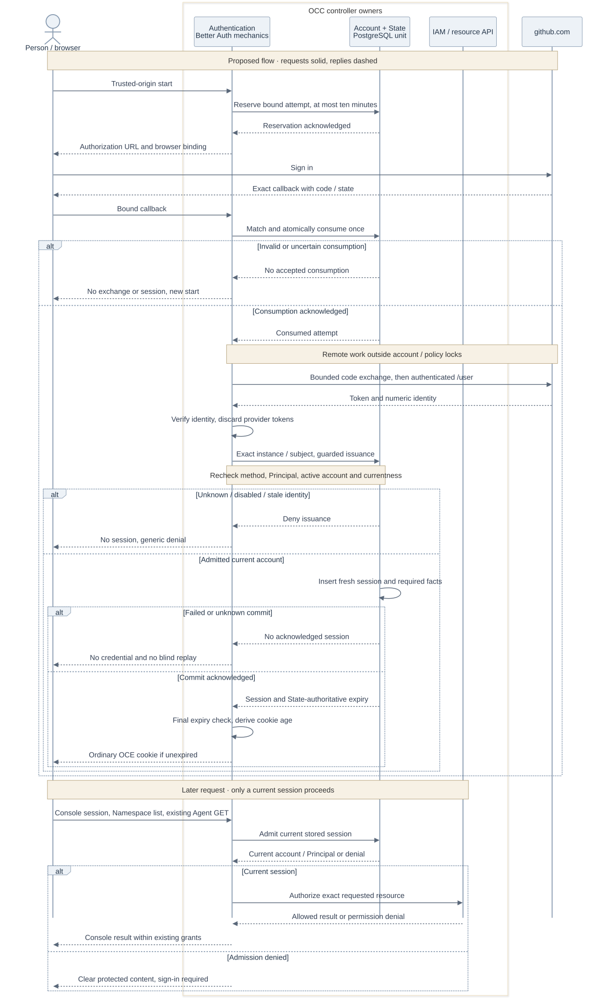

<a id="rfc-federated-human-sign-in"></a>

# RFC: GitHub sign-in for existing accounts

**Date:** 2026-09-22

**Status:** Draft. [Implementation PR #305](https://github.com/openclaw/openclaw-enterprise/pull/305) is available for review. Deployment and live GitHub verification remain open.

**2026-09-23 amendment:** Use the same GitHub App registration for sign-in and
repository integration. This supersedes the OAuth-App-only choice below, including the Scope and
Verification sections; those retain the original proposal wording.
Sign-in uses the App's client ID and client secret; repository access keeps its
existing private-key consumer. OCC reads the authenticated user's numeric ID,
then discards the returned access and refresh tokens. App permissions govern
those tokens; sign-in grants no OCE repository access. Changing the client ID
requires explicit administrator enrollment under the new provider instance.
See [the implementation's setup reference](https://github.com/openclaw/openclaw-enterprise/blob/feat/github-human-sign-in-20260922/docs/reference/authentication.md#github-sign-in-for-existing-accounts).

## Problem and decision

Let an existing OpenClaw Enterprise (OCE) user sign in with GitHub and keep the
same account and permissions. The OpenClaw Control Plane (OCC) already uses
Better Auth for password login and session cookies. Extend that path with
GitHub OAuth, explicit administrator enrollment, and local session revocation.

An administrator associates a GitHub identity with an existing OCE account.
The user chooses **Continue with GitHub** in Console, signs in, and opens an
Agent they already have permission to read. Login creates no account or grants.
Personal and team use share the existing Namespace and IAM permission model.

## Scope

The MVP supports one github.com OAuth App, one serving controller, native IAM,
restricted-role PostgreSQL, and one HTTPS Console origin. Accounts and permissions
are provisioned beforehand. Password login remains available, including one
designated recovery administrator who can sign in during a GitHub outage.

While this profile is active, account creation, policy administration, bootstrap,
and other identity writers stay stopped. Shared-cookie native administration and
other session readers are unsupported. These are first-release compatibility
limits, not permanent removals of those capabilities.

## Contract

### How this extends OCE

| Existing component                      | Change                                                                                                                                           |
| --------------------------------------- | ------------------------------------------------------------------------------------------------------------------------------------------------ |
| Controller authentication / Better Auth | Add GitHub verification and route password and GitHub session writes through OCE State. Retain library password verification and signed cookies. |
| PostgreSQL State                        | Store enrollment and revocation state, bind sessions to it, and save authentication changes with their audit events in one transaction.          |
| Native IAM                              | Resolve the same account to the same Principal, OCE's authorization identity. Continue checking permissions for each resource request.           |
| Console                                 | Add the GitHub button. Continue using the existing session, Namespace, and Agent APIs.                                                           |

The existing user, sign-in method, and session records remain. New State records
bind each user to their Installation and Principal, track whether the account is
disabled, designate the recovery account, and store short-lived login attempts.
Account and method **version numbers** let session reads detect revocation or a
changed sign-in method.

A GitHub method belongs to exactly one local account. Its identity is the
configured OAuth application's client ID plus GitHub's immutable numeric user ID.
The endpoints and application kind are fixed in this MVP. Changing the client ID
selects a different provider instance; rotating its secret preserves enrollment.
Email, GitHub usernames, and organization membership never select the local
account or grant permissions. Login tokens are separate from the GitHub App
credentials used by Agents to access repositories.

### Setup and sign-in

Configure `OCC_AUTH_GITHUB_CLIENT_ID`, `OCC_AUTH_GITHUB_CLIENT_SECRET`, and
`OCC_AUTH_GITHUB_RECOVERY_USER_ID` on the controller, alongside existing
`OCC_AUTH_BASE_URL` and `OCC_AUTH_SECRET`. Keep secrets in protected server
configuration. Register `/api/auth/providers/github/callback` on the configured
origin as the OAuth callback.

1. A human Installation administrator verifies the person's numeric GitHub ID
   and the intended OCE account independently, then attaches that identity.
   Attachment preserves the password and permissions but invalidates old sessions.
2. Console starts a login attempt and sends the browser to GitHub.
3. On return, OCC checks and consumes the browser's attempt before exchanging
   the code. GitHub's authenticated `/user` response supplies the numeric ID.
4. OCC finds the enrolled account, checks that it is enabled, and saves a new
   session with its audit event. Only a confirmed commit releases a cookie.
   Unknown or disabled identities receive a generic denial and no session.
5. Console returns to its existing workflow:
   `/api/auth/session` → `/namespaces` → an authorized Agent read.



Proposed lifecycle. Arrows show requests and replies, not deployment status.
[Editable diagram](31-human-federated-sign-in/request-lifecycle.mmd).

### HTTP interfaces

All paths below begin with `/api/auth`. JSON results use the existing
`{data, meta: {requestId}}` envelope.

Browser routes reserve `/providers/{provider}/start` and
`/providers/{provider}/callback`, where `{provider}` selects a server-configured
integration. Only GitHub ships in this MVP, with no arbitrary issuer URLs or
generic OIDC backend.

| Operation                                 | Input and result                                                                                                                                         |
| ----------------------------------------- | -------------------------------------------------------------------------------------------------------------------------------------------------------- |
| `GET /providers`                          | Returns `{github: boolean}` so Console can show the button.                                                                                              |
| `POST /providers/github/start`            | Requires the configured browser `Origin`. Returns `{url}` and sets the attempt cookie. Accepts no provider override or return URL.                       |
| `GET /providers/github/callback`          | Receives `state` and `code` or provider `error`, with the matching browser cookie. Redirects to `/console/`, or `/console/?authError=github` on failure. |
| `GET /accounts/:userId`                   | Returns current `userId`, `principalId`, `version`, `disabled`, and `methods` with `methodId`, `providerId`, and `subject`.                              |
| `POST /accounts/:userId/providers/github` | Accepts `{subject, expectedVersion}`. Attaches the numeric GitHub identity and invalidates prior sessions and pending authentication proofs.             |
| `POST /accounts/:userId/disable`          | Accepts `{expectedVersion}`. Blocks login and invalidates sessions and pending proofs. Refuses the protected recovery account.                           |
| `POST /accounts/:userId/revoke`           | Accepts `{expectedVersion}`. Invalidates sessions and pending proofs while allowing a fresh login.                                                       |

All four account operations require a current human session, the exact trusted
`Origin`, and native IAM `administer` permission on the Installation. Service keys
do not qualify. Mutations return `{userId}` and leave IAM grants unchanged.

For example, after an administrator reads account version `1`, the attachment
body is:

```json
{ "subject": "12345678", "expectedVersion": 1 }
```

`subject` is the verified GitHub user ID, not a username or email. The version
prevents overwriting a concurrent account change: a stale value returns
`409 RESOURCE_CONFLICT`. State rechecks the administrator's session while locking
the affected accounts, so concurrent logout or revocation can deny the mutation.

If a database commit's outcome is unknown, administration returns
`503 DEPENDENCY_UNAVAILABLE`. Do not automatically retry or compensate.
An authorized account read shows present state, but cannot prove which request
caused it. Resolve the uncertain operation before choosing another action.

The existing password sign-in, session inspection, and sign-out routes remain.
Both password and GitHub sessions expire after eight hours without refresh.
Every request checks the stored session, account, method, versions, and expiry.
Logout commits revocation and its audit event before clearing the cookie.

### Security

The main threats are signing into the wrong local account, replaying a callback,
using a revoked session, unauthorized account changes, and credential disclosure.
Browsers and provider responses are untrusted. Deployment and database
administrators remain trusted.

| Threat                                     | Required protection                                                                                                                                                                                                                                                                                                                                              |
| ------------------------------------------ | ---------------------------------------------------------------------------------------------------------------------------------------------------------------------------------------------------------------------------------------------------------------------------------------------------------------------------------------------------------------- |
| Account takeover through automatic linking | Explicit administrator enrollment, unique immutable method ownership, and no signup or email-based association. A failed login never falls back to another identity.                                                                                                                                                                                             |
| Forged or replayed callback                | Unpredictable state, browser binding, S256 PKCE, exact provider/configuration/callback matching, and five-minute expiry. Reject ambiguous parameters. Consume once before remote work, including valid provider-error callbacks.                                                                                                                                 |
| Revocation racing with login               | Serialize account changes with session issuance. Recheck account and method versions in the transaction that stores the session and audit event. No cookie after audit failure, unknown commit, or expiry.                                                                                                                                                       |
| Provider stalls or resource exhaustion     | Bound request admission, concurrent work, stored attempts, and cleanup. Cancel both provider calls through body reads after a shared ten-second deadline, cap each response at 64 KiB, and refuse redirects. Password recovery has separate request capacity.                                                                                                    |
| Credential disclosure                      | Use Secure, HttpOnly, SameSite=Lax, host-only cookies. Discard provider tokens after verification. Redact credentials, codes, and raw provider errors from response bodies, logs, telemetry, and audit. Audit contains local IDs, not external subjects or profiles. The OAuth code/state redirect and session cookie carry only their intended protocol values. |

Local disablement and revocation affect OCE sessions. GitHub suspension does not
continuously revoke them. Neither operation stops an Agent or closes its
repository connections.

### Activation and recovery

Use a maintenance window: close ingress, drain or terminate admitted work, stop
old controllers, and prevent their restart. Validate configuration and existing
accounts before changing state. Atomically enroll the account population,
designate a usable password administrator, and invalidate legacy sessions.
Start one compatible controller and verify recovery before reopening ingress.
Rolling upgrades and rollback to old binaries are unsupported.

The recovery designation is fixed. Its account cannot be disabled through this
API, and its password and Installation permission must remain available.
Out-of-band database or policy changes can still destroy recovery.

An installation that has never enabled GitHub retains its existing password and
service-key behavior when GitHub configuration is absent. After activation,
missing required configuration prevents startup. A GitHub outage with valid
configuration still permits password login.

## Implementation

Deliver one focused implementation over this RFC:

1. Extend controller auth and Console with the routes above, using Better Auth
   helpers and fixed GitHub endpoints.
2. Add the State enrollment, session, attempt, and recovery records. Connect
   both login methods, account controls, and audit to the same transactions.
3. Document and verify operator enrollment, maintenance activation, and password
   recovery through the ordinary Console workflow.

The draft code and detailed API/operator references are in
[PR #305](https://github.com/openclaw/openclaw-enterprise/pull/305).
Milestone M3, the stopped-maintenance command (`pnpm auth:maintain`), follows
in a PR stacked on #305: activation, enrolment repair, recovery password reset,
session purge, and deactivation back to the password-only profile. See the
[operator procedure](../docs/guides/deploy/auth-maintenance.md).
The proposed State adapter extends existing persistence; it introduces no
separate identity service or IAM policy writer.

## Verification

| What must work                     | How we establish it                                                                                                                                                                   |
| ---------------------------------- | ------------------------------------------------------------------------------------------------------------------------------------------------------------------------------------- |
| Existing permissions survive login | Sign in through real Console and read an existing authorized Agent. Deny unknown/same-email identities and unauthorized Namespace access.                                             |
| Revocation and failure stay safe   | Exercise concurrent login, disable, revoke, and administrator logout against PostgreSQL. Test replay, expiry, stale versions, audit failure, and lost commit acknowledgment.          |
| Recovery and deployment hold       | Preserve existing users, passwords, and grants on upgrade. Verify old-controller exclusion, HTTPS cookies, secret/log handling, and password administration during a provider outage. |
| GitHub accepts the integration     | Complete sign-in using the actual registered OAuth App and exact deployed callback.                                                                                                   |

The implementation draft has source review and connected PostgreSQL, controller,
IAM, and Console checks using controlled GitHub endpoints. Receiving migration
integration, installed maintenance/HTTPS/log checks, live GitHub sign-in, and
release acceptance remain open.

## Deferred

Google sign-in is the next planned provider extension, using OIDC verification
through the same account/session path. Enterprise SSO comes later; configured
Entra, Okta, or other enterprise providers need their own identity rules and
qualification.

Later work may add external-only onboarding, account creation while this profile
is active, method repair/linking, reenablement, password reset, CLI browser login,
and additional session consumers. Public signup, invitations, SAML/SCIM, group
sync, dynamic SSO administration, provider-wide logout, and Agent workload
identity are outside this MVP.
