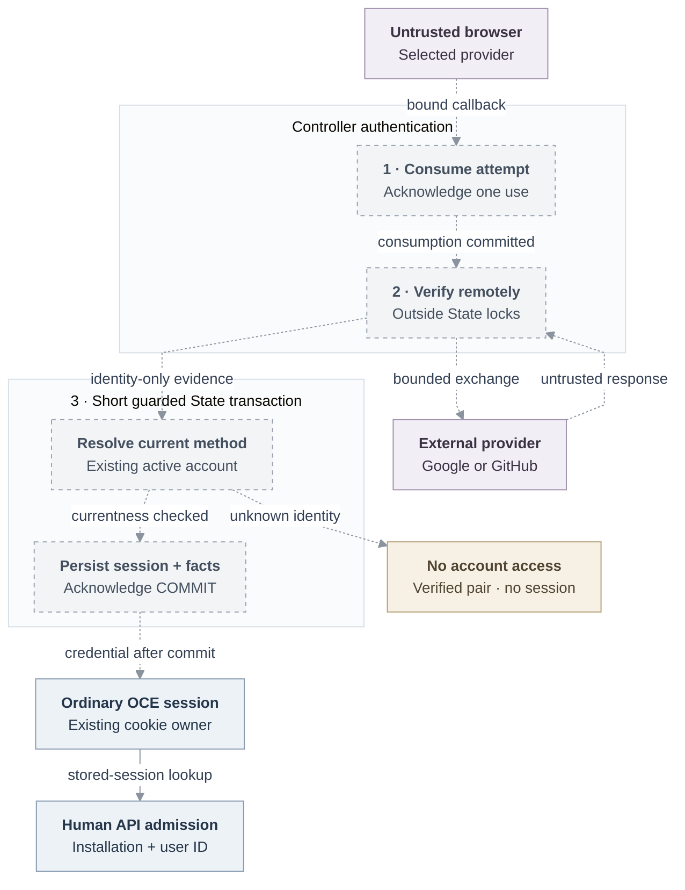

# RFC: Federated human sign-in

**Date:** 2026-09-18
**Status:** Draft; shared account and policy interfaces under review.
**Owner:** OCC authentication, account lifecycle, and native IAM.
**Source baseline:** Public `openclaw/openclaw-enterprise` at `046e12b007bb1b4928bd3f7497a2353714be11a8`.

## Decision

A manually provisioned person signs into the OpenClaw Control Plane (OCC) Console
with Google or GitHub, sees an authorized Namespace, creates a Configuration and
Agent, and performs an allowed Agent lifecycle operation. Several methods identify
one stable human. Existing Namespaces serve personal or shared workspaces without
new Team, Organization, membership, or personal-workspace resources.

The browser release includes manual account/method administration and repair,
explicit grants, local revocation, and this ordinary Console journey. Enterprise
providers and human CLI login remain selected subsequent deliveries.

## Current boundary and scope

At review baseline [`724dcb5`](https://github.com/openclaw/openclaw-enterprise/blob/724dcb5cb80b5e76a62e8267a21185a2e91a85c2/docs/reference/authentication.md),
OCC supports password sessions and service keys; federation is unsupported.
[Account provisioning](https://github.com/openclaw/openclaw-enterprise/blob/724dcb5cb80b5e76a62e8267a21185a2e91a85c2/apps/controller/src/index.ts#L2531-L2563)
uses separate authentication/IAM writes. The shared transaction and connected
browser path below remain proposed, without installed or live-provider acceptance.

Empty `authentication.providers` preserves local-password login, the explicitly
provisioned development administrator, and service keys. Provider outage preserves
independently selected local recovery; a failed selected identity never falls back.
Supported account-client authentication survives migration through internal
composition, without caller-selectable bypasses.

Use only the browser path's account and selected-IAM capabilities. Protected
invocation, workload identity, egress, active withdrawal, and History serving have
separate delivery gates; neither model execution nor a History UI gates login.

## Design and failure behavior

### Accounts and authority

Better Auth `user.id` remains the immutable human subject under the Installation
issuer. Existing `account` rows represent methods: persist one owner per exact
`(providerInstanceId, subject)`, allowing several methods per account. Preserve
legitimate account/Principal IDs and unique manually supplied contact email;
provider email may be absent. Never attach or merge by email.

| Provider identity | Versioned immutable trust tuple and verified subject                                              |
| ----------------- | ------------------------------------------------------------------------------------------------- |
| Google/OIDC       | Exact issuer, client ID, fixed subject policy; validated `sub`. Google uses its canonical issuer. |
| GitHub            | Exact web/API origins, client ID, application kind; authenticated numeric user ID.                |
| Entra extension   | Additionally pin tenant; validated immutable object ID within that tenant.                        |

Labels, route names, and secret rotation preserve identity. Issuer, client,
tenant, or subject-rule changes create another instance. Email, domain, UPN,
display name, groups, GitHub login, and repository membership confer no authority.
Login resolves an existing active account and creates no Principal, Role,
Namespace, repository grant, or Agent credential. Selected IAM resolves the stable
Principal and authorizes every exact operation. The Agent retains its own
ServicePrincipal/runtime authority. Repository owners retain token custody and
execution-time authorization; assignment and use remain distinct.

### Atomic administration and recovery

A current human session with Installation `administer` can provision an account
with one password/external method and explicit grants; read safe account/method
details or exact contact email; attach/remove/repair methods; enable/disable;
revoke all sessions; and add/remove grants. Authentication owns password hashing
and protocol verification; bootstrap administrator seeding stays explicit.

Account, method, grant-free Principal, explicit grants, activation, receipt,
mandatory audit, and required narrowing intent must share the original State
transaction. Selected [IAM administration](31-basic-rbac.md) owns its fixed catalog,
expected policy revision, bounded ordered batches, and durable withdrawal;
Driver binding differs from OCC facades. Unsupported capabilities fail closed,
without native fallback or an OIDC policy writer.

Reuse account security: UUID incarnation, positive safe-integer version,
active/disabled state, non-reusable deleted tombstones. Missing, orphan,
provisioning, and deleted accounts deny admission; external-only accounts need no
password row. Mutations carry an operation reference and expected incarnation/version;
method changes also check current owner. Repair atomically replaces the immutable
association with a new method ID, invalidates both accounts, and preserves their
identities/grants without merging. Security/method changes atomically invalidate all affected
sessions. Removing the final method disables its account. Enablement
requires a usable method and advances currentness without restoring sessions,
grants, invocations, or authority generations.

Use explicit READ COMMITTED through original State: Installation authority
(shared/exclusive guard as required) → sorted account/session guards → complete
policy barrier/head → resources → retention/audit. Every native writer participates.
Complete sorted affected-account old/new transitions differ from extra recovery
guards; reject omitted, extra, duplicate, unguarded, foreign, or expired evidence.
Narrow every accepted transition atomically. No fabricated evidence, late upgrade,
secondary connection, or nested COMMIT substitutes for the owning transaction.
Failures poison acceptance; drain admitted work before COMMIT.

Serialize account, grant, Group-membership, and Restriction changes to preserve
one enabled usable local-password administrator under the complete candidate
policy, including overriding Restrictions. Failed/unknown COMMIT never authorizes
destructive compensation or blind replay. Authorized exact retained-receipt lookup
recovers the original operation/result/revisions; changed content conflicts and
missing evidence stays unknown. SQL enforcement remains State-owned.

**Proposal—account/State owner review:** retain an owner-issued, nonempty account-operation
digest of at most 200 characters unchanged, separate from the policy-command
digest; its encoding remains undecided.

IAM owns Namespace visibility, exact Namespace-parent creator permissions,
companion/revision grants, and administrator-approved creation profiles. Apply
selected grants to each newly created exact object atomically; account
administration consumes this catalog. Do not add broad administration, Secret,
or content access to make Console work.

### Browser callback and session

Dashed edges are proposed joins; the solid edge is the
[existing stored-session admission](https://github.com/openclaw/openclaw-enterprise/blob/724dcb5cb80b5e76a62e8267a21185a2e91a85c2/apps/controller/src/auth/index.ts#L342-L364).
It does not establish the new currentness checks or installed federation.

Controller authentication uses declared `openid-client@6.8.8` with internal
OIDC/GitHub adapters. `authorizationURL(attempt)` builds the redirect;
`verifyCallback(consumedAttempt, callbackURL)` returns an opaque server-created
provider/subject and optional safe profile—no tokens, raw claims, account choice,
or authority. Adapters do not mutate policy.

Operator configuration selects finite trusted providers and absolute mounted
client-secret paths. Validate public origin, exact callback/trust tuples and
allowed HTTPS endpoint origins; HTTP is limited to explicit loopback development
fixtures. Keep curated provider-list, trusted-origin start
`{ providerId, returnTo? }` → authorization URL, and exact provider callback routes;
never mount an unrestricted library handler.

Reserve an unpredictable-state, browser-bound attempt in existing verification
storage for **at most ten minutes**. Bind purpose, provider instance, callback,
S256 verifier, OIDC nonce, browser-cookie digest, and permitted local return.
Atomically consume and acknowledge it before code exchange. Reject duplicate
parameters, replay, configuration/browser/provider mismatch, and unsafe redirects.
Expiry, exchange failure, or uncertain persistence fails closed without replay.
Use shared start/callback rate limits and pending-attempt caps across browser/provider and
Installation; bounded cleanup expires them. Bound discovery/token/JWKS/UserInfo
timeout, response size, and redirects; pin discovery issuer and all endpoints.

Require complete [OIDC token-response validation](https://openid.net/specs/openid-connect-core-1_0.html#TokenResponseValidation):
required ID token/claim types, signature/permitted algorithm, issuer,
audience/authorized party, issued-at/expiry, nonce/subject, bounded clock skew,
not-before when present, and matching UserInfo subject. GitHub exchanges the code
then calls authenticated `/user`. OAuth Apps request only necessary identity
permissions. GitHub Apps require a separate identity-only registration without
additional repository/organization permissions; reject expanded registrations.
[OAuth scopes cannot narrow App user-token permissions](https://docs.github.com/en/apps/creating-github-apps/authenticating-with-a-github-app/generating-a-user-access-token-for-a-github-app).
Discard all provider tokens after verification, avoid unnecessary offline access,
and keep repository App/installation-token issuance separate.

After remote verification, resolve current method ownership and insert a fresh
ordinary Better Auth session in a short guarded transaction. Bind method,
incarnation/version, and absolute expiry; recheck active state, ownership,
currentness, and expiry on insertion/admission. Constraints and guards prevent
late insertion restoring revoked access. Password/provider/CLI issuers, session
display, API admission, and logout share this policy. Release credentials only
after acknowledged session persistence and required login evidence; uncertain
acknowledgment releases none and permits no blind replay.

Unknown verified people receive their actionable provider-instance/subject pair
and no session. **Proposal—Auth/Console decision pending:** render escaped inert
text directly to the verified initiating browser in a same-origin, no-store,
referrer-protected response, without third-party assets, persistent storage,
tickets, or retrieval endpoint. Replay requires fresh sign-in; copied subjects
do not expire. Any redirect/retrieval alternative requires an approved finite,
browser-bound one-use design; never put identity or credentials in redirect URLs.

Failures expose fixed nonsensitive errors/request IDs. Redact raw provider text,
claims, codes, tokens, cookies, and secrets before responses, logs, or audit.
Account audit uses closed local account/Principal/method/operation/currentness
references and fixed outcomes in the common ledger. External subjects/email/profile
appear only in authorized management or direct no-access responses, never durable
audit/History, URLs, or telemetry. Account facts need no invented Agent subject.

Use the common **eight-hour absolute default**, with sliding refresh disabled.
**Proposal—session/product/operator decision pending:** initially expose only that
default without lifetime UI; decide issuing clock, configurability/ceiling, and
existing-session effects before acceptance. Eight hours is not a universal browser
ceiling. Logout revokes the selected session; disable/revoke-all invalidates browser
and CLI sessions. Grant removal affects the next IAM decision. Provider suspension
does not continuously revoke OCE sessions.

## Acceptance and delivery

Land the RFC first, then these independently reviewable increments:

| Increment and owner                | Required result and evidence                                                                                                                                                                                                                                                                                                                   |
| ---------------------------------- | ---------------------------------------------------------------------------------------------------------------------------------------------------------------------------------------------------------------------------------------------------------------------------------------------------------------------------------------------- |
| Account/IAM/State foundation       | Actual administrator consumer, fresh/upgrade migrations preserving IDs, external-only currentness, method uniqueness, both-owner repair, final-method disablement, usable-local-admin account/grant/Group/Restriction races, retained receipts and unknown COMMIT without compensation. A migration reservation is not acceptance.             |
| Both-provider browser—Auth/Console | Same human/Principal through Google and GitHub; actual Console Configuration-create → exact Configuration-read → Agent-create → supported lifecycle operation, with required revision/companion grants and cross-Namespace denial. Optional panels deny gracefully. Record exact setup/routes/grants; creation alone does not deploy an Agent. |
| Enterprise—protocol owner          | Issuer-pinned OIDC/Okta; org/custom servers are distinct issuers. Entra requires concrete tenant GUID, tenant-specific v2 issuer and validated `ver/tid/oid/sub`. Reject browser-selected issuers/multitenant templates. Enterprise GitHub pins web/API origins and requires S256; unsupported versions stay unavailable.                      |
| Human CLI—Go/controller/session    | Implement the approval/exchange and credential-custody contract below through the real Go CLI, controller, PostgreSQL, and loopback listener.                                                                                                                                                                                                  |

Use actual controller, Console, selected IAM, State/audit and migrated PostgreSQL
with separate migrator/application roles. Controlled endpoints replace only the
external provider. Treat browser, CLI, callbacks, profiles, and Agent workloads
as untrusted. Inventory every issuer/reader; prove CSRF, injection/replay,
issuer/nonce/PKCE, malformed/missing tokens/callbacks, discovery/redirect, email-linking,
bootstrap escalation, fixation, stale state, duplicate/concurrent callbacks,
rollback, restart, two-controller issuance/revocation, logout and grant removal.
Cover append failure/uncertain acknowledgment before credential release and both
open decisions. Prove token nonretention in persistence, controller/installed
ingress/access logs and failure paths.

Each increment requires focused real-consumer evidence, independent SQL/security
review, corrected composed checks and living reference/guide/source-flow updates.
Refresh main and actual suppliers before final review/publication. Qualify intended
HTTPS installation and real registrations separately for each delivery; source,
composed, installed, live-provider, and release evidence remain distinct.

### Selected CLI contract

The CLI opens a loopback listener, creates S256 proof/client state, and requests
**five-minute** browser authorization. A current signed-in person explicitly
approves displayed OCE origin/account. Approval atomically consumes the request;
store a **60-second one-use** code digest with exact origin/session/proof bindings.
Return only to recorded `http://127.0.0.1:<port>/oauth/callback`; require a single
code/matching state and close the listener on terminal outcome.

Direct HTTPS exchange rechecks proof, current account, and approving session;
acknowledged issuance creates an independent ordinary session capped by both
eight hours and approving-session expiry. Uncertain exchange permits no blind
replay. `occ auth login/status/logout` uses the normal OCC client and a signed
cookie in an origin-bound, owner-only file. Atomic file operations reject unsafe
permissions/symlinks and serialize processes across aliases. Preserve explicit
service-key selection, reject conflicting credentials, verify TLS, prohibit unsafe
redirects, and never fall back after credential failure. No provider credential
reaches CLI. Status checks the stored account; logout deletes the file only after
acknowledged stored-session absence. Failure retains it for retry. Prove approval
session/currentness races, restart, origin mismatch, file custody, and failed logout.

## Alternatives and follow-ups

Account narrowing commits intent now. IAM/runtime/credential owners separately
owe protected refusal and final bytes within **30 seconds** of the authority-owner
event, including renewal loss, while preserving scoped five-second contracts.
Owners must define evidence age, clock/skew, deadlines, cadence, and closure reserve.
Session denial, credential
closure, physical stop, cleanup, and unknown provider effects remain distinct;
close those gates through actual receivers and installed measurements.

Signup/invitations, self-service linking, automatic workspaces, SAML,
SCIM/directory sync, continuous provider offboarding, and provider-derived repository
grants remain excluded. A new product selection must name existing account/IAM,
protocol, or repository owners and prove association, authority, recovery and
withdrawal. Deployment/database administrator compromise is outside containment.
No second identity/session store, enrollment service, or general policy editor is
needed for this release.
