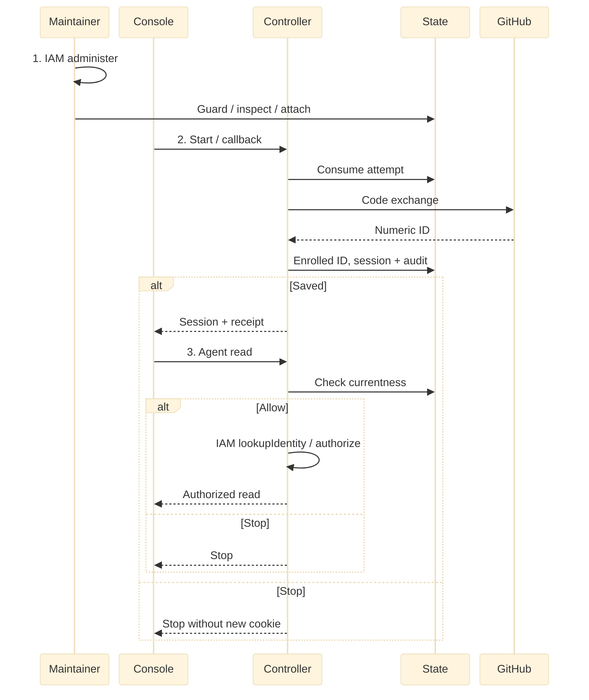

<a id="rfc-federated-human-sign-in"></a>

# RFC: GitHub sign-in for existing accounts

**Date:** 2026-09-22  
**Status:** Draft. [PR #305](https://github.com/openclaw/openclaw-enterprise/pull/305) is unmerged. Deployment and live GitHub verification remain open.

**2026-09-23 amendment:** Use the repository integration's GitHub App for sign-in, superseding the OAuth-App-only choice. Login uses the client ID and secret. Repository access retains its separate private-key consumer.

## Problem and decision

An existing OpenClaw Enterprise (OCE) user signs in with GitHub to read an authorized Agent. An administrator enrolls the identity during stopped maintenance. The local user, Installation Principal and grants remain. Login creates no account, link, IAM grant or repository access. Unknown or disabled identities are denied.

## Scope

One Installation and controller use native IAM, restricted-role PostgreSQL and one HTTPS origin. Mixed versions, shared-cookie native administration, other session readers and external account, policy and provisioning writers are excluded. Configured password recovery survives GitHub outages. Password-only binding is weaker. Service keys retain precedence.

Cancellation and denial recovery remains the product owner's decision. The candidate blocks tabs without verified success and requires administrative resolution and a new tab.

A future enabled event could enroll an identity and settle an administrator-configured, narrow, revocable shared-Agent or conversation entitlement through State and IAM, enforced by Gateway and sharing. This is tentative. Login never restores revoked grants. Google, enterprise OIDC, linking, online administration, broader CLI and stronger cross-tab guarantees remain future work.

## Contract

Better Auth runs in the controller. PostgreSQL State owns attempts, account and method currentness, sessions and audit. The controller's IAM Driver resolves identity to a Principal and authorizes each exact action. Separate maintenance uses both. Its State guard and IAM reads rely on stopped writers, not a combined transaction.

<a id="setup-and-sign-in"></a>

### Operator setup and activation

Provision accounts and grants. Configure the App, Installation, restricted database and trust, and auth settings. Register `/api/auth/providers/github/callback` on `OCC_AUTH_BASE_URL`. Protect `OCC_AUTH_GITHUB_CLIENT_ID`, `OCC_AUTH_GITHUB_CLIENT_SECRET` and `OCC_AUTH_GITHUB_RECOVERY_USER_ID`. Allow controller HTTPS egress to GitHub token and user endpoints. Close ingress, drain requests, stop serving and conflicting account, policy, bootstrap, provisioning and session writers, and prevent restart. `--writers-stopped` asserts exclusion, not fencing.

From the matching checkout, use an owner-only, nonsymlink file with the real recovery email and password. Examples, not executed:

```sh
NODE_ENV=production pnpm auth:maintain --writers-stopped --credentials-file FILE --operation inspect --user-id ID
NODE_ENV=production pnpm auth:maintain --writers-stopped --credentials-file FILE --operation attach-github --user-id ID --github-user-id 12345678 --expected-version VERSION
```

The first configured inspect can activate after validating the recovery password, Installation, Drivers, IAM `administer` and static configuration. There is no activate command. Activation enrolls existing password accounts, invalidates unbound sessions and refuses account creation before account or IAM writes. Maintenance rechecks the current session. Inspect returns the version. Attach the independently verified 1–20 digit GitHub ID without a leading zero at that version. Stale versions and owned subjects are refused. Attachment preserves account and grants while invalidating sessions and proofs. Start one compatible controller. Verify recovery, login, stale-session refusal and authorized Agent read before reopening ingress, retaining exclusions.

<a id="http-interfaces"></a>

### Console sign-in and security

Console pins `sessionBinding` from `GET /api/auth/providers` before writes: `true` here, `false` for password-only. Bad discovery permits only retrying that read. Sign-in, inspection and logout acknowledgments must match. `POST /api/auth/providers/github/start` requires the configured Origin and returns a fixed URL, browser cookie and `attemptId`. Callback consumes the bound attempt once before exchange, including valid provider errors. It rejects ambiguity, uses S256 PKCE and fixed endpoints, reads the numeric ID and discards tokens. Client ID plus immutable numeric ID uniquely identifies the method. Email, username, domain and organization confer no authority. Changing client ID requires reattachment. Secret rotation preserves enrollment but invalidates pending attempts.

After session and audit commit, callback issues a cookie and signed two-minute receipt. No-store `POST /api/auth/providers/github/result` matches receipt, `attemptId` and current cookie to return the actual `sessionKey`. Password issuance also identifies its session. Console waits for matching inspection, then sends `x-occ-session-key` to narrow each request's cookie session. Logout matches and revokes that session. Only owner-proven `error.authentication` with matching `operation` and `outcome: "rejected"` proves no effect. Malformed, contradictory or lost replies do not. Markers are neither IAM authority nor durable journals. Late responses can change shared cookies. Logout does not cancel an in-flight sign-in.

For unsafe cookie-session requests, the controller requires the exact configured Console Origin before session lookup or effects; absent, malformed or different Origins and contradictory supplied Fetch Metadata are rejected. An invalid service key never falls back to a cookie; bearer credentials are rejected. The native proxy retains its separate policy. Host-only cookies and the optional session-key header are not this boundary. This guard is required, not yet qualified.

Attempts expire in five minutes. Provider calls share ten seconds, cap each response at 64 KiB and refuse redirects. Per controller, password admission is 30 per minute and four active, GitHub start/callback is 60 per minute and eight active. State caps 1,000 pending attempts per Installation and removes at most 100 expired rows per start. Sessions last eight hours without refresh and use host-only Secure, HttpOnly, SameSite=Lax cookies. Reject duplicate active-session cookie names and redact credentials, tokens, codes and raw provider errors. Local revocation does not continuously track GitHub suspension, stop Agents or close repository connections.



Proposed lifecycle. The stopped maintainer and controller each compose IAM. Commit must be confirmed; read requires current identity and IAM allow. Denial or unknown outcome stops the path. [Source](31-human-federated-sign-in/request-lifecycle.mmd) and [SVG](31-human-federated-sign-in/request-lifecycle.svg).

<a id="activation-and-recovery"></a>

### Recovery and uncertain outcomes

State commits local effects and audit together, not IAM reads, GitHub calls or browser delivery. On uncertain COMMIT discard the client without another query, fresh cookie, replay or compensation. A later read is current state, not a receipt. Preserve a potentially created account unless its owner proves no commit. After uncertain maintenance do no cleanup. Report operation, session cleanup and pool shutdown separately. Keep ingress closed for owner resolution. Maintenance cannot disable recovery, but out-of-band changes can destroy it. Missing configuration prevents startup after activation. Rolling upgrade, old-binary rollback and method repair are unsupported.

## Implementation and verification

Extend controller, Console, State and separate maintenance. Preserve main SQL and receipts, qualify receiving history and refuse unsupported predecessors. [PR #305](https://github.com/openclaw/openclaw-enterprise/pull/305) and [PR #461](https://github.com/openclaw/openclaw-enterprise/pull/461) both propose index 32. The State owner and first landing determine order.

Acceptance requires stopped activation, recovery, Console login and authorized Agent read, unknown or disabled refusal, stale-version and revocation checks, audit, uncertain outcomes, upgrade preservation and installed HTTPS with the actual GitHub App. Pinned [main](https://github.com/openclaw/openclaw-enterprise/blob/181b0472f9a5a9d422035edf5121d3a15c200cb5/docs/reference/authentication.md) has password authentication. A source review found that a sibling-origin cookie POST could stop an Agent; the GitHub-profile consequence is inferred, not demonstrated in a real database or browser. The fix and exact source review remain open. Prior local checks do not establish exact-head hosted CI, installed HTTPS, live GitHub, human approval or release.

## Open decisions and references

The maintenance guide `docs/guides/deploy/github-sign-in.md` and browser reference `docs/reference/authentication/browser-sessions.md` are forthcoming on the reviewed implementation, not the older unmerged PR. Authenticated readback on the exact published stack gates publication. Anonymous 404 is not an intended-reader access test.

## Manual Notes
