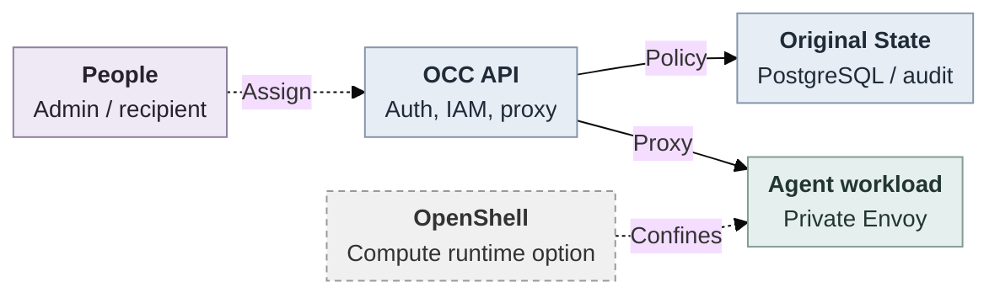
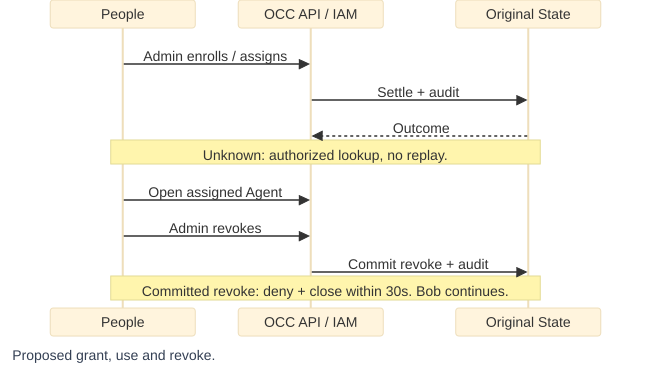

# Agent access (Proposed)

## Problem and Decision

Connect enrollment, grants and withdrawal for ordinary local users on embedded OpenClaw Kubernetes without a SandboxDriver. The first checkpoint grants trusted **full native administration inside assigned Agents**. It provides no chat-only isolation, personal provider consent or per-command mediation.

## Scope

| Subject       | Selected contract                                                                                                                                        |
| ------------- | -------------------------------------------------------------------------------------------------------------------------------------------------------- |
| Agents        | Personal: one named human grant to a service-owned Agent. Shared: explicit human grants share native conversations, settings and accessible credentials. |
| Administrator | Only Installation administrators enroll, provision, grant and revoke.                                                                                    |
| Recipient     | Namespace `read` for discovery, exact-Agent `read` and `administer`. No default Installation, Configuration, Secret, deployment or sibling-Agent rights. |

This current-runtime checkpoint complements the [broader RBAC proposal](https://github.com/openclaw/openclaw-enterprise/pull/245). Restricted conversation/invocation/content access, named teams, Slack/Teams identity mapping and user-grant/integration use remain selected later outcomes. Protected Git/model traffic must fully close within 30 seconds after renewal loss, with selected stricter five-second profiles. Browser closure proves neither. Self-withdrawal, delegation, self-service creation and SCIM are later increments. Process termination is later hardening.

Independent `specs/37-openshell-runtime.md` remains optional. OCE retains human/repository authority and credential custody. OpenShell provides runtime/network/provider enforcement through existing IAM/resource, Compute/Sandbox and credential boundaries. Components do not prove a shipped path.

## Contract

**Setup.** Enable the disabled-by-default [native pilot](31-agent-native-admin-ui.md#contract) with compatible gateway, private routing, wildcard Agent DNS/TLS and explicit shared-cookie domain. Enabling it grants nothing. [Console defaults](../apps/controller/src/console/agents/create.mjs#L40) enable Control UI; [native admission](../apps/controller/src/gateway/native-admin.ts#L84) still requires the exact browser origin, trusted-proxy identity and admin device auto-approval.

**Interfaces.** Existing [POST /api/auth/accounts](../docs/reference/api.md#post-apiauthaccounts) requires `email`, `password`, `roleId` and optional `name`, returning a human `principalId`. Explicit zero-grant enrollment must extend route/helper/validator without administrator defaults. Its wire shape remains unselected.

Existing [Namespace IAM operations](../docs/reference/api.md#iam) create/list/get/delete immutable roles and access-bindings under `/namespaces/{namespaceId}/iam`. Their [writer](../packages/occ/src/state/postgres-state.ts#L2336-L2367) admits Namespace ServicePrincipals, excluding humans, and [target schema](../packages/contracts/src/api/common.ts#L237-L244) excludes Namespace. Extend these owners for existing humans and exact Namespace targets. SQL already represents these grants.

**Illustrative, unexecuted journey.** Administrator enrolls Alice without grants, provisions personal/shared Agents and assigns the table's permissions using her returned Principal ID. Alice signs in locally, discovers both and selects **Open native admin UI**. Bob receives discovery and shared access only. Sibling access is refused. Preserve the [independent launcher](../apps/controller/src/console/agents/detail.mjs#L268): denied Configuration/revision reads cannot prevent launch or justify broader grants.

Human Principals and Agent ServicePrincipals remain distinct. IAM/State compose in OCC's browser admission/proxy API process. Compute resolves Kubernetes Agents through private Envoy. Reuse [origin checks and server-side transport-key custody](31-agent-native-admin-ui.md#proxy-native-identity-and-permissions): Envoy supplies `occ-workspace-files`; native trusted-proxy authentication grants `operator.admin` without a native gateway token. Retain policy reload and persistence/audit. Add no services, tables, leases or account authorities. Dashed joins are proposed/optional.

**Settlement.** OCE resolves canonical targets. Selected IAM and original State check current administrator/account authority and target validity through settlement, including deletion races. Account owners participate in original-State account/Principal/audit atomic settlement, or supply narrowly resolved recovery. Preserve last-usable-local-admin invariants. Zero-grant accounts and unshared Agents are safe intermediates.

Lost COMMIT replies can leave durable state but uncertain caller knowledge. Account/State owners use stable operation/account association and authorized result lookup to distinguish committed, rejected and unknown outcomes. Never blindly delete accounts or replay uncertain mutations.

**Withdrawal.** Committed revoke denies new admission. Renew native authorization before its lease exceeds 30 seconds, closing on denial, timeout or loss. Closure neither cancels accepted jobs nor retracts disclosures. Managed redeploy restores configuration, not erased storage. [Lifecycle source](36-agent-access/request-lifecycle.mmd).

Current tools and authorized administrator/service-key paths remain supported. Unsupported enforced profiles fail explicitly without dependency-driven downgrade. Local sign-in has no AgentInvocation, egress, SPIFFE or OpenShell dependency.

## Implementation

1. Adopt this RFC atop authentication/IAM, merged [policy administration](https://github.com/openclaw/openclaw-enterprise/pull/260), State/audit, discovery and proxy.
2. Receive enrollment/recovery and human grants in parallel through existing owners, selectively reusing accepted components. Before exposure, account/State owners resolve the sole implementation choice: atomic participation versus narrow recovery with an authorized result consumer.
3. Connect enrollment/access controls in Console, preserving its independent launcher and configuration editor, then qualify two-user use. Component evidence and [historical native delivery](31-agent-native-admin-ui.md#changelog) do not prove these joins, installed/live-provider or release readiness.

## Verification

Future acceptance uses real local sign-in, ordinary account/policy routes and PostgreSQL's limited application role. Verify zero grants, exact targets, audit/rollback, stale authority, deletion races and uncertain settlement. Installed embedded Kubernetes, with two controllers where relevant, must prove personal/shared visibility, limited-permission launch, a model turn and Git/gh. API revoke must close Alice's already-open browser within 30 seconds while Bob continues. Measure timing. No new runtime/provider pass is claimed.

## References

[Native access/recovery](31-agent-native-admin-ui.md), [authorization](../docs/reference/authorization.md), [authentication](../docs/reference/authentication.md), [console](../docs/reference/console.md), [Drivers](17-provider-driver-abstraction.md).
