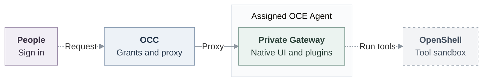

# Agent access (Proposed)

## Decision

An Installation administrator assigns people to separate OpenClaw Enterprise (OCE) Agent deployments. People sign in to OCE, discover their assigned Agents and open the existing OpenClaw native administration UI. The first release grants **full native administration within each assigned deployment** on embedded Kubernetes, without requiring a SandboxDriver.

An **OCE Agent** is a managed deployment with its own Gateway trust domain; native OpenClaw agent IDs select configurations within a Gateway. An OCE resource grant does not isolate native IDs inside that Gateway. Members sharing a deployment must trust one another. This is not hostile-user isolation.

## Architecture and reuse

| Owner                              | Responsibility and reuse                                                                                                                                                                                                                           |
| ---------------------------------- | -------------------------------------------------------------------------------------------------------------------------------------------------------------------------------------------------------------------------------------------------- |
| OCE / OpenClaw Control Plane (OCC) | [Central accounts](../docs/reference/authentication.md), [exact resource grants](../docs/reference/authorization.md), deployment lifecycle and browser admission; reuse authentication, IAM, PostgreSQL State/audit, Compute and the native proxy. |
| Native OpenClaw                    | Within-Gateway roles, sessions, channels, tools and administration UI; translate future OCE restrictions into these controls.                                                                                                                      |
| Optional OpenShell                 | Supported execution and network enforcement through existing runtime boundaries; independent [runtime proposal #321](https://github.com/openclaw/openclaw-enterprise/pull/321).                                                                    |

Upstream already documents [durable people, named `gateway.roles` and session scopes](https://docs.openclaw.ai/gateway/operator-scopes), [channel controls](https://docs.openclaw.ai/gateway/security/access-control), and [the OpenShell sandbox plugin](https://docs.openclaw.ai/gateway/openshell). OCE's packaged runtime at this proposal's source base is `2026.9.1`; newer upstream capabilities require compatibility and installed-runtime qualification. Reuse them after qualification.

Existing paths are solid; proposed joins are dashed. OpenShell confines supported execution, not the Gateway or its host plugins.

Add no second IAM engine, policy store, service, table, lease or account authority. Human Principals remain distinct from Agent ServicePrincipals. OCE retains human/repository authority and credential custody.

## Access contract

| Choice                | Meaning                                                                                                                                                        |
| --------------------- | -------------------------------------------------------------------------------------------------------------------------------------------------------------- |
| Personal              | One named human grantee on a service-owned Agent.                                                                                                              |
| Shared                | Several explicit grantees share conversations, settings, tools and accessible credentials.                                                                     |
| Recipient permissions | Exact Namespace `read` for discovery; exact Agent `read` and `administer`. No implied Installation, Configuration, Deployment, Secret or sibling-Agent grants. |
| Administration        | Only Installation administrators enroll, provision, grant and revoke; recipients cannot delegate access.                                                       |

The proxy uses shared native identity `occ-workspace-files` with `operator.admin`. OCE attributes humans at admission; this handoff supplies neither per-command nor per-chat human identity. Full administration reaches that deployment's whole Gateway trust domain. Personal provider inheritance, consent and chat-only privacy are outside this release.

**Setup:** enable the disabled-by-default [native pilot](31-agent-native-admin-ui.md#contract), compatible Gateway, private routing, wildcard Agent DNS/TLS and explicit shared-cookie domain. Enabling it grants nothing. Require Control UI, exact browser origin, trusted-proxy identity and administrator device auto-approval. Keep transport keys server-side; no native Gateway token reaches the browser.

Alice receives discovery plus personal/shared Agent grants; Bob receives discovery plus shared access. Both use **Open native admin UI**; sibling access is denied. Keep the launcher independent of Configuration/revision reads. Native edits may diverge from managed Configuration/AgentRevision; redeployment restores managed configuration, not erased persistent storage.

## Delivery checkpoints

Existing-person sharing can ship before enrollment or granular native roles. Neither initial checkpoint depends on OpenShell.

1. **Share with existing people.** Extend existing Namespace IAM routes and Role/AccessBinding writers for human Principals and exact Namespace targets. Connect Console sharing to these owners and retain policy reload/audit. Qualify discovery, independent launch, sharing and withdrawal before release.
2. **Enroll without grants.** Extend `POST /api/auth/accounts`, its helper and validator for explicit zero-grant enrollment, returning the human `principalId`. The current route requires `email`, `password`, `roleId` and optional `name`; the new wire shape remains to be defined without administrator defaults. Commit account, Principal and audit atomically in the **original State transaction**. Zero-grant enrollment is not yet connected to the public account route.
3. **Translate granular native permissions.** Qualify supported native roles/session controls and human identity handoff, then translate OCE restrictions instead of rebuilding native policy. The [broader RBAC direction](https://github.com/openclaw/openclaw-enterprise/pull/245) retains restricted conversation/invocation/content access, personal/team channel authority, named teams, Slack/Teams identity mapping and user-grant/integration use. Self-withdrawal, delegation, self-service creation and SCIM remain later increments.

## Settlement and withdrawal

OCC resolves canonical targets. Selected IAM and original State check current administrator/account authority and target validity through settlement, including deletion races. Preserve bootstrap and the last usable local administrator. Zero-grant accounts and unshared Agents are safe intermediates.

Use a stable operation/account receipt and authorized result lookup to distinguish committed, rejected and unknown outcomes when the database commit reply is lost. Never blindly delete accounts or replay uncertain mutations. Separate sharing mutations may leave safe partial grants; refresh effective access before continuing.

Committed revoke denies new admission. Renew browser authorization before its lease exceeds **30 seconds**; denial, timeout or renewal loss closes the connection. This does not cancel accepted jobs or retract disclosures. Separately, future protection for Git/model traffic must fully close that traffic within **30 seconds** of renewal loss, with selected stricter **five-second** profiles. Browser closure does not prove traffic closure; process termination remains later hardening.

Keep existing tools and authorized administrator/service-key paths. Unsupported enforced profiles fail explicitly without dependency-driven downgrade. Local sign-in has no AgentInvocation, egress, SPIFFE or OpenShell dependency.

## Verification

Use real local sign-in, ordinary account/policy routes and PostgreSQL's limited application role. Check zero grants, exact targets, audit/rollback, last-admin protection, stale authority, deletion races and unknown settlement. Installed embedded Kubernetes, with two controllers where relevant, must prove personal/shared visibility, limited-permission launch, a model turn and Git/gh. Measure API revoke closing Alice's open browser within 30 seconds while Bob continues. Source components do not establish installed, live-provider or release readiness.
