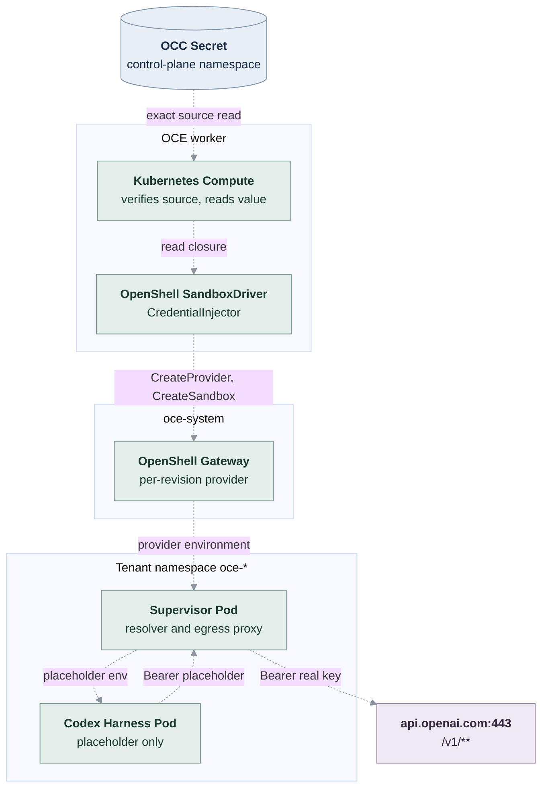

# RFC: Sandbox credential injection for Harness model credentials

**Date:** 2026-09-24
**Status:** Proposed; not implemented or approved.
**Owner:** Harness runtime integration and the OpenShell SandboxDriver.
**Source baseline:** `codex/openshell-repeatable-environment-pr325` at `1364f085`;
OpenShell [`v0.1.0-pre.7`](https://github.com/NVIDIA/OpenShell/tree/v0.1.0-pre.7) (`f8002d19`).

## Problem and decision

Kubernetes Compute delivers an Agent's `api_key` harness credential as a
`secretKeyRef` environment entry. The [OpenShell SandboxDriver](../docs/reference/drivers/openshell-sandbox.md)
rejects that entry because stock OpenShell cannot receive it, so every
OpenShell-selected deployment fails before Sandbox creation. Making OpenShell
accept Secret-backed environment variables would still place the real key in the
Harness process, which the [target design](../docs/design/safeguards.md#secret-access)
treats as a temporary exception: the Harness should receive only scoped substitutes.

OpenShell already provides that substitute. A gateway-stored _provider_ holds the
credential, the Sandbox process receives a placeholder, and the supervisor's
egress proxy replaces the placeholder only on requests to endpoints bound to
that provider.

Add an optional `CredentialInjector` contract to `SandboxDriver`, and a
`substitution` delivery mode to the frozen harness-auth snapshot. When the
revision's selected Sandbox implements the contract, Compute hands it the
verified credential source instead of projecting a Secret. The OpenShell
SandboxDriver implements it with per-revision providers. No new Driver
capability, resource, or public API field is introduced.

## Scope

In scope:

- `api_key` harness auth for dedicated Codex with an `openai/` or `codex/` model,
  on bundled Kubernetes Compute with the OpenShell SandboxDriver.
- Deploying that combination without the model key entering the Harness Pod,
  its environment, or any Kubernetes object in the Harness namespace, with a
  revision-scoped credential lifecycle in OpenShell.

Out of scope:

- `codex_pat` and `chatgpt_service_account` under OpenShell. The entrypoint and
  Codex inspect those tokens locally (`runtime-entrypoints.ts:1340-1359`), so a
  placeholder cannot satisfy them. Admission keeps rejecting them.
- Embedded OpenClaw, which OpenShell already rejects.
- The other stock pre.7 blockers: the app-server token `secretKeyRef`, the
  projected workload token, PVC subpath mounts, plugin-runtime ConfigMap entries,
  and Authorization stripping on exposed routes. OpenShell deployments still
  fail closed on the first of these.
- Credential injection without a Sandbox, such as the per-Agent model egress
  proxy named by `TODO(model-egress-proxy)` in Kubernetes Compute
  (`index.ts:6653`). See [Alternatives](#alternatives-considered).
- Automatic rotation, gateway-managed refresh, and OAuth token grants.

## Upstream capabilities this design relies on

Read from the pre.7 source; OpenShell `main` (`6c864ec`) is unchanged here.

| Capability                                                                                                            | Source                                                                             |
| --------------------------------------------------------------------------------------------------------------------- | ---------------------------------------------------------------------------------- |
| `CreateProvider`/`DeleteProvider` store raw values in the gateway credential store, encrypted by default.             | `proto/openshell.proto:282-415`; `docs/reference/gateway-config.mdx:425-472`       |
| `SandboxSpec.providers` attaches workspace providers at Sandbox creation.                                             | `proto/openshell.proto:1016-1048`                                                  |
| The supervisor puts `openshell:resolve:env:…` placeholders in the child environment and keeps values in its resolver. | `crates/openshell-core/src/secrets.rs:252-290`                                     |
| On Kubernetes, the supervisor runs in a separate Pod; the workload Pod has empty egress and no provider credentials.  | `docs/kubernetes/sandbox-runtime.mdx:10-106`                                       |
| The proxy substitutes only for the host, port, and path bound by the provider profile, and returns 403 otherwise.     | `docs/providers/profiles.mdx:49-80`; `docs/sandboxes/manage-providers.mdx:371-420` |
| Credentialed endpoints require L7 inspection with TLS termination; `tls: skip` is rejected.                           | `docs/sandboxes/policies.mdx:65,433,735`                                           |

Limits that shape the design:

- Static keys are substituted only where the client already sends the placeholder,
  for example in its `Authorization` header. The proxy does not add headers for
  static credentials (`profiles.mdx:199-205`).
- Providers are workspace-scoped. Any principal with workspace `user` can attach
  any provider in that workspace to its own Sandbox (`crates/openshell-server/src/grpc/sandbox.rs:1224-1278`).
- A profile's `binaries` affect policy composition but not placeholder resolution.
  Binary-scoped injection is an upstream roadmap item (`profiles.mdx:206`).
- There is no reference form: the gateway must receive the value itself.

## Contract

### Revision snapshot

Add a delivery mode to the secret-backed harness-auth snapshot:

```ts
type HarnessCredentialDelivery =
  { type: "env" } | { type: "substitution"; sandboxDriverId: string };

// HarnessAuthSnapshot, api_key and codex_pat members:
//   { method; source; secretDriverId; delivery: HarnessCredentialDelivery }
```

The public `HarnessAuthBinding` is unchanged. The Installation's Sandbox
selection determines delivery, not the Agent author. Admission freezes the mode
with the revision's pinned `sandboxDriverId`. A revision never switches between
`env` and `substitution`; a later selection applies only to a later deployment.

### CredentialInjector

```ts
interface CredentialInjectionEndpoint {
  readonly host: string;
  readonly port: number;
  readonly path: string; // glob, for example "/v1/**"
}

interface CredentialInjectionRequest {
  readonly envName: string; // "OPENAI_API_KEY"
  readonly endpoints: readonly CredentialInjectionEndpoint[];
}

interface CredentialInjectionGrant {
  readonly envName: string;
  readonly ref: string; // opaque to OCC; meaningful to the same SandboxDriver
}

interface CredentialInjector {
  supports(input: {
    readonly execution: "dedicated" | "embedded";
    readonly method: HarnessAuthSnapshot["method"];
    readonly requests: readonly CredentialInjectionRequest[];
  }): { readonly supported: true } | { readonly supported: false; readonly reason: string };

  prepareRevisionCredentials(
    context: SandboxNamespaceContext & {
      readonly revision: AgentRevisionIdentity;
      readonly credentials: readonly {
        readonly request: CredentialInjectionRequest;
        readonly read: () => Promise<string>;
      }[];
    },
  ): Promise<readonly CredentialInjectionGrant[]>;

  releaseRevisionCredentials(
    context: SandboxNamespaceContext & { readonly revision: AgentRevisionIdentity },
  ): Promise<void>;
}

interface SandboxDriver {
  // existing members …
  credentialInjection?: CredentialInjector;
}

interface HarnessWorkloadRequirements {
  // existing members …
  injectedCredentials: readonly CredentialInjectionGrant[];
}
```

Contract rules:

- `supports` is pure and runs at admission. It must not contact the gateway.
- `prepareRevisionCredentials` is idempotent for one revision. It returns exactly
  one grant for each request, or throws. A replay with the same revision returns
  the same grants.
- `provisionHarness` must consume every grant in `injectedCredentials` and must
  reject any grant it did not issue. Unconsumed grants fail provisioning.
- `releaseRevisionCredentials` succeeds only after the stored copy is verifiably
  gone, and treats an already-absent copy as success. Namespace `cleanup` removes
  every copy the driver owns in that Namespace.
- `read` returns the value of the exact admitted source. The injector must not
  log, persist, or return it, and must call `read` only to transfer the value
  into its credential store.

The harness integration, not the injector, owns the request. Compute's
`prepareHarnessAuth` (`apps/controller/src/drivers/compute/kubernetes/index.ts:358-406`)
maps `api_key` with a Codex `openai/` or `codex/` model to
`{ envName: "OPENAI_API_KEY", endpoints: [{ host: "api.openai.com", port: 443, path: "/v1/**" }] }`.

### Admission and worker recheck

In `deployAgent` (`packages/occ/src/index.ts:2842`), after selecting the Sandbox:

1. If the selected Sandbox declares `credentialInjection`, secret-backed harness
   auth must use `substitution`. Admission calls `compute.validateHarnessAuth`
   as today, then `credentialInjection.supports(...)`. An unsupported result
   returns 409 with the injector's reason. There is no fallback to `env`.
2. If the Sandbox does not declare it, the existing `env` delivery and the
   Sandbox's own environment validation apply unchanged.
3. The existing actor and service-principal Secret `operate` checks apply to
   both modes; substitution requires no new permission.

`credentialInjection` is an optional member, not a new `SANDBOX_FACETS` entry.
Facets describe containment and carry no methods. Today OCC checks only that the
facet list is well formed, and never checks a facet against a method, policy, or
revision field. A driver that declares `credentialInjection` must implement all
three methods and must declare the `networking` facet. Three sites validate
Sandbox contracts, and each adds these checks:

- startup `validateCreatedSandboxDriver` (`apps/controller/src/composition/installation-config.ts:891-909`);
- OCC `driverHasCapabilityContract` (`packages/occ/src/index.ts:444-453`);
- worker `validSandboxDriver` (`apps/controller/src/worker.ts:171-185`).

This is the first check that ties a facet to another contract member. It
verifies the driver's declaration only, not enforcement. The bypass guarantee
comes from the OpenShell workload fence and its integration proof; see
[Network policy](#network-policy).

These sites already disagree. Startup does not check facet values, and the worker
does not check duplicates or `configureAgent`. Aligning them is a separate
cleanup, outside this RFC.

The worker's `authorizeRevision` and `resolveRevisionSecretContext` keep their
current checks. The resolved context carries the frozen delivery mode.

### Compute rendering

For `substitution`, `prepareHarnessAuth` returns the literal `CODEX_LOGIN_MODE`
and model variables plus the injection requests, and no `secretKeyRef` for the
model key. `deliverHarnessAuth` (`index.ts:6830-6921`) keeps its source
ownership and UID check. Instead of copying the value into the revision's
`harness-secrets-…` Secret, it passes a `read` closure over that verified
source to `prepareRevisionCredentials`. It then places the grants in the Sandbox
requirements. The per-revision Secret still carries non-model entries, such as
the app-server token.

This keeps value access where it already is: the worker-side Compute read that
`deliverHarnessAuth` performs today. The injector receives no Kubernetes Secret
authority.

In `shutdownRevisionRuntime` (`index.ts:2982-3004`), Compute calls
`releaseRevisionCredentials` after the Sandbox `cleanup` for that revision
succeeds. Namespace deletion relies on the Sandbox Namespace `cleanup`.

### Harness runtime

The Codex entrypoint is unchanged. It reads `OPENAI_API_KEY`, which now holds
the placeholder, and passes it to `codex login --with-api-key` through stdin.
Codex stores and sends the placeholder, and the supervisor's proxy substitutes
the real key on the request to `api.openai.com`. The startup model probe
exercises that path before readiness, so a failed substitution holds the Pod
unready through the existing failure handling.

## OpenShell implementation



All arrows are dashed because the path is proposed.

### Profile, provider, and attachment

- **Profile.** The driver imports one workspace-scoped custom profile,
  `oce-codex-openai`, into each OCC workspace. It declares credential
  `OPENAI_API_KEY` with `auth_style: bearer`, the request's endpoints with
  `protocol: rest` and `enforcement: enforce`, and the binaries from new
  Installation configuration `credentialInjection.binaries`. The import is
  idempotent and uses `resource_version` for updates. A profile whose content
  differs from the derived definition is updated, never silently reused.
- **Provider.** `prepareRevisionCredentials` creates one provider per revision
  and request. Its name is derived from the Agent and revision IDs (for example
  `oce-<sha(agentId)12>-<sha(revisionId)12>-model`), and it carries OCC ownership
  labels. A replay finds the existing provider by name and ownership and
  returns the same grant. A foreign provider with that name fails provisioning.
  The grant `ref` is the provider name.
- **Attachment.** `sandboxSpec` places every grant's provider in
  `SandboxSpec.providers` at creation. The driver does not use runtime
  `AttachSandboxProvider`. The existing static `providers` configuration remains
  for operator-owned providers, and must not name an `oce-` provider.
- **Environment check.** `environment()` keeps rejecting every `secretKeyRef`.
  Substitution requests never produce one, so the model key no longer triggers
  the rejection.

### Network policy

The attached profile supplies the model egress allowance through OpenShell's
policy composition. The operator's static `model-provider` rule with `tls: skip`
is removed from the development profile (`internal/occdev/kubernetes.go:276`)
and test fixtures. The driver rejects Installation configuration in which a
static network policy endpoint overlaps an injection endpoint, because the
uninspected rule would conflict with the credentialed one.

With TLS terminated at the proxy, Codex must trust the per-generation Sandbox
CA, which OpenShell provides through `SSL_CERT_FILE`. See
[verification gates](#verification-gates).

Substitution protects the key only if every Harness connection passes through
the supervisor. OpenShell's workload fence enforces this, not the `networking`
facet or `network_policies`. The fence is a NetworkPolicy in each Sandbox
namespace that gives workload Pods empty egress and admits only supervisor
ingress (`docs/kubernetes/sandbox-runtime.mdx:52-78`). It takes effect only
when the cluster's network plugin enforces NetworkPolicy, which OpenShell asks
operators to verify before setting `supervisor.sandboxRuntime.networkPolicyEnforced`.
The OpenShell reference states this requirement, and a direct-connection
[test](#tests) proves it.

### Authority and trust

- The worker's gateway principal needs workspace `admin` and the
  `provider:write` scope in every OCC workspace, in addition to its current
  `sandbox:write`.
- No other principal may hold a role in an OCC-owned workspace, because any
  workspace user can attach any workspace provider. This becomes an operator
  requirement in the OpenShell reference. OCC cannot verify it through the pre.7
  API.
- The value crosses the worker-to-gateway connection. Outside the local
  development profile, the driver refuses to prepare credentials unless the
  gateway endpoint uses `https` and bearer authentication.
- The real key exists in the OCC Secret, transiently in the worker, in the
  gateway credential store, and in the supervisor's memory. It is absent from
  the Harness Pod, its environment, its workspace, and the tenant Kubernetes
  Secrets. The gateway store's encryption key and backups become part of the
  credential boundary.

### Lifecycle

- **Candidate failure.** The provider remains until the revision is retired or
  the Namespace is deleted, like other candidate resources.
- **Secret updates.** A provider is a point-in-time copy, so updating the OCC
  Secret does not change a running revision. The operator redeploys.
- **Retirement.** Sandbox deletion, then `DeleteProvider`, then `GetProvider`
  must return not-found. Failure leaves retirement incomplete for retry.
- **Namespace deletion.** The driver lists providers carrying OCC ownership labels
  in the workspace, deletes each one, and verifies that none remain before
  `DeleteWorkspace`.

## Failure behavior

All failures leave the candidate inactive and the previous revision unchanged:

- Admission returns 409 for an unsupported method, topology, or model.
- Profile or provider failures fail `prepareRevision` before Sandbox creation.
- An unconsumed or foreign grant fails `provisionHarness`.
- A proxy substitution failure fails the Codex startup probe; the Pod stays unready.

## Alternatives considered

- **Separate `CredentialGatewayDriver` capability**, deferred by the
  [archived Sandbox provisioning spec](.archive/13-sandbox-driver-provisioning.md).
  Substitution works only at the proxy that contains the workload, so a
  separately selected capability mostly adds invalid combinations. A future
  non-Sandbox egress proxy can promote the standalone interface to a capability.
- **A `credentialInjection` facet.** Facets are unverified labels without
  methods; see [Admission and worker recheck](#admission-and-worker-recheck).
- **Upstream `secretKeyRef` support**, which keeps the real key in the Harness.
- **One provider per Agent.** Rotation would reach running revisions, and
  upstream rotation semantics for existing placeholders are inconsistent
  (`manage-providers.mdx:192`, `inference-routing.mdx:113-114`).

## Verification gates

Confirm these against the pinned runtime image and pre.7 before moving to
`Accepted`:

1. The pinned Codex binary (`@openai/codex@0.156.0`) trusts a CA supplied through
   `SSL_CERT_FILE`, or through another mechanism the Sandbox sets.
2. Codex reaches `api.openai.com` only with request shapes the proxy can rewrite.
   A WebSocket transport needs its upgrade `Authorization` header substituted.
   Binary frames on credentialed endpoints are rejected.
3. `codex login --with-api-key` accepts the placeholder without local validation.
4. The worker's gateway principal can import workspace profiles and create
   providers with the configured authentication.
5. The pre.7 supervisor advertises static credential binding support, so the
   gateway does not withhold the material.

## Tests

- Extend `tests/integration/sandbox-driver-openshell-k3d-real.test.mjs` so that
  the regular Agent deploy workflow runs through the real OCC API, worker,
  gateway, and supervisor. Remove `OPENAI_API_KEY` from the compatibility
  bridge's staged inputs.
  - The positive case completes the real model turn with the key injected by
    the proxy. It asserts that the Harness Pod's environment holds only the
    placeholder, and that no Pod spec, tenant Secret, or workspace file contains
    the key.
  - It asserts that retirement deletes the provider.
- Mode `0` now asserts that the first remaining rejection is the app-server
  token, with no model-key rejection.
- Add a denied case: a Harness request to an unbound host with the placeholder
  receives 403 and never reaches the host.
- Add a bypass case: from inside the Harness Pod, direct DNS resolution and a
  direct TCP connection to `api.openai.com:443` fail. This proves that the
  workload fence, not the declared facet, keeps model traffic on the
  substituting proxy.
- Add conformance cases proving that all three validation sites reject a driver
  that declares `credentialInjection` without the `networking` facet or
  without all three methods.
- Add a conformance case for the admission decision: an OpenShell selection with
  `api_key` freezes `substitution`, and `codex_pat` returns 409.

## Documentation

Update in the implementation PR:

- [OpenShell SandboxDriver](../docs/reference/drivers/openshell-sandbox.md):
  configuration, workspace-role and fence requirements, remaining blockers.
- [Sandbox Drivers](../docs/reference/drivers/sandbox.md): the optional contract.
- [Harness execution](../docs/reference/harness-execution.md#harness-authentication)
  and [Secret Driver](../docs/reference/drivers/secret.md): delivery modes.
- [OpenShell provisioning flow](../docs/flows/openshell-sandbox-provisioning.md)
  and [OpenShell testing](../docs/testing/openshell.md).
- [Secret access](../docs/design/safeguards.md#secret-access): record OpenShell
  substitution as implemented for this combination only.

## Open questions

- Should the development profile ship the Codex binary identity for
  `credentialInjection.binaries`, or derive it from the runtime image at build
  time?
- Is workspace membership observable through an OpenShell API that OCC could
  check in `ensureNamespace`?
- Should Anthropic-model embedded execution follow once OpenShell supports
  embedded OpenClaw, or wait for a common inference path?
