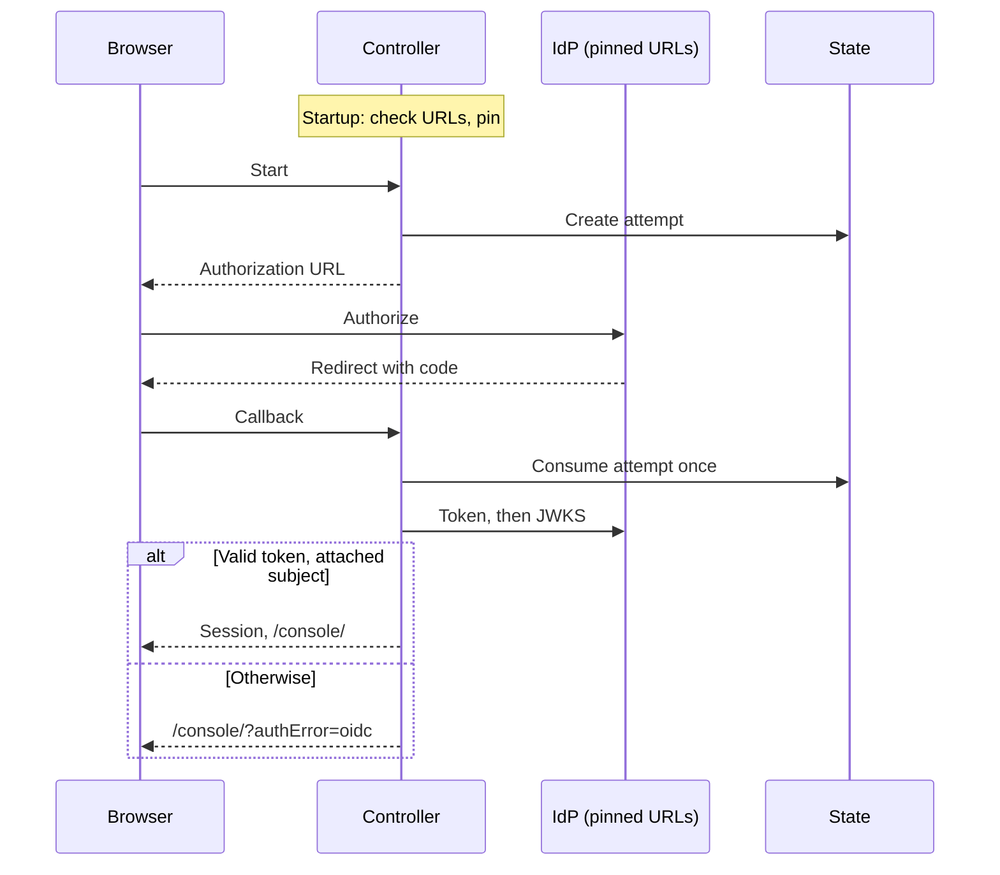

# RFC: Generic OIDC sign-in for existing accounts

- **Status:** Proposed; not implemented or approved.
- **Owner:** rclarke0 (proposal). Auth design review: freeqaz. Scope and release: kevinlin-openai.
- **Related:** [#729][issue-729]; SSO/SCIM stays in the 1.0 backlog ([#82][issue-82], [#92][issue-92]);
  Google sign-in [PR #594][pr-594]; [spec 31](31-human-federated-sign-in.md).
- **Date:** 2026-09-30. **Source baseline:** `main` at `129723ab`; links are pinned to it.

## Problem and decision

A team using Auth0, Okta, Entra ID or Keycloak wants its people to sign in to the
Console with that identity provider (IdP). OCC offers password, GitHub and Google
sign-in, and states that generic OIDC is unsupported ([authentication.md:15][ref-unsupported]).
Google sign-in is already an OIDC authorization-code flow with PKCE, a nonce and
ID-token checks, but its issuer and endpoints are constants ([google.ts:10-15][g-const]).

**Decision:** add one operator-configured provider, `oidc`, to the existing guarded
profile. It runs the Google flow with configured values in place of Google's
constants. An administrator attaches a person's exact subject to an existing account,
and sign-in admits only that account. Spec 31 left other providers to a future spec
([scope](31-human-federated-sign-in.md#scope)); this is that spec, limited to sign-in.

**Out of scope:** provisioning, just-in-time accounts or signup; group, role or claim
mapping; SCIM; more than one issuer, including multi-tenant issuers such as Entra ID
`common`; SAML; tokens as API credentials; IdP-driven logout; and runtime discovery.
The guarded profile's prerequisites are unchanged.

## Design

### Configuration

| Variable (API only)                    | Helm `auth.oidc`              | Rule                                                               |
| -------------------------------------- | ----------------------------- | ------------------------------------------------------------------ |
| `OCC_AUTH_OIDC_ISSUER`                 | `issuer`                      | The exact `iss` string.                                            |
| `OCC_AUTH_OIDC_AUTHORIZATION_URL`      | `authorizationUrl`            | Browser redirect target; never fetched.                            |
| `OCC_AUTH_OIDC_TOKEN_URL`, `_JWKS_URL` | `tokenUrl`, `jwksUrl`         | Fetched by the controller.                                         |
| `OCC_AUTH_OIDC_CLIENT_ID`, `_SECRET`   | Secret keys, as `auth.google` | Required.                                                          |
| `OCC_AUTH_OIDC_TOKEN_AUTH`             | `tokenAuth`                   | Optional: `client_secret_post` (default) or `client_secret_basic`. |
| `OCC_AUTH_OIDC_DISPLAY_NAME`           | `displayName`                 | Optional button label, 1–40 printable characters.                  |

Required values are all or none. A partial set fails startup, as for GitHub and
Google ([github.ts:55-67][gh-config], [google.ts:33-43][g-config]), and Helm and the
profile renderer refuse the same inputs ([\_helpers.tpl:42-65][helm-google],
[render-installation-profile.mjs:410][profile-render]). The recovery user ID stays
required ([auth/index.ts:95-124][login-config]).

The issuer is compared byte for byte, never normalised. Auth0's is
`https://<tenant>.auth0.com/` with a trailing slash, or a custom domain. Operators
copy the values from the IdP's discovery document by hand.

### Endpoint trust

At startup each URL must be `https:` on port 443, with no userinfo, query or
fragment, a DNS host name rather than an IP address, and the issuer's host.
`ProviderEndpoint` is a compile-time union of four literals
([provider-transport.ts:29-34][pt-endpoint]), so `providerJSON` also accepts a
`PinnedEndpoint` that only the OIDC parser constructs. After startup nothing adds to
the fetchable set, and the issuer itself is never fetched. The ten-second deadline
([google.ts:214-216][g-deadline]), `redirect: "error"` and 64 KiB limit
([provider-transport.ts:9-81][pt-read]) stay. As for Google, the JWKS is fetched on
each callback ([google.ts:233][g-jwks]), so key rotation needs no restart.

The chart adds an OIDC egress NetworkPolicy on TCP 443 from `auth.oidc.egressCidrs`,
defaulting to `0.0.0.0/0` like Google's ([networkpolicies.yaml:229-253][np-google]).
The pinned URLs decide the trusted hosts; CIDRs or an egress proxy
([spec 31](31-human-federated-sign-in.md#milestones)) narrow the addresses.

### Identity and enrollment

The provider instance is `oidc:<sha256(issuer + "\0" + clientId)>`. GitHub and Google
key on the client ID alone ([github.ts:182][gh-instance], [github.ts:201][g-instance]);
including the issuer makes each method the exact (iss, sub) pair, unique per instance
([0008:58][db-unique]). Changing the issuer or client ID means attaching again and
detaching stale methods, as after a GitHub client change
([external-sign-in.md:50-52][ref-rotation]).

The subject is an opaque string matching `^[\x21-\x7E]{1,255}$`, the rule Google
already uses ([google.ts:97][g-sub], [index.ts:3858-3867][attach-schema]), within the
512-character column ([0008:52][db-length]). It is compared exactly. Auth0
(`auth0|…`, `google-oauth2|…`), Okta and Keycloak subjects fit.

`POST /api/auth/accounts/:userId/providers/oidc` with `{subject, expectedVersion}`
joins the existing account operations ([index.ts:3780-3817][account-ops]) under
unchanged rules: a human session, exact `Origin`, Installation `administer`, and every
IAM grant of the target account's Principal ([index.ts:3682-3701][covers]). Attach
advances the version and ends the account's sessions
([human-authentication.ts:754-802][attach-state]). It returns `409` when OIDC is off,
the version is stale, or another account owns the subject. Account creation accepts
only `github.subject` ([index.ts:4260][create-account]), so OIDC identities are
attached afterwards, as Google's are.

The callback admits only an attached (instance, subject) pair
([human-authentication.ts:501-521][snapshot]); anything else is audited as
`EXTERNAL_IDENTITY_REJECTED` and creates no account. Only the `openid` scope is
requested and email is never read. A brokering IdP, such as Auth0 with social
connections, can give one person several subjects; only attached ones sign in, and
the guide says so.

### ID-token checks

Google's checks apply ([google.ts:132-205][g-verify]), with three changes: `iss` must
equal the configured issuer exactly; `alg` must be `RS256` with an RSA key of at least
2,048 bits, a floor PR #594 left as a follow-up; and there is no `hd` or email check.
`auth_time`, `acr` and `amr` are not checked; multi-factor policy belongs to the IdP.

### Routes and Console

`/api/auth/providers/oidc/{start,callback,result}` use the shared helper
([github.ts:409][gh-helper]), its admission budget ([github.ts:377-390][gh-budget]),
PKCE and receipt. Failure redirects to `/console/?authError=oidc`.
`GET /api/auth/providers` adds `oidc` and `oidcSignIn: {label, authorizationUrl}`
([index.ts:3466-3486][discovery]). The Console checks each start URL against a fixed
origin and path before navigating ([console.mjs:33-41][console-table],
[console.mjs:383-400][console-check]); for OIDC it checks the discovered
`authorizationUrl`. The name `oidc` names the protocol, so it stays correct if the
IdP changes, and one instance needs no slug ([console.mjs:579-581][console-error]).

PR #594 notes that a login receipt is not bound to its provider. That is not a
bypass, but a third provider widens the gap, so the receipt also signs the provider
name.

### Recovery and failure

- `OCC_AUTH_PASSWORD_SIGN_IN=recovery-only` accepts OIDC as the configured provider;
  the parser, startup and chart checks count it ([auth/index.ts:102-110][login-config],
  [auth/index.ts:1544-1551][startup-guard], [\_helpers.tpl:16-19][helm-recovery]).
- The recovery password path reads only State ([github.ts:575-633][password-path]),
  and startup never contacts the IdP. An outage or blocked egress fails OIDC sign-in
  closed, audited as `PROVIDER_UNAVAILABLE` ([provider-transport.ts:20-27][pt-denial]);
  the recovery account still signs in ([external-sign-in.md:99-100][ref-outage]).
- OCE does not learn when an IdP disables someone, and sessions last up to eight
  hours. Offboarding means detaching or disabling the account in OCE as well.
- Activation is one-way: removing OIDC when it is the only provider fails startup
  ([auth/index.ts:1547-1551][startup-guard]).

Proposed flow; the browser steps are the implemented Google flow.

## Delivery and verification

1. Parser, pinned transport, verifier and provider instance.
2. Routes, attach, discovery, Console, Helm and profile renderer, with documentation:
   [authentication.md:15][ref-unsupported], the external sign-in reference, a new
   OIDC sign-in guide and the affected cheat sheets.
3. The live check, recorded in the implementation PR.

Proof:

- `oidc-id-token`: configuration refusals (HTTP, off-host URL, query, partial set)
  and token refusals (trailing-slash issuer, `HS256`, `none`, a 1,024-bit or foreign
  key, `aud`/`azp`, nonce, `exp`/`iat`, subject bounds). `sign-in-chart-parity` keeps
  chart and parser aligned.
- `oidc-login-transport`: only pinned URLs are fetched, with redirect refusal, the
  size limit and the deadline.
- `postgres-oidc-sign-in`, modelled on `postgres-google-sign-in`: attach and sign in;
  a second, unattached subject refused; issuer change; recovery during an outage;
  detach and disable; three providers sharing one budget.

A `fakeOidc` fixture beside `fakeGoogle` ([production-sign-in.mjs:385][fake-google])
serves the token and JWKS URLs with Auth0-shaped issuers and subjects. It proves OCE
against its own reading of OIDC, not any IdP's behaviour. The live check is reported
separately. Against an Auth0 development tenant, which the requesting team can
provide, and a disposable Keycloak realm, it covers the authorization request, the
real `iss` form, subjects, both token methods, key rotation, NetworkPolicy egress and
a Console sign-in. Okta and Entra ID stay unverified unless someone runs them.

Nothing is implemented yet; this RFC rests on source review at the baseline.

## Alternatives and open decisions

**Discovery once at startup** needs fewer settings but makes startup depend on the
IdP: a restart during an outage would fail, locking out recovery, or start without
OIDC. A changed discovery document would also change trusted URLs without review.
**Per-request discovery** would let the IdP choose what the controller fetches.
**Email matching** fails when addresses change owners.

| Open decision                                                   | Owner           | Recommendation                                          |
| --------------------------------------------------------------- | --------------- | ------------------------------------------------------- |
| Sponsor this in 0.x apart from SSO/SCIM, in the published image | kevinlin-openai | Yes; the non-goals stay binding.                        |
| Allow an explicitly listed extra host for the URLs              | freeqaz         | Not until an IdP needs it.                              |
| Allow ports other than 443 (Keycloak often uses 8443)           | freeqaz         | No; this matches the NetworkPolicy.                     |
| Allow `ES256` or `PS256`                                        | freeqaz         | `RS256` first; never symmetric algorithms.              |
| Find per-application subjects, as in Entra ID                   | freeqaz         | The person supplies it; never list unattached subjects. |
| Apply the receipt binding and key floor to Google               | freeqaz         | Yes, in the same PR.                                    |

## References

[Authentication](../docs/reference/authentication.md),
[external sign-in](../docs/reference/authentication/external-sign-in.md),
[Google sign-in guide](../docs/guides/deploy/google-sign-in.md); source links above.

[issue-729]: https://github.com/openclaw/openclaw-enterprise/issues/729
[issue-82]: https://github.com/openclaw/openclaw-enterprise/issues/82
[issue-92]: https://github.com/openclaw/openclaw-enterprise/issues/92
[pr-594]: https://github.com/openclaw/openclaw-enterprise/pull/594
[ref-unsupported]: https://github.com/openclaw/openclaw-enterprise/blob/129723ab6d7daaa1cf885905c0ad1b8cc7c7bef7/docs/reference/authentication.md#L15-L16
[ref-rotation]: https://github.com/openclaw/openclaw-enterprise/blob/129723ab6d7daaa1cf885905c0ad1b8cc7c7bef7/docs/reference/authentication/external-sign-in.md#L50-L52
[ref-outage]: https://github.com/openclaw/openclaw-enterprise/blob/129723ab6d7daaa1cf885905c0ad1b8cc7c7bef7/docs/reference/authentication/external-sign-in.md#L99-L100
[g-const]: https://github.com/openclaw/openclaw-enterprise/blob/129723ab6d7daaa1cf885905c0ad1b8cc7c7bef7/apps/controller/src/auth/google.ts#L10-L15
[g-config]: https://github.com/openclaw/openclaw-enterprise/blob/129723ab6d7daaa1cf885905c0ad1b8cc7c7bef7/apps/controller/src/auth/google.ts#L33-L43
[g-sub]: https://github.com/openclaw/openclaw-enterprise/blob/129723ab6d7daaa1cf885905c0ad1b8cc7c7bef7/apps/controller/src/auth/google.ts#L97
[g-verify]: https://github.com/openclaw/openclaw-enterprise/blob/129723ab6d7daaa1cf885905c0ad1b8cc7c7bef7/apps/controller/src/auth/google.ts#L132-L205
[g-deadline]: https://github.com/openclaw/openclaw-enterprise/blob/129723ab6d7daaa1cf885905c0ad1b8cc7c7bef7/apps/controller/src/auth/google.ts#L214-L216
[g-jwks]: https://github.com/openclaw/openclaw-enterprise/blob/129723ab6d7daaa1cf885905c0ad1b8cc7c7bef7/apps/controller/src/auth/google.ts#L233
[pt-read]: https://github.com/openclaw/openclaw-enterprise/blob/129723ab6d7daaa1cf885905c0ad1b8cc7c7bef7/apps/controller/src/auth/provider-transport.ts#L9-L81
[pt-denial]: https://github.com/openclaw/openclaw-enterprise/blob/129723ab6d7daaa1cf885905c0ad1b8cc7c7bef7/apps/controller/src/auth/provider-transport.ts#L20-L27
[pt-endpoint]: https://github.com/openclaw/openclaw-enterprise/blob/129723ab6d7daaa1cf885905c0ad1b8cc7c7bef7/apps/controller/src/auth/provider-transport.ts#L29-L34
[gh-config]: https://github.com/openclaw/openclaw-enterprise/blob/129723ab6d7daaa1cf885905c0ad1b8cc7c7bef7/apps/controller/src/auth/github.ts#L55-L67
[gh-instance]: https://github.com/openclaw/openclaw-enterprise/blob/129723ab6d7daaa1cf885905c0ad1b8cc7c7bef7/apps/controller/src/auth/github.ts#L182
[g-instance]: https://github.com/openclaw/openclaw-enterprise/blob/129723ab6d7daaa1cf885905c0ad1b8cc7c7bef7/apps/controller/src/auth/github.ts#L201
[gh-budget]: https://github.com/openclaw/openclaw-enterprise/blob/129723ab6d7daaa1cf885905c0ad1b8cc7c7bef7/apps/controller/src/auth/github.ts#L377-L390
[gh-helper]: https://github.com/openclaw/openclaw-enterprise/blob/129723ab6d7daaa1cf885905c0ad1b8cc7c7bef7/apps/controller/src/auth/github.ts#L409
[password-path]: https://github.com/openclaw/openclaw-enterprise/blob/129723ab6d7daaa1cf885905c0ad1b8cc7c7bef7/apps/controller/src/auth/github.ts#L575-L633
[login-config]: https://github.com/openclaw/openclaw-enterprise/blob/129723ab6d7daaa1cf885905c0ad1b8cc7c7bef7/apps/controller/src/auth/index.ts#L95-L124
[startup-guard]: https://github.com/openclaw/openclaw-enterprise/blob/129723ab6d7daaa1cf885905c0ad1b8cc7c7bef7/apps/controller/src/auth/index.ts#L1544-L1551
[discovery]: https://github.com/openclaw/openclaw-enterprise/blob/129723ab6d7daaa1cf885905c0ad1b8cc7c7bef7/apps/controller/src/index.ts#L3466-L3486
[covers]: https://github.com/openclaw/openclaw-enterprise/blob/129723ab6d7daaa1cf885905c0ad1b8cc7c7bef7/apps/controller/src/index.ts#L3682-L3701
[account-ops]: https://github.com/openclaw/openclaw-enterprise/blob/129723ab6d7daaa1cf885905c0ad1b8cc7c7bef7/apps/controller/src/index.ts#L3780-L3817
[attach-schema]: https://github.com/openclaw/openclaw-enterprise/blob/129723ab6d7daaa1cf885905c0ad1b8cc7c7bef7/apps/controller/src/index.ts#L3858-L3867
[create-account]: https://github.com/openclaw/openclaw-enterprise/blob/129723ab6d7daaa1cf885905c0ad1b8cc7c7bef7/apps/controller/src/index.ts#L4260
[console-table]: https://github.com/openclaw/openclaw-enterprise/blob/129723ab6d7daaa1cf885905c0ad1b8cc7c7bef7/apps/controller/src/console/console.mjs#L33-L41
[console-check]: https://github.com/openclaw/openclaw-enterprise/blob/129723ab6d7daaa1cf885905c0ad1b8cc7c7bef7/apps/controller/src/console/console.mjs#L383-L400
[console-error]: https://github.com/openclaw/openclaw-enterprise/blob/129723ab6d7daaa1cf885905c0ad1b8cc7c7bef7/apps/controller/src/console/console.mjs#L579-L581
[snapshot]: https://github.com/openclaw/openclaw-enterprise/blob/129723ab6d7daaa1cf885905c0ad1b8cc7c7bef7/packages/occ/src/state/human-authentication.ts#L501-L521
[attach-state]: https://github.com/openclaw/openclaw-enterprise/blob/129723ab6d7daaa1cf885905c0ad1b8cc7c7bef7/packages/occ/src/state/human-authentication.ts#L754-L802
[db-length]: https://github.com/openclaw/openclaw-enterprise/blob/129723ab6d7daaa1cf885905c0ad1b8cc7c7bef7/migrations/0008_better_auth_sessions.sql#L52
[db-unique]: https://github.com/openclaw/openclaw-enterprise/blob/129723ab6d7daaa1cf885905c0ad1b8cc7c7bef7/migrations/0008_better_auth_sessions.sql#L58
[helm-recovery]: https://github.com/openclaw/openclaw-enterprise/blob/129723ab6d7daaa1cf885905c0ad1b8cc7c7bef7/deploy/helm/openclaw-enterprise/templates/_helpers.tpl#L16-L19
[helm-google]: https://github.com/openclaw/openclaw-enterprise/blob/129723ab6d7daaa1cf885905c0ad1b8cc7c7bef7/deploy/helm/openclaw-enterprise/templates/_helpers.tpl#L42-L65
[np-google]: https://github.com/openclaw/openclaw-enterprise/blob/129723ab6d7daaa1cf885905c0ad1b8cc7c7bef7/deploy/helm/openclaw-enterprise/templates/networkpolicies.yaml#L229-L253
[profile-render]: https://github.com/openclaw/openclaw-enterprise/blob/129723ab6d7daaa1cf885905c0ad1b8cc7c7bef7/scripts/render-installation-profile.mjs#L410
[fake-google]: https://github.com/openclaw/openclaw-enterprise/blob/129723ab6d7daaa1cf885905c0ad1b8cc7c7bef7/tests/helpers/production-sign-in.mjs#L385

## Manual Notes
